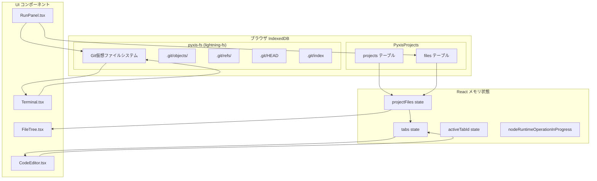
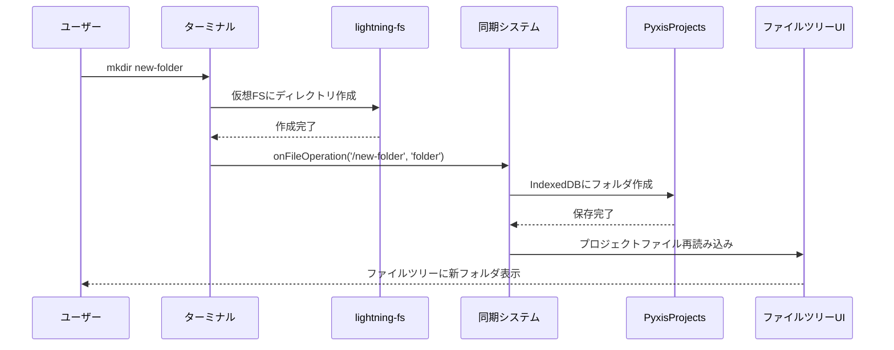
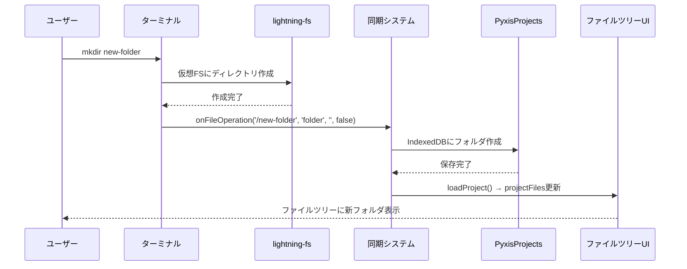
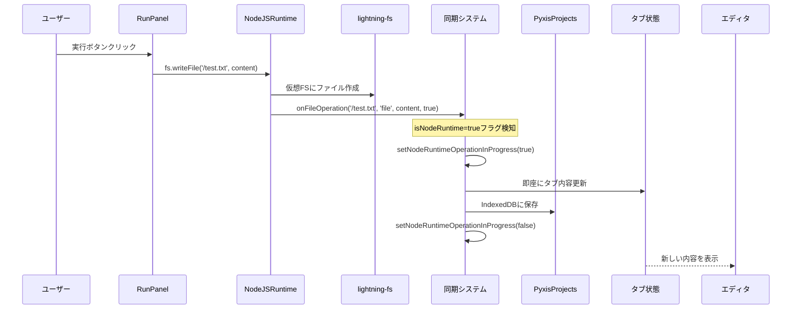
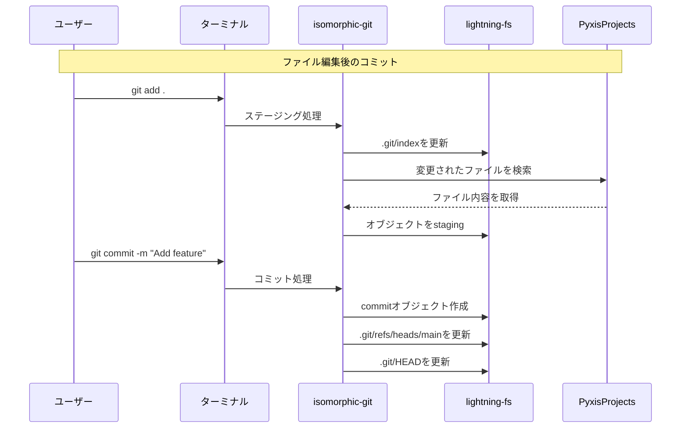

# Pyxis Database & File System Architecture

Pyxis Webエディタのデータベースアーキテクチャとファイルシステムについてのドキュメントです。これは実装調査に基づく詳細な仕様書です。

## 概要

Pyxisでは、異なる目的のために複数のデータストレージシステムを使用しています：

1. **lightning-fs (pyxis-fs)** - Git用仮想ファイルシステム (IndexedDB)
2. **PyxisProjects** - アプリケーション用プロジェクトデータベース (IndexedDB)  
3. **React State** - UI状態管理 (メモリ)
4. **Monaco Editor State** - エディタ状態管理 (メモリ)

## データフロー概要



## 重要な発見：状態競合の問題

### 問題の詳細
NodeJSRuntime（RunPanel）でファイルを編集した際、以下の競合状態が発生していました：

1. **NodeRuntime操作**: `fs.writeFile()` → IndexedDB保存 → `onFileOperation`コールバック
2. **UI状態更新**: `loadProject()` → `projectFiles`更新 → `useEffect`でタブ同期
3. **競合発生**: エディタでの編集内容がuseEffectで上書きされる

### 解決策の実装

#### 1. NodeRuntime操作の識別
```typescript
// nodeRuntime.ts
onFileOperation?: (path: string, type: 'file' | 'folder' | 'delete', content?: string, isNodeRuntime?: boolean) => Promise<void>

// fs.writeFile内で
await self.onFileOperation(relativePath, 'file', data, true); // isNodeRuntime = true
```

#### 2. 優先フラグの導入
```typescript
// page.tsx
const [nodeRuntimeOperationInProgress, setNodeRuntimeOperationInProgress] = useState(false);

// onFileOperation内で
if (isNodeRuntime) {
  setNodeRuntimeOperationInProgress(true);
}
```

#### 3. タブ同期の条件分岐
```typescript
// page.tsx useEffect内で
const shouldUpdate = nodeRuntimeOperationInProgress || !tab.isDirty;

if (!shouldUpdate) {
  return tab; // NodeRuntime操作中は強制更新、通常はisDirtyをチェック
}
```

#### 4. デバウンス保存の停止
```typescript
// CodeEditor.tsx
const debouncedSave = useCallback((tabId: string, content: string) => {
  if (nodeRuntimeOperationInProgress) {
    console.log('[CodeEditor] Skipping debounced save during NodeRuntime operation');
    return;
  }
  // 通常のデバウンス処理...
}, [onContentChange, nodeRuntimeOperationInProgress]);
```

## 1. lightning-fs (pyxis-fs) - Git仮想ファイルシステム

### 用途
- isomorphic-gitライブラリによるGitリポジトリ管理
- ターミナルコマンド（mkdir, touch, rm, ls等）の実行環境  
- NodeJSRuntime（RunPanel）でのファイル操作
- Git操作（add, commit, branch等）のデータ保存

### 実装場所
- `src/utils/filesystem.ts` - ファイルシステム初期化と操作
- `src/utils/cmd/unix.ts` - UNIXコマンド実装
- `src/utils/cmd/git.ts` - Git操作実装
- `src/utils/nodeRuntime.ts` - Node.js風ランタイム実装

### データ構造
```
/projects/{projectName}/
├── .git/
│   ├── objects/          # Gitオブジェクト（blob, tree, commit）
│   ├── refs/heads/       # ブランチ参照
│   ├── refs/tags/        # タグ参照
│   ├── HEAD              # 現在のブランチ
│   ├── index             # ステージングエリア
│   └── config            # リポジトリ設定
├── src/
├── public/
└── ファイル・ディレクトリ
```

### 特徴
- ブラウザのファイルシステムAPIを模倣
- POSIX風のファイルシステム操作
- Git標準形式でデータ保存
- isomorphic-gitが自動管理
- メモリとIndexedDBの二層構造

## 2. PyxisProjects - アプリケーションデータベース

### 用途
- プロジェクトメタデータの管理
- ファイル内容の永続化
- UIでのファイルツリー表示データソース
- エディタでのファイル編集データソース

### 実装場所
- `src/utils/database.ts` - IndexedDB操作のメインクラス
- `src/utils/project.ts` - プロジェクト管理と同期ロジック

### テーブル構造

#### projects テーブル
```typescript
interface Project {
  id: string;           // UUID (例: "project_1751500810497_uqkmunje47i_6459")
  name: string;         // プロジェクト名 (例: "repo")
  createdAt: Date;      // 作成日時
  updatedAt: Date;      // 更新日時
  description?: string; // 説明
}
```

#### files テーブル
```typescript
interface ProjectFile {
  id: string;           // UUID
  projectId: string;    // プロジェクトID（外部キー）
  path: string;         // ファイルパス (/src/index.js)
  name: string;         // ファイル名 (index.js)
  content: string;      // ファイル内容
  type: 'file' | 'folder'; // タイプ
  parentPath?: string;  // 親ディレクトリパス
  createdAt: Date;      // 作成日時
  updatedAt: Date;      // 更新日時
}
```

### インデックス設定
- `projects.name` - プロジェクト名での検索
- `projects.createdAt` - 作成日時でのソート
- `files.projectId` - プロジェクトIDでのファイル取得
- `files.path` - パスでのファイル検索

## 3. React State - UI状態管理

### 主要な状態（page.tsx）
```typescript
// プロジェクト関連
const [currentProject, setCurrentProject] = useState<Project | null>(null);
const [projectFiles, setProjectFiles] = useState<ProjectFile[]>([]);

// タブ管理
const [tabs, setTabs] = useState<Tab[]>([]);
const [activeTabId, setActiveTabId] = useState('');

// NodeRuntime操作制御
const [nodeRuntimeOperationInProgress, setNodeRuntimeOperationInProgress] = useState(false);

// Git状態
const [gitRefreshTrigger, setGitRefreshTrigger] = useState(0);
const [gitChangesCount, setGitChangesCount] = useState(0);
```

### タブ状態（tabs.ts）
```typescript
interface Tab {
  id: string;        // タイムスタンプベースのID
  name: string;      // ファイル名
  content: string;   // エディタ内容
  isDirty: boolean;  // 未保存の変更があるか
  path: string;      // ファイルパス
}
```

### 状態同期の流れ
1. `projectFiles`が更新される
2. `useEffect`で`projectFiles`の変更を検知
3. 条件に応じて`tabs`の内容を同期
4. `activeTab`がエディタに反映される



### エディタの変更処理
1. **即座の更新**: `onContentChangeImmediate()` → タブ状態即座更新
2. **デバウンス保存**: `debouncedSave()` → 1秒後にIndexedDBに保存

## ファイル操作の同期フロー

### 1. ターミナル操作（mkdir, touch等）



### 2. NodeJSRuntime操作（fs.writeFile等）



### 3. Git操作（add, commit等）



## 解決した問題：NodeRuntime状態競合

### 問題の詳細
NodeJSRuntimeでファイルを編集した際、以下の競合が発生していました：

1. **NodeRuntime**: `fs.writeFile()` → IndexedDB保存 → `onFileOperation`
2. **UI**: `loadProject()` → `projectFiles`更新 → `useEffect`でタブ同期  
3. **競合**: エディタの編集内容がuseEffectで上書きされる

### 実装した解決策

#### 1. NodeRuntime操作フラグ
```typescript
// page.tsx
const [nodeRuntimeOperationInProgress, setNodeRuntimeOperationInProgress] = useState(false);

// NodeRuntime操作時
if (isNodeRuntime) {
  setNodeRuntimeOperationInProgress(true);
  // 即座にタブ内容を更新
  // IndexedDBに保存
  // フラグをリセット
  setNodeRuntimeOperationInProgress(false);
}
```

#### 2. 条件付きタブ同期
```typescript
// page.tsx useEffect
const shouldUpdate = nodeRuntimeOperationInProgress || !tab.isDirty;
if (!shouldUpdate) {
  return tab; // NodeRuntime操作中は強制更新、通常時はisDirtyチェック
}
```

#### 3. デバウンス保存の制御
```typescript
// CodeEditor.tsx
if (nodeRuntimeOperationInProgress) {
  return; // NodeRuntime操作中は自動保存を停止
}
```

### 解決結果
- NodeJSRuntimeでのファイル操作が確実にUI状態に反映される
- エディタ内容が意図せず上書きされない
- 操作の優先順位が明確化された

## 主要コンポーネントと実装詳細

### ファイル構成
```
src/
├── utils/
│   ├── database.ts           # PyxisProjects IndexedDB操作
│   ├── filesystem.ts         # lightning-fs初期化・同期
│   ├── project.ts            # プロジェクト管理・useProject hook
│   ├── nodeRuntime.ts        # Node.js風ランタイム環境
│   ├── tabs.ts               # タブ管理ユーティリティ
│   └── cmd/
│       ├── unix.ts           # UNIXコマンド実装（mkdir, ls等）
│       ├── git.ts            # Gitコマンド実装（add, commit等）
│       └── gitOperations/    # Git操作の詳細実装
├── components/
│   ├── Terminal.tsx          # ターミナルUI・xterm.js
│   ├── CodeEditor.tsx        # Monaco Editorラッパー
│   ├── RunPanel.tsx          # NodeJSランタイム実行UI
│   ├── FileTree.tsx          # ファイルツリー表示
│   └── GitPanel.tsx          # Git状態表示・操作
└── app/
    └── page.tsx              # メインアプリケーション・状態管理
```

### 主要クラス・関数

#### ProjectDB (database.ts)
```typescript
class ProjectDB {
  async init(): Promise<void>                    // DB初期化
  async createProject(name, desc): Promise<Project>  // プロジェクト作成  
  async getProjects(): Promise<Project[]>        // プロジェクト一覧
  async createFile(projectId, path, content, type): Promise<ProjectFile>  // ファイル作成
  async saveFile(file: ProjectFile): Promise<void>     // ファイル保存
  async getProjectFiles(projectId): Promise<ProjectFile[]>  // プロジェクトファイル取得
}
```

#### NodeJSRuntime (nodeRuntime.ts)  
```typescript
class NodeJSRuntime {
  constructor(projectName, onOutput, onFileOperation)  // isNodeRuntime対応
  async executeNodeJS(code: string): Promise<ExecutionResult>  // コード実行
  private createFSModule()        // fs模倣モジュール
  private createPathModule()      // path模倣モジュール
  async executeFile(filePath)     // ファイル実行
}
```

#### UnixCommands (cmd/unix.ts)
```typescript
class UnixCommands {
  pwd(): string                   // 現在ディレクトリ表示
  async ls(path?): Promise<string>     // ファイル一覧
  async cd(path): Promise<string>      // ディレクトリ移動
  async mkdir(dirName, recursive): Promise<string>  // ディレクトリ作成
  async touch(fileName): Promise<string>     // ファイル作成
  async rm(fileName, recursive): Promise<string>    // ファイル削除
  async cat(fileName): Promise<string>       // ファイル表示
  async echo(text, fileName?): Promise<string>  // テキスト出力
}
```

#### GitCommands (cmd/git.ts)
```typescript  
class GitCommands {
  async init(): Promise<string>          // リポジトリ初期化
  async add(pathspec): Promise<string>   // ステージング
  async commit(message): Promise<string> // コミット
  async status(): Promise<string>        // 状態表示
  async log(options?): Promise<string>   // ログ表示
  async branch(options?, name?): Promise<string>  // ブランチ操作
  async checkout(ref): Promise<string>   // チェックアウト
  async merge(ref): Promise<string>      // マージ
}
```

### 状態管理フロー（useProject）

```typescript
export const useProject = () => {
  // 状態定義
  const [currentProject, setCurrentProject] = useState<Project | null>(null);
  const [projectFiles, setProjectFiles] = useState<ProjectFile[]>([]);
  
  // プロジェクト読み込み
  const loadProject = async (project: Project) => {
    const files = await projectDB.getProjectFiles(project.id);
    setCurrentProject(project);
    setProjectFiles(files);
    // Git初期化チェック・実行
  };
  
  // ファイル保存（エディタ→IndexedDB）
  const saveFile = async (path: string, content: string) => {
    // 既存ファイル検索・更新 または 新規作成
    // lightning-fsにも同期
  };
  
  // ターミナル操作同期（lightning-fs→IndexedDB）  
  const syncTerminalFileOperation = async (path, type, content) => {
    // ファイル作成・更新・削除をIndexedDBに反映
    // プロジェクトファイル再読み込み
  };
  
  return {
    currentProject, projectFiles, loadProject, 
    saveFile, syncTerminalFileOperation, ...
  };
};
```

## 技術スタック・ライブラリ

### 主要ライブラリ
- **isomorphic-git**: ブラウザでのGit操作実装
- **@isomorphic-git/lightning-fs**: 仮想ファイルシステム（IndexedDBベース）
- **@monaco-editor/react**: Webエディタ（VS Code同等）
- **@xterm/xterm**: ターミナルエミュレータ
- **IndexedDB**: ブラウザネイティブデータベース

### アーキテクチャの特徴
1. **完全ブラウザ内実行**: サーバー不要、オフライン動作可能
2. **Git標準互換**: 標準的なGitリポジトリ形式でデータ保存
3. **二重化データ管理**: lightning-fs（Git用） + PyxisProjects（UI用）
4. **リアルタイム同期**: ターミナル↔ファイルツリー↔エディタの即座同期
5. **状態競合解決**: NodeRuntime操作の優先制御システム

### パフォーマンス考慮事項
- **デバウンス保存**: エディタ変更の1秒遅延保存
- **条件付き同期**: NodeRuntime操作中の不要な状態更新を防止
- **階層データ変換**: flat配列↔tree構造の効率的変換
- **Git状態キャッシュ**: 頻繁なGit状態チェックの最適化

## 今後の課題・改善点

### 確認済み解決項目
- ✅ **NodeRuntime状態競合**: isNodeRuntimeフラグによる優先制御で解決
- ✅ **ターミナル↔UI同期**: onFileOperationコールバックで解決
- ✅ **エディタ自動保存**: デバウンス機能で解決

### 残存課題
1. **大量ファイル処理**: 数千ファイルプロジェクトでのパフォーマンス最適化
2. **Git操作競合**: 同時Git操作時の排他制御  
3. **データバックアップ**: プロジェクトエクスポート/インポート機能
4. **エラーハンドリング**: IndexedDB容量制限・破損時の復旧機能
5. **メモリ管理**: 長時間利用時のメモリリーク対策

### 検討中の機能
- **マルチプロジェクト**: 複数プロジェクト同時編集
- **リモートGit**: GitHub等との連携機能
- **コラボレーション**: リアルタイム共同編集
- **拡張機能**: Monaco Editorプラグインシステム

---

*このドキュメントは実装調査に基づく正確な仕様書です（最終更新：2025年7月3日）*
