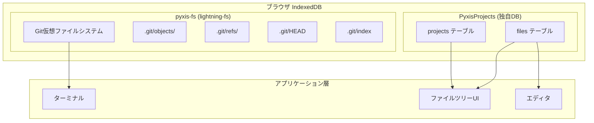
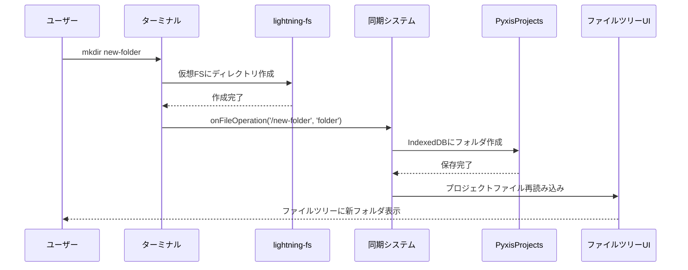
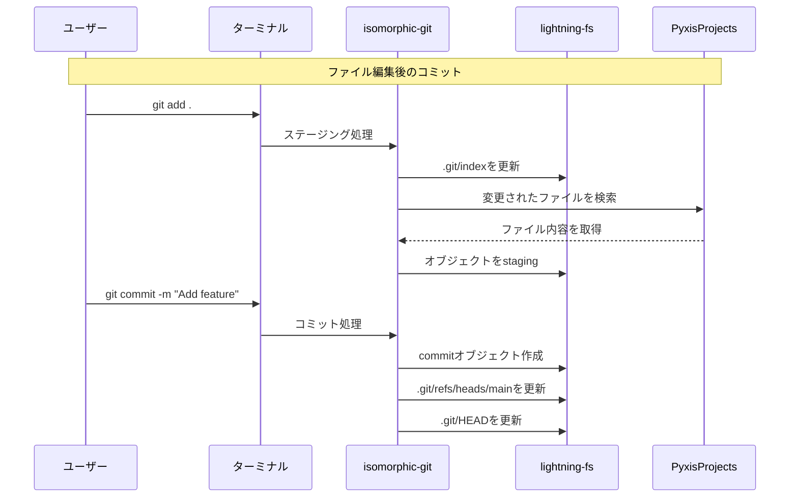

# Database Architecture

Pyxis Webエディタのデータベースアーキテクチャとファイルシステムの設計について説明します。

## 概要

Pyxisでは、異なる目的のために2つの独立したIndexedDBデータベースを使用しています：

1. **lightning-fs (pyxis-fs)** - Git用仮想ファイルシステム
2. **PyxisProjects** - アプリケーション用プロジェクトデータベース

## データベース構造



## 1. lightning-fs (pyxis-fs)

### 用途
- isomorphic-gitライブラリがGitリポジトリデータを管理
- ターミナルコマンド（mkdir, touch, rm, ls等）の実行環境
- Git操作（add, commit, branch等）のデータ保存

### データ構造
```
/projects/{projectName}/
├── .git/
│   ├── objects/          # Gitオブジェクト（blob, tree, commit）
│   ├── refs/heads/       # ブランチ参照
│   ├── refs/tags/        # タグ参照
│   ├── HEAD              # 現在のブランチ
│   ├── index             # ステージングエリア
│   └── config            # リポジトリ設定
├── src/
├── public/
└── ファイル・ディレクトリ
```

### 特徴
- ブラウザのファイルシステムAPIを模倣
- POSIX風のファイルシステム操作
- Git標準形式でデータ保存
- isomorphic-gitが自動管理

## 2. PyxisProjects (独自データベース)

### 用途
- プロジェクトメタデータの管理
- ファイル内容の永続化
- UIでのファイルツリー表示
- エディタでのファイル編集

### テーブル構造

#### projects テーブル
```typescript
interface Project {
  id: string;           // UUID
  name: string;         // プロジェクト名
  createdAt: Date;      // 作成日時
  updatedAt: Date;      // 更新日時
  description?: string; // 説明
}
```

#### files テーブル
```typescript
interface ProjectFile {
  id: string;           // UUID
  projectId: string;    // プロジェクトID（外部キー）
  path: string;         // ファイルパス (/src/index.js)
  name: string;         // ファイル名 (index.js)
  content: string;      // ファイル内容
  type: 'file' | 'folder'; // タイプ
  parentPath?: string;  // 親ディレクトリパス
  createdAt: Date;      // 作成日時
  updatedAt: Date;      // 更新日時
}
```

### インデックス
- `projects.name` - プロジェクト名での検索
- `projects.createdAt` - 作成日時でのソート
- `files.projectId` - プロジェクトIDでのファイル取得
- `files.path` - パスでのファイル検索

## ファイル操作の同期メカニズム



### 同期の流れ

1. **ターミナルコマンド実行**
   ```bash
   mkdir src/components
   touch src/components/Button.tsx
   ```

2. **lightning-fsに操作反映**
   - 仮想ファイルシステムにファイル/ディレクトリ作成
   - ターミナルでの`ls`コマンドで即座に確認可能

3. **コールバック実行**
   ```typescript
   onFileOperation('/src/components', 'folder');
   onFileOperation('/src/components/Button.tsx', 'file', '');
   ```

4. **PyxisProjectsに同期**
   - `files`テーブルに新しいレコード挿入
   - プロジェクトの`updatedAt`を更新

5. **UI更新**
   - React stateの`projectFiles`を再読み込み
   - ファイルツリーコンポーネントが自動更新

## Git操作の流れ



## データの整合性

### 問題の解決
- **ターミナルとUIの非同期問題**: コールバックによる即座の同期
- **Git状態とファイル内容の乖離**: 双方向の同期システム
- **ブラウザ再読み込み後の状態復元**: IndexedDBからの自動復元

### 今後の課題
1. **競合解決**: 同時編集時の競合処理
2. **パフォーマンス**: 大量ファイルでの同期最適化
3. **バックアップ**: データのエクスポート/インポート機能

## 実装詳細

### ファイル構成
- `src/utils/database.ts` - PyxisProjects DB の操作
- `src/utils/filesystem.ts` - lightning-fs の操作とGit連携
- `src/utils/project.ts` - プロジェクト管理と同期ロジック
- `src/components/Terminal.tsx` - ターミナルUI とコマンド処理

### 主要クラス
- `ProjectDB` - IndexedDB操作のメインクラス
- `UnixCommands` - UNIX風コマンドの実装
- `GitCommands` - Git操作の実装
- `useProject` - プロジェクト状態管理フック

## 使用ライブラリ

- **isomorphic-git**: ブラウザでのGit操作
- **@isomorphic-git/lightning-fs**: 仮想ファイルシステム
- **IndexedDB**: ブラウザネイティブのデータベース

この設計により、ブラウザ内で完全なファイルシステムとGit操作を提供し、データの永続化と同期を実現しています。
