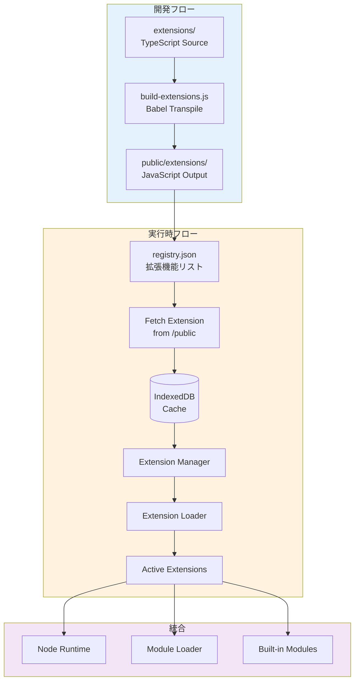
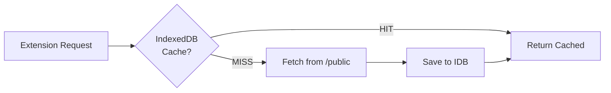

# Pyxis Extension System

## 概要

Pyxis Extension Systemは、静的サイトホスティング環境で動作する高度な拡張機能システムです。

### 主な特徴

- 📦 **TypeScriptで拡張機能を記述** - ビルド時に自動トランスパイル
- 🚀 **Lazy Loading** - 必要な時だけfetchして読み込み
- 💾 **IndexedDBキャッシュ** - 2回目以降は高速ロード
- 🔌 **Hot Swappable** - Runtime再起動なしで有効化/無効化
- 🌐 **静的ホスティング対応** - SSR不要、CDNで配信可能

## アーキテクチャ



## ディレクトリ構造

```
Pyxis-CodeCanvas/
├── extensions/                    # 拡張機能のソースコード (TypeScript)
│   └── pyxis/
│       ├── typescript-runtime/
│       │   ├── index.ts          # エントリーポイント
│       │   └── manifest.json     # マニフェスト
│       └── i18n-service/
│           ├── index.ts
│           └── manifest.json
│
├── public/extensions/             # ビルド済み拡張機能 (JavaScript)
│   ├── registry.json             # 拡張機能レジストリ
│   └── pyxis/
│       ├── typescript-runtime/
│       │   ├── index.js          # トランスパイル済み
│       │   └── manifest.json
│       └── i18n-service/
│           ├── index.js
│           └── manifest.json
│
├── src/engine/extensions/         # 拡張機能システムのコア
│   ├── types.ts                  # 型定義
│   ├── extensionManager.ts       # ライフサイクル管理
│   ├── extensionLoader.ts        # ロード・実行
│   ├── extensionRegistry.ts      # レジストリ管理
│   └── storage-adapter.ts        # IndexedDB連携
│
└── scripts/
    └── build-extensions.js        # ビルドスクリプト
```

## 拡張機能の作成方法

### 1. ソースディレクトリを作成

```bash
mkdir -p extensions/pyxis/my-extension
```

### 2. manifest.jsonを作成

```json
{
  "id": "pyxis.my-extension",
  "name": "My Extension",
  "version": "1.0.0",
  "type": "service",
  "description": "My custom extension",
  "author": "Your Name",
  "entry": "index.js",
  "provides": {
    "services": ["my-service"]
  },
  "metadata": {
    "publishedAt": "2025-11-02T00:00:00Z",
    "updatedAt": "2025-11-02T00:00:00Z",
    "tags": ["custom"]
  }
}
```

### 3. index.tsを作成

```typescript
import type { ExtensionContext, ExtensionActivation } from '@/engine/extensions/types';

export async function activate(context: ExtensionContext): Promise<ExtensionActivation> {
  context.logger.info('My Extension activating...');

  const myService = {
    doSomething: async () => {
      context.logger.info('Doing something...');
      return 'result';
    },
  };

  return {
    services: {
      'my-service': myService,
    },
  };
}

export async function deactivate(): Promise<void> {
  console.log('[My Extension] Deactivating...');
}
```

### 4. ビルド

```bash
npm run dev  # または npm run build
```

ビルドスクリプトが自動的に:
- TypeScriptをトランスパイル
- public/extensions/に配置
- registry.jsonを更新

## 拡張機能の種類

| Type | 説明 | 例 |
|------|------|-----|
| `builtin-module` | Node.jsビルトインモジュール | fs, path, crypto |
| `service` | グローバルサービス | i18n, git, storage |
| `transpiler` | コードトランスパイラ | TypeScript, JSX, Babel |
| `language-runtime` | 言語ランタイム | Python, Rust, Go |
| `tool` | 開発ツール | linter, formatter |
| `ui` | UI拡張 | テーマ、エディタ拡張 |

## 使用例

### 拡張機能のインストール

```typescript
import { extensionManager } from '@/engine/extensions';

// 初期化
await extensionManager.init();

// インストール
const installed = await extensionManager.installExtension(
  'pyxis/typescript-runtime/manifest.json'
);

// 有効化
await extensionManager.enableExtension('pyxis.typescript-runtime');
```

### アクティブな拡張機能の取得

```typescript
// 全てのビルトインモジュールを取得
const builtInModules = extensionManager.getAllBuiltInModules();

// 特定の拡張機能のアクティベーション結果を取得
const activation = extensionManager.getExtensionActivation('pyxis.i18n-service');
```

## 既存コードの統合

### NodeRuntimeとの統合

拡張機能システムは既存のNodeRuntimeとシームレスに統合されます:

```typescript
// src/engine/runtime/extendedBuiltInModules.ts
import { extensionManager } from '@/engine/extensions/extensionManager';
import { createBuiltInModules } from '@/engine/node/builtInModule';

export async function createExtendedBuiltInModules(options) {
  // コアモジュール
  const coreModules = createBuiltInModules(options);
  
  // 拡張機能モジュール
  const extensionModules = extensionManager.getAllBuiltInModules();
  
  // マージ（拡張機能が優先）
  return { ...coreModules, ...extensionModules };
}
```

## ビルドプロセス

### npm run dev / build の動作

```bash
npm run dev
# ↓
# 1. node initial_files_to_ts.js
# 2. node scripts/build-extensions.js  ← 追加
# 3. next dev --turbopack
```

### build-extensions.jsの処理フロー

1. **extensions/** をスキャン
2. **.ts/.tsx** をBabelでトランスパイル → **.js**
3. **manifest.json** をコピー
4. **public/extensions/** に配置
5. **registry.json** を自動生成

## パフォーマンス最適化

### キャッシュ戦略



### 遅延ロード

- レジストリは起動時に1回だけfetch
- 拡張機能は有効化時にfetch
- 2回目以降はIndexedDBから即座にロード

## セキュリティ

### サンドボックス実行

拡張機能は制限された`ExtensionContext`で実行:

```typescript
interface ExtensionContext {
  extensionId: string;
  storage: {
    get: <T>(key: string) => Promise<T | null>;
    set: <T>(key: string, value: T) => Promise<void>;
    delete: (key: string) => Promise<void>;
  };
  logger: {
    info: (...args: unknown[]) => void;
    warn: (...args: unknown[]) => void;
    error: (...args: unknown[]) => void;
  };
}
```

- ファイルシステムアクセスなし
- ネットワークアクセスなし（fetchは別途実装が必要）
- 独立したストレージ空間

## 今後の拡張性

### 将来的に追加可能な機能

- **Python Runtime Extension** - Pyodideを利用
- **Rust Runtime Extension** - WebAssemblyコンパイル
- **ESLint Extension** - Lintルール拡張
- **Prettier Extension** - フォーマットルール拡張
- **Git Advanced Extension** - 高度なGit操作
- **AI Copilot Extension** - AI支援機能

### 外部レジストリサポート

将来的に外部URLからの拡張機能インストールをサポート:

```typescript
await extensionManager.installFromUrl(
  'https://cdn.example.com/extensions/custom-ext/manifest.json'
);
```

## トラブルシューティング

### ビルドエラー

```bash
# Babelがない場合
npm install

# 拡張機能だけを再ビルド
node scripts/build-extensions.js
```

### 実行時エラー

```typescript
// ExtensionManagerのログを確認
console.log(extensionManager.getActiveExtensions());

// 特定の拡張を無効化
await extensionManager.disableExtension('pyxis.typescript-runtime');

// 再度有効化
await extensionManager.enableExtension('pyxis.typescript-runtime');
```

## まとめ

Pyxis Extension Systemは:

✅ **開発者フレンドリー** - TypeScriptで型安全に記述  
✅ **高速** - IndexedDBキャッシュで2回目以降は瞬時にロード  
✅ **柔軟** - 既存コードを拡張機能として切り出し可能  
✅ **スケーラブル** - 無限に拡張機能を追加可能  
✅ **静的ホスティング対応** - サーバーレスで動作

これにより、Pyxisのコア機能を小さく保ちつつ、必要な機能だけをユーザーが選択してインストールできる、モダンで拡張性の高いアーキテクチャを実現しています。
