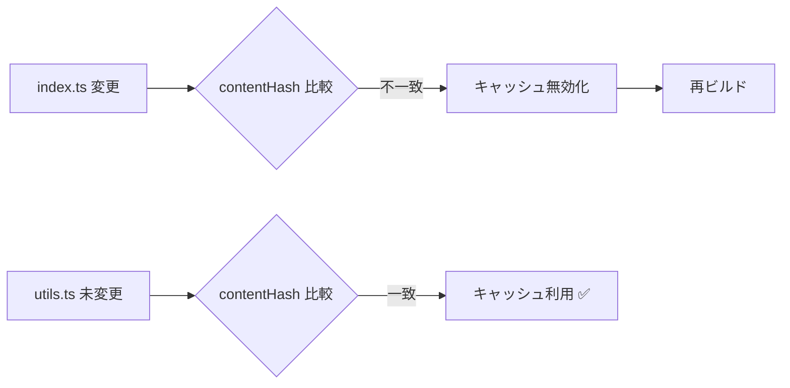
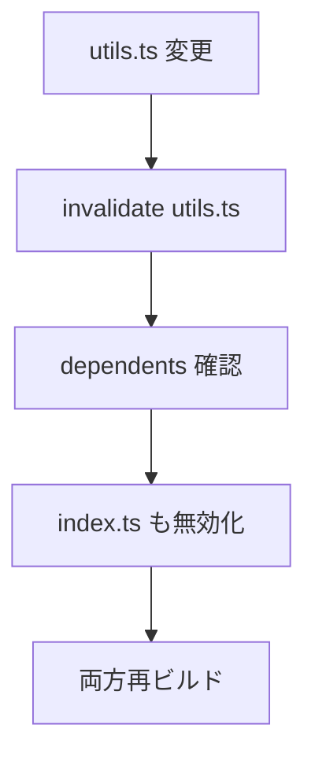
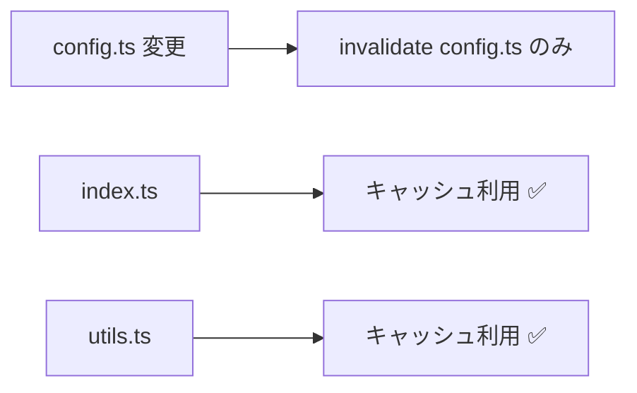

# モジュールキャッシュ戦略

## 概要

新しいモジュールキャッシュシステムは、**ファイル変更に強く、依存関係を正しく管理し、キャッシュの肥大化を防ぐ**設計になっています。

## キー設計原則

### 1. **キャッシュキー = ファイルパスのみ**
- ❌ 旧: `hash(path + version)` → 内容変更のたびに新しいキーが生成され、古いキャッシュが残る
- ✅ 新: `path` → 同じファイルは常に同じキーを使用し、自動的に上書き

### 2. **内容ハッシュで変更検出**
```typescript
interface CacheEntry {
  originalPath: string;
  contentHash: string; // ファイル内容のハッシュ
  code: string;
  deps: string[];
  dependents: string[]; // 逆参照
  // ...
}
```

### 3. **双方向依存グラフ**
```
ファイルA → ファイルB (AはBに依存)
    ↓           ↑
  deps[]    dependents[]
```

- `deps`: このファイルが依存しているファイル
- `dependents`: このファイルに依存しているファイル(逆参照)

## キャッシュライフサイクル

### 1. キャッシュ保存 (`set`)

```typescript
// ファイルA (index.ts) がファイルB (utils.ts) に依存
await cache.set('/src/index.ts', {
  originalPath: '/src/index.ts',
  contentHash: 'abc123', // 内容のハッシュ
  code: '...',
  deps: ['/src/utils.ts'], // 依存リスト
  // ...
});
```

**処理フロー:**
1. 既存キャッシュがあれば依存グラフから削除
2. 新しいキャッシュを保存(`/src/index.ts` をキーに)
3. 依存グラフを更新(双方向リンク)
4. ディスクに永続化

### 2. キャッシュ取得 (`get`)

```typescript
const entry = await cache.get('/src/index.ts', 'abc123');
```

**処理フロー:**
1. パスでキャッシュを検索
2. 内容ハッシュが一致するか確認
   - ✅ 一致 → キャッシュHIT
   - ❌ 不一致 → キャッシュ無効化、null返却

### 3. キャッシュ無効化 (`invalidate`)

```typescript
// utils.ts が変更された
await cache.invalidate('/src/utils.ts');
```

**処理フロー:**
1. `/src/utils.ts` のキャッシュを削除
2. **依存する全ファイルも再帰的に無効化**
   - 例: `index.ts` も無効化される
3. 依存グラフから削除
4. ディスクから削除

## 変更検出の仕組み

### シナリオ1: ファイルAのみ変更



### シナリオ2: 依存ファイルB変更



### シナリオ3: 関係ないファイルC変更



## 実装例

### 使用方法

```typescript
import { ModuleCache } from '@/engine/runtime/moduleCache';

// 初期化
const cache = new ModuleCache(projectId, projectName);
await cache.init();

// ビルド前: キャッシュチェック
const sourceCode = await readFile('/src/index.ts');
const contentHash = cache.hashContent(sourceCode);
const cached = await cache.get('/src/index.ts', contentHash);

if (cached) {
  console.log('キャッシュ利用!');
  return cached.code;
}

// ビルド実行
const compiled = await compile(sourceCode);
const deps = extractDeps(compiled); // ['/src/utils.ts', '/src/config.ts']

// キャッシュ保存
await cache.set('/src/index.ts', {
  originalPath: '/src/index.ts',
  contentHash,
  code: compiled.code,
  deps,
  mtime: Date.now(),
  size: compiled.code.length,
});
```

### ファイル変更時

```typescript
// ファイル監視で変更検出
fileWatcher.on('change', async (path) => {
  console.log(`ファイル変更: ${path}`);
  
  // キャッシュ無効化(依存ファイルも自動的に無効化される)
  await cache.invalidate(path);
  
  // 再ビルド
  await rebuild(path);
});
```

## メリット

### ✅ キャッシュの正確性
- 内容が変わればキャッシュ無効化
- 依存関係も自動追跡

### ✅ キャッシュの効率性
- 変更されていないファイルはキャッシュ利用
- 無関係なファイルは影響を受けない

### ✅ キャッシュの管理性
- 古いキャッシュは自動削除(同じキーで上書き)
- GCで容量制御
- 依存グラフで整合性維持

## 技術的詳細

### ファイル構造

```
/cache/
  modules/
    _src_index.ts.js      # コンパイル済みコード
    _src_utils.ts.js
  meta/
    _src_index.ts.json    # メタデータ
    _src_utils.ts.json
```

### メタデータ形式

```json
{
  "originalPath": "/src/index.ts",
  "contentHash": "abc123",
  "sourceMap": "...",
  "deps": ["/src/utils.ts"],
  "dependents": ["/src/app.ts"],
  "mtime": 1699000000000,
  "lastAccess": 1699000000000,
  "size": 5120
}
```

### GC戦略

- 最大キャッシュサイズ: 100MB
- GC発動時: 70%まで削減
- 削除優先度: `lastAccess` が古い順

## まとめ

| 項目 | 旧システム | 新システム |
|------|-----------|-----------|
| キャッシュキー | `hash(path+version)` | `path` |
| 変更検出 | バージョン比較 | 内容ハッシュ比較 |
| 依存管理 | 一方向のみ | 双方向グラフ |
| 古いキャッシュ | 残り続ける | 自動上書き |
| 依存無効化 | 手動 | 自動再帰 |
| キャッシュ削除 | 手動 | GC + 自動無効化 |

新システムでは、**正確性、効率性、管理性**のすべてが向上しています。
