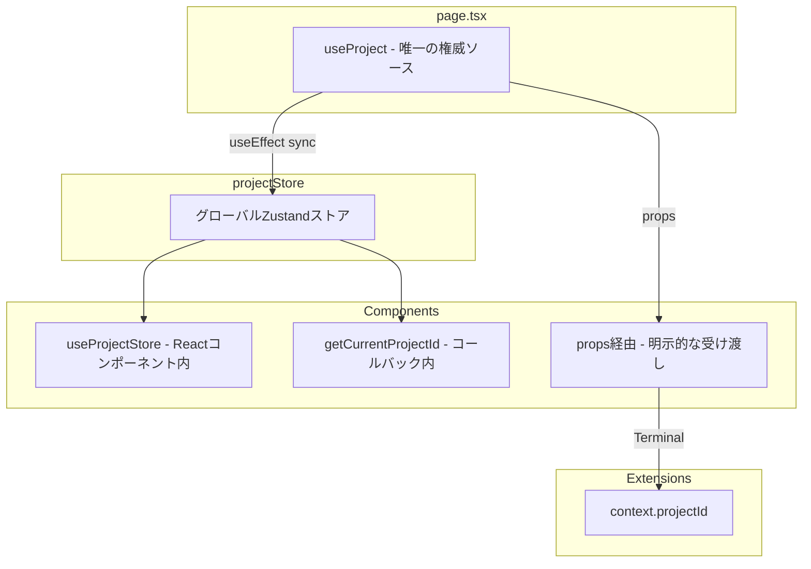

# Project ID ベストプラクティス

このドキュメントでは、Pyxis CodeCanvasにおけるProject IDの取得・使用に関するベストプラクティスを説明します。

---

## 背景と問題

### useProject()フックの問題

`useProject()`フックはReactの`useState`を使用しているため、**各コンポーネントで独立したステートを持ちます**。これにより以下の問題が発生していました：

```typescript
// 問題のあるコード
const EditorTabComponent = () => {
  const { saveFile, currentProject } = useProject();
  // currentProjectは独立したステートのため、nullになる可能性がある
  
  const handleSave = async (content: string) => {
    // currentProjectがnullの場合、サイレントに失敗
    if (saveFile && currentProject) {
      await saveFile(path, content);
    }
  };
};
```

---

## アーキテクチャ

### Project ID の流れ



---

## ベストプラクティス

### 1. Reactコンポーネント内でProject IDを取得

**推奨: `useProjectStore`を使用**

```typescript
import { useProjectStore } from '@/stores/projectStore';

const MyComponent = () => {
  // グローバルストアからリアクティブに取得
  const currentProject = useProjectStore(state => state.currentProject);
  const projectId = currentProject?.id;
  
  // projectIdを使用
};
```

### 2. コールバック関数内でProject IDを取得

**推奨: `getCurrentProjectId()`ユーティリティを使用**

```typescript
import { getCurrentProjectId } from '@/stores/projectStore';

const MyComponent = () => {
  const handleContentChange = useCallback(async (content: string) => {
    // コールバック実行時点の最新のprojectIdを取得
    const projectId = getCurrentProjectId();
    
    if (projectId && path) {
      await fileRepository.saveFileByPath(projectId, path, content);
    }
  }, [path]);
};
```

### 3. propsで受け取る場合

**親コンポーネントからpropsで渡される場合は、そのまま使用**

```typescript
interface TerminalProps {
  currentProjectId: string;
}

const Terminal = ({ currentProjectId }: TerminalProps) => {
  // propsで受け取ったprojectIdを使用
  await fileRepository.createFile(currentProjectId, path, content, 'file');
};
```

### 4. Extension内でProject IDを取得

**`context.projectId`を使用**

```typescript
// Extension command handler
export const handler = async (args: string[], context: CommandContext) => {
  const { projectId } = context;
  
  const fileRepository = context.getSystemModule('fileRepository');
  const file = await fileRepository.getFileByPath(projectId, '/src/index.ts');
};
```

---

## 非推奨パターン

### ❌ page.tsx以外でuseProject()を使用

```typescript
// 非推奨: 独立したステートが作成される
const MyTabComponent = () => {
  const { currentProject, saveFile } = useProject(); // NG
};
```

### ❌ LocalStorageから直接取得

```typescript
// 非推奨: 同期の問題がある
const projectId = JSON.parse(localStorage.getItem('recent-projects'))?.[0]?.id;
```

---

## API リファレンス

### projectStore.ts

| API | 用途 | 使用場所 |
|-----|------|----------|
| `useProjectStore(state => state.currentProject)` | リアクティブにプロジェクト取得 | Reactコンポーネント内 |
| `useProjectStore(state => state.currentProjectId)` | リアクティブにID取得 | Reactコンポーネント内 |
| `getCurrentProjectId()` | 即時にID取得 | コールバック、非同期関数内 |
| `getCurrentProject()` | 即時にプロジェクト取得 | コールバック、非同期関数内 |

### page.tsxでの同期

```typescript
// page.tsx
const { currentProject } = useProject();
const setCurrentProjectToStore = useProjectStore(state => state.setCurrentProject);

useEffect(() => {
  setCurrentProjectToStore(currentProject);
}, [currentProject, setCurrentProjectToStore]);
```

---

## ファイル操作時のProject ID使用例

### ファイル保存

```typescript
import { fileRepository } from '@/engine/core/fileRepository';
import { getCurrentProjectId } from '@/stores/projectStore';

const saveFile = async (path: string, content: string) => {
  const projectId = getCurrentProjectId();
  if (!projectId) {
    console.error('No project selected');
    return;
  }
  
  await fileRepository.saveFileByPath(projectId, path, content);
};
```

### ファイル取得

```typescript
const getFile = async (path: string) => {
  const projectId = getCurrentProjectId();
  if (!projectId) return null;
  
  return await fileRepository.getFileByPath(projectId, path);
};
```

---

## チェックリスト

新しいコンポーネントでProject IDを使用する際：

- [ ] `useProject()`を直接使用していないか確認
- [ ] Reactコンポーネント内では`useProjectStore`を使用
- [ ] コールバック内では`getCurrentProjectId()`を使用
- [ ] propsで渡される場合はそのまま使用
- [ ] Extension内では`context.projectId`を使用

---

## 関連ドキュメント

- [FILE_REPOSITORY_BEST_PRACTICES.md](./FILE_REPOSITORY_BEST_PRACTICES.md) - FileRepositoryの最適化とキャッシュ
- [CORE-ENGINE.md](../docs/CORE-ENGINE.md) - コアエンジンアーキテクチャ

---

ドキュメント作成日: 2025-12-03
