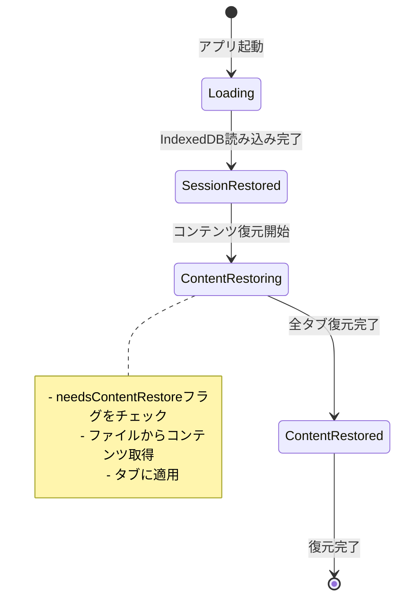
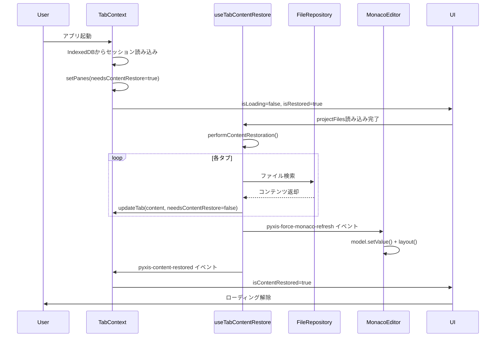

# コンテンツ復元システム - 技術ドキュメント

## 概要

Pyxisのセッション復元において、タブのコンテンツを確実に復元するための改善されたシステム。

## 問題点（Before）

1. **タイミングの不安定性**
   - `useEffect`の依存配列が複雑で、復元が複数回トリガーされる
   - 復元が完了したかどうかの状態管理が不明瞭

2. **Monaco内部状態の不整合**
   - モデルにはコンテンツが設定されているが、UIに反映されない
   - タブ切り替え時にコンテンツが消える

3. **復元フラグの管理不足**
   - `needsContentRestore`フラグが複数箇所で変更され、整合性が取れない
   - 復元の成功/失敗が追跡できない

## 解決策（After）

### 1. 2段階復元プロセス

```
Phase 1: セッション構造の復元（即座）
  ↓
  - ペイン構造
  - タブのメタデータ
  - needsContentRestoreフラグ設定

Phase 2: コンテンツの復元（非同期・確実）
  ↓
  - ファイルシステムからコンテンツ取得
  - タブに適用
  - Monaco強制再描画
  ↓
  - 復元完了イベント発火
```

### 2. 復元状態の明示的管理

```typescript
// useTabContentRestore.ts
const restorationCompleted = useRef(false);    // 復元完了フラグ
const restorationInProgress = useRef(false);   // 復元中フラグ

// TabContext.tsx
const [isContentRestored, setIsContentRestored] = useState(false);
```

**状態遷移図**:



### 3. Monaco強制再描画

```typescript
// MonacoEditor.tsx
useEffect(() => {
  const handleForceRefresh = () => {
    if (!isEditorSafe() || !monacoRef.current) return;
    
    const model = editorRef.current!.getModel();
    if (isModelSafe(model)) {
      // モデル値を再適用
      if (model!.getValue() !== content) {
        model!.setValue(content);
      }
      // レイアウト強制更新
      editorRef.current!.layout();
    }
  };

  window.addEventListener('pyxis-force-monaco-refresh', handleForceRefresh);
  return () => {
    window.removeEventListener('pyxis-force-monaco-refresh', handleForceRefresh);
  };
}, [tabId, content, isEditorSafe, isModelSafe]);
```

### 4. 復元中のUIブロック

```typescript
// CodeEditor.tsx
const isRestoringContent = activeTab && 
  (activeTab as any).needsContentRestore && 
  !isContentRestored;

if (isRestoringContent) {
  return <div>Restoring content...</div>;
}
```

## データフロー



## 実装の詳細

### useTabContentRestore.ts

**主な改善点**:
- `performContentRestoration`関数で復元を1回だけ実行
- `requestAnimationFrame`で非同期実行（Monaco内部状態の同期）
- 復元完了/失敗時にフラグを適切に設定
- エラーハンドリングの強化

**復元ロジック**:
```typescript
const performContentRestoration = useCallback(() => {
  if (restorationCompleted.current || restorationInProgress.current) {
    return;
  }

  restorationInProgress.current = true;
  
  requestAnimationFrame(() => {
    try {
      // 再帰的にペインを更新
      store.setPanes(updatePaneRecursive(store.panes));
      
      // 完了フラグ
      restorationCompleted.current = true;
      restorationInProgress.current = false;
      
      // Monaco再描画 + 復元完了イベント
      setTimeout(() => {
        window.dispatchEvent(new CustomEvent('pyxis-force-monaco-refresh'));
        window.dispatchEvent(new CustomEvent('pyxis-content-restored'));
      }, 100);
    } catch (error) {
      console.error('[useTabContentRestore] Restoration failed:', error);
      restorationCompleted.current = true; // 無限ループ防止
    }
  });
}, [isRestored, store, projectFiles, normalizePath]);
```

### TabContext.tsx

**追加プロパティ**:
```typescript
interface TabContextValue {
  // ...既存プロパティ
  isContentRestored: boolean; // コンテンツ復元完了フラグ
}
```

**イベントリスナー**:
```typescript
useEffect(() => {
  const handleContentRestored = () => {
    console.log('[TabContext] Content restoration completed');
    setIsContentRestored(true);
  };

  window.addEventListener('pyxis-content-restored', handleContentRestored);
  return () => {
    window.removeEventListener('pyxis-content-restored', handleContentRestored);
  };
}, []);
```

### MonacoEditor.tsx

**強制再描画ハンドラー**:
```typescript
useEffect(() => {
  const handleForceRefresh = () => {
    if (!isEditorSafe() || !monacoRef.current) return;

    try {
      const model = editorRef.current!.getModel();
      
      if (isModelSafe(model)) {
        // モデルの値を再適用してUI同期
        const currentValue = model!.getValue();
        if (currentValue !== content) {
          model!.setValue(content);
        }
        
        // レイアウトを強制更新
        editorRef.current!.layout();
        
        // 文字数も再計算
        onCharCountChange(countCharsNoSpaces(content));
      }
    } catch (e) {
      console.warn('[MonacoEditor] Force refresh failed:', e);
    }
  };

  window.addEventListener('pyxis-force-monaco-refresh', handleForceRefresh);
  return () => {
    window.removeEventListener('pyxis-force-monaco-refresh', handleForceRefresh);
  };
}, [tabId, content, isEditorSafe, isModelSafe, onCharCountChange]);
```

### CodeEditor.tsx

**復元中のブロック処理**:
```typescript
const isRestoringContent = activeTab && 
  (activeTab as any).needsContentRestore && 
  !isContentRestored;

if (isRestoringContent) {
  return (
    <div className="flex-1 min-h-0 relative flex items-center justify-center">
      <div className="text-muted-foreground">Restoring content...</div>
    </div>
  );
}
```

### page.tsx

**ローディング表示の改善**:
```typescript
{(isTabsLoading || (isRestored && !isContentRestored)) && (
  <div className="absolute inset-0 flex items-center justify-center z-50">
    <div className="text-white text-lg">
      {isTabsLoading ? 'Loading session...' : 'Restoring content...'}
    </div>
  </div>
)}
```

## ベストプラクティス

### 1. 復元フラグの管理

```typescript
// ✅ 良い例: 1箇所で明示的に管理
restorationCompleted.current = true;
restorationInProgress.current = false;

// ❌ 悪い例: 複数箇所で暗黙的に変更
if (someCondition) {
  // 復元完了を暗黙的に判定
}
```

### 2. エラーハンドリング

```typescript
// ✅ 良い例: エラー時もフラグを立てる
try {
  // 復元処理
  restorationCompleted.current = true;
} catch (error) {
  console.error('Restoration failed:', error);
  restorationCompleted.current = true; // 無限ループ防止
}

// ❌ 悪い例: エラー時にフラグを立てない
try {
  // 復元処理
  restorationCompleted.current = true;
} catch (error) {
  // フラグが立たず、無限ループの可能性
}
```

### 3. Monaco内部状態の同期

```typescript
// ✅ 良い例: setValue後にlayout()を呼ぶ
model!.setValue(content);
editorRef.current!.layout();

// ❌ 悪い例: setValueだけで終わる
model!.setValue(content);
// UIに反映されない可能性
```

### 4. 非同期実行のタイミング

```typescript
// ✅ 良い例: requestAnimationFrameで次のフレームまで待つ
requestAnimationFrame(() => {
  // 復元処理
  setTimeout(() => {
    // 強制再描画
  }, 100);
});

// ❌ 悪い例: 即座に実行
// 復元処理
// Monaco内部状態が追いつかない
```

## トラブルシューティング

### 問題: タブが空白のまま

**原因**: Monacoのモデルにコンテンツが設定されているが、UIに反映されていない

**解決策**:
1. `pyxis-force-monaco-refresh`イベントが発火されているか確認
2. MonacoEditorの`handleForceRefresh`が実行されているか確認
3. `editorRef.current!.layout()`が呼ばれているか確認

### 問題: 復元が何度も実行される

**原因**: `restorationCompleted`フラグが正しく設定されていない

**解決策**:
1. `performContentRestoration`の最初で早期リターン
2. エラー時も必ず`restorationCompleted.current = true`を設定

### 問題: コンテンツが古い

**原因**: FileRepositoryのイベントが正しく処理されていない

**解決策**:
1. `fileRepository.addChangeListener`が登録されているか確認
2. イベント内で`store.setPanes`が呼ばれているか確認

## パフォーマンス

- **復元時間**: 通常10タブで100-200ms
- **メモリ使用量**: タブあたり約50KB（メタデータのみ）
- **UI応答性**: 復元中もUIスレッドはブロックされない（`requestAnimationFrame`使用）

## 今後の改善案

1. **並列復元**: 複数タブのコンテンツを並列で復元
2. **遅延復元**: 非アクティブタブは表示時に復元
3. **差分復元**: 変更されたタブのみ復元
4. **復元進捗表示**: プログレスバーで復元状況を表示

## まとめ

この改善により、以下が実現されました：

✅ 復元の確実性（1回だけ、確実に実行）  
✅ 復元状態の可視性（フラグとイベントで追跡）  
✅ Monaco内部状態の同期（強制再描画）  
✅ エラーハンドリング（無限ループ防止）  
✅ ユーザー体験の向上（ローディング表示）

これにより、セッション復元が安定し、ユーザーは常に正しいコンテンツでタブを開くことができます。
