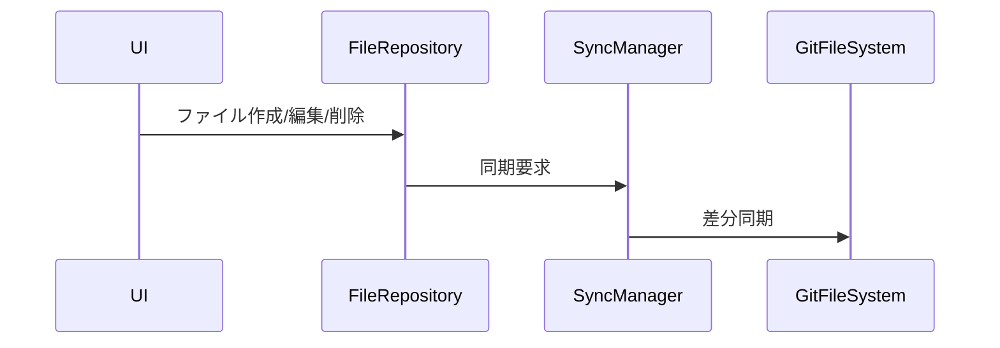
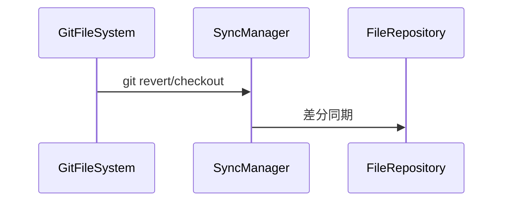

# 仮想ファイルシステム統合設計案

## 概要

- IndexedDB（独自FS）を「主」とし、lightning-fs（isomorphic-git）はgit操作用のワークツリーとして利用
- 通常操作はIndexedDB→lightning-fs、git revert等はlightning-fs→IndexedDBで同期
- SyncManagerで差分同期を制御

---

## システム構成図

```mermaid
flowchart TD
    UI[UI/ターミナル] -->|ファイル操作| FileRepository
    FileRepository -- 同期要求 --> SyncManager
    SyncManager -- 差分同期 --> GitFileSystem
    GitFileSystem -- git操作 --> SyncManager
    SyncManager -- 差分同期 --> FileRepository
    GitFileSystem -- git操作 -->|revert checkout| SyncManager
```

---

## クラス構成

- **FileRepository**  
  IndexedDBの管理・API提供。全ファイル操作はここを経由。

- **GitFileSystem**  
  lightning-fsの管理・git操作API。git add/commit/revert等を担当。

- **SyncManager**  
  両者の同期制御。差分検出・反映。  
  - `syncFromIndexedDBToFS(projectName)`
  - `syncFromFSToIndexedDB(projectName)`

---

## データフロー

### 通常操作



### git revert等



---

## ポイント

- すべてのファイル操作はFileRepository経由に統一
- git操作でワークツリーが変化した場合のみ、lightning-fs→IndexedDBの同期を行う
- 差分同期でパフォーマンスを担保

```
[UI/ターミナル]
      ↓
[FileRepository (IndexedDB)]
      ↓
[SyncManager] ←→ [GitFileSystem (lightning-fs)]
      ↑
   [git操作]
```

また、ターミナルのファイルシステムクラスと、page.tsxのクラスが分離してるせいで、ここの同期処理もややこしいことになってる。 ごっそり変えていこう。ブランチは切ってるから、ガッツリ変えていこう。