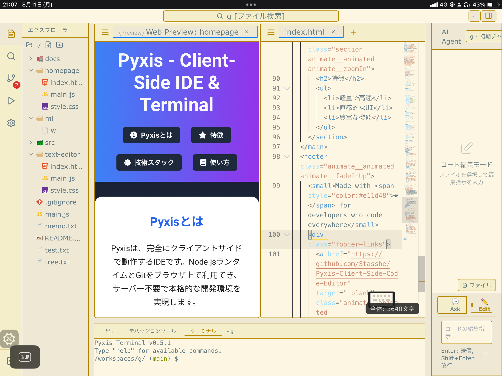

<div align="center">
  
  
  # 🌟 Pyxis - Client Side Code Editor

  ## [📖 English Version README](README_en.md)
  
  ### *セットアップゼロ。素早く起動、気軽にコーディング*
  
  [](https://github.com/your-username/pyxis)
  [](LICENSE)
  [](README.md)
  [](https://nextjs.org/)
  [](https://tailwindcss.com/)
  [](https://www.typescriptlang.org/)
  [](https://react.dev/)
  [](https://github.com/Stasshe/Pyxis-Client-Side-Code-Editor/commits/main)
  [](#)
  
  **[🚀 Pyxis を今すぐ試す](https://pyxis-code.onrender.com)**
</div>

---

## ✨ Pyxis って何？

**完全な開発環境**がブラウザで瞬時に起動する、そんな世界を想像してみてください。ダウンロード不要、インストール不要、サーバー接続不要。それがPyxisです！**VS Code + Node.js + Git**が全て一つの超高速ウェブアプリに詰まっていて、iPadでも、どこでも動きます。

> 💡 **学生、プロ、コードを気軽に書きたい全ての人にピッタリ！**

---

## 🚀 あなたの心を揺さぶる革新的機能

### 🔥 **ホットモジュールリプレースメント（HMR）- リアルタイム編集！**
<div align="center">
  
</div>

簡易サイトを素早く構築できる。ブラウザでしかテストできないが、環境整備は面倒。そんな時に、とても便利。

---

### **Markdown・Mermaid・LaTeX - ドキュメント**
<div align="center">
  
</div>

美しいドキュメントをライブプレビューで作成！Mermaidでフローチャート、LaTeXで数式、リッチなマークダウン - 全てタイプするだけでリアルタイム更新。

---

### 🔄 **ビジュアル Git - バージョン管理がこんなに簡単**
<div align="center">
  
</div>

コードの変更を**gitビジュアル差分**で確認！完全なGitサポートでブランチ、マージ、履歴管理 - 何を壊しても大丈夫な安全なGit学習環境。

---

### ⚡ **Node.js ランタイム - バックエンドパワー**
<div align="center">
  
</div>

ブラウザで**本物のNode.jsコード**が動く！ファイル操作、readline、多くのnpmモジュールが動作。(WASMを使っていないので、完璧な動作は厳しいです。ただ、動作は早いです。)

---

### **スマートファイル操作 - 何でも瞬時に発見**
<div align="center">
  
</div>

**VS Code並みの効率性**でプロジェクトをナビゲート！高速ファイル検索、インテリジェントなオートコンプリート、強力なコマンドでコーディングが楽しくなります。

---

## 🎯 なぜPyxisを選ぶべきか？

### **超高速 - 待ち時間ゼロ**
- **瞬間起動** - サーバーなし、ローディング画面なし、純粋なスピード
- **静的ホスティング** でまばたきより速く読み込み
- **ストレスフリー、ラグなし** - 思考の速度でコーディング

### 🛡️ **100%安全 - 何も壊れない**
- **サンドボックス環境** - 恐れることなく自由に実験
- **初心者のGitとコーディング学習に最適**
- **システム破損不可能** - ただのブラウザタブだから！

### **iPad ファースト - どこでもコーディング**
- **iPad で設計** された究極のモバイルコーディング体験
- **タッチ最適化インターフェース** とデュアルエディター対応
- **真のiPad開発** - ついに、タブレット用の本物のIDE

### 🤖 **AI搭載 - あなたのコーディングアシスタント**
- **Ask & Edit機能** - 何度もファイルからChatGPTにコピペする必要なし
- **シームレス統合** でコーディング環境に直接組み込み

### 🌐 **ユニバーサル互換性**
- **どこでも動く** - Web、iPad、モバイル、全てのモダンブラウザ
- **マルチペーン対応** で複雑なプロジェクトも楽々
- **バッファコンテンツ対応** - zip解凍、PDF、画像、動画表示

--- 

## 🌟 **おそらく世界初** - こんな機能が全て統合されたブラウザエディタはありませんでした

- **サーバーに一切接続しない**ため（static site hosting）起動が驚くほどはやい。ノンストレス
- **完全なGit**が使える（ブランチや、マージ、リセットなど、ローカルのgitに対応。）もしリポジトリとしてちゃんと使いたかったら、設定から。.gitを含めてダウンロードできる。
- **NodeJS**が使える。WASMを使わないので、実行までの時間が非常に短い。また、javascriptでできない、ファイルオペレーション機能をエミュレートし、気楽にコードが気軽にかける
- マークダウン、マーメイド、Latexなどを非常に軽量にリアルタイム編集できる。
- **AIAgent**搭載　vscodeを開くまでではないが、AskやEdit機能によって、通常のブラウザでは、何度も貼り付けたりする作業がいるところを、Pyxisは解決。
- **HMR** 簡易サイトを素早く構築できる。ブラウザでしかテストできないが、環境整備は面倒。そんな時に、とても便利。
- **iPad互換**　私がiPadで開発したため、もちろんiPad最優先。そのためにコードエディタも2つ搭載
- ブラウザ上だから、**何をしても壊れない。**パソコンだと何かを消すと大惨事。Pyxisだと、何をしても大丈夫。初心者がgitを学ぶのにも最適。
- buffercontentも対応し、unzipやpdf,image,videoなどのビューワーも搭載。
- **大量のテキスト**も、素早く、キーボードショートカットを使いこなして編集できる。
- **マルチペーン**　複数ウィンドウで同時に作業

---

## 🎪 みんなにピッタリ

<div align="center">

| 👨‍🎓 **学生** | 👩‍💻 **プロフェッショナル** | 🧪 **実験好き** |
|:---:|:---:|:---:|
| セットアップの面倒なしに学習 | 通勤中にiPadでコーディング | アイデアを瞬時にテスト |
| 安全にGitの練習 | デプロイなしでクライアントデモ | 高速プロトタイピング |
| 学校のPCからもアクセス | 高性能メモ帳用に | アルゴリズムテスト |

</div>

---

## Tech

### **Front End**
- **Next.js 15** と React 19 - 最新で最高
- **TypeScript** - 型安全な開発
- **Tailwind CSS** - 美しく、レスポンシブなデザイン

### **エディターとターミナル**
- **Monaco Editor** - VS Codeと同じエンジンを使用
- **xterm.js** - フル機能ターミナル体験
- **Lightning FS** - 超高速ファイルシステム

### **ランタイムイノベーション**
- **node-stdlib-browser** - Node.js API互換性
- **fs module** - 気合いのエミュレーター全書き
- **isomorphic-git** - 純粋JavaScriptのGit実装

### **Pyxisのデータベース・ファイルシステム設計に興味がある方へ**
- Pyxisの内部アーキテクチャやデータベース設計、ファイルシステムの詳細な仕様\n
- **非常に高度な内容**をまとめた[Development/DATABASE.md](Development/DATABASE.md)をご覧ください。
\n\n> 
データフローやIndexedDBの構造、仮想ファイルシステムの仕組みなど、\n> 開発者・研究者向けの深い技術情報を掲載しています。

### 🎨 **作れるもの**

```javascript
// 🚀 本当に動くNode.jsアプリ！
const fs = require('fs');
const readline = require('readline');

// 本物のファイル操作
fs.writeFileSync('my-app.js', 'console.log("こんにちはPyxis!")');

// インタラクティブなコンソールアプリ
const rl = readline.createInterface({
  input: process.stdin,
  output: process.stdout
});

rl.question('お名前は？ ', (name) => {
  console.log(`${name}さん、Pyxisへようこそ！ 🌟`);
  rl.close();
});
```

---

## 🚀 クイックスタートガイド

### **1. クリックしてコーディング開始！**
1. 🌐 **[Pyxis を開く](https://pyxis-code.onrender.com)** - どのブラウザでも
2. 📝 **タイプ開始** - サインアップ不要、ダウンロード不要
3. 🎯 **下の例を試す** - 即座に体験

### **2. 初めてのPyxisプロジェクト**

**シンプルなNode.jsアプリを作成：**
```javascript
// app.js
const fs = require('fs');

// 初めてのファイルを書く
fs.writeFileSync('hello.txt', 'Pyxisからこんにちは！ 🚀');

// 読み戻す
const message = fs.readFileSync('hello.txt', 'utf8');
console.log(message);

console.log('Pyxisへようこそ - どこでもコーディング！ ✨');
```
Git練習
```
git add .
git commit -m "初めてのPyxisプロジェクト！ 🎉"

# フィーチャーブランチ作成
git checkout -b my-awesome-feature

# 美しい差分ビュー
git diff [branchName]
```

**リッチなドキュメント作成：**
```markdown
# 私のプロジェクト

## アーキテクチャ
```mermaid
graph TD
    A[ユーザー] --> B[Pyxis IDE]
    B --> C[Node.js ランタイム]
    B --> D[Git システム]
    C --> E[ファイル システム]

## 数式
$$E = mc^2$$
```
**タイプするだけでリアルタイムプレビュー！**

---

## 🌈 ブラウザ互換性

| ブラウザ | サポート | 備考 |
|---------|---------|-------|
| 🟢 **Chrome/Edge** | 完璧 | 最高の体験にお勧め |
| 🟢 **Safari (iPad)** | 優秀 | iPadに特別最適化 |
| 🟡 **Firefox** | 良好 | 全機能動作 |
| 🟡 **モバイル** | 良好 | タッチ最適化インターフェース |

**システム要件：** モダンブラウザと2GB+のRAMでスムーズな体験。

---

## 🎉 Pyxisコミュニティに参加

### 💝 **あなたの力をお貸しください！**

貢献の方法はたくさんあります：

- 🐛 **バグを見つけた？** 報告してPyxisをより良くしましょう
- 💡 **アイデアがある？** 機能提案をシェアしてください
- **ドキュメント改善** - 他の人にも伝えましょう
- 🔧 **コード貢献** - 新機能追加やイシュー修正
- ⭐ **リポジトリにスター** - 本当に成長の助けになります！

### 🌟 **Thanks**

Pyxisを可能にした素晴らしいオープンソースプロジェクトに心から感謝：
- **Monaco Editor** - ブラウザでのVS Code
- **isomorphic-git** - Gitをウェブに
- **Next.js & React** - モダンウェブアプリの基盤

---

## 📄 ライセンス

MIT License - 使って、改造して。詳細は[LICENSE](LICENSE)をご覧ください。

---

<div align="center">

## 🚀 制限なしのコーディングの準備はできましたか？

**[✨ Pyxis を今すぐ起動](https://pyxis-code.onrender.com)**

*ダウンロード不要。セットアップ不要。純粋なコーディング。* ✨

---

### シェアしよう

**Pyxisが気に入った？** リポジトリに⭐をつけて、仲間の開発者にシェアしてください！

**バグを見つけた？** [こちらで報告](issues/)して改善にご協力ください

---


*「制限なく、いつでも、どこでもコーディング」*

</div>
