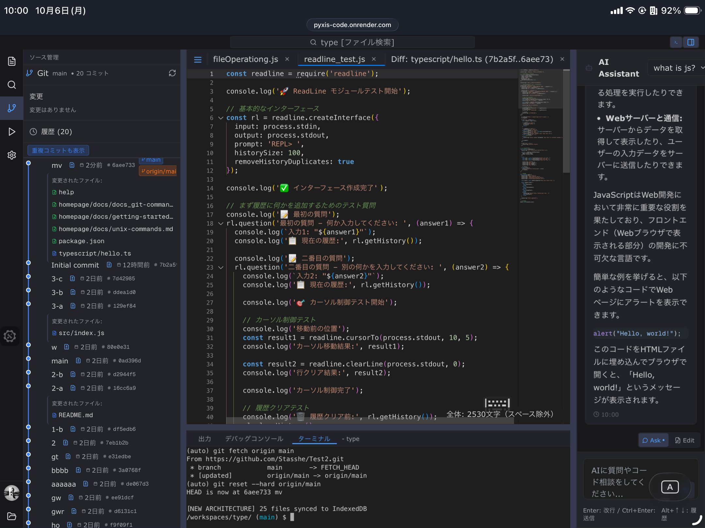
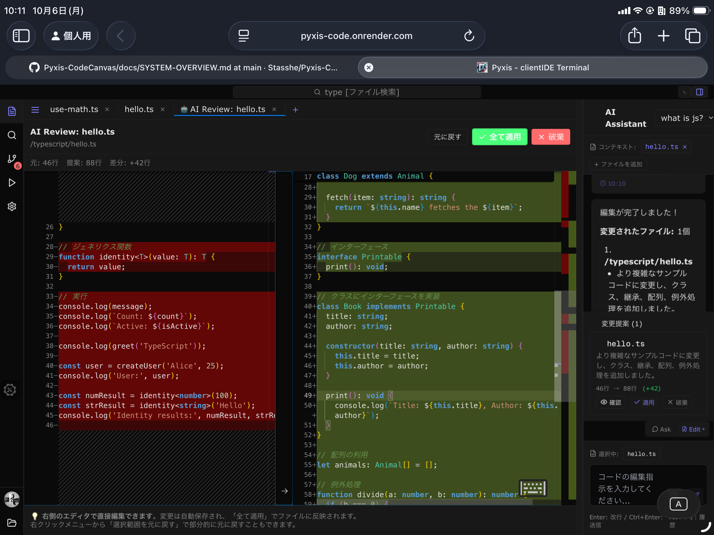

<div align="center">
  
  
  # Pyxis - Client Side Code Editor

  ## [English Version README](README_en.md)
  
  ### *Zero Setup. Quick Start, Easy Coding*

  [](https://github.com/your-username/pyxis)
  [](LICENSE)
  [](README.md)
  [](#)
  [](https://tauri.app/)
  [](https://nextjs.org/)
  [](https://tailwindcss.com/)
  [](https://www.typescriptlang.org/)
  [](https://react.dev/)
  [](https://github.com/Stasshe/Pyxis-Client-Side-Code-Editor/commits/main)
  [](#)
  
  **[🚀 Pyxis を今すぐ試す](https://Stasshe.github.io/Pyxis-CodeCanvas)**
</div>

---

## Pyxis って何？

- **Pyxisは、iPad向けに設計された1秒で起動する高機動なブラウザIDEです。**
- **静的サイトなので、サーバー起動が必要なく、また課金も一切発生しません。**

### 🌍 **世界18ヶ国語対応 - グローバルなコーディング体験**

**Pyxisはあなたの言語で動作します。** 

> 日本語 • English • 中文 • 繁體中文 • 한국어 • Español • Français • Deutsch • Italiano • Português • Русский • Nederlands • Türkçe • العربية • हिन्दी • ไทย • Tiếng Việt • Bahasa Indonesia • Svenska • Polski

世界中の開発者が母国語でPyxisを快適に利用できます。

### こんな人のために作りました

<div align="center">

| **iPadユーザー** | **PC所有者** |
|:---:|:---:|
| iPadで本格的にコーディング | VSCodeを開くほどではない |
| Stackblitzは重すぎる | ちょっとしたコード編集 |
| タッチ操作に最適化されたIDE | 長めのメモを取りたい |
| 軽快な動作が欲しい | 気軽にサッと使いたい |

</div>


###StackblitzやWebContainerとの違い・Pyxisの設計思想

StackblitzやWebContainerはWeb開発に特化した高度なIDEですが、Pyxisは**「VSCodeのようなエディタ・便利なファイルシステム・実行環境をWeb/iPadで実現する」**ことを目的としています。

- **Stackblitzとの違い**: PyxisはWeb開発専用ではなく、ドキュメント作成やメモ、アルゴリズム学習など幅広い用途を想定。目的自体が異なります。
- **WebContainerとの違い**: PyxisはWeb Workerの並列多用を避け、IndexedDBへの積極的なキャッシュでメモリ消費を大幅に抑制。WebContainerのような仮想化ではなく、軽量・高速な独自ランタイムを採用しています。
- **エディタ体験重視**: VSCodeのような操作性・ファイルシステム・実行体験を重視し、iPadやモバイルでも快適に動作。

> 💡 **パソコンのような操作性とiPadの機動性を両立！**
> 🖥️ **Tauriデスクトップ版もサポート！** Windows/Mac/LinuxでネイティブアプリとしてPyxisを利用できます。

---

## Pyxisの革新的機能

### **Markdown・Mermaid・LaTeX - 高品質ドキュメント作成**
<div align="center">
  
</div>

**Pyxisはマークダウンビューワーに特にこだわっています。**
- **ドキュメント作成** - 技術文書、仕様書を美しく
- **ブログ記事執筆** - リアルタイムプレビューで効率的に
- **Mermaid対応** - フローチャート、図表を簡単作成
- **LaTeX数式** - 数学的な表現も完璧にレンダリング

タイプするだけで即座にプレビュー更新！長文の執筆にも最適です。

---


### **ライブリロード（即時反映） - 簡易サイト構築**
<div align="center">
  
</div>

**HTML/CSS/JSのみ対応** - ブラウザでしかテストできないが、環境整備は面倒。そんな時に、とても便利。
- ファイル保存時に即座にブラウザへ反映（Liveリロード）
- 簡易的なWeb開発に最適
- セットアップ不要でサッと使える

 > **注意**: 現在はHTML/CSS/JSのみ対応。WebContainer等は不要で、自前実装による高速な即時リロードを実現しています。

---


### **Gitバージョン管理・GitHub連携**

**主要なGit機能をブラウザ上で実現。** ブランチ、マージ、コミット、リセット、.git込みエクスポートなどに加え、**GitHubへのpush（PAT認証）にも対応**しています。
- **ビジュアル差分** - コード変更を美しく可視化
- **ブランチ操作** - 安全に実験、いつでも戻せる
- **.git込みでダウンロード** - 設定から.gitを含めて丸ごとエクスポート可能
- **GitHubリモート連携** - PAT認証によるpush/pullが可能
- **安全な学習環境** - 何を壊しても大丈夫！初心者のGit練習にも最適

> **注意**: GitHub連携はPersonal Access Token（PAT）認証で実現しています。リモートリポジトリへのpush/pullが可能です。

---

### **AIアシスタント - 流行りのAI IDE**
<div align="center">
  
</div>
PyxisではAIアシスタントがコード差分の提案・採用をサポート。より直感的なDiff操作・レビュー体験が可能です。

---


### **Node.js & TypeScript ランタイム
<div align="center">
  
</div>

**WASMを使わない独自実装**で、Node.jsだけでなく**TypeScriptの実行にも対応**。TypeScriptはBabel Standaloneと独自の正規化システムで高速に変換・実行されます。
- **瞬時に実行** - コンパイル不要、待ち時間ゼロ
- **ファイル操作** - `fs`, `readline`, `userinterface` など主要モジュールがそのまま使える
- **TypeScript/Babel対応** - Babel Standaloneと複雑な正規化システムでTypeScriptも即時実行
- **気軽にコード実行** - アルゴリズムテスト、学習、インタラクティブなコンソールアプリもOK

JavaScriptでは不可能なファイルオペレーションやインタラクティブな入出力（readline, userinterface）もエミュレートし、本格的なNode.js/TypeScript学習環境を提供。


> **制限事項**: WASMを使用していないため、ネイティブモジュールやchild_processなど一部機能は未対応です。基本的なNode.js/TypeScript学習や簡易スクリプト実行には十分です。

---

### **Advanced Shell System - Full POSIX Shell Support**
<div align="center">
  
</div>

**ブラウザ上で本格的なPOSIX準拠シェルスクリプト実行環境を実現！** Pyxis独自のStreamShellアーキテクチャにより、パイプライン、リダイレクション、制御構文、変数展開など、実Unixシェルのほとんどの機能をサポートします。

#### 主な機能
- **パイプライン処理** - `cmd1 | cmd2 | cmd3` によるストリーム接続
- **リダイレクション** - `cmd > file`、`cmd >> file`、`cmd < file`、`cmd 2>&1` など完全対応
- **制御構文** - `if/then/else`、`for/while` ループ、`break/continue`
- **変数展開** - `$VAR`、`$(command)` コマンド置換、`((算術))` 算術展開
- **論理演算子** - `&&`、`||` による条件実行
- **バックグラウンド実行** - `cmd &` 非同期処理
- **ファイル操作** - `ls`、`cat`、`grep`、`head`、`tail` などUnixコマンド
- **スクリプト実行** - `.sh` ファイルの直接実行

#### 技術的特徴
- **ストリーミングアーキテクチャ** - Node.js Stream APIによる真のストリーミング処理
- **バックプレッシャー対応** - メモリ効率の高いデータフロー制御
- **プロセス抽象化** - ブラウザ環境での仮想プロセス管理
- **fd管理** - ファイルディスクリプタの完全エミュレーション
- **タイムアウト保護** - 無限ループ防止のための自動タイムアウト

**シェルスクリプトの例：**
```bash
# パイプライン処理
cat large-file.txt | grep "error" | head -10

# リダイレクション
ls -la > directory-listing.txt 2>&1

# 制御構文
if [ -f "config.txt" ]; then
    echo "Config file exists"
    cat config.txt
else
    echo "Creating default config"
    echo "default=true" > config.txt
fi

# 算術展開
COUNT=$((COUNT + 1))
echo "Current count: $COUNT"
```

**ブラウザで本物のシェル体験！** 複雑なスクリプトも、データ処理も、すべてPyxisのターミナルで実行可能です。

> **StreamShellアーキテクチャにより、メモリ効率が高く、大規模データ処理も快適に動作します。**


> Note: 一部のシステムコマンドやバグ、機能はまだ完全には対応していません。今後のアップデートでさらに強化予定です。
issueで要望をお寄せください。

詳細は [Shell System Documentation](/docs/SHELL-SYSTEM.md) を参照。

---

### Pyxis拡張機能システム
<div align="center">
  
</div>

<div align="center">
  
</div>

Pyxis最大の特徴のひとつが「拡張機能システム」です。VSCodeライクなUI拡張・npmライブラリ完全対応・Terminalコマンド拡張・多言語パック・トランスパイラ・サービス拡張など、あらゆる機能をTypeScript/TSXで自由に追加できます。

#### 主なポイント
- **CLIテンプレート生成**：`pnpm run create-extension`で対話式テンプレート自動生成。初心者でも即拡張開発可能。
- **npmライブラリ完全対応**：外部ライブラリを自由に利用。
- **Terminalコマンド拡張**：独自コマンドをAPIで追加し、PyxisターミナルUIから実行可能。
- **VSCodeライクなUI拡張**：カスタムタブ・サイドバーパネルをAPIで追加。React/TSXで直感的にUI構築。
- **多言語パック・サービス拡張**：言語パックや独自サービスも拡張機能として追加。
- **安全なサンドボックス設計**：各拡張は独立・安全に動作。IndexedDBで永続化・キャッシュ。

「VSCode級のUI拡張がWeb/iPadで動く」「Terminalコマンドも拡張可能」「公式テンプレートで即開発」など、他にない柔軟性と拡張性を持っています。

詳細は [Extension Readme](/extensions/README.md) や、より詳細な[EXTENSION-SYSTEM](/docs/EXTENSION-SYSTEM.md)を参照。

---

---

### **スムーズなファイル・IDE操作**
<div align="center">
  
</div>
<div align="center">
  
</div>


**VS Codeのような効率性**でプロジェクトをナビゲート！高速ファイル検索オペレーションウィンドウなど、高速化つスムーズな、ストレスフリーなUXを提供します。

---

## なぜPyxisを選ぶべきか？

### **超高速 - 待ち時間ゼロ**
- **瞬間起動** - サーバーなし、ローディング画面なし、純粋なスピード
- **静的ホスティング** でまばたきより速く読み込み
- **ストレスフリー、ラグなし** - 思考の速度でコーディング

### **100%安全 - 何も壊れない**
- **サンドボックス環境** - 恐れることなく自由に実験
- **初心者のGitとコーディング学習に最適**
- **システム破損不可能** - ただのブラウザタブだから！

### **iPad ファースト - どこでもコーディング**
- **iPad で設計** された究極のモバイルコーディング体験
- **タッチ最適化インターフェース** とデュアルエディター対応
- **真のiPad開発** - ついに、タブレット用の本物のIDE

### auriデスクトップ対応
- Windows/Mac/LinuxでネイティブアプリとしてPyxisを利用可能
- Webと同じ体験をデスクトップで
- オフラインでも動作

### **AIサポート - シームレスな開発支援**
- **Ask & Edit機能** - 通常のブラウザでは何度もコピペが必要な作業を解決
- **コンテキスト保持** - ファイルを開いたまま、AIに質問・編集依頼
- **統合された体験** - VSCodeを開くほどではないが、AIの力は欲しい時に最適

### **ユニバーサル互換性**
- **どこでも動く** - Web、iPad、モバイル、全てのモダンブラウザ
- **マルチペーン対応** で複雑なプロジェクトも楽々
- **バッファコンテンツ対応** - zip解凍、PDF、画像、動画表示
- **🌍 20ヶ国語対応** - 日本語、英語、中国語、韓国語、スペイン語、フランス語、ドイツ語、イタリア語、ポルトガル語、ロシア語、オランダ語、トルコ語、アラビア語、ヒンディー語、タイ語、ベトナム語、インドネシア語、スウェーデン語、ポーランド語に対応
- **拡張機能システム** - 言語パック、トランスパイラ、カスタム機能を動的に追加

--- 

## Pyxisの独自性 - 他にはない組み合わせ

### **設計思想**
- **1秒起動** - サーバーレス静的ホスティングによる驚異的な速度
- **iPad最優先** - 実際にiPadで開発、デュアルエディター搭載
- **気軽さ重視** - VSCodeほど本格的ではないが、メモ帳をはるかに超える機能
- **Gitバージョン管理・GitHub連携** - ブランチ、マージ、リセット、.git込みダウンロード、PAT認証push/pull
- **高速Node.js** - 瞬時実行、ファイル操作エミュレート
- **こだわりのMD** - Markdown/Mermaid/LaTeX、ドキュメント・ブログ執筆に最適
- **AIサポート** - Ask/Edit機能で効率化
- **ライブリロード対応** - HTML/CSS/JS簡易サイト開発
- **バッファ対応** - ZIP解凍、PDF/画像/動画ビューワー
- **効率的編集** - キーボードショートカットで大量テキストも快適
- **マルチペーン** - 複数ウィンドウで同時作業
- **拡張機能アーキテクチャ** - 動的ロード、依存関係管理、永続化でモジュラーな設計

### **安全性**
ブラウザ上だから**何をしても壊れない**。PC環境で何かを削除すると取り返しがつかないが、Pyxisなら安心。初心者のGit学習にも最適。

### **将来の展望**
- **CAS導入** - Latexiumライブラリ開発中（symbolic computation対応予定）

---

## こんな使い方ができます

<div align="center">

| **iPadユーザー** |  **PC所有者** | **学習者** |
|:---:|:---:|:---:|
| 外出先で本格コーディング | VSCode起動は面倒な時に | Git操作を安全に練習 |
| ブログ記事をその場で執筆 | ちょっとしたコード編集 | Node.js基礎を学習 |
| ドキュメント作成・プレビュー | 長めのメモ・技術文書作成 | アルゴリズムテスト |
| 軽快な操作性で快適作業 | 1秒起動で即作業開始 | 何を壊しても安心な環境 |

</div>

---

## Tech

### [click me! 処理フローはこちら](./Development/all-flow.svg)

### **Front End**
- **Next.js 15** と React 19 - 最新で最高
- **TypeScript** - 型安全な開発
- **Tailwind CSS** - 美しく、レスポンシブなデザイン

### Desktop (Tauri)
- Tauri - 軽量・高速なデスクトップアプリフレームワーク
- Rust - セキュアなネイティブランタイム

### **エディターとターミナル**
- **Monaco Editor** - VS Codeと同じエンジンを使用
- **xterm.js** - フル機能ターミナル体験
- **Lightning FS** - 超高速ファイルシステム

### **ランタイムイノベーション**
- **node-stdlib-browser** - Node.js API互換性
- **fs module** - 気合いのエミュレーター全書き
- **isomorphic-git** - 純粋JavaScriptのGit実装

### **Pyxisのデータベース・ファイルシステム設計に興味がある方へ**
- Pyxisの内部アーキテクチャやデータベース設計、ファイルシステムの詳細な仕様\n
- **非常に高度な内容**をまとめた[Development/DATABASE.md](Development/DATABASE.md)をご覧ください。
データフローやIndexedDBの構造、仮想ファイルシステムの仕組みなど、開発者・研究者向けの深い技術情報を掲載しています。

### **作れるもの**

```javascript
// 🚀 本当に動くNode.jsアプリ！
const fs = require('fs');
const readline = require('readline');

// 本物のファイル操作
fs.writeFileSync('my-app.js', 'console.log("こんにちはPyxis!")');

// インタラクティブなコンソールアプリ
const rl = readline.createInterface({
  input: process.stdin,
  output: process.stdout
});

rl.question('お名前は？ ', (name) => {
  console.log(`${name}さん、Pyxisへようこそ！ 🌟`);
  rl.close();
});
```

---

## 🚀 クイックスタートガイド

### **1. クリックしてコーディング開始！**
1. **[Pyxis を開く](https://Stasshe.github.io/Pyxis-CodeCanvas)** - どのブラウザでも
2. *タイプ開始** - サインアップ不要、ダウンロード不要

### Tauriデスクトップ版の使い方
1. リポジトリをクローンし、tauriブランチに切り替え
2. RustとNode.jsをインストール
3. pnpm install で依存を導入
4. pnpm exec tauri dev でデスクトップアプリを起動
5. Web版と同じPyxis体験をデスクトップで！
* [Tauri Setup Guide](./Development/Tauri-Setup.md)

### **2. 初めてのPyxisプロジェクト**

**シンプルなNode.jsアプリを作成：**
```javascript
// app.js
const fs = require('fs');

// 初めてのファイルを書く
fs.writeFileSync('hello.txt', 'Pyxisからこんにちは！ 🚀');

// 読み戻す
const message = fs.readFileSync('hello.txt', 'utf8');
console.log(message);

console.log('Pyxisへようこそ - どこでもコーディング！ ✨');
```
Git練習
```
git add .
git commit -m "初めてのPyxisプロジェクト！ 🎉"

# フィーチャーブランチ作成
git checkout -b my-awesome-feature

# 美しい差分ビュー
git diff [branchName]
```

**リッチなドキュメント作成：**
```markdown
# 私のプロジェクト

## アーキテクチャ
```mermaid
graph TD
    A[ユーザー] --> B[Pyxis IDE]
    B --> C[Node.js ランタイム]
    B --> D[Git システム]
    C --> E[ファイル システム]

## 数式
$$E = mc^2$$
```
**タイプするだけでリアルタイムプレビュー！**

---

## ブラウザ互換性

| ブラウザ | サポート | 備考 |
|---------|---------|-------|
| 🟢 **Chrome/Edge** | 完璧 | 最高の体験にお勧め |
| 🟢 **Safari (iPad)** | 優秀 | iPadに特別最適化 |
| 🟡 **Firefox** | 良好 | 全機能動作 |
| 🟡 **モバイル** | 良好 | タッチ最適化インターフェース |
| 🟢 Tauri (Desktop) | 完璧 | Windows/Mac/Linuxで動作 |

**システム要件：** モダンブラウザと2GB+のRAMでスムーズな体験。

---

## インストール方法

### 推奨: pnpm (高速・効率的)
```bash
# pnpmをインストール (未インストールの場合)
npm install -g pnpm

# 依存関係をインストール
pnpm install

# 開発サーバー起動
pnpm run dev

# 本番ビルド
pnpm run build
pnpm run preview
```

### npm でも可能
```bash
npm install
npm run dev
npm run build
npm run preview
```

or, if you use tauri, use "tauri" branch.
* check this guide! [Tauri Setup Guide](./Development/Tauri-Setup.md)

```
npm i

npx tauri dev
```

---

## Pyxisコミュニティに参加

### **あなたの力をお貸しください！**

貢献の方法はたくさんあります：

- **バグを見つけた？** 報告してPyxisをより良くしましょう
- **アイデアがある？** 機能提案をシェアしてください
- **ドキュメント改善** - 他の人にも伝えましょう
- **コード貢献** - 新機能追加やイシュー修正
- **リポジトリにスター** - 本当に成長の助けになります！

### **Thanks**

Pyxisを可能にした素晴らしいオープンソースプロジェクトに心から感謝：
- **Monaco Editor** - ブラウザでのVS Code
- **isomorphic-git** - Gitをウェブに
- **Next.js & React** - モダンウェブアプリの基盤

---

## 📄 ライセンス

MIT License - 使って、改造して。詳細は[LICENSE](LICENSE)をご覧ください。

---

<div align="center">

## 制限なしのコーディングの準備はできましたか？

**[Pyxis を今すぐ起動](https://Stasshe.github.io/Pyxis-CodeCanvas)**

*ダウンロード不要。セットアップ不要。純粋なコーディング。* ✨

**Dev Server: [pyxis-code.onrender.com](https://pyxis-code.onrender.com)**

---

### シェアしよう

**Pyxisが気に入った？** リポジトリに⭐をつけて、仲間の開発者にシェアしてください！

**バグを見つけた？** [こちらで報告](issues/)して改善にご協力ください

---


*「制限なく、いつでも、どこでもコーディング」*

</div>
