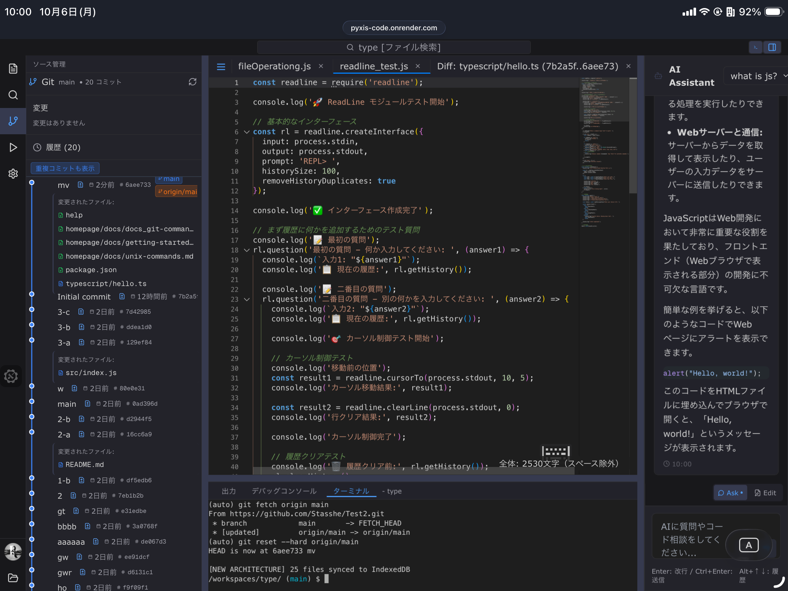
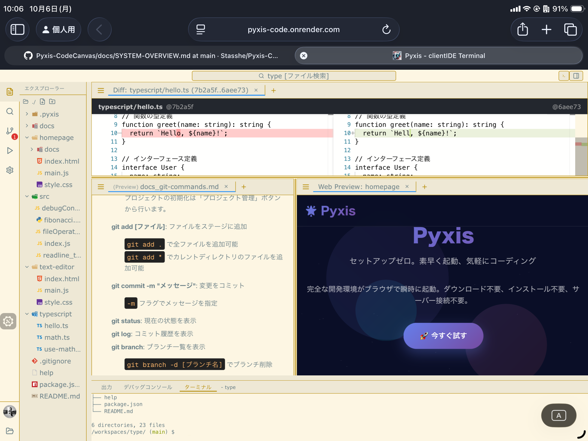
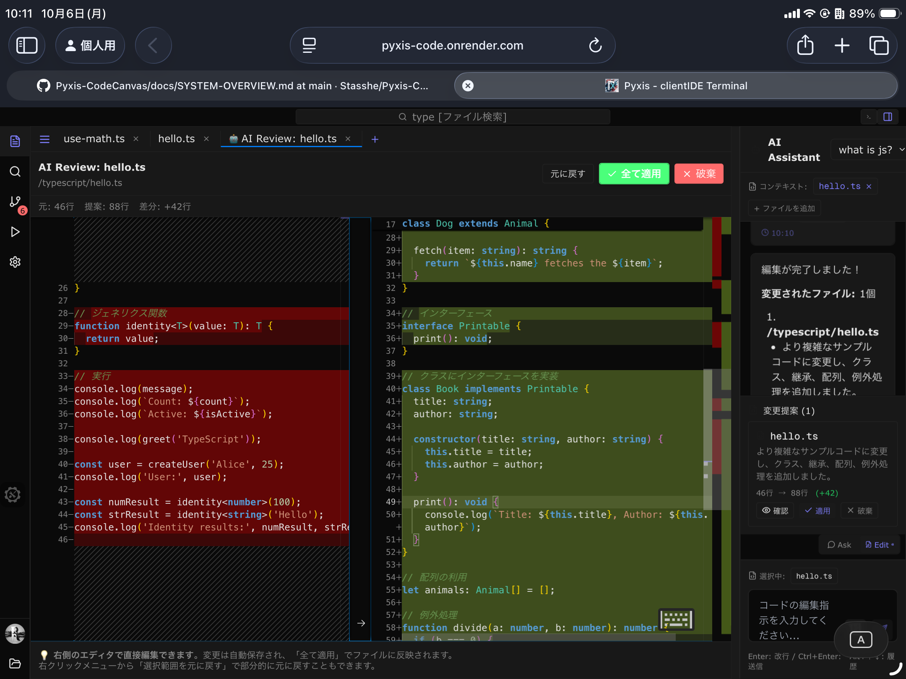
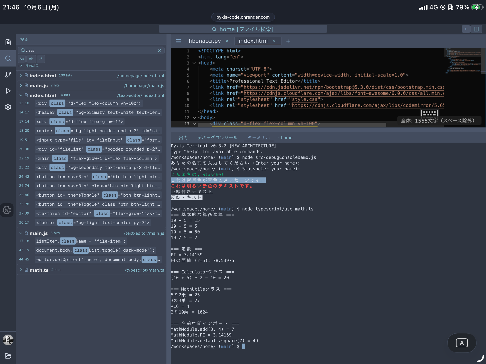

<div align="center">
  
  
  # 🌟 Pyxis - Your Code Universe in a Browser
  
  ### *Zero Setup. Quick Start, Easy Coding*

  [](https://github.com/your-username/pyxis)
  [](LICENSE)
  [](README.md)
  [](#)
  [](https://tauri.app/)
  [](https://nextjs.org/)
  [](https://tailwindcss.com/)
  [](https://www.typescriptlang.org/)
  [](https://react.dev/)
  [](https://github.com/Stasshe/Pyxis-Client-Side-Code-Editor/commits/main)
  [](#)
  
  **[🚀 Try Pyxis Now](https://Stasshe.github.io/Pyxis-CodeCanvas)** | **[📖 日本語版](README.md)**
</div>

---

## ✨ What is Pyxis?

- **Pyxis is a high-mobility browser IDE designed for iPad that launches in just 1 second.**
- **Since Pyxis is a static site, there is no need to start a server, and as a result, no charges are incurred.**

### 🌍 **18 Languages Worldwide - Global Coding Experience**

**Pyxis speaks your language.**

> 日本語 • English • 中文 • 繁體中文 • 한국어 • Español • Français • Deutsch • Italiano • Português • Русский • Nederlands • Türkçe • العربية • हिन्दी • ไทย • Tiếng Việt • Bahasa Indonesia • Svenska • Polski

Break language barriers with a truly global IDE. Developers worldwide can use Pyxis comfortably in their native language.

### 🎯 Built For

<div align="center">

| 📱 **iPad Users** | 💻 **PC Owners** |
|:---:|:---:|
| Serious coding on iPad | Not serious enough for VS Code |
| Stackblitz is too heavy | Quick code edits |
| Touch-optimized IDE | Extended note-taking |
| Lightweight performance | Casual, instant access |

</div>

### 🚀 Why Not Stackblitz?

Stackblitz is a sophisticated IDE, but has these challenges:
- **Heavy on iPad** - High memory consumption
- **Web-focused** - Limited for other use cases
- **Small screen issues** - Not mobile-optimized
- **Touch UI problems** - Not optimized for iPad gestures

**Pyxis solves these problems:**
- ⚡ **1-second startup** - Serverless static hosting for instant launch
- � **iPad-optimized** - Touch gestures and dual editor support
- 🎨 **Versatile** - Not just web dev, but docs and notes too
- 🪶 **Lightweight** - Smooth even on iPad

> 💡 **Desktop-like experience with iPad mobility!**
> 🖥️ **Tauri Desktop supported!** Use Pyxis as a native app on Windows, Mac, and Linux.

---

## 🚀 Revolutionary Features of Pyxis

### 📝 **Markdown, Mermaid & LaTeX - Premium Documentation**
<div align="center">
  
</div>

**Pyxis focuses heavily on the Markdown viewer.**
- 📄 **Technical docs** - Beautiful specifications and documentation
- ✍️ **Blog writing** - Efficient writing with real-time preview
- 📊 **Mermaid support** - Easy flowcharts and diagrams
- 🔢 **LaTeX math** - Perfect rendering of mathematical expressions

Instant preview as you type! Perfect for long-form writing.

---

### 🔥 **Live Reload (Instant Update) - Quick Site Building**
<div align="center">
  
</div>

**HTML/CSS/JS only** - Perfect for quick browser testing without tedious setup.
- Instant updates on file save (Live Reload)
- Ideal for simple web development
- No setup required, just start coding

 > **Note**: Currently supports HTML/CSS/JS only. No WebContainer needed—Pyxis implements its own fast instant reload system.

---

### 🔄 **Local Git - Version Control in Browser**

**Local Git is nearly complete!** Branch, merge, commit, reset - all major Git features in your browser.
- 🎨 **Visual diffs** - Beautiful code change visualization
- 🌿 **Branch operations** - Experiment safely, revert anytime
- 💾 **Export with .git** - Download entire repository including .git folder
- 🛡️ **Safe learning** - Break anything without consequences! Perfect for Git beginners

> **GitHub Integration**: Remote repository connection is on hold pending GitHub application approval. Local Git is fully functional.

---

### 🧠 **AI Assistant Diff Adoption UI**
<div align="center">
  
</div>
Pyxis features an AI assistant that helps you review and adopt code diffs. This provides a more intuitive Git operation and review experience.

---

### ⚡ **Node.js & TypeScript Runtime - Lightning Fast Execution**
<div align="center">
  
</div>

**Custom implementation without WASM**—incredibly fast, and supports not only Node.js but also TypeScript execution (via Babel Standalone and advanced normalization). The runtime allows you to use `fs`, `readline`, and even `userinterface` (for interactive console apps), just like in a real Node.js environment.
- ⚡ **Instant execution** - No compilation, zero wait time
- 📁 **File operations** - Full support for `fs`, `path`, `readline`, and `userinterface` modules
- 🌀 **TypeScript/Babel support** - TypeScript runs instantly via Babel Standalone and normalization system
- 🎯 **Casual coding** - Perfect for algorithm testing, learning, and interactive console apps

Emulates file operations and interactive user input/output that are impossible in plain JavaScript, providing a genuine Node.js/TypeScript learning environment.

> **Limitations**: No WASM means some features like native modules and child_process are unsupported. Sufficient for basic Node.js/TypeScript learning and simple scripts.

---

### � **Smart File Operations - Find Anything Instantly**
<div align="center">
  
</div>

<div align="center">
  
</div>

Navigate your projects with **VS Code-like efficiency**! Fast file search, an operation window for quick actions, intelligent autocomplete, and a smooth, stress-free UX make navigating projects effortless.

---

## 🎯 Why Choose Pyxis?

### **Lightning Fast - Zero Wait Time**
- **Instant startup** - No servers, no loading screens, just pure speed
- **Static hosting** means it loads faster than you can blink
- **No stress, no lag** - Code at the speed of thought

### 🛡️ **100% Safe - Break Nothing**
- **Sandbox environment** - Experiment freely without fear
- **Perfect for beginners** learning Git and coding
- **No system damage possible** - it's just a browser tab!

### 📱 **iPad First - Code Anywhere**
- **Designed on iPad** for the ultimate mobile coding experience
- **Touch-optimized interface** with dual editor support
- **True iPad development** - finally, a real IDE for your tablet

### 🤖 **AI Support - Seamless Development Assistance**
- **Ask & Edit features** - Eliminates repetitive copy-paste in regular browsers
- **Context retention** - Ask AI and request edits while keeping files open
- **Integrated experience** - Not quite VS Code level, but perfect when you need AI power

### 🌐 **Universal Compatibility**
- **Works everywhere** - Web, iPad, mobile, any modern browser
- **Multi-pane support** for complex projects
- **Buffer content support** - unzip files, view PDFs, images, videos
- **🌍 18 Languages Support** - Available in Japanese, English, Chinese, Traditional Chinese, Korean, Spanish, French, German, Italian, Portuguese, Russian, Dutch, Turkish, Arabic, Hindi, Thai, Vietnamese, Indonesian, Swedish, and Polish

### 🖥️ **Tauri Desktop Support**
- **Windows/Mac/Linux** native app experience
- **Same features as Web version** on desktop
- **Works offline**

--- 

---

## 🎪 Use Cases

<div align="center">

| � **iPad Users** |  **PC Owners** | 👨‍🎓 **Learners** |
|:---:|:---:|:---:|
| Serious coding on the go | When VS Code is overkill | Practice Git operations safely |
| Write blog posts anywhere | Quick code edits | Learn Node.js basics |
| Document creation & preview | Extended notes & tech docs | Algorithm testing |
| Smooth operation, comfort | 1-second start, instant work | Break anything, stay safe |

</div>

---

## Tech

### **Frontend Powerhouse**
- **Next.js 15** with React 19 - Latest and greatest
- **TypeScript** - Type-safe development
- **Tailwind CSS** - Beautiful, responsive design

### **Desktop (Tauri)**
- **Tauri** - Lightweight, fast desktop app framework
- **Rust** - Secure native runtime

### **Editor & Terminal**
- **Monaco Editor** - The same engine that powers VS Code
- **xterm.js** - Full-featured terminal experience
- **Lightning FS** - Blazing-fast file system

### **Runtime Innovation**
- **fs module** - File System
- **node-stdlib-browser** - Node.js API compatibility
- **isomorphic-git** - Pure JavaScript Git implementation

### **Interested in Pyxis Database & File System Design?**

For an in-depth look at Pyxis's internal architecture, database design, and file system specifications, check out the **advanced documentation** in [Development/DATABASE.md](Development/DATABASE.md).

> Covers data flow, IndexedDB structure, virtual file system mechanisms, and more—packed with deep technical insights for developers and researchers.

### 🎨 **What You Can Build**

```javascript
// 🚀 Node.js apps that actually work!
const fs = require('fs');
const readline = require('readline');

// Real file operations
fs.writeFileSync('my-app.js', 'console.log("Hello Pyxis!")');

// Interactive console apps
const rl = readline.createInterface({
  input: process.stdin,
  output: process.stdout
});

rl.question('What\'s your name? ', (name) => {
  console.log(`Hello ${name}! Welcome to Pyxis! 🌟`);
  rl.close();
});
```

### 🌟 **Git Workflow Made Easy**

```bash
# See beautiful visual diffs
git diff [branchName]
git add .
git commit -m "My awesome feature ✨"

# Branch like a pro
git checkout -b feature/amazing-idea
git merge main

# Download your entire repo with .git included!
# Perfect for moving to desktop later
```


---

## 🚀 Quick Start Guide

### **1. Just Click and Code!**
1. 🌐 **[Open Pyxis](https://Stasshe.github.io/Pyxis-CodeCanvas)** in any browser
2. 📝 **Start typing** - no sign up, no downloads needed
3. 🎯 **Try the examples**

### **How to use Tauri Desktop version**
1. Clone the repository and switch to the `tauri` branch
2. Install Rust and Node.js
3. Run `npm install` to install dependencies
4. Run `npx tauri dev` to launch the desktop app
5. Enjoy the same Pyxis experience on desktop!

### **2. Your First Pyxis Project**

**Create a simple Node.js app:**
```javascript
// app.js
const fs = require('fs');

// Write your first file
fs.writeFileSync('hello.txt', 'Hello from Pyxis! 🚀');

// Read it back
const message = fs.readFileSync('hello.txt', 'utf8');
console.log(message);

// Create a simple server simulation
const express = require('express'); // Many npm modules work!
console.log('Welcome to Pyxis - code anywhere! ✨');
```
**Create rich documentation:**
```markdown
# My Project

## Architecture
```mermaid
graph TD
    A[User] --> B[Pyxis IDE]
    B --> C[Node.js Runtime]
    B --> D[Git System]
    C --> E[File System]
## Formula
$$E = mc^2$$
```
**Real-time preview as you type!**

---

## 🌈 Browser Compatibility

| Browser | Support | Notes |
|---------|---------|-------|
| 🟢 **Chrome/Edge** | Perfect | Recommended for best experience |
| 🟢 **Safari (iPad)** | Excellent | Optimized specifically for iPad |
| 🟡 **Firefox** | Good | All features work |
| 🟡 **Mobile** | Good | Touch-optimized interface |
| 🟢 **Tauri (Desktop)** | Perfect | Works on Windows/Mac/Linux |

**System Requirements:** Just a modern browser and 2GB+ RAM for smooth experience.

---

## インストール方法
```
npm i

#development server
npm run dev

#production mode
npm run build
npm run preview
```

or, if you use tauri, use "tauri" branch.
* check this guide! [Tauri Setup Guide](./Development/Tauri-Setup.md)

```
npm i

npx tauri dev
```

## 🎉 Join the Pyxis Community

### 💝 **We'd Love Your Help!**

There are tons of ways to contribute:

- 🐛 **Found a bug?** Report it and help make Pyxis better
- 💡 **Have an idea?** Share your feature suggestions
- **Improve docs** - help others discover
- 🔧 **Code contributions** - add new features or fix issues
- ⭐ **Star the repo** - it really helps us grow!

### 🌟 **Special Thanks**

Huge appreciation to the amazing open-source projects that make Pyxis possible:
- **Monaco Editor** - The VS Code in browsers
- **isomorphic-git** - Bringing Git to the web
- **xtermjs** - Terminal emulator
- **Next.js & React** - The foundation of modern web apps

---

## 📄 License

MIT License - Use it, modify it, love it! See [LICENSE](LICENSE) for details.

---

<div align="center">

## 🚀 Ready to Code Without Limits?

**[✨ Launch Pyxis Now](https://Stasshe.github.io/Pyxis-CodeCanvas)**

*No downloads. No setup. Just pure coding.* ✨

---

### 📱 Share

**Love Pyxis?** Star ⭐ the repo and share it with fellow developers!

**Found a bug?** [Report it here](issues/) and help us improve

---


*"Code anywhere, anytime, without limits"*

</div>