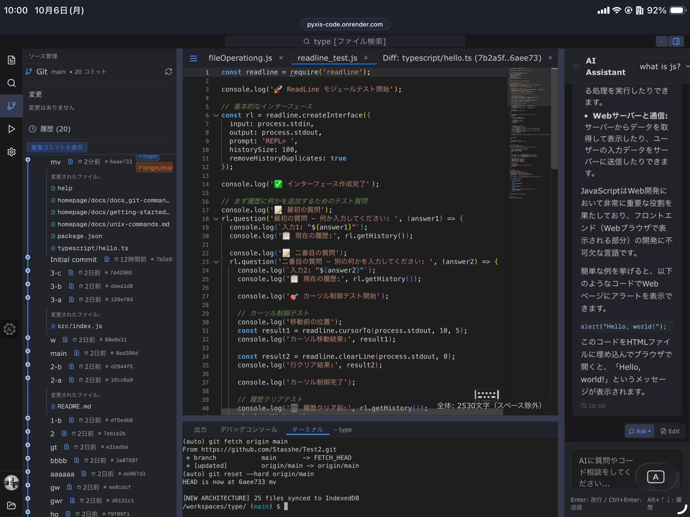
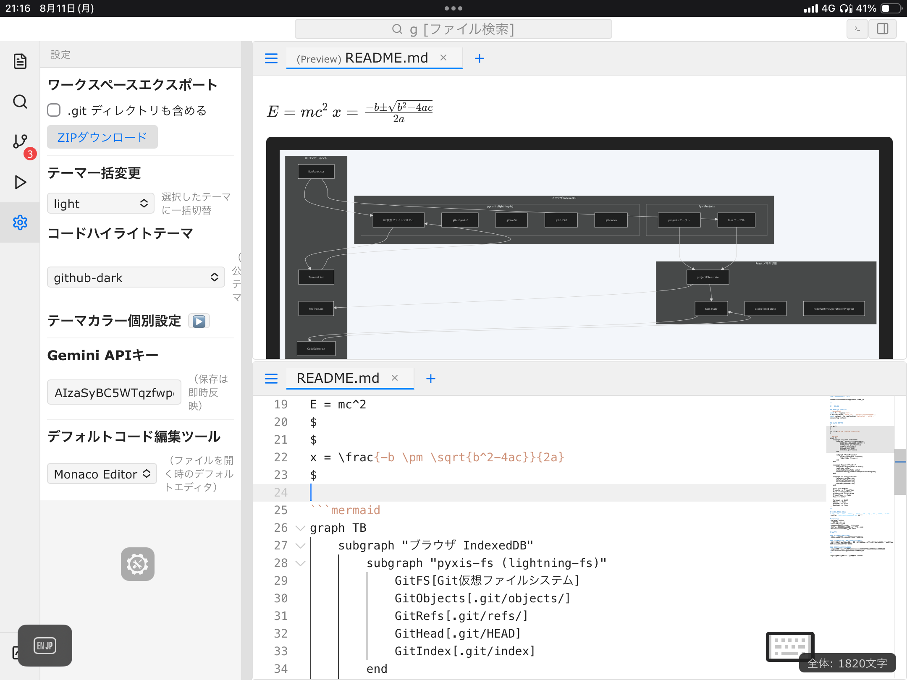
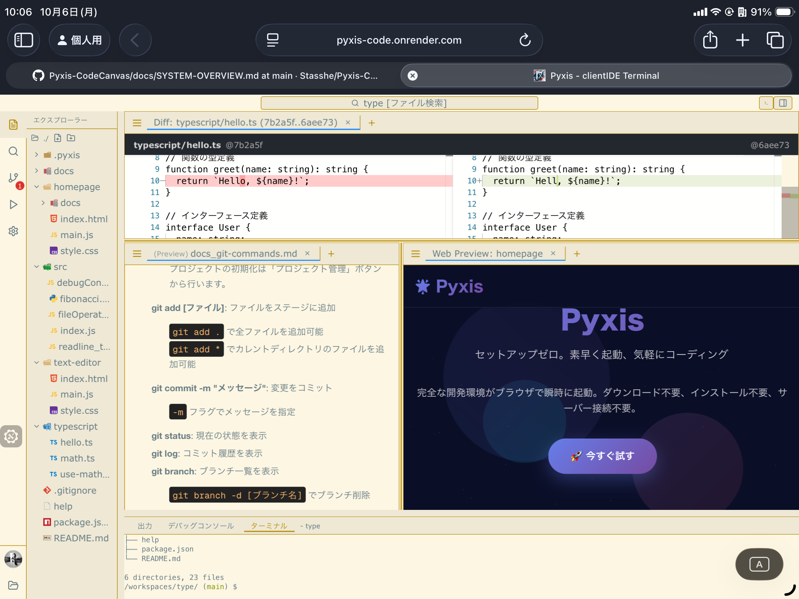
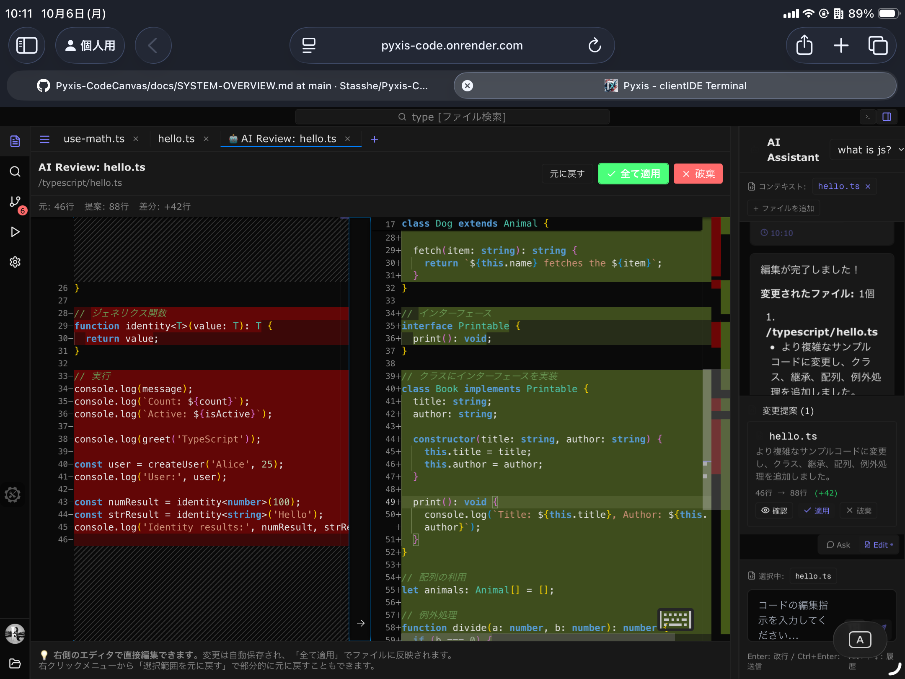
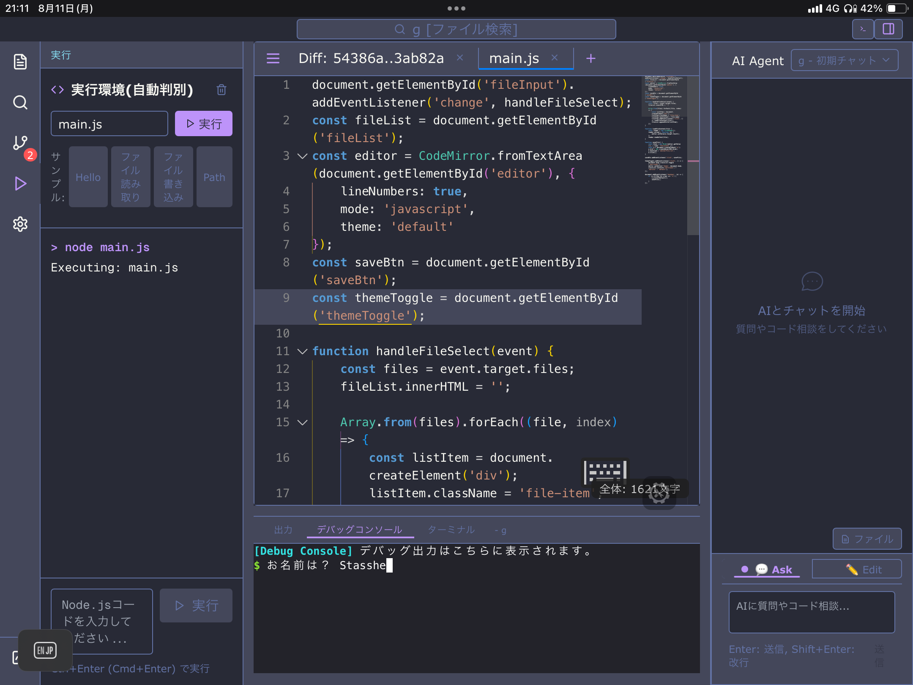
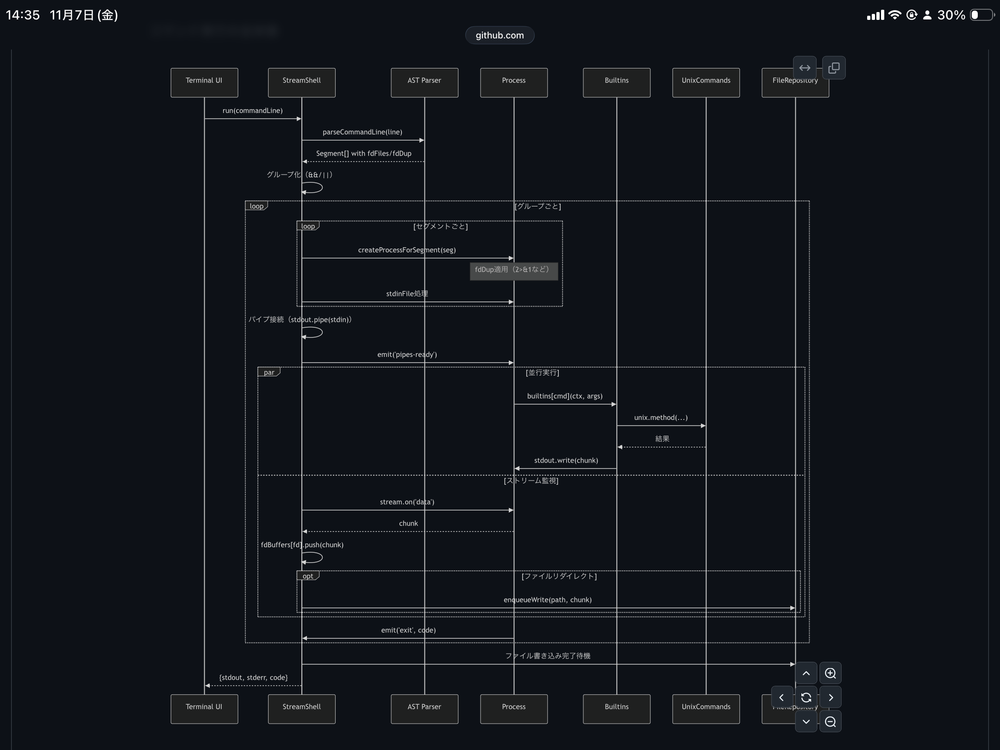
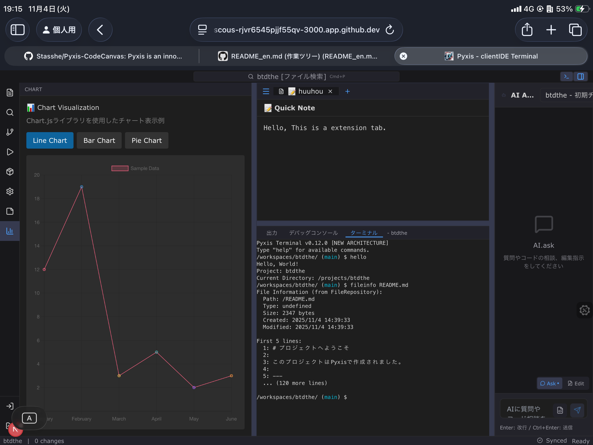
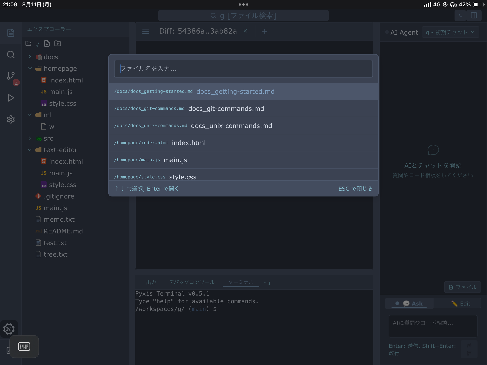
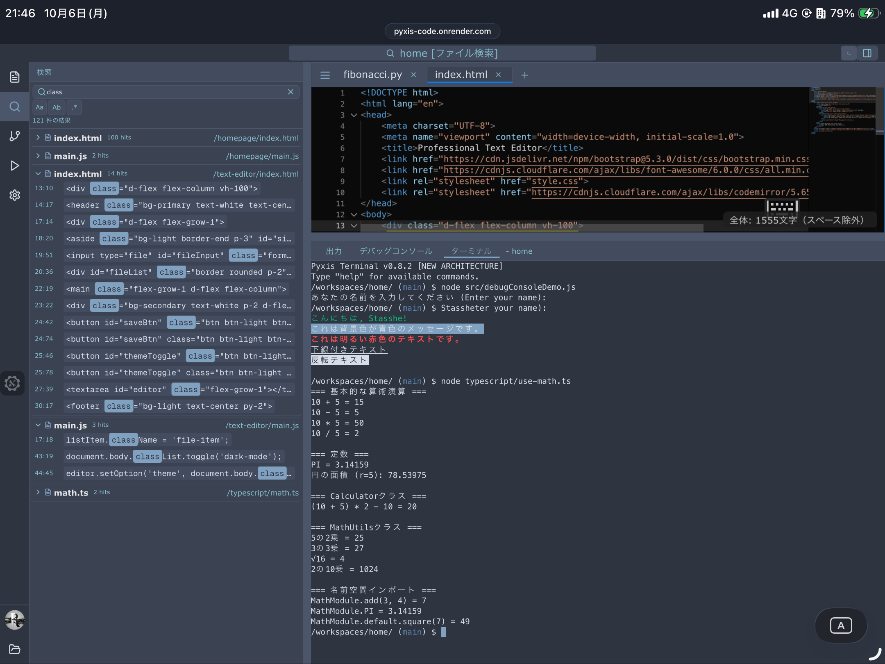

<div align="center">
  
  
  # 🌟 Pyxis - Your Code Universe in a Browser
  
  ### *Zero Setup. Quick Start, Easy Coding*

  [](https://github.com/your-username/pyxis)
  [](LICENSE)
  [](README.md)
  [](#)
  [](https://tauri.app/)
  [](https://vite.dev/)
  [](https://tailwindcss.com/)
  [](https://www.typescriptlang.org/)
  [](https://react.dev/)
  [](https://github.com/Stasshe/Pyxis-Client-Side-Code-Editor/commits/main)
  [](#)
  
  **[🚀 Try Pyxis Now](https://Stasshe.github.io/Pyxis-CodeCanvas)** | **[📖 日本語版](README.md)**
</div>

---

## ✨ What is Pyxis?

- **Pyxis is a high-mobility browser IDE designed for iPad that launches in just 1 second.**
- **Since Pyxis is a static site, there is no need to start a server, and as a result, no charges are incurred.**

### 🌍 **20 Languages Worldwide - Global Coding Experience**

**Pyxis speaks your language.**

> 日本語 • English • 中文 • 繁體中文 • 한국어 • Español • Français • Deutsch • Italiano • Português • Русский • Nederlands • Türkçe • العربية • हिन्दी • ไทย • Tiếng Việt • Bahasa Indonesia • Svenska • Polski

Break language barriers with a truly global IDE. Developers worldwide can use Pyxis comfortably in their native language.

### 🎯 Built For

<div align="center">

| 📱 **iPad Users** | 💻 **PC Owners** |
|:---:|:---:|
| Serious coding on iPad | Not serious enough for VS Code |
| Stackblitz is too heavy | Quick code edits |
| Touch-optimized IDE | Extended note-taking |
| Lightweight performance | Casual, instant access |

</div>

### 🚀 Why Not Stackblitz?

Stackblitz is a sophisticated IDE, but has these challenges:
- **Heavy on iPad** - High memory consumption
- **Web-focused** - Limited for other use cases
- **Small screen issues** - Not mobile-optimized
- **Touch UI problems** - Not optimized for iPad gestures

**Pyxis solves these problems:**
- ⚡ **1-second startup** - Serverless static hosting for instant launch
- � **iPad-optimized** - Touch gestures and dual editor support
- 🎨 **Versatile** - Not just web dev, but docs and notes too
- 🪶 **Lightweight** - Smooth even on iPad

> 💡 **Desktop-like experience with iPad mobility!**
> 🖥️ **Tauri Desktop supported!** Use Pyxis as a native app on Windows, Mac, and Linux.

---

## 🚀 Revolutionary Features of Pyxis

### 📝 **Markdown, Mermaid & LaTeX - Premium Documentation**
<div align="center">
  
</div>

**Pyxis focuses heavily on the Markdown viewer.**
- 📄 **Technical docs** - Beautiful specifications and documentation
- ✍️ **Blog writing** - Efficient writing with real-time preview
- 📊 **Mermaid support** - Easy flowcharts and diagrams. Hold `Alt` or `Ctrl` while dragging to pan or using the wheel to zoom on desktop; drag and pinch on touch devices
- 🔢 **LaTeX math** - Perfect rendering of mathematical expressions

Instant preview as you type! Perfect for long-form writing.

---

### 🔥 **Live Reload (Instant Update) - Quick Site Building**
<div align="center">
  
</div>

**HTML/CSS/JS only** - Perfect for quick browser testing without tedious setup.
- Instant updates on file save (Live Reload)
- Ideal for simple web development
- No setup required, just start coding

 > **Note**: Currently supports HTML/CSS/JS only. No WebContainer needed—Pyxis implements its own fast instant reload system.

---

### 🔄 **Local Git - Version Control in Browser**

**Local Git is nearly complete!** Branch, merge, commit, reset - all major Git features in your browser.
- 🎨 **Visual diffs** - Beautiful code change visualization
- 🌿 **Branch operations** - Experiment safely, revert anytime
- 💾 **Export with .git** - Download entire repository including .git folder
- 🛡️ **Safe learning** - Break anything without consequences! Perfect for Git beginners

> **GitHub Integration**: GitHub push uses PAT authentication through the REST API. Clone, fetch, and pull support public repositories; authenticated clone and fetch are unsupported because credentials are rejected on the public CORS proxy. See [Git and GitHub](docs/domain/git.md) (Japanese).

---

### 🧠 **AI Assistant Diff Adoption UI**
<div align="center">
  
</div>
Pyxis features an AI assistant that helps you review and adopt code diffs. This provides a more intuitive Git operation and review experience.

---

### ⚡ **Node.js & TypeScript Runtime - Lightning Fast Execution**
<div align="center">
  
</div>

Node.js code runs in a Runtime Worker, reusing a prewarmed idle Worker when available. Program globals live on the Worker’s actual global object so sloppy assignments and bare identifier lookup match Node; runtime-owned temporary descriptors are restored after each run. Normal completion clears execution state and returns the Worker to the idle pool; termination or an unexpected failure discards it. The Runtime Worker accesses files through the FS Worker. The FS Worker retains the directory-handle chain for its most recent successful path lookup and reuses shared ancestors; it does not cache file handles or contents. It owns the persistent transformed-module cache, while CommonJS modules load once per execution. `require.resolve(..., { paths })` accepts explicit package lookup roots. `path` defaults to POSIX behavior; `path.win32` and `path/win32` provide Windows-style paths. JavaScript and TypeScript resolution follows package type, `exports` / `imports` conditions, and file extensions. Symlinks use reserved FS Worker records on OPFS, and module cache identity follows realpaths. npm `.bin` entries are symlinks resolved by Terminal and `npx`. Terminal supports CommonJS inline scripts with `node -e` and `node --eval`. The runtime also exposes `node:constants`, `node:zlib`, Node-maintained `node:string_decoder`, Node-compatible `node:querystring`, `node:diagnostics_channel` with generic channels and sync, Promise, and callback tracing, `node:events.on` for EventEmitter/EventTarget async iteration, `node:stream/promises` with `finished` and `pipeline`, and `node:stream/web` with native WHATWG streams plus text and compression APIs; `stream.Readable.fromWeb()` and `toWeb()` convert between Node and WHATWG readable streams; `process.arch` matches `os.arch()`. See the [Node.js Runtime documentation](docs/domain/node-runtime.md) (Japanese) for details.
`fs.chmod()` updates mode metadata exposed through `stat()` and `access()`. `util.styleText()` generates ANSI styles according to terminal color settings. The runtime's `assert` export is callable and includes `assert/strict`; `util` uses Node-derived `inspect`, `format`, and `formatWithOptions`, and supports `isDeepStrictEqual` and `promisify.custom`. `process.env` inherits the launching shell environment, and `process.chdir()` operates within the virtual filesystem. `crypto` provides hashes, HMAC, PBKDF2, random bytes and integers, IV-based ciphers, signing and verification, ECDH/DH, public/private key encryption and decryption, `scrypt`, and `scryptSync`. Key generation is unavailable.
The virtual HOME is `/home/pyxis`; new workspaces at `~/<name>` start empty, the runtime module cache uses `~/.cache/pyxis`, and the npm cache uses `~/.npm`. The active editor pane is empty until a folder is selected. The file tree holds metadata only and reads file content when a file is opened. OperationWindow offers separate Quick Open, Open Folder, and Open Recent modes. npm stores compact abbreviated registry metadata under `~/.npm/registry` according to HTTP freshness and revalidates expired entries with ETag. Tarballs are keyed by the SHA-256 of the exact resolved URL, checked against available registry or lockfile integrity before extraction, and cached after successful extraction. npm v3 `package-lock.json` records registry package placements and supports nested dependency versions. At startup, generated `initial_files/` content is placed in `~/demo` only if that directory is absent. Existing folders, including an existing `~/demo`, are left intact.
- **Stop controls** - RunPanel Stop ends the run; Terminal Ctrl+C invokes the program's SIGINT handler
- ⚡ **Isolated execution** - Per-run module caches and timers are reset; normally completed Workers are reused
- 📁 **File operations** - Supported APIs from `fs`, `path`, `readline`, and `userinterface`
- 🌀 **TypeScript support** - TypeScript is transformed through the extension transpiler configuration
- 🎯 **Casual coding** - Perfect for algorithm testing, learning, and interactive console apps

Emulates file operations and interactive user input/output that are impossible in plain JavaScript, providing a genuine Node.js/TypeScript learning environment.


> **Limitations**: Native Node.js addons, sockets, and HTTP server APIs are unavailable. `child_process` commands run through Pyxis's shell implementation.

---

### 🐚 **Advanced Shell System - POSIX Shell Subset**
<div align="center">
  
</div>

**Run practical shell scripts in the browser.** Pyxis's StreamShell supports a subset of POSIX shell syntax, including pipelines, redirections, control structures, and variable expansion.

#### 🚀 Key Features
- **Pipeline Processing** - `cmd1 | cmd2 | cmd3` for stream connections
- **Redirections** - `cmd > file`, `cmd >> file`, `cmd < file`, `cmd 2>&1`, and related operators
- **Control Structures** - `if/then/else`, `for/while` loops, functions, `ERR`/`EXIT` traps, and `set -e/-u/-o pipefail`
- **Variable Expansion** - `$VAR`, parameter expansion, `$(command)` command substitution, and `$((arithmetic))` arithmetic expansion
- **Logical Operators** - `&&`, `||` for conditional execution
- **Background Execution** - `cmd &` for asynchronous processing
- **File Operations** - `ls`, `cat`, `grep`, `head`, `tail`, `tr`, `awk`, and other Unix commands
- **Script Execution** - Resolve `.sh` files from the current working directory and return their exit status

#### ⚡ Technical Features
- **Streaming Architecture** - True streaming processing using Node.js Stream API
- **Backpressure Support** - Memory-efficient data flow control
- **Process Abstraction** - Virtual process management in browser environment
- **fd Management** - File descriptor mapping and duplication

**Shell Script Examples:**
```bash
# Pipeline processing
cat large-file.txt | grep "error" | head -10

# Redirections
ls -la > directory-listing.txt 2>&1

# Control structures
if [ -f "config.txt" ]; then
    echo "Config file exists"
    cat config.txt
else
    echo "Creating default config"
    echo "default=true" > config.txt
fi

# Arithmetic expansion
COUNT=$((COUNT + 1))
echo "Current count: $COUNT"
```

Command substitution does not change the parent Terminal's working directory. Some shell syntax and commands remain unsupported; see the [Shell documentation](docs/domain/shell.md) (Japanese).

> Note: Some system commands, bugs, and features are not yet fully supported. Further enhancements are planned for future updates. Please submit requests via issues.

[See the Shell documentation](docs/domain/shell.md) (Japanese) for details.

---

<div align="center">
  
</div>

<div align="center">
  
</div>

One of Pyxis's biggest features is its "Extension System." You can add VSCode-like UI extensions, install npm registry packages, create custom terminal commands, language packs, transpilers, and service extensions—all in TypeScript/TSX.

#### Highlights
- **CLI Template Generation**: Instantly scaffold new extensions with `pnpm run create-extension`. Even beginners can start developing extensions right away.
- **npm Registry Package Support**: Registry tarball installs use npm v3 lockfiles, nested dependency versions, and required peer dependencies. The CLI accepts multiple packages and npm aliases in `alias@npm:target@range` form, including scoped targets. Compatible lock entries take priority; new ranges prefer `latest` when it satisfies the range.
- **Terminal Command Extensions**: Add custom commands via API and run them from Pyxis's terminal UI.
- **VSCode-like UI Extensions**: Add custom tabs and sidebar panels via API. Build intuitive UIs with React/TSX.
- **Language Packs & Service Extensions**: Add language packs or custom services as extensions.
- **Extension Persistence**: Extension registrations and fetched code are stored in the browser; enabled extensions are restored on the next startup.

Pyxis extensions offer flexibility and power unmatched by any other browser IDE: VSCode-level UI extensions on Web/iPad, extensible terminal commands, and instant development with official templates.

See `/extensions/README.md` and [the extension system documentation](docs/domain/extensions.md) (Japanese) for details.

---

---

### � **Smart File Operations - Find Anything Instantly**
<div align="center">
  
</div>

<div align="center">
  
</div>

Navigate your projects with **VS Code-like efficiency**! Fast file search, an operation window for quick actions, intelligent autocomplete, and a smooth, stress-free UX make navigating projects effortless.

---

## 🎯 Why Choose Pyxis?

### **Lightning Fast - Zero Wait Time**
- **Instant startup** - No servers, no loading screens, just pure speed
- **Static hosting** means it loads faster than you can blink
- **No stress, no lag** - Code at the speed of thought

### 🛡️ **100% Safe - Break Nothing**
- **Sandbox environment** - Experiment freely without fear
- **Perfect for beginners** learning Git and coding
- **No system damage possible** - it's just a browser tab!

### 📱 **iPad First - Code Anywhere**
- **Designed on iPad** for the ultimate mobile coding experience
- **Touch-optimized interface** with dual editor support
- **True iPad development** - finally, a real IDE for your tablet

### 🤖 **AI Support - Seamless Development Assistance**
- **Ask & Edit features** - Eliminates repetitive copy-paste in regular browsers
- **Context retention** - Ask AI and request edits while keeping files open
- **Integrated experience** - Not quite VS Code level, but perfect when you need AI power

### 🌐 **Universal Compatibility**
- **Works everywhere** - Web, iPad, mobile, any modern browser
- **Multi-pane support** for complex projects
- **Binary file support** - Preserve file bytes across OPFS, Git, runtime, uploads/downloads, and ZIP extraction; decode only for text reads, explicit Node encodings, `.mjs` transpilation, or terminal display
- **🌍 20 Languages Support** - Available in Japanese, English, Chinese, Traditional Chinese, Korean, Spanish, French, German, Italian, Portuguese, Russian, Dutch, Turkish, Arabic, Hindi, Thai, Vietnamese, Indonesian, Swedish, and Polish
- **Extension System** - Dynamically add language packs, transpilers, and custom features

### 🖥️ **Tauri Desktop Support**
- **Windows/Mac/Linux** native app experience
- **Same features as Web version** on desktop
- **Works offline**

--- 

---

## 🎪 Use Cases

<div align="center">

| � **iPad Users** |  **PC Owners** | 👨‍🎓 **Learners** |
|:---:|:---:|:---:|
| Serious coding on the go | When VS Code is overkill | Practice Git operations safely |
| Write blog posts anywhere | Quick code edits | Learn Node.js basics |
| Document creation & preview | Extended notes & tech docs | Algorithm testing |
| Smooth operation, comfort | 1-second start, instant work | Break anything, stay safe |

</div>

---

## Tech

### **Frontend Powerhouse**
- **React 19 + Vite** - Fast client-side builds
- **TypeScript** - Type-safe development
- **Tailwind CSS** - Beautiful, responsive design

### **Desktop (Tauri)**
- **Tauri** - Lightweight, fast desktop app framework
- **Rust** - Secure native runtime

### **Editor & Terminal**
- **Monaco Editor** - The same engine that powers VS Code
- **xterm.js** - Full-featured terminal experience
- **OPFS** - Browser filesystem for project files and Git history

### **Runtime Innovation**
- **fs module** - File System
- **node-stdlib-browser** - Node.js API compatibility
- **isomorphic-git** - Pure JavaScript Git implementation

### **File System Design**

OPFS is the only store for file contents. IndexedDB stores metadata such as recent folders, tabs, chats, and AI reviews. See the [storage architecture](docs/arch/storage.md) and [data flow](docs/arch/data-flow.md) documents (Japanese), indexed in [docs/README.md](docs/README.md).

Editor save and restore failures appear in the editor and Output. Failed saves retain unsaved edits. Failed restores block editing; close and reopen the tab to retry.

### 🎨 **What You Can Build**

```javascript
// 🚀 Node.js apps that actually work!
const fs = require('fs');
const readline = require('readline');

// Real file operations
fs.writeFileSync('my-app.js', 'console.log("Hello Pyxis!")');

// Interactive console apps
const rl = readline.createInterface({
  input: process.stdin,
  output: process.stdout
});

rl.question('What\'s your name? ', (name) => {
  console.log(`Hello ${name}! Welcome to Pyxis! 🌟`);
  rl.close();
});
```

### 🌟 **Git Workflow Made Easy**

```bash
# See beautiful visual diffs
git diff [branchName]
git add .
git commit -m "My awesome feature ✨"

# Branch like a pro
git checkout -b feature/amazing-idea
git merge main

# Download your entire repo with .git included!
# Perfect for moving to desktop later
```


---

## 🚀 Quick Start Guide

### **1. Just Click and Code!**
1. 🌐 **[Open Pyxis](https://Stasshe.github.io/Pyxis-CodeCanvas)** in any browser
2. 📝 **Start typing** - no sign up, no downloads needed
3. 🎯 **Try the examples**

### **How to use Tauri Desktop version**
1. Clone the repository and switch to the `tauri` branch
2. Install Rust and Node.js
3. Run `pnpm install` to install dependencies
4. Run `pnpm exec tauri dev` to launch the desktop app
5. Enjoy the same Pyxis experience on desktop!

### **2. Your First Pyxis Project**

**Create a simple Node.js app:**
```javascript
// app.js
const fs = require('fs');

// Write your first file
fs.writeFileSync('hello.txt', 'Hello from Pyxis! 🚀');

// Read it back
const message = fs.readFileSync('hello.txt', 'utf8');
console.log(message);

// Create a simple server simulation
const express = require('express'); // Many npm modules work!
console.log('Welcome to Pyxis - code anywhere! ✨');
```
**Create rich documentation:**
```markdown
# My Project

## Architecture
```mermaid
graph TD
    A[User] --> B[Pyxis IDE]
    B --> C[Node.js Runtime]
    B --> D[Git System]
    C --> E[File System]
## Formula
$$E = mc^2$$
```
**Real-time preview as you type!**

---

## 🌈 Browser Compatibility

| Browser | Support | Notes |
|---------|---------|-------|
| 🟢 **Chrome/Edge** | Chrome verified | Edge not measured |
| 🟢 **Safari (iPad)** | Safari 26+ | Not verified on device |
| 🟡 **Firefox** | Not measured | Support is unverified |
| 🟡 **Mobile** | Good | Touch-optimized interface |
| 🟢 **Tauri (Desktop)** | Perfect | Works on Windows/Mac/Linux |

Persistent file renames require OPFS `FileSystemFileHandle.move()`. This was verified in Chrome. Safari 26+ is the target, but Safari and Firefox integration have not been measured.

**System Requirements:** Just a modern browser and 2GB+ RAM for smooth experience.

---

## Installation

### Recommended: pnpm (Fast & Efficient)
```bash
# Install pnpm (if not installed)
npm install -g pnpm

# Install dependencies
pnpm install

# Development server
pnpm run dev

# Production build
pnpm run build
pnpm run preview
```

### npm also works
```bash
npm install
npm run dev
npm run build
npm run preview
```

or, if you use tauri, use "tauri" branch.

```
npm i

npx tauri dev
```

## 🎉 Join the Pyxis Community

### 💝 **We'd Love Your Help!**

There are tons of ways to contribute:

- 🐛 **Found a bug?** Report it and help make Pyxis better
- 💡 **Have an idea?** Share your feature suggestions
- **Improve docs** - help others discover
- 🔧 **Code contributions** - add new features or fix issues
- ⭐ **Star the repo** - it really helps us grow!

### 🌟 **Special Thanks**

Huge appreciation to the amazing open-source projects that make Pyxis possible:
- **Monaco Editor** - The VS Code in browsers
- **isomorphic-git** - Bringing Git to the web
- **xtermjs** - Terminal emulator
- **React & Vite** - The foundation of modern web apps

---

## 📄 License

MIT License - Use it, modify it, love it! See [LICENSE](LICENSE) for details.

---

<div align="center">

## 🚀 Ready to Code Without Limits?

**[✨ Launch Pyxis Now](https://Stasshe.github.io/Pyxis-CodeCanvas)**

*No downloads. No setup. Just pure coding.* ✨

---

### 📱 Share

**Love Pyxis?** Star ⭐ the repo and share it with fellow developers!

**Found a bug?** [Report it here](issues/) and help us improve

---


*"Code anywhere, anytime, without limits"*

</div>
