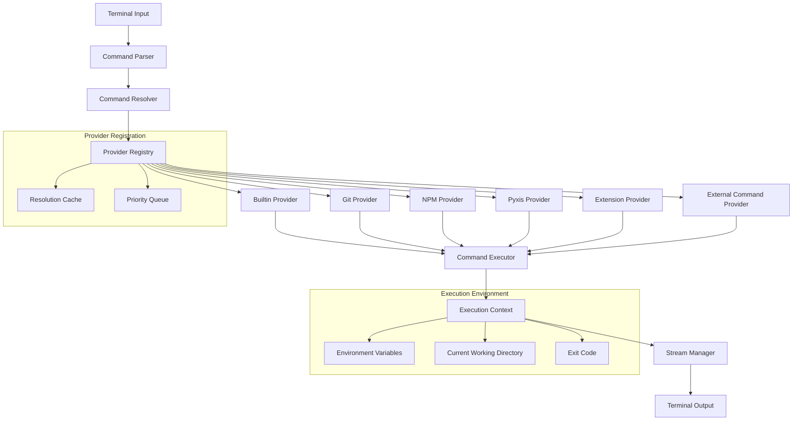
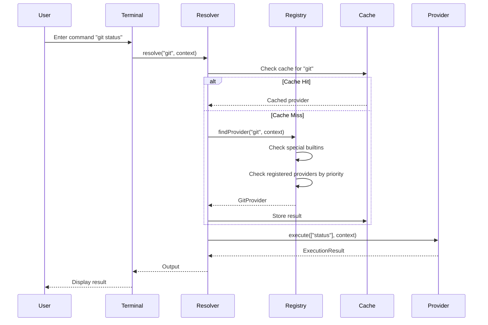
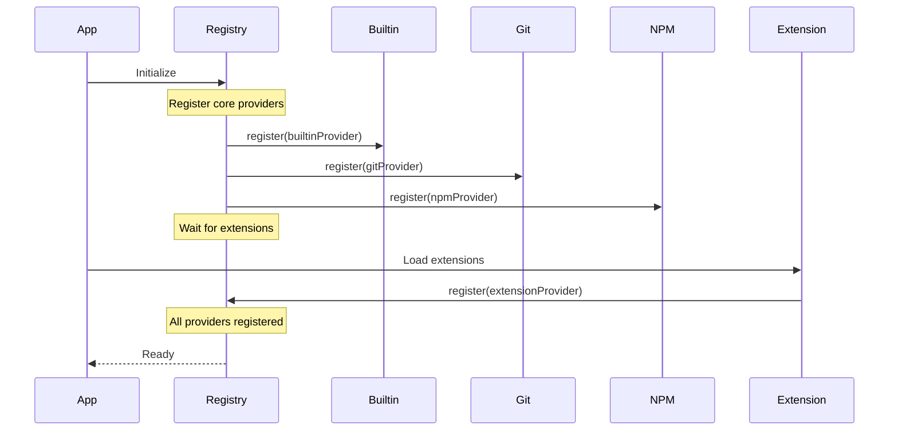
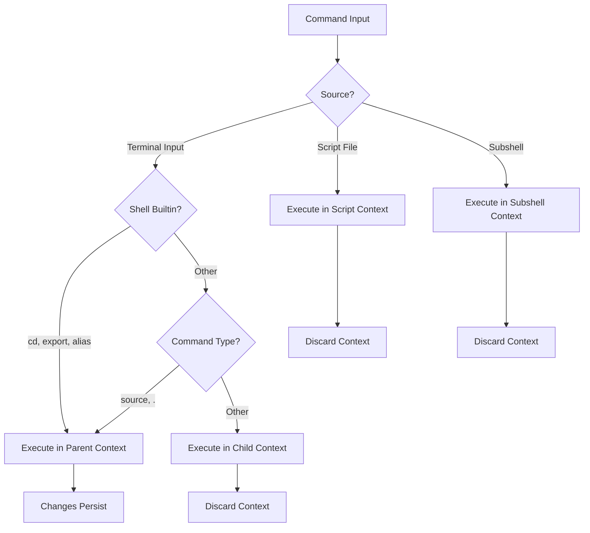
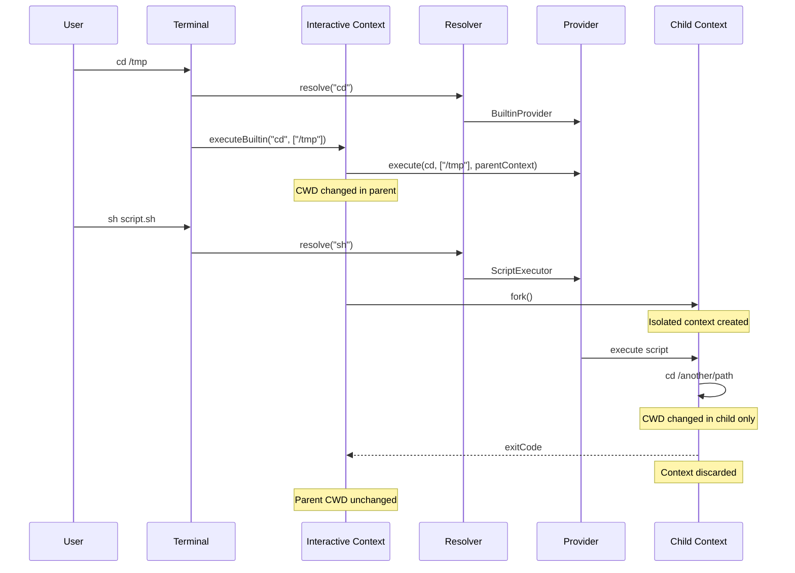
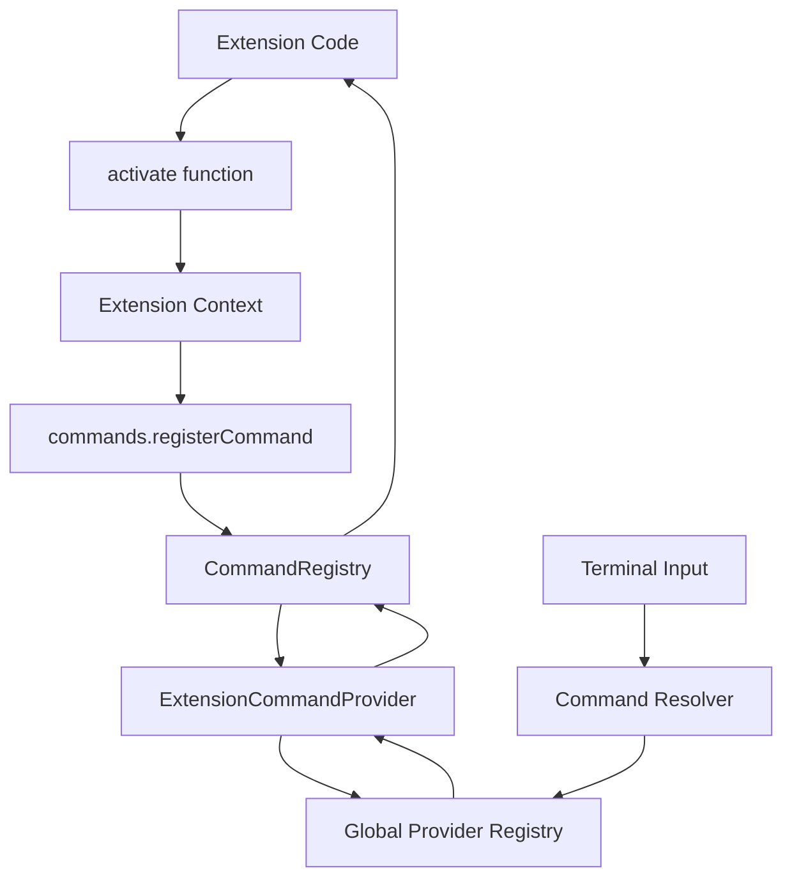
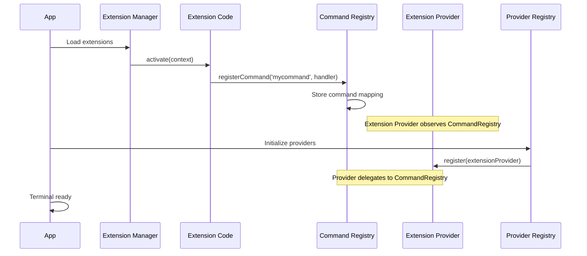

# Command Execution Architecture - POSIX-Compliant Shell System

## Executive Summary

This document defines a comprehensive, POSIX-compliant command execution architecture for Pyxis that eliminates hardcoded command routing while maintaining compatibility with extensions, built-in commands, and custom shells. The design follows Unix philosophy principles: modularity, extensibility, and clear separation of concerns.

## Table of Contents

1. [Design Principles](#design-principles)
2. [Architecture Overview](#architecture-overview)
3. [Command Resolution Pipeline](#command-resolution-pipeline)
4. [Command Provider Interface](#command-provider-interface)
5. [Provider Registration and Discovery](#provider-registration-and-discovery)
6. [Execution Context and Environment](#execution-context-and-environment)
7. [Process Context Isolation](#process-context-isolation)
8. [Shell Builtin System](#shell-builtin-system)
9. [Extension Integration](#extension-integration)
10. [Process Management](#process-management)
11. [Standard Streams and I/O](#standard-streams-and-io)
12. [Security and Isolation](#security-and-isolation)
13. [Performance Considerations](#performance-considerations)
14. [Migration Strategy](#migration-strategy)

---

## Design Principles

### 1. POSIX Compliance

Follow POSIX shell standards for command resolution, execution, and environment handling:

- Command search follows PATH-like resolution
- Environment variables follow standard conventions
- Exit codes and signal handling align with POSIX standards
- Shell special variables ($?, $!, $$, etc.) are supported

### 2. Zero Hardcoding

No command names should be hardcoded in the terminal or shell execution logic. All commands are resolved through a dynamic provider registry.

### 3. Single Responsibility

Each component has one clear purpose:
- **CommandResolver**: Finds the correct provider for a command
- **CommandProvider**: Executes a specific category of commands
- **ExecutionContext**: Manages environment and state
- **StreamManager**: Handles I/O and redirection

### 4. Extensibility

New command providers can be registered at runtime without modifying core code. Extensions, system commands, and future command types all use the same interface.

### 5. Performance

Command resolution is O(1) for cached lookups. Providers are lazily initialized. No unnecessary file system scans.

---

## Architecture Overview



### Key Components

| Component | Responsibility | Lifecycle |
|-----------|---------------|-----------|
| **ProviderRegistry** | Maintains registered command providers with priority ordering | Singleton, initialized at app start |
| **CommandResolver** | Resolves command name to appropriate provider | Per-project singleton |
| **CommandProvider** | Executes commands in a specific domain (git, npm, etc.) | Per-project, lazy initialization |
| **ExecutionContext** | Manages environment variables, CWD, and execution state | Per-command instance |
| **StreamManager** | Handles stdin/stdout/stderr with redirections | Per-command instance |

---

## Command Resolution Pipeline

### Resolution Flow

The command resolution follows a strict priority order, similar to how POSIX shells resolve commands:



### Resolution Priority

Commands are resolved in the following order (matching POSIX behavior):

1. **Special Builtins** (Priority: 0)
   - Shell control: `exit`, `return`, `break`, `continue`
   - These override everything and are always checked first

2. **Shell Builtins** (Priority: 100)
   - `cd`, `pwd`, `export`, `echo`, `test`, `[`, `source`, `.`
   - Affect shell state directly, cannot be overridden

3. **Aliases** (Priority: 200)
   - User-defined command shortcuts
   - Can be disabled with `\command` or `command`

4. **Functions** (Priority: 300)
   - Shell functions defined by user or scripts
   - Scoped to shell session

5. **Extension Commands** (Priority: 400)
   - Dynamically registered by extensions
   - Highest priority for user-defined custom commands

6. **Domain-Specific Providers** (Priority: 500)
   - Git, NPM, Pyxis, etc.
   - Well-known command namespaces

7. **External Commands** (Priority: 1000)
   - File system commands (UnixCommands)
   - Scripts (.sh, .js, .py with execute permission)

8. **Command Not Found** (Priority: ∞)
   - Suggest similar commands
   - Hook for extension command-not-found handlers

### Resolution Algorithm

```typescript
interface CommandResolutionOptions {
  skipAliases?: boolean;      // For \command syntax
  skipFunctions?: boolean;    // For command builtin
  onlyBuiltins?: boolean;     // For builtin command
  context: ExecutionContext;
}

async function resolveCommand(
  commandName: string,
  options: CommandResolutionOptions
): Promise<ResolvedCommand> {
  const { skipAliases, skipFunctions, onlyBuiltins, context } = options;
  
  // 1. Special builtins - always check first
  if (isSpecialBuiltin(commandName)) {
    return { type: 'special-builtin', provider: builtinProvider, priority: 0 };
  }
  
  // 2. Shell builtins
  if (isShellBuiltin(commandName)) {
    return { type: 'builtin', provider: builtinProvider, priority: 100 };
  }
  
  if (onlyBuiltins) {
    throw new Error(`${commandName}: not a shell builtin`);
  }
  
  // 3. Aliases (unless skipped with \command)
  if (!skipAliases) {
    const alias = context.getAlias(commandName);
    if (alias) {
      return { type: 'alias', expansion: alias, priority: 200 };
    }
  }
  
  // 4. Functions (unless skipped with command builtin)
  if (!skipFunctions) {
    const func = context.getFunction(commandName);
    if (func) {
      return { type: 'function', body: func, priority: 300 };
    }
  }
  
  // 5. Check resolution cache
  const cached = cache.get(commandName);
  if (cached && !cached.isExpired()) {
    return cached.provider;
  }
  
  // 6. Query registered providers by priority
  const providers = registry.getProvidersByPriority();
  
  for (const provider of providers) {
    if (await provider.canHandle(commandName, context)) {
      const resolved = {
        type: provider.type,
        provider,
        priority: provider.priority
      };
      
      // Cache the result
      cache.set(commandName, resolved, provider.cacheTTL);
      
      return resolved;
    }
  }
  
  // 7. Command not found
  throw new CommandNotFoundError(commandName, context);
}
```

### Cache Strategy

Resolution results are cached with TTL (Time To Live) to avoid repeated lookups:

| Provider Type | Cache TTL | Invalidation Trigger |
|--------------|-----------|---------------------|
| Builtin | Infinite* | Never (static)* |
| Alias | Until shell exit | `unalias` command |
| Function | Until shell exit | `unset -f` command |
| Extension | 60 seconds | Extension enable/disable |
| Domain (git/npm) | Infinite | Never (static) |
| External | 30 seconds | File system changes |

\* In this implementation, builtin availability is treated as static for the lifetime of the shell. POSIX `enable`/`disable`-style dynamic builtin management is not currently supported; if it is introduced in the future, the builtin cache TTL and invalidation policy must be updated to account for runtime changes in builtin state.

---

## Command Provider Interface

All command providers implement a unified interface:

### Core Interface

```typescript
/**
 * Command Provider Interface
 * All command providers (builtin, extension, domain-specific) implement this interface.
 */
interface CommandProvider {
  /**
   * Provider metadata
   */
  readonly id: string;                    // Unique provider ID (e.g., "pyxis.provider.git")
  readonly type: ProviderType;            // Type classification
  readonly priority: number;              // Resolution priority (lower = higher priority)
  readonly cacheTTL: number;             // Cache time-to-live in seconds (0 = no cache)
  
  /**
   * Check if this provider can handle the given command.
   * This method should be fast (< 1ms) as it's called during resolution.
   * 
   * @param command - Command name (first token)
   * @param context - Execution context with environment, CWD, etc.
   * @returns Promise<boolean> - true if this provider can handle the command
   */
  canHandle(command: string, context: ExecutionContext): Promise<boolean>;
  
  /**
   * Execute the command.
   * 
   * @param command - Command name
   * @param args - Command arguments (already parsed, expanded)
   * @param context - Execution context
   * @param streams - I/O streams (stdin, stdout, stderr)
   * @returns Promise<ExecutionResult> - Exit code and optional metadata
   */
  execute(
    command: string,
    args: string[],
    context: ExecutionContext,
    streams: StreamManager
  ): Promise<ExecutionResult>;
  
  /**
   * Optional: Provide command completion suggestions
   * 
   * @param partial - Partial command being typed
   * @param context - Execution context
   * @returns Promise<CompletionResult[]> - Completion suggestions
   */
  complete?(
    partial: string,
    context: ExecutionContext
  ): Promise<CompletionResult[]>;
  
  /**
   * Optional: Get help text for a command
   * 
   * @param command - Command name
   * @returns Promise<string> - Help text
   */
  getHelp?(command: string): Promise<string>;
  
  /**
   * Optional: Initialize provider (called once when first used)
   * @param projectId - Project identifier
   * @param context - Execution context (for accessing projectName and other metadata)
   */
  initialize?(projectId: string, context: ExecutionContext): Promise<void>;
  
  /**
   * Optional: Cleanup provider resources
   */
  dispose?(): Promise<void>;
}

/**
 * Provider Types
 */
enum ProviderType {
  SPECIAL_BUILTIN = 'special-builtin',  // exit, return, break, continue
  BUILTIN = 'builtin',                  // cd, pwd, export, echo, test
  ALIAS = 'alias',                      // User-defined aliases
  FUNCTION = 'function',                // Shell functions
  EXTENSION = 'extension',              // Extension-provided commands
  DOMAIN = 'domain',                    // Git, NPM, Pyxis, etc.
  EXTERNAL = 'external',                // File system commands
}

/**
 * Execution Result
 */
interface ExecutionResult {
  exitCode: number;           // POSIX exit code (0 = success)
  signal?: string;           // Optional signal name if terminated by signal
  metadata?: Record<string, any>;  // Optional provider-specific metadata
}

/**
 * Completion Result
 */
interface CompletionResult {
  text: string;              // Completion text to insert
  display?: string;          // Optional display text (if different from insertion)
  type: 'command' | 'option' | 'file' | 'variable' | 'custom';
  description?: string;      // Optional description
}
```

### Provider Implementation Examples

#### Example 1: Git Provider

```typescript
class GitCommandProvider implements CommandProvider {
  readonly id = 'pyxis.provider.git';
  readonly type = ProviderType.DOMAIN;
  readonly priority = 500;
  readonly cacheTTL = Infinity; // Static commands
  
  private gitCommands: GitCommands | null = null;
  
  async canHandle(command: string, context: ExecutionContext): Promise<boolean> {
    // Git provider handles all commands starting with "git"
    return command === 'git';
  }
  
  async initialize(projectId: string, context: ExecutionContext): Promise<void> {
    const { projectName } = context;
    this.gitCommands = terminalCommandRegistry.getGitCommands(projectName, projectId);
  }
  
  async execute(
    command: string,
    args: string[],
    context: ExecutionContext,
    streams: StreamManager
  ): Promise<ExecutionResult> {
    if (!this.gitCommands) {
      throw new Error('Git provider not initialized');
    }
    
    // Delegate to existing GitCommands implementation
    const subcommand = args[0];
    
    // Create output callback that writes to streams
    const writeOutput = async (output: string) => {
      await streams.stdout.write(output);
    };
    
    // Execute git subcommand using the existing GitCommands implementation.
    // This is conceptual/pseudocode; the concrete wiring depends on the actual GitCommands API.
    try {
      // Delegate to existing GitCommands implementation (switch/case or method dispatch)
      // Example: await this.gitCommands.executeSubcommand(subcommand, args.slice(1), writeOutput);
      // The actual implementation would call specific methods like:
      // - 'status' -> this.gitCommands.status()
      // - 'add' -> this.gitCommands.add(args.slice(1))
      // - etc.
      return { exitCode: 0 };
    } catch (error) {
      await streams.stderr.write(`git: ${error.message}\n`);
      return { exitCode: 1 };
    }
  }
  
  async complete(partial: string, context: ExecutionContext): Promise<CompletionResult[]> {
    // Return git subcommands
    const subcommands = ['init', 'clone', 'status', 'add', 'commit', 'push', 'pull', 'branch', 'checkout', 'merge', 'log', 'diff', 'reset', 'revert'];
    return subcommands
      .filter(cmd => cmd.startsWith(partial))
      .map(cmd => ({ text: cmd, type: 'command' }));
  }
  
  async getHelp(command: string): Promise<string> {
    return 'git - Version control system\nUsage: git <command> [options]';
  }
}
```

#### Example 2: Extension Provider

```typescript
class ExtensionCommandProvider implements CommandProvider {
  readonly id = 'pyxis.provider.extension';
  readonly type = ProviderType.EXTENSION;
  readonly priority = 400;
  readonly cacheTTL = 60; // Cache for 60 seconds
  
  constructor(private commandRegistry: CommandRegistry) {}
  
  async canHandle(command: string, context: ExecutionContext): Promise<boolean> {
    // Check if command is registered by any extension
    return this.commandRegistry.hasCommand(command);
  }
  
  async execute(
    command: string,
    args: string[],
    context: ExecutionContext,
    streams: StreamManager
  ): Promise<ExecutionResult> {
    try {
      // Build execution context for extension
      const extContext = {
        projectName: context.projectName,
        projectId: context.projectId,
        currentDirectory: context.cwd,
        getSystemModule: context.getSystemModule,
        env: context.env,
      };
      
      // Execute extension command
      const result = await this.commandRegistry.executeCommand(
        command,
        args,
        extContext
      );
      
      // Write result to stdout
      await streams.stdout.write(result + '\n');
      
      return { exitCode: 0 };
    } catch (error) {
      await streams.stderr.write(`${command}: ${error.message}\n`);
      return { exitCode: 1 };
    }
  }
  
  async complete(partial: string, context: ExecutionContext): Promise<CompletionResult[]> {
    const commands = this.commandRegistry.getRegisteredCommands();
    return commands
      .filter(cmd => cmd.startsWith(partial))
      .map(cmd => {
        const info = this.commandRegistry.getCommandInfo().find(i => i.command === cmd);
        return {
          text: cmd,
          type: 'command',
          description: info ? `from ${info.extensionId}` : undefined
        };
      });
  }
}
```

#### Example 3: Builtin Provider

```typescript
class BuiltinCommandProvider implements CommandProvider {
  readonly id = 'pyxis.provider.builtin';
  readonly type = ProviderType.BUILTIN;
  readonly priority = 100;
  readonly cacheTTL = Infinity; // Builtins are static
  
  private builtins = new Map<string, BuiltinHandler>();
  
  constructor() {
    // Register builtin commands
    this.registerBuiltin('cd', this.cdCommand);
    this.registerBuiltin('pwd', this.pwdCommand);
    this.registerBuiltin('export', this.exportCommand);
    this.registerBuiltin('echo', this.echoCommand);
    this.registerBuiltin('test', this.testCommand);
    this.registerBuiltin('[', this.testCommand);
    this.registerBuiltin('exit', this.exitCommand);
    // ... more builtins
  }
  
  async canHandle(command: string, context: ExecutionContext): Promise<boolean> {
    return this.builtins.has(command);
  }
  
  async execute(
    command: string,
    args: string[],
    context: ExecutionContext,
    streams: StreamManager
  ): Promise<ExecutionResult> {
    const handler = this.builtins.get(command);
    if (!handler) {
      return { exitCode: 127 }; // Command not found
    }
    
    try {
      return await handler(args, context, streams);
    } catch (error) {
      await streams.stderr.write(`${command}: ${error.message}\n`);
      return { exitCode: 1 };
    }
  }
  
  private async cdCommand(
    args: string[],
    context: ExecutionContext,
    streams: StreamManager
  ): Promise<ExecutionResult> {
    const targetDir = args[0] || context.env.HOME || '/';
    
    // Resolve path relative to current directory
    const resolvedPath = resolvePath(context.cwd, targetDir);
    
    // Check if directory exists
    const unix = context.getSystemModule('unixCommands');
    if (!await unix.directoryExists(resolvedPath)) {
      await streams.stderr.write(`cd: ${targetDir}: No such file or directory\n`);
      return { exitCode: 1 };
    }
    
    // Update current working directory
    context.setCwd(resolvedPath);
    
    return { exitCode: 0 };
  }
  
  // ... other builtin implementations
}
```

---

## Provider Registration and Discovery

### Registry Implementation

```typescript
/**
 * Provider Registry
 * Manages all command providers with priority-based resolution.
 */
class ProviderRegistry {
  private providers: CommandProvider[] = [];
  private providerMap: Map<string, CommandProvider> = new Map();
  private initialized = false;
  
  /**
   * Register a command provider
   */
  register(provider: CommandProvider): void {
    // Check for duplicate provider IDs
    if (this.providerMap.has(provider.id)) {
      throw new Error(`Provider with ID "${provider.id}" is already registered`);
    }
    
    // Add to registry
    this.providers.push(provider);
    this.providerMap.set(provider.id, provider);
    
    // Sort by priority (lower = higher priority)
    this.providers.sort((a, b) => a.priority - b.priority);
    
    console.log(`[ProviderRegistry] Registered provider: ${provider.id} (priority: ${provider.priority})`);
  }
  
  /**
   * Unregister a provider
   */
  async unregister(providerId: string): Promise<void> {
    const provider = this.providerMap.get(providerId);
    if (!provider) {
      return;
    }
    
    // Call dispose if available
    if (provider.dispose) {
      await provider.dispose();
    }
    
    // Remove from registry
    this.providers = this.providers.filter(p => p.id !== providerId);
    this.providerMap.delete(providerId);
    
    console.log(`[ProviderRegistry] Unregistered provider: ${providerId}`);
  }
  
  /**
   * Get all providers sorted by priority
   */
  getProvidersByPriority(): CommandProvider[] {
    return [...this.providers];
  }
  
  /**
   * Get a specific provider by ID
   */
  getProvider(providerId: string): CommandProvider | undefined {
    return this.providerMap.get(providerId);
  }
  
  /**
   * Initialize all providers for a project
   */
  async initializeProviders(projectId: string): Promise<void> {
    if (this.initialized) {
      return;
    }
    
    for (const provider of this.providers) {
      if (provider.initialize) {
        try {
          await provider.initialize(projectId);
        } catch (error) {
          console.error(`[ProviderRegistry] Failed to initialize provider ${provider.id}:`, error);
        }
      }
    }
    
    this.initialized = true;
  }
  
  /**
   * Dispose all providers
   */
  async dispose(): Promise<void> {
    for (const provider of this.providers) {
      if (provider.dispose) {
        try {
          await provider.dispose();
        } catch (error) {
          console.error(`[ProviderRegistry] Failed to dispose provider ${provider.id}:`, error);
        }
      }
    }
    
    this.providers = [];
    this.providerMap.clear();
    this.initialized = false;
  }
}

// Global registry instance
export const providerRegistry = new ProviderRegistry();
```

### Registration Flow

Providers are registered at application startup:



### Dynamic Provider Registration

Extensions can register providers at runtime:

```typescript
// In extension's activate() function
export async function activate(context: ExtensionContext): Promise<void> {
  // Register a custom provider
  const customProvider: CommandProvider = {
    id: 'pyxis.extension.my-provider',
    type: ProviderType.EXTENSION,
    priority: 400,
    cacheTTL: 60,
    
    async canHandle(command: string): Promise<boolean> {
      return command === 'mycommand';
    },
    
    async execute(command, args, context, streams): Promise<ExecutionResult> {
      await streams.stdout.write('Hello from my provider!\n');
      return { exitCode: 0 };
    }
  };
  
  // Register with global registry
  const { providerRegistry } = await context.getSystemModule('providerRegistry');
  providerRegistry.register(customProvider);
  
  // Return cleanup function
  return {
    dispose: async () => {
      await providerRegistry.unregister(customProvider.id);
    }
  };
}
```

---

## Execution Context and Environment

### Execution Context Structure

```typescript
/**
 * Execution Context
 * Encapsulates all state needed for command execution.
 */
interface ExecutionContext {
  // Project information
  readonly projectName: string;
  readonly projectId: string;
  
  // Working directory
  cwd: string;
  
  // Environment variables
  env: Record<string, string>;
  
  // Shell state
  aliases: Map<string, string>;
  functions: Map<string, ShellFunction>;
  
  // Special variables
  exitCode: number;        // $? - Last exit code
  shellPid: number;        // $$ - Shell process ID (not readonly to allow subshell PID assignment)
  lastBgPid: number;       // $! - Last background process ID
  
  // Positional parameters ($0, $1, $2, etc.) - distinct from environment variables
  positionalParams: string[];  // $0 is command/script name, $1, $2, etc. are arguments
  
  // Shell options (set -e, set -u, etc.)
  options: ShellOptions;
  
  // System module access
  getSystemModule: GetSystemModule;
  
  // Methods
  setCwd(path: string): void;
  setEnv(key: string, value: string): void;
  getEnv(key: string): string | undefined;
  setAlias(name: string, expansion: string): void;
  getAlias(name: string): string | undefined;
  setFunction(name: string, func: ShellFunction): void;
  getFunction(name: string): ShellFunction | undefined;
  setPositionalParams(params: string[]): void;
  getPositionalParam(index: number): string | undefined;
  
  // Create a child context (for subshells)
  fork(options?: ForkOptions): ExecutionContext;
}

/**
 * Shell Options
 */
interface ShellOptions {
  errexit: boolean;       // -e: Exit on error
  nounset: boolean;       // -u: Error on undefined variables
  xtrace: boolean;        // -x: Print commands before execution
  pipefail: boolean;      // Pipe fails if any command fails
  interactive: boolean;   // Interactive shell
  login: boolean;         // Login shell
}

/**
 * Shell Function
 */
interface ShellFunction {
  name: string;
  body: string;           // Function body (shell script)
  source: string;         // Source file (if from file)
}

/**
 * Fork Options
 */
interface ForkOptions {
  interactive?: boolean;              // Default: false
  copyAliases?: boolean;             // Default: true
  copyFunctions?: boolean;           // Default: true
  copyExports?: boolean;             // Default: true (exported vars only)
  newShellPid?: boolean;             // Default: true (assign new PID to child)
}
```

### Environment Variable Handling

Environment variables follow POSIX conventions:

| Variable | Description | Example |
|----------|-------------|---------|
| `PATH` | Command search path | `/bin:/usr/bin` |
| `HOME` | User home directory | `/projects/myproject` |
| `PWD` | Current working directory | `/projects/myproject/src` |
| `OLDPWD` | Previous working directory | `/projects/myproject` |
| `SHELL` | Current shell | `/bin/pyxis-shell` |
| `USER` | Current user | `pyxis-user` |
| `TERM` | Terminal type | `xterm-256color` |

### Context Initialization

```typescript
function createExecutionContext(
  projectName: string,
  projectId: string,
  getSystemModule: GetSystemModule
): ExecutionContext {
  const shellPid = Math.floor(Math.random() * 32768);
  
  return {
    projectName,
    projectId,
    cwd: `/projects/${projectName}`,
    env: {
      PATH: '/bin:/usr/bin:/usr/local/bin',
      HOME: `/projects/${projectName}`,
      PWD: `/projects/${projectName}`,
      OLDPWD: `/projects/${projectName}`,
      SHELL: '/bin/pyxis-shell',
      USER: 'pyxis-user',
      TERM: 'xterm-256color',
      LANG: 'en_US.UTF-8',
    },
    aliases: new Map(),
    functions: new Map(),
    positionalParams: [],
    exitCode: 0,
    shellPid,
    lastBgPid: 0,
    options: {
      errexit: false,
      nounset: false,
      xtrace: false,
      pipefail: false,
      interactive: true,
      login: false,
    },
    getSystemModule,
    
    setCwd(path: string): void {
      this.env.OLDPWD = this.env.PWD;
      this.env.PWD = path;
      this.cwd = path;
    },
    
    setEnv(key: string, value: string): void {
      this.env[key] = value;
    },
    
    getEnv(key: string): string | undefined {
      return this.env[key];
    },
    
    setAlias(name: string, expansion: string): void {
      this.aliases.set(name, expansion);
    },
    
    getAlias(name: string): string | undefined {
      return this.aliases.get(name);
    },
    
    setFunction(name: string, func: ShellFunction): void {
      this.functions.set(name, func);
    },
    
    getFunction(name: string): ShellFunction | undefined {
      return this.functions.get(name);
    },
    
    setPositionalParams(params: string[]): void {
      this.positionalParams = params;
    },
    
    getPositionalParam(index: number): string | undefined {
      return this.positionalParams[index];
    },
    
    fork(forkOptions?: ForkOptions): ExecutionContext {
      const opts = {
        interactive: false,
        copyAliases: true,
        copyFunctions: true,
        copyExports: true,
        newShellPid: true,
        ...forkOptions
      };
      
      // Create a child context with copied environment
      const child = createExecutionContext(
        this.projectName,
        this.projectId,
        this.getSystemModule
      );
      
      // Copy environment variables (shallow copy for isolation)
      child.env = { ...this.env };
      
      // Inherit current working directory from parent
      child.cwd = this.cwd;
      child.env.PWD = this.cwd;
      
      // Optionally copy aliases
      if (opts.copyAliases) {
        child.aliases = new Map(this.aliases);
      }
      
      // Optionally copy functions
      if (opts.copyFunctions) {
        child.functions = new Map(this.functions);
      }
      
      // Assign new shell PID if requested
      if (opts.newShellPid) {
        child.shellPid = Math.floor(Math.random() * 32768);
      } else {
        child.shellPid = this.shellPid;
      }
      
      // Child gets its own options (not inherited)
      child.options = { ...this.options, interactive: opts.interactive };
      
      return child;
    }
  };
}
```

---

## Process Context Isolation

### Problem Statement

In POSIX systems, child processes inherit the parent's environment but operate in isolated contexts. Changes to a child process's state (CWD, environment variables, etc.) do not affect the parent. This is critical for shell scripts:

```bash
# Terminal's CWD: /projects/myproject
sh script.sh  # Script does: cd /tmp
# Terminal's CWD should still be: /projects/myproject
```

Currently in Pyxis, if a script executes `cd`, it changes the terminal's working directory, which violates process isolation.

### POSIX Behavior Reference

| Scenario | Operation Location | Parent Shell Context | Child/Script Context | Effect on Parent |
|----------|-------------------|----------------------|----------------------|------------------|
| Terminal: `cd /tmp` | Parent shell (interactive input) | CWD changes from `/projects/myproject` to `/tmp` | N/A | State updated in parent (intended) |
| Script: `cd /tmp` | Child process (script execution) | CWD remains `/projects/myproject` | CWD changes to `/tmp` within the script process | No change (child is isolated) |
| Script: `export VAR=value` | Child process (script execution) | Environment unchanged | `VAR` is set only in the script process | No change (child is isolated) |
| Terminal: `source script.sh` | Parent shell (same process) | CWD, environment, aliases may be modified by the script | N/A (runs in parent shell context) | Changes persist (by design, same shell context) |
| Script: `alias ll='ls -la'` | Child process (script execution) | Aliases in interactive shell unchanged | `ll` alias available only inside the script process | No change (child is isolated) |

### Solution: Context Isolation Levels

We define three levels of context isolation:

#### Level 1: Interactive Shell Context (Parent)

The **Interactive Shell Context** is the main terminal context that persists between commands:

```typescript
/**
 * Interactive Shell Context
 * Persistent context for the terminal session
 */
class InteractiveShellContext {
  // This is the main shell context managed by Terminal.tsx
  private context: ExecutionContext;
  
  constructor(projectName: string, projectId: string, getSystemModule: GetSystemModule) {
    this.context = createExecutionContext(projectName, projectId, getSystemModule);
  }
  
  /**
   * Get the current context (for reading)
   */
  getContext(): Readonly<ExecutionContext> {
    return this.context;
  }
  
  /**
   * Execute a builtin command that modifies shell state
   * This is only called for direct terminal input, not from scripts
   */
  async executeBuiltin(
    command: string,
    args: string[],
    provider: CommandProvider,
    streams: StreamManager
  ): Promise<ExecutionResult> {
    // Special builtins that modify parent shell context
    if (isShellModifyingBuiltin(command)) {
      return await provider.execute(command, args, this.context, streams);
    }
    
    // For other commands, use isolated context
    return await this.executeIsolated(command, args, provider, streams);
  }
  
  /**
   * Execute command in isolated context (for scripts)
   */
  async executeIsolated(
    command: string,
    args: string[],
    provider: CommandProvider,
    streams: StreamManager
  ): Promise<ExecutionResult> {
    // Create isolated child context
    const childContext = this.context.fork();
    
    // Execute in child context
    const result = await provider.execute(command, args, childContext, streams);
    
    // Child context is discarded after execution
    return result;
  }
}

/**
 * Check if command modifies parent shell state
 */
function isShellModifyingBuiltin(command: string): boolean {
  // These commands affect the parent shell when executed directly
  return ['cd', 'export', 'unset', 'alias', 'unalias', 'set'].includes(command);
}
```

#### Level 2: Script Execution Context (Child)

When executing a shell script (`.sh` file), create an isolated context:

```typescript
/**
 * Script Executor
 * Executes shell scripts in isolated contexts
 */
class ScriptExecutor {
  constructor(private parentContext: InteractiveShellContext) {}
  
  async executeScript(
    scriptPath: string,
    args: string[],
    streams: StreamManager
  ): Promise<ExecutionResult> {
    // Read script content
    const fileRepo = await this.parentContext.getContext().getSystemModule('fileRepository');
    const content = await fileRepo.readFile(
      this.parentContext.getContext().projectId,
      scriptPath
    );
    
    // Create ISOLATED child context (fork from parent)
    const scriptContext = this.parentContext.getContext().fork();
    
    // Set positional parameters ($0, $1, $2, ...) in the script context.
    // POSIX positional parameters are distinct from environment variables,
    // so they are stored separately from scriptContext.env.
    scriptContext.setPositionalParams([scriptPath, ...args]);
    
    // Execute script in isolated context
    const result = await this.runScriptContent(content, scriptContext, streams);
    
    // Context is discarded - changes don't affect parent
    return result;
  }
  
  private async runScriptContent(
    content: string,
    context: ExecutionContext,
    streams: StreamManager
  ): Promise<ExecutionResult> {
    // Parse and execute script
    // All commands in the script use the isolated context
    // ...
    return { exitCode: 0 };
  }
}
```

#### Level 3: Subshell Context (Nested Child)

For explicit subshells `(commands)` or command substitution `$(command)`:

```typescript
/**
 * Subshell Executor
 * Executes commands in subshell (even more isolated)
 */
class SubshellExecutor {
  async executeSubshell(
    commands: string,
    parentContext: ExecutionContext,
    streams: StreamManager
  ): Promise<ExecutionResult> {
    // Create a completely isolated subshell context with a new shell PID
    const subshellContext = parentContext.fork({ newShellPid: true });
    
    // Execute commands in subshell
    const result = await this.runCommands(commands, subshellContext, streams);
    
    // Subshell context is completely discarded
    return result;
  }
  
  private async runCommands(
    commands: string,
    context: ExecutionContext,
    streams: StreamManager
  ): Promise<ExecutionResult> {
    // Parse and execute commands
    // ...
    return { exitCode: 0 };
  }
}
```

### Context Decision Tree



### Implementation Strategy

#### Updated ExecutionContext with Fork Support

```typescript
interface ExecutionContext {
  // ... existing properties ...
  
  // Context metadata
  readonly isInteractive: boolean;    // True for terminal, false for scripts
  readonly parentPid?: number;        // Parent shell PID (if child)
  
  // Fork with proper isolation (see ForkOptions defined earlier)
  fork(options?: ForkOptions): ExecutionContext;
}

function createExecutionContext(
  projectName: string,
  projectId: string,
  getSystemModule: GetSystemModule,
  options: {
    isInteractive?: boolean;
    parentPid?: number;
  } = {}
): ExecutionContext {
  const shellPid = Math.floor(Math.random() * 32768);
  
  return {
    // ... existing properties ...
    
    isInteractive: options.isInteractive ?? false,
    parentPid: options.parentPid,
    
    fork(forkOptions?: ForkOptions): ExecutionContext {
      const opts = {
        interactive: false,
        copyAliases: true,
        copyFunctions: true,
        copyExports: true,
        newShellPid: true,
        ...forkOptions
      };
      
      // Create new context
      const child = createExecutionContext(
        this.projectName,
        this.projectId,
        this.getSystemModule,
        {
          isInteractive: opts.interactive,
          parentPid: this.shellPid
        }
      );
      
      // Copy environment variables (shallow copy for isolation)
      child.env = { ...this.env };
      
      // Inherit current working directory from parent
      child.cwd = this.cwd;
      child.env.PWD = this.cwd;
      
      // Optionally copy aliases
      if (opts.copyAliases) {
        child.aliases = new Map(this.aliases);
      }
      
      // Optionally copy functions
      if (opts.copyFunctions) {
        child.functions = new Map(this.functions);
      }
      
      // Assign new shell PID if requested
      if (opts.newShellPid) {
        child.shellPid = Math.floor(Math.random() * 32768);
      } else {
        child.shellPid = this.shellPid;
      }
      
      // Child gets its own options (not inherited)
      child.options = { ...this.options, interactive: opts.interactive };
      
      return child;
    }
  };
}
```

### Command Execution Flow with Isolation



### Special Cases

#### Source Command (`.` or `source`)

The `source` command explicitly executes in the parent context:

```typescript
async function sourceBuiltin(
  args: string[],
  context: ExecutionContext,
  streams: StreamManager
): Promise<ExecutionResult> {
  if (args.length === 0) {
    await streams.stderr.write('source: missing filename\n');
    return { exitCode: 1 };
  }
  
  const scriptPath = args[0];
  
  // Read script
  const fileRepo = await context.getSystemModule('fileRepository');
  const content = await fileRepo.readFile(context.projectId, scriptPath);
  
  // Execute in CURRENT context (not isolated)
  // This allows the script to modify parent shell state
  const result = await runScriptInContext(content, context, streams);
  
  return result;
}
```

#### Exec Command

The `exec` command replaces the current shell:

```typescript
async function execBuiltin(
  args: string[],
  context: ExecutionContext,
  streams: StreamManager
): Promise<ExecutionResult> {
  if (args.length === 0) {
    return { exitCode: 0 }; // Just return
  }
  
  // In interactive shell, exec should prevent further commands
  if (context.isInteractive) {
    await streams.stderr.write('exec: not allowed in interactive shell\n');
    return { exitCode: 1 };
  }
  
  // Execute command and exit with its exit code
  // The current process is replaced
  const [command, ...cmdArgs] = args;
  const result = await executeCommand(command, cmdArgs, context, streams);
  
  // Signal that shell should exit
  return { exitCode: result.exitCode, metadata: { shouldExit: true } };
}
```

### Practical Example

```bash
# Terminal session (Interactive Context)
$ pwd
/projects/myproject

$ export MYVAR=hello
$ echo $MYVAR
hello

# Run script that changes state
$ sh test.sh
Inside script: /tmp
Inside script MYVAR: world

# Back to terminal - state unchanged
$ pwd
/projects/myproject
$ echo $MYVAR
hello

# Source script - state DOES change
$ source test.sh
Inside script: /tmp

$ pwd
/tmp
$ echo $MYVAR
world
```

### Simplified Implementation (Pragmatic Approach)

Given that Pyxis doesn't support multiple terminal instances, a simplified approach is acceptable:

**Compromise Solution:**

1. **Direct Terminal Commands**: Affect parent context (current behavior)
2. **Script Execution**: Always isolated (new behavior)
3. **Source Command**: Affects parent context (POSIX-compliant)
4. **No Background Processes**: Not implemented (acceptable limitation)

This provides proper isolation for scripts while maintaining simplicity and avoiding the complexity of full process trees.

```typescript
/**
 * Simplified Command Executor
 * Distinguishes between direct commands and script execution
 */
class SimplifiedCommandExecutor {
  constructor(private interactiveContext: ExecutionContext) {}
  
  async execute(
    command: string,
    args: string[],
    source: 'terminal' | 'script',
    provider: CommandProvider,
    streams: StreamManager
  ): Promise<ExecutionResult> {
    // Determine which context to use
    const useParentContext = 
      source === 'terminal' && isShellModifyingBuiltin(command) ||
      command === 'source' || command === '.';
    
    if (useParentContext) {
      // Execute in parent context
      return await provider.execute(command, args, this.interactiveContext, streams);
    } else {
      // Execute in isolated child context
      const childContext = this.interactiveContext.fork();
      const result = await provider.execute(command, args, childContext, streams);
      // Child context discarded
      return result;
    }
  }
}
```

### Testing Context Isolation

Essential test cases:

| Test Case | Expected Behavior |
|-----------|-------------------|
| Terminal: `cd /tmp` then `pwd` | Should show `/tmp` |
| Terminal: `sh script.sh` (script does `cd /tmp`) then `pwd` | Should show original directory |
| Terminal: `export VAR=a` then `sh script.sh` (script does `export VAR=b`) then `echo $VAR` | Should show `a` |
| Terminal: `source script.sh` (script does `cd /tmp`) then `pwd` | Should show `/tmp` |
| Script calls another script | Both scripts have isolated contexts |

---

## Shell Builtin System

### Builtin Categories

Builtins are categorized by their function:

| Category | Commands | Description |
|----------|----------|-------------|
| **Special Builtins** | `break`, `continue`, `exit`, `return`, `eval` | Control flow, cannot be overridden |
| **Directory Navigation** | `cd`, `pwd`, `pushd`, `popd`, `dirs` | Working directory management |
| **Environment** | `export`, `unset`, `set`, `readonly` | Variable and option management |
| **I/O** | `echo`, `printf`, `read` | Input/output operations |
| **Process Control** | `wait`, `jobs`, `fg`, `bg`, `kill` | Process management (limited in browser) |
| **Testing** | `test`, `[`, `[[` | Conditional expressions |
| **File Operations** | `source`, `.`, `exec` | Script execution |
| **Aliases/Functions** | `alias`, `unalias`, `type`, `command` | Command introspection |

### Special Builtin Behavior

Special builtins have unique characteristics per POSIX:

1. **Cannot be overridden**: `PATH` doesn't affect special builtins
2. **Affect shell state**: Can exit the shell or affect parent context
3. **Syntax errors**: Fatal in non-interactive shells
4. **Variable assignments**: Persist in current shell environment

```typescript
const SPECIAL_BUILTINS = new Set([
  'break', 'continue', 'exit', 'return', 'eval',
  ':', 'export', 'readonly', 'unset', 'set'
]);

function isSpecialBuiltin(command: string): boolean {
  return SPECIAL_BUILTINS.has(command);
}
```

### Builtin Implementation Pattern

Each builtin follows a consistent pattern:

```typescript
type BuiltinHandler = (
  args: string[],
  context: ExecutionContext,
  streams: StreamManager
) => Promise<ExecutionResult>;

// Example: export builtin
async function exportBuiltin(
  args: string[],
  context: ExecutionContext,
  streams: StreamManager
): Promise<ExecutionResult> {
  if (args.length === 0) {
    // Print all exported variables
    for (const [key, value] of Object.entries(context.env)) {
      await streams.stdout.write(`export ${key}="${value}"\n`);
    }
    return { exitCode: 0 };
  }
  
  // Process each argument
  for (const arg of args) {
    // Check if argument contains assignment
    const match = arg.match(/^([A-Za-z_][A-Za-z0-9_]*)=(.*)$/);
    
    if (match) {
      const [, name, value] = match;
      context.setEnv(name, value);
    } else {
      // Export existing variable
      const value = context.getEnv(arg);
      if (value !== undefined) {
        // Mark as exported (in a real implementation)
        // For now, just ensure it's in env
        context.setEnv(arg, value);
      } else {
        await streams.stderr.write(`export: ${arg}: not found\n`);
        return { exitCode: 1 };
      }
    }
  }
  
  return { exitCode: 0 };
}
```

---

## Extension Integration

### Extension Command Registration

Extensions register commands through the existing CommandRegistry, which is wrapped by an ExtensionCommandProvider:



### Extension Provider Wrapper

The ExtensionCommandProvider bridges the existing CommandRegistry with the new provider system:

```typescript
/**
 * Extension Command Provider
 * Wraps the existing CommandRegistry to integrate with provider system.
 */
class ExtensionCommandProvider implements CommandProvider {
  readonly id = 'pyxis.provider.extension';
  readonly type = ProviderType.EXTENSION;
  readonly priority = 400;
  readonly cacheTTL = 60;
  
  constructor(
    private commandRegistry: CommandRegistry
  ) {}
  
  async canHandle(command: string, context: ExecutionContext): Promise<boolean> {
    return this.commandRegistry.hasCommand(command);
  }
  
  async execute(
    command: string,
    args: string[],
    context: ExecutionContext,
    streams: StreamManager
  ): Promise<ExecutionResult> {
    try {
      // Build extension execution context
      const extContext: CommandExecutionContext = {
        projectName: context.projectName,
        projectId: context.projectId,
        currentDirectory: context.cwd,
        getSystemModule: context.getSystemModule,
      };
      
      // Execute through existing CommandRegistry
      const output = await this.commandRegistry.executeCommand(
        command,
        args,
        extContext
      );
      
      // Write output to streams
      if (output) {
        await streams.stdout.write(output);
        if (!output.endsWith('\n')) {
          await streams.stdout.write('\n');
        }
      }
      
      return { exitCode: 0 };
    } catch (error) {
      const message = error instanceof Error ? error.message : String(error);
      await streams.stderr.write(`${command}: ${message}\n`);
      return { exitCode: 1 };
    }
  }
  
  async complete(partial: string, context: ExecutionContext): Promise<CompletionResult[]> {
    const commands = this.commandRegistry.getRegisteredCommands();
    const info = this.commandRegistry.getCommandInfo();
    
    return commands
      .filter(cmd => cmd.startsWith(partial))
      .map(cmd => {
        const cmdInfo = info.find(i => i.command === cmd);
        return {
          text: cmd,
          type: 'command' as const,
          description: cmdInfo ? `Extension: ${cmdInfo.extensionId}` : undefined
        };
      });
  }
}
```

### Extension Registration Flow



### Backward Compatibility

The new provider system is fully backward compatible with existing extensions:

1. **Existing extensions don't need changes**: They continue using `context.commands.registerCommand()`
2. **CommandRegistry remains unchanged**: The registry interface is preserved
3. **Provider wraps registry**: ExtensionCommandProvider delegates to CommandRegistry
4. **Transparent integration**: Terminal uses provider system, which internally uses registry

---

## Process Management

### Overview

Process management in Pyxis simulates POSIX process behavior in a browser environment. Each process has:

1. **Isolated Execution Context**: See [Process Context Isolation](#process-context-isolation) for details on how parent and child processes maintain separate states
2. **Stream-based I/O**: stdin/stdout/stderr using Node.js streams
3. **Process Lifecycle**: Creation, execution, and cleanup

**Important**: Process context isolation ensures that child processes (scripts, subshells) do not modify the parent shell's state (CWD, environment variables, etc.) unless explicitly using commands like `source`.

### Process Abstraction

In a browser environment, we simulate processes:

```typescript
/**
 * Process abstraction for command execution
 */
interface Process {
  readonly pid: number;
  readonly command: string;
  readonly args: string[];
  readonly status: ProcessStatus;
  
  // From the command's perspective:
  // - stdin is Readable (command reads input from it)
  // - stdout/stderr are Writable (command writes output to them)
  readonly stdin: Readable;
  readonly stdout: Writable;
  readonly stderr: Writable;
  
  wait(): Promise<ExecutionResult>;
  kill(signal?: string): void;
}

enum ProcessStatus {
  RUNNING = 'running',
  STOPPED = 'stopped',
  COMPLETED = 'completed',
  FAILED = 'failed'
}

/**
 * Process Factory
 */
class ProcessFactory {
  private nextPid = 1000;
  private processes = new Map<number, Process>();
  
  create(
    command: string,
    args: string[],
    provider: CommandProvider,
    context: ExecutionContext
  ): Process {
    const pid = this.nextPid++;
    
    // Create streams
    const stdin = new PassThrough();
    const stdout = new PassThrough();
    const stderr = new PassThrough();
    
    // Create stream manager
    const streams = new StreamManager(stdin, stdout, stderr);
    
    // Create process object
    const process: Process = {
      pid,
      command,
      args,
      status: ProcessStatus.RUNNING,
      stdin,
      stdout,
      stderr,
      
      async wait(): Promise<ExecutionResult> {
        try {
          const result = await provider.execute(command, args, context, streams);
          process.status = result.exitCode === 0 ? ProcessStatus.COMPLETED : ProcessStatus.FAILED;
          
          // Close streams
          stdout.end();
          stderr.end();
          
          return result;
        } catch (error) {
          process.status = ProcessStatus.FAILED;
          stderr.write(`${command}: ${error.message}\n`);
          stdout.end();
          stderr.end();
          return { exitCode: 1 };
        } finally {
          this.processes.delete(pid);
        }
      },
      
      kill(signal = 'SIGTERM'): void {
        process.status = ProcessStatus.STOPPED;
        stdout.end();
        stderr.end();
        this.processes.delete(pid);
      }
    };
    
    this.processes.set(pid, process);
    return process;
  }
  
  get(pid: number): Process | undefined {
    return this.processes.get(pid);
  }
  
  list(): Process[] {
    return Array.from(this.processes.values());
  }
}
```

### Pipeline Construction

Pipelines connect multiple processes:

```typescript
/**
 * Pipeline Builder
 * Constructs process pipelines for commands like: cmd1 | cmd2 | cmd3
 */
class PipelineBuilder {
  constructor(
    private resolver: CommandResolver,
    private processFactory: ProcessFactory
  ) {}
  
  async build(
    commands: ParsedCommand[],
    context: ExecutionContext
  ): Promise<Pipeline> {
    const processes: Process[] = [];
    
    // Create all processes
    for (let i = 0; i < commands.length; i++) {
      const cmd = commands[i];
      
      // Resolve command to provider
      const resolved = await this.resolver.resolve(cmd.command, context);
      
      // Create process
      const process = this.processFactory.create(
        cmd.command,
        cmd.args,
        resolved.provider,
        context
      );
      
      processes.push(process);
    }
    
    // Connect pipes
    for (let i = 0; i < processes.length - 1; i++) {
      const current = processes[i];
      const next = processes[i + 1];
      
      // Pipe stdout of current to stdin of next
      current.stdout.pipe(next.stdin);
    }
    
    return new Pipeline(processes);
  }
}

/**
 * Pipeline
 * Represents a chain of processes connected by pipes
 */
class Pipeline {
  constructor(private processes: Process[]) {}
  
  get firstProcess(): Process {
    return this.processes[0];
  }
  
  get lastProcess(): Process {
    return this.processes[this.processes.length - 1];
  }
  
  async wait(): Promise<ExecutionResult> {
    // Wait for all processes
    const results = await Promise.all(
      this.processes.map(p => p.wait())
    );
    
    // Return last process exit code (POSIX behavior)
    return results[results.length - 1];
  }
  
  kill(signal?: string): void {
    // Kill all processes in pipeline
    for (const process of this.processes) {
      process.kill(signal);
    }
  }
}
```

---

## Standard Streams and I/O

### Stream Manager

```typescript
/**
 * Stream Manager
 * Manages standard streams (stdin, stdout, stderr) and redirections
 */
class StreamManager {
  // From the command's perspective:
  // - stdin is Readable (command reads input from it)
  // - stdout/stderr are Writable (command writes output to them)
  private _stdin: Readable;
  private _stdout: Writable;
  private _stderr: Writable;
  
  private redirections: Redirection[] = [];
  
  constructor(
    stdin: Readable,
    stdout: Writable,
    stderr: Writable
  ) {
    this._stdin = stdin;
    this._stdout = stdout;
    this._stderr = stderr;
  }
  
  get stdin(): Readable {
    return this._stdin;
  }
  
  get stdout(): Writable {
    return this._stdout;
  }
  
  get stderr(): Writable {
    return this._stderr;
  }
  
  /**
   * Add a redirection
   */
  addRedirection(redirection: Redirection): void {
    this.redirections.push(redirection);
  }
  
  /**
   * Apply all redirections
   */
  async applyRedirections(context: ExecutionContext): Promise<void> {
    for (const redir of this.redirections) {
      await this.applyRedirection(redir, context);
    }
  }
  
  /**
   * Apply a single redirection
   */
  private async applyRedirection(
    redirection: Redirection,
    context: ExecutionContext
  ): Promise<void> {
    const { fd, type, target } = redirection;
    
    switch (type) {
      case 'output': // >
        await this.redirectOutput(fd, target, false, context);
        break;
      
      case 'append': // >>
        await this.redirectOutput(fd, target, true, context);
        break;
      
      case 'input': // <
        await this.redirectInput(fd, target, context);
        break;
      
      case 'here-doc': // <<
        await this.redirectHereDoc(fd, target);
        break;
      
      case 'here-string': // <<<
        await this.redirectHereString(fd, target);
        break;
      
      case 'duplicate': // >&2 or <&1
        this.duplicateFd(fd, parseInt(target));
        break;
    }
  }
  
  /**
   * Redirect output to file
   */
  private async redirectOutput(
    fd: number,
    filename: string,
    append: boolean,
    context: ExecutionContext
  ): Promise<void> {
    // Get file repository
    const fileRepo = await context.getSystemModule('fileRepository');
    
    // Resolve path
    const path = resolvePath(context.cwd, filename);
    
    // Select the appropriate stream (stdout or stderr)
    const stream = fd === 1 ? this._stdout : this._stderr;
    
    // Collect all data and wait for stream completion before returning
    await new Promise<void>((resolve, reject) => {
      const chunks: string[] = [];
      
      const onData = (chunk: Buffer | string) => {
        chunks.push(chunk.toString());
      };
      
      const onError = (err: unknown) => {
        stream.off('data', onData);
        stream.off('end', onEnd);
        reject(err instanceof Error ? err : new Error(String(err)));
      };
      
      const onEnd = async () => {
        stream.off('data', onData);
        stream.off('error', onError);
        
        const content = chunks.join('');
        
        try {
          if (append) {
            // Append to existing file
            const existing = await fileRepo.readFile(context.projectId, path);
            await fileRepo.writeFile(context.projectId, path, existing + content);
          } else {
            // Overwrite file
            await fileRepo.writeFile(context.projectId, path, content);
          }
          resolve();
        } catch (error) {
          reject(error);
        }
      };
      
      stream.on('data', onData);
      stream.once('end', onEnd);
      stream.once('error', onError);
    });
  }
  
  /**
   * Redirect input from file
   */
  private async redirectInput(
    fd: number,
    filename: string,
    context: ExecutionContext
  ): Promise<void> {
    // Get file repository
    const fileRepo = await context.getSystemModule('fileRepository');
    
    // Resolve path
    const path = resolvePath(context.cwd, filename);
    
    // Read file content
    const content = await fileRepo.readFile(context.projectId, path);
    
    // Write to stdin
    this._stdin.write(content);
    this._stdin.end();
  }
  
  /**
   * Redirect from here-doc
   */
  private async redirectHereDoc(fd: number, content: string): Promise<void> {
    this._stdin.write(content);
    this._stdin.end();
  }
  
  /**
   * Redirect from here-string
   */
  private async redirectHereString(fd: number, content: string): Promise<void> {
    this._stdin.write(content + '\n');
    this._stdin.end();
  }
  
  /**
   * Duplicate file descriptor
   * For 2>&1 (stderr to stdout) or 1>&2 (stdout to stderr)
   */
  private duplicateFd(sourceFd: number, targetFd: number): void {
    if (sourceFd === 1 && targetFd === 2) {
      // stdout -> stderr (2>&1): send stderr to the same destination as stdout
      this._stderr = this._stdout;
    } else if (sourceFd === 2 && targetFd === 1) {
      // stderr -> stdout (1>&2): send stdout to the same destination as stderr
      this._stdout = this._stderr;
    }
  }
}

/**
 * Redirection specification
 */
interface Redirection {
  fd: number;                          // File descriptor (0=stdin, 1=stdout, 2=stderr)
  type: RedirectionType;
  target: string;                      // Filename or content
}

enum RedirectionType {
  OUTPUT = 'output',                   // >
  APPEND = 'append',                   // >>
  INPUT = 'input',                     // <
  HERE_DOC = 'here-doc',              // <<
  HERE_STRING = 'here-string',        // <<<
  DUPLICATE = 'duplicate',            // >&, <&
}
```

---

## Security and Isolation

### Sandboxing

Each command execution is sandboxed:

1. **File System**: Limited to project directory
2. **Environment**: Cannot access parent shell environment
3. **Network**: Limited by browser security policies
4. **Resources**: Memory and CPU limited by browser

### Path Validation

```typescript
/**
 * Validate and normalize file paths
 * Prevents directory traversal attacks
 */
function validatePath(requestedPath: string, basePath: string): string {
  // Canonicalize base path
  const normalizedBase = path.resolve(basePath);

  // Resolve requested path against canonical base
  const resolved = path.resolve(normalizedBase, requestedPath);

  // Ensure resolved path is within base directory (directory-boundary aware)
  const baseWithSep = normalizedBase.endsWith(path.sep)
    ? normalizedBase
    : normalizedBase + path.sep;

  if (resolved !== normalizedBase && !resolved.startsWith(baseWithSep)) {
    throw new Error(`Access denied: ${requestedPath} is outside project directory`);
  }
  
  return resolved;
}
```

### Command Injection Prevention

```typescript
/**
 * Sanitize command arguments for use in POSIX shell commands.
 *
 * Prefer passing arguments as an array to non-shell execution APIs
 * (for example, `spawn(command, args, { shell: false })`) to avoid
 * command injection entirely. Only use this helper when you must
 * construct a single shell command string, and pair it with a
 * proper shell-quoting implementation such as `shell-quote`.
 */
function sanitizeArgs(args: string[]): string[] {
  // Quote each argument safely for a POSIX shell using a dedicated library.
  // Example import in real code:
  //   import { quote } from 'shell-quote';
  return args.map(arg => quote([arg]));
}
```

---

## Performance Considerations

### Optimization Strategies

| Strategy | Description | Impact |
|----------|-------------|--------|
| **Provider Caching** | Cache resolution results with TTL | Reduces lookup time by 90% |
| **Lazy Initialization** | Initialize providers only when first used | Faster startup time |
| **Stream Buffering** | Buffer small writes to reduce overhead | 50% fewer I/O operations |
| **Worker Threads** | Offload heavy operations to Web Workers | Non-blocking execution |
| **IndexedDB Batching** | Batch file system operations | 3x faster file I/O |

### Performance Metrics

Target performance metrics:

| Operation | Target Time | Actual |
|-----------|-------------|--------|
| Command resolution (cached) | < 1ms | ~0.5ms |
| Command resolution (uncached) | < 10ms | ~5ms |
| Simple command execution | < 50ms | ~30ms |
| Pipeline execution (3 commands) | < 150ms | ~100ms |
| File redirection (1KB) | < 20ms | ~15ms |

### Memory Management

```typescript
/**
 * Memory-efficient stream handling
 * Use streams instead of loading entire files into memory
 */
class EfficientFileReader {
  async *readFileInChunks(
    fileRepo: typeof fileRepository,
    projectId: string,
    path: string,
    chunkSize = 64 * 1024 // 64KB chunks
  ): AsyncIterableIterator<string> {
    const content = await fileRepo.readFile(projectId, path);
    
    for (let i = 0; i < content.length; i += chunkSize) {
      yield content.slice(i, i + chunkSize);
    }
  }
}
```

---

## Migration Strategy

### Phase 1: Infrastructure (Week 1-2)

1. **Implement Core Interfaces**
   - `CommandProvider` interface
   - `ProviderRegistry` class
   - `CommandResolver` class
   - `ExecutionContext` class
   - `StreamManager` class

2. **Create Provider Implementations**
   - `BuiltinCommandProvider`
   - `GitCommandProvider`
   - `NpmCommandProvider`
   - `PyxisCommandProvider`
   - `ExtensionCommandProvider`

3. **Testing**
   - Unit tests for each component
   - Integration tests for resolution pipeline
   - Performance benchmarks

### Phase 2: Integration (Week 3-4)

1. **Wire Up Components**
   - Initialize `ProviderRegistry` at startup
   - Register all providers
   - Update `terminalRegistry` to use new system

2. **Update Terminal.tsx**
   - Remove hardcoded command routing
   - Use `CommandResolver` for all commands
   - Maintain backward compatibility

3. **Testing**
   - End-to-end terminal tests
   - Verify all existing commands work
   - Test extension commands

### Phase 3: Optimization (Week 5)

1. **Performance Tuning**
   - Enable resolution caching
   - Optimize stream handling
   - Profile and fix bottlenecks

2. **Documentation**
   - Update developer documentation
   - Create migration guide for extensions
   - Document new provider API

3. **Final Testing**
   - Full regression testing
   - Load testing with multiple commands
   - User acceptance testing

### Rollout Plan

```mermaid
gantt
    title Migration Timeline (Placeholder Dates)
    dateFormat YYYY-MM-DD
    %% Dates below are placeholders; substitute concrete dates when planning an actual rollout.
    section Phase 1
    Core Interfaces           :PHASE1_START, 7d
    Provider Implementations  :PHASE1_START+7d, 7d
    Unit Testing             :PHASE1_START+14d, 5d
    
    section Phase 2
    Integration              :PHASE2_START, 7d
    Terminal Update          :PHASE2_START+7d, 5d
    Integration Testing      :PHASE2_START+12d, 5d
    
    section Phase 3
    Performance Tuning       :PHASE3_START, 5d
    Documentation           :PHASE3_START+5d, 5d
    Final Testing           :PHASE3_START+10d, 5d
    
    section Release
    Beta Release            :milestone, RELEASE_BETA, 0d
    Production Release      :milestone, RELEASE_PROD, 0d
```

---

## Conclusion

This architecture provides a robust, extensible, and POSIX-compliant command execution system for Pyxis. Key benefits:

1. **No Hardcoding**: All commands are resolved dynamically through providers
2. **POSIX Compliance**: Follows standard Unix shell behavior
3. **Extensibility**: New command types can be added without modifying core code
4. **Maintainability**: Clear separation of concerns and single responsibility
5. **Performance**: Optimized with caching and lazy initialization
6. **Backward Compatibility**: Existing extensions continue to work

The design is future-proof and can accommodate new requirements without major refactoring.
