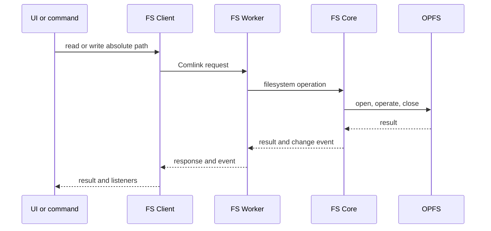

# Data Flow

Pyxis separates persistent file contents from application metadata. OPFS is the sole file store. IndexedDB stores records that need application-level keys and attributes.

## File operations

The worker opens and closes a SyncAccessHandle around each file operation. Writes flush before closing. File-change events carry absolute paths and metadata; consumers refresh the affected tree entry or tab content. File contents are read only by callers that need them.

All layers share Node-compatible POSIX lexical path operations. Filesystem boundaries accept absolute paths; relative resolution receives an explicit working directory. Shell syntax such as `~`, globs, quotes, and variable expansion is interpreted by the shell parser before filesystem calls. Runtime `fs` calls do not perform shell expansion.

## Git and package installation

Git and npm installation run inside the FS Worker against FS Core. isomorphic-git uses a filesystem adapter over the same OPFS tree as editors and terminal operations. There is no file-copy synchronization layer, and `.gitignore` does not decide which files are copied to a Git filesystem.

## Workspace and metadata

Opening a folder sets its absolute path as the workspace root. Newly created workspaces use `~/<name>` under HOME `/home/pyxis`. The file tree is built from `walk(rootPath)`, and the root is the default working directory. File identity remains the absolute path throughout the filesystem API.

| Data | Storage key or location |
|---|---|
| File contents, `.git`, `node_modules` | OPFS absolute path |
| Runtime cache | OPFS `~/.cache/pyxis` |
| Temporary files | Memory-backed `/tmp` |
| Recent folders | IndexedDB, keyed by root path |
| Chat spaces and tab state | IndexedDB, scoped by root path |
| AI reviews | IndexedDB, scoped by root path and file path |
| Preferences, translations, extensions | Existing application storage |

## Runtime filesystem path

The Node runtime uses the filesystem bridge to access FS Worker operations. Its synchronous filesystem requests are routed through the Service Worker path; asynchronous filesystem calls use worker messaging. The Runtime Worker is separate from the FS Worker so a synchronous request cannot block the filesystem owner that must answer it. See [Node Runtime](./NODE-RUNTIME.md) for the runtime execution model.

## Legacy migration

At startup, the temporary migration moves legacy project files and Git history into OPFS and changes project-scoped metadata to root-path keys. Migration verifies copied data before removing legacy stores. The filesystem worker then seeds generated `initial_files/` content into `~/demo` only when that directory is absent. This runs before recent folders are read; new workspaces remain empty, and existing folders are untouched. Safari-specific behavior and performance checks remain tracked in [Development/TODO.md](../Development/TODO.md).
