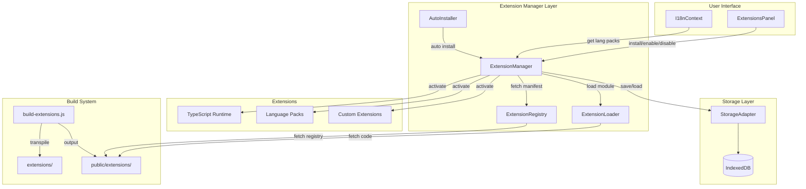
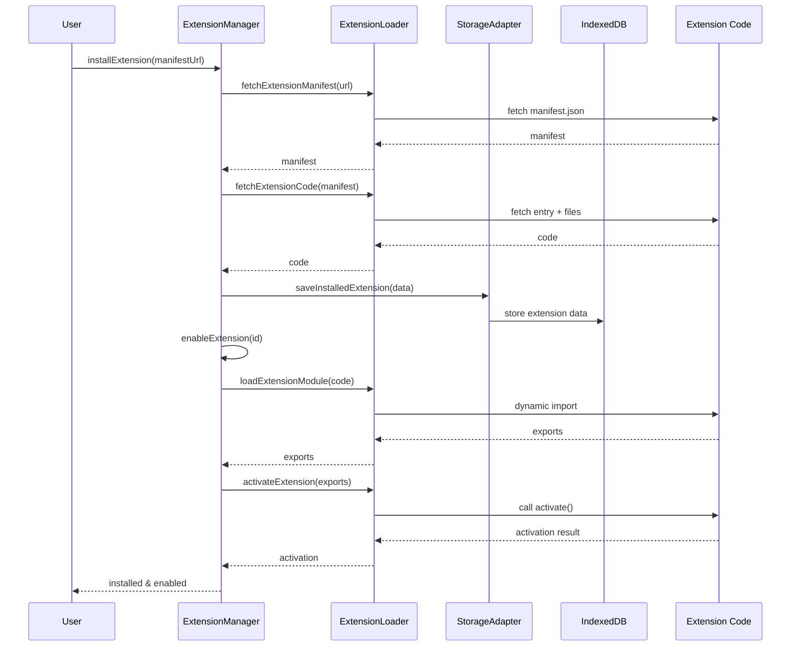
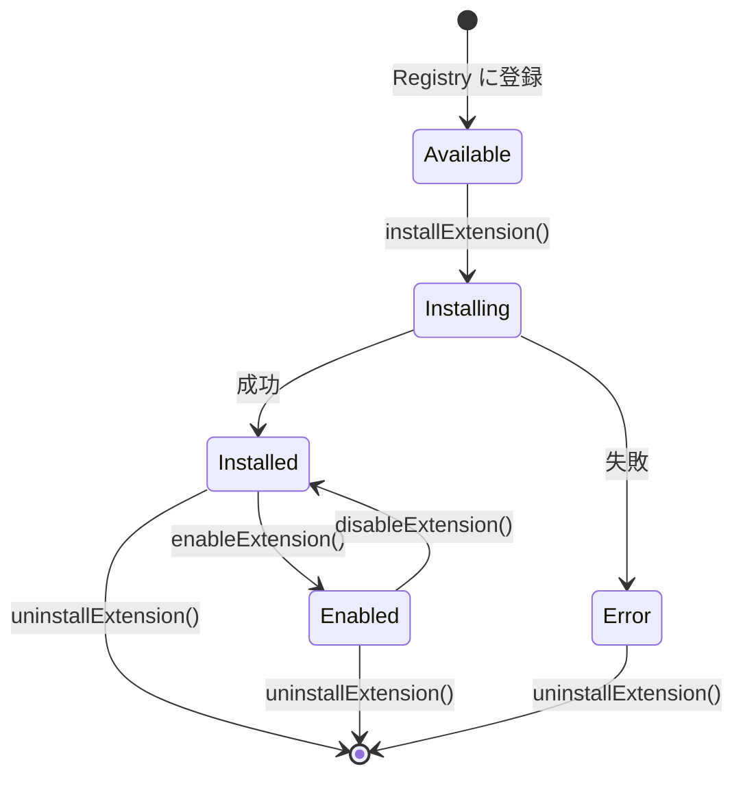
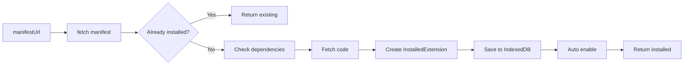
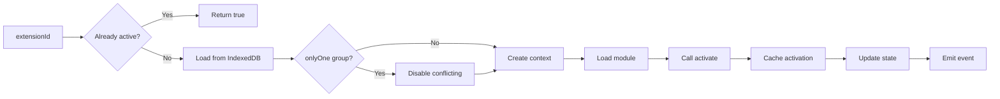
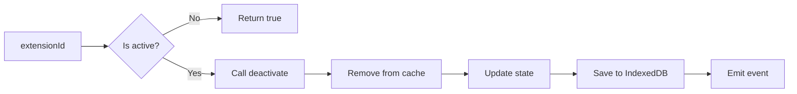
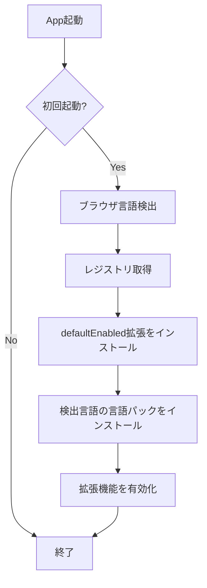
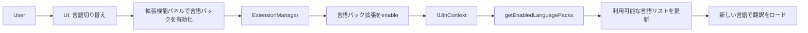
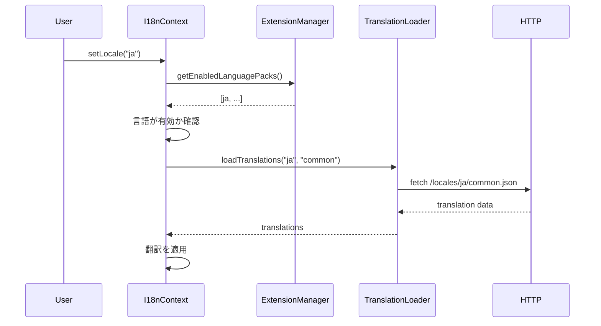
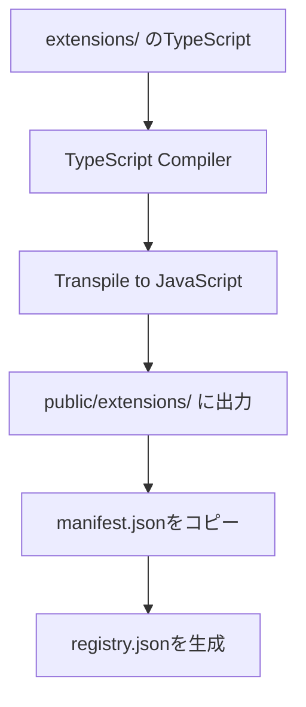

# 拡張機能システム (Extension System)

Pyxisの拡張機能システムは、コア機能を拡張し、新しい言語サポート、トランスパイラ、サービスなどを動的に追加できる仕組みを提供します。

## 目次

- [システム概要](#システム概要)
- [アーキテクチャ](#アーキテクチャ)
- [拡張機能のライフサイクル](#拡張機能のライフサイクル)
- [拡張機能の種類](#拡張機能の種類)
- [レジストリシステム](#レジストリシステム)
- [ストレージ管理](#ストレージ管理)
- [i18nシステムとの統合](#i18nシステムとの統合)
- [開発ワークフロー](#開発ワークフロー)

---

## システム概要

### 設計思想

Pyxisの拡張機能システムは以下の原則に基づいて設計されています：

- **動的ロード**: ブラウザ環境でTypeScript拡張機能を動的にロード・実行
- **分離と独立性**: 各拡張機能は独立したモジュールとして動作
- **依存関係管理**: 拡張機能間の依存関係を明示的に管理
- **永続化**: IndexedDBを使用して拡張機能のコードとメタデータを保存
- **型安全性**: TypeScriptの型システムを活用した安全な拡張機能API

### 主要コンポーネント

| コンポーネント | 役割 | ファイル |
|-------------|------|---------|
| Extension Manager | 拡張機能のライフサイクル全体を管理 | `extensionManager.ts` |
| Extension Loader | 拡張機能のロード・実行を担当 | `extensionLoader.ts` |
| Extension Registry | 利用可能な拡張機能のカタログ管理 | `extensionRegistry.ts` |
| Storage Adapter | IndexedDBへの永続化を抽象化 | `storage-adapter.ts` |
| Auto Installer | 初回起動時の自動インストール | `autoInstaller.ts` |

---

## アーキテクチャ

### 全体構成図



### データフロー



---

## 拡張機能のライフサイクル

### 状態遷移



### 状態の詳細

| 状態 | 説明 | 操作可能なアクション |
|-----|------|-------------------|
| **Available** | レジストリに登録されているが未インストール | install |
| **Installing** | インストール処理中 | - |
| **Installed** | インストール済みだが無効 | enable, uninstall |
| **Enabled** | 有効化され実行中 | disable, uninstall |
| **Error** | エラー状態 | uninstall |
| **Updating** | 更新処理中 | - |

### ライフサイクルメソッド

#### 1. インストール (Install)



#### 2. 有効化 (Enable)



#### 3. 無効化 (Disable)



---

## 拡張機能の種類

### 種類と用途

| 種類 | 用途 | 提供機能 | 例 |
|-----|------|---------|---|
| **transpiler** | コードトランスパイル | `runtimeFeatures.transpiler` | TypeScript, JSX |
| **service** | システムサービス | `services.*` | i18n, Git統合 |
| **builtin-module** | Node.js互換モジュール | `runtimeFeatures.builtInModules` | fs, path |
| **language-runtime** | 言語実行環境 | 言語固有のランタイム | Python, Ruby |
| **tool** | 開発ツール | コマンドやユーティリティ | linter, formatter |
| **ui** | UI拡張 | UIコンポーネント | カスタムパネル |

### 拡張機能の構造

各拡張機能は以下の構造を持ちます：

```
extensions/
└── example-extension/
    ├── manifest.json     # メタデータ
    ├── index.ts          # エントリーポイント
    └── [additional files] # 追加ファイル（オプション）
```

### Manifest形式

Manifestは拡張機能のメタデータを定義します：

| フィールド | 型 | 説明 |
|----------|---|------|
| `id` | string | 一意な識別子 例: `pyxis.typescript-runtime` |
| `name` | string | 表示名 |
| `version` | string | バージョン (semver形式) |
| `type` | ExtensionType | 拡張機能の種類 |
| `description` | string | 説明文 |
| `author` | string | 作者名 |
| `entry` | string | エントリーポイントの相対パス |
| `dependencies` | string[] | 依存する拡張機能のID（オプション） |
| `provides` | object | 提供する機能の定義 |
| `onlyOne` | string | 排他制御グループ名（オプション） |

### Extension Context

拡張機能が実行時に受け取るコンテキスト：

| プロパティ | 型 | 説明 |
|----------|---|------|
| `extensionId` | string | 拡張機能のID |
| `extensionPath` | string | 拡張機能のベースパス |
| `version` | string | 拡張機能のバージョン |
| `logger` | object | ログ出力API（オプション） |
| `storage` | object | 永続化ストレージAPI（オプション） |
| `getSystemModule` | function | システムモジュール取得API（オプション） |

### Activation Result

`activate()`関数が返すべき構造：

| プロパティ | 型 | 説明 |
|----------|---|------|
| `runtimeFeatures` | object | ランタイム機能（オプション） |
| `services` | object | サービスAPI（オプション） |
| `dispose` | function | クリーンアップ関数（オプション） |

---

## レジストリシステム

### レジストリの役割

レジストリは利用可能な拡張機能のカタログとして機能します。

**ファイル**: `public/extensions/registry.json`

### レジストリ構造

| フィールド | 説明 |
|----------|------|
| `version` | レジストリのバージョン |
| `extensions` | 拡張機能のリスト |
| `extensions[].id` | 拡張機能ID |
| `extensions[].type` | 種類 |
| `extensions[].manifestUrl` | Manifestへの相対パス |
| `extensions[].defaultEnabled` | 初回起動時に自動有効化するか |
| `extensions[].recommended` | 推奨マーク |

### キャッシュ戦略

レジストリは5分間キャッシュされます：

- 初回アクセス: fetchしてキャッシュ
- 5分以内: キャッシュから返却
- 5分経過後: 再fetchしてキャッシュ更新
- `forceRefresh=true`: 強制再fetch

### 自動インストーラー

初回起動時、以下の処理が自動実行されます：



**処理内容**:
1. ブラウザ言語を検出 例: `ja`, `en`
2. `defaultEnabled: true`の拡張機能をインストール
3. 検出された言語に対応する言語パックをインストール・有効化

---

## ストレージ管理

### IndexedDB構造

拡張機能データは以下の形式で保存されます：

| Store名 | キー | 値 |
|--------|-----|---|
| `extensions` | `extensionId` | `InstalledExtension` |

### InstalledExtension構造

| フィールド | 説明 |
|----------|------|
| `manifest` | 拡張機能のManifest |
| `status` | 現在の状態 |
| `installedAt` | インストール日時 (timestamp) |
| `updatedAt` | 最終更新日時 (timestamp) |
| `enabled` | 有効化状態 |
| `cache.entryCode` | エントリーポイントのコード |
| `cache.files` | 追加ファイルのコード |
| `cache.cachedAt` | キャッシュ日時 (timestamp) |

### コードキャッシュ戦略

拡張機能のコードは以下の理由でキャッシュされます：

- **パフォーマンス**: ネットワークリクエストを削減
- **オフライン対応**: インターネット接続なしでも動作
- **一貫性**: バージョン固定による動作の安定性

キャッシュは拡張機能のアンインストール時にクリアされます。

---

## i18nシステムとの統合

### 言語パック拡張機能

Pyxisのi18nシステムは拡張機能システムと深く統合されています。

#### 統合の仕組み



#### I18nContext との連携

`I18nContext`は以下の方法で拡張機能システムと連携します：

| 処理 | 説明 |
|-----|------|
| **利用可能言語の取得** | `extensionManager.getEnabledLanguagePacks()`を呼び出し、有効化された言語パックのリストを取得 |
| **言語切り替え検証** | 選択された言語の言語パック拡張が有効化されているか確認 |
| **自動フォールバック** | 保存された言語が無効化されている場合、有効な言語にフォールバック |

#### 言語パック拡張の実装例

言語パック拡張は以下の構造で実装されています：

**Manifest**: `extensions/lang-packs/ja/manifest.json`
- `type`: `"service"`
- `onlyOne`: `"lang-pack"` - 同時に複数の言語パックを有効化できない

**エントリーポイント**: `extensions/lang-packs/ja/index.ts`
- `activate()`関数で以下を返却：
  - `services['language-pack']`: ロケールと言語名の情報

#### onlyOneグループ制御

言語パックは`onlyOne: "lang-pack"`グループに属します。

**動作**:
- 新しい言語パックを有効化すると、同じグループの他の拡張機能が自動的に無効化される
- これにより、常に1つの言語のみがアクティブな状態を保証

### 翻訳データのロード

言語パック拡張の有効化後、i18nシステムは以下のフローで翻訳をロードします：



**注意点**:
- 翻訳ファイル自体 (`public/locales/**`) は拡張機能システムとは独立
- 言語パック拡張は「どの言語が利用可能か」を定義するのみ
- 実際の翻訳データはi18nシステムが直接ロード

---

## 開発ワークフロー

### ビルドシステム

`build-extensions.js`が拡張機能のビルドを担当します。

#### ビルドプロセス



#### ビルドコマンド

開発時にビルドスクリプトを手動実行：

```bash
node build-extensions.js
```

**処理内容**:
1. `public/extensions/`をクリーンアップ
2. `extensions/`配下の全TypeScriptファイルをトランスパイル
3. 出力を`public/extensions/`に配置
4. `manifest.json`を各拡張機能ディレクトリにコピー
5. `registry.json`を自動生成（オプション）

### 拡張機能の作成手順

新しい拡張機能を作成する標準的な手順：

#### ステップ1: ディレクトリ作成

```bash
mkdir -p extensions/my-extension
```

#### ステップ2: Manifest作成

`extensions/my-extension/manifest.json`:
- 必須フィールドを記述
- `type`と`provides`を適切に設定

#### ステップ3: エントリーポイント作成

`extensions/my-extension/index.ts`:
- `activate(context: ExtensionContext)`関数を実装
- `deactivate()`関数を実装（オプション）
- 適切な`ExtensionActivation`を返却

#### ステップ4: ビルド

```bash
node build-extensions.js
```

#### ステップ5: レジストリに登録

`extensions/registry.json`に以下を追加：
- `id`: 拡張機能のID
- `type`: 種類
- `manifestUrl`: Manifestへのパス
- `defaultEnabled`: 自動有効化の有無（オプション）

#### ステップ6: テスト

ブラウザでアプリケーションを起動し、拡張機能パネルから手動インストール・有効化してテスト。

### 型定義の共有

`extensions/_shared/types.ts`に共通型が定義されています。

**重要な型**:
- `ExtensionContext`: 拡張機能が受け取るコンテキスト
- `ExtensionActivation`: activate関数の戻り値型

拡張機能はこれらの型をインポートして使用します。

### デバッグ

拡張機能のデバッグには以下のログが有用です：

- `[ExtensionManager]`: ライフサイクル管理
- `[ExtensionLoader]`: ロード・実行
- `[ExtensionAutoInstaller]`: 自動インストール

ブラウザのDevToolsコンソールでこれらのログをフィルタして確認できます。

---

## まとめ

Pyxisの拡張機能システムは、以下の特徴を持つ柔軟で拡張性の高い設計です：

- **動的性**: ブラウザ環境で拡張機能を動的にロード・実行
- **永続性**: IndexedDBによるコードとメタデータのキャッシュ
- **型安全性**: TypeScriptの型システムによる安全なAPI
- **統合性**: i18nシステムなど他のコアシステムとの密な統合
- **自動化**: 初回起動時の自動インストール・言語検出

この設計により、Pyxisは柔軟に機能を拡張でき、ユーザーは必要な機能のみを有効化できる効率的なシステムとなっています。
