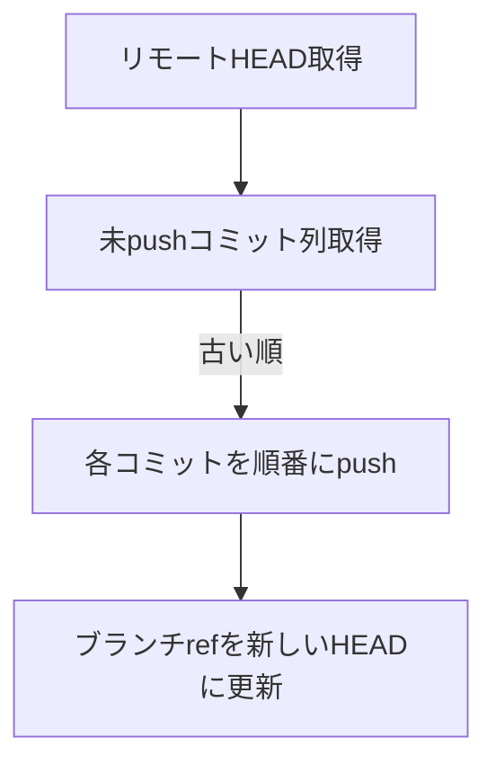

# Git Push 本物設計仕様書

## 目的

ローカルのコミット履歴をGitHubリモートリポジトリに「本物のgit push」と同じ体系・動作で反映する。履歴・作者・差分・fast-forward判定など、公式gitと同等の動作を目指す。

---

## 機能要件

### 1. コミット履歴の再現
- ローカルとリモートの分岐点（共通祖先）を特定し、未pushのコミットを古い順にすべて取得する。
- 各コミットごとにtree/blobsをGitHub APIで作成し、親SHAを正しく繋げていく。
- 各コミットのauthor/committer情報・メッセージ・タイムスタンプも忠実に再現する。

### 2. pushの流れ


1. リモートのHEAD（最新コミットSHA）を取得
2. ローカルのHEADからリモートHEADまでの未pushコミット列を取得
3. 各コミットを順番にGitHub APIで作成
    - treeを構築
    - commitを作成（parentは直前のコミットSHA）
4. 最後にリファレンス（ブランチ）を新しいHEADに更新

### 3. fast-forward/force-pushの判定
- fast-forward可能かどうか（リモートHEADがローカル履歴に含まれるか）を判定し、不可ならエラーや警告を出す。
- forceオプション時は、リモートブランチを強制的に上書き。

### 4. 差分アップロードの最適化
- すでにリモートに存在するblob/treeは再アップロードしない（SHAで判定）。
- 差分のみアップロードすることでAPIコストを削減。

### 5. エラー処理・トランザクション性
- 途中で失敗した場合はロールバックや再送処理を検討。
- 進捗表示やエラー内容の詳細な通知。

---

## 実装イメージ

```typescript
// 1. リモートHEAD取得
const remoteHead = await githubAPI.getRef(branch);

// 2. ローカルの未pushコミット列を取得（リモートHEAD以降）
const commitsToPush = await getCommitsToPush(fs, dir, branch, remoteHeadSha);

// 3. 各コミットを順番にpush
let parentSha = remoteHeadSha;
for (const commit of commitsToPush) {
  const treeSha = await buildTree(commit.oid, ...);
  const newCommit = await githubAPI.createCommit({
    message: commit.message,
    tree: treeSha,
    parents: [parentSha],
    author: commit.author,
    committer: commit.committer,
  });
  parentSha = newCommit.sha;
}

// 4. ブランチrefを更新
await githubAPI.updateRef(branch, parentSha, force);
```

---

## 備考
- 公式gitのpush挙動・履歴再現性・差分最適化を重視する。
- 差分アップロード・fast-forward判定・エラー処理も本物のgitに準拠。
- 詳細なAPI設計・エッジケースは実装時に都度検討。
