# Node.js Runtime - Browser-Based JavaScript Execution Environment

Pyxis CodeCanvas の Node.js Runtime は、完全にブラウザ内で動作する Node.js 互換の実行環境です。IndexedDB をストレージとして使い、依存関係の事前ロードによる同期的な`require()`、Web Worker による非同期トランスパイル、そして依存グラフを管理するキャッシュシステムを備えています。

---

## System Overview

### Design Goals

1. **Complete Browser Execution**: サーバーを必要とせず、すべてクライアント側で実行
2. **Node.js Compatibility**: CommonJS の require、npm パッケージ、組み込みモジュールの互換性
3. **High Performance**: 依存関係の事前ロードと同期実行による高速化
4. **Smart Caching**: 変更検出と依存グラフによる効率的なキャッシュ管理
5. **Extensibility**: 拡張機能によるトランスパイラのカスタマイズ

### Key Features

- **Synchronous require()**: 依存関係を事前ロードすることで、従来の Node.js と同じ同期的な`require()`を実現
- **Pre-loading Strategy**: エントリーファイル実行前に全依存関係を再帰的にロード
- **Smart Cache Invalidation**: ファイル内容のハッシュによる変更検出と、依存グラフに基づく自動無効化
- **Extension-based Transpilation**: TypeScript/JSX は拡張機能が担当、コアは CJS/ESM 変換のみ
- **npm Packages Support**: node_modules 内のパッケージを完全にサポート
- **Built-in Modules**: `fs`、`path`、`http`、`readline`などを提供

---

## Overall Architecture

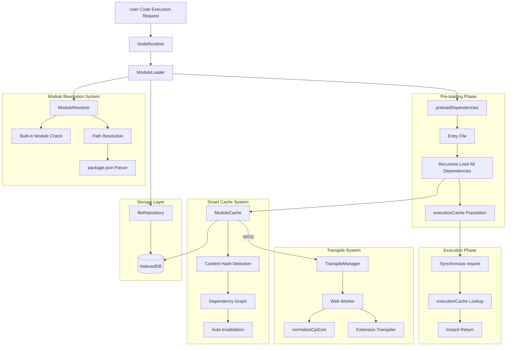

---

## Core Component Details

### 1. NodeRuntime

システムのエントリーポイント。依存関係の事前ロードとファイル実行を管理します。

#### Primary Responsibilities

- 依存関係の事前ロード（`preloadDependencies`）
- サンドボックス環境の構築
- グローバルオブジェクトの注入
- 組み込みモジュールの提供
- 同期的な`require()`関数の作成

#### Processing Flow

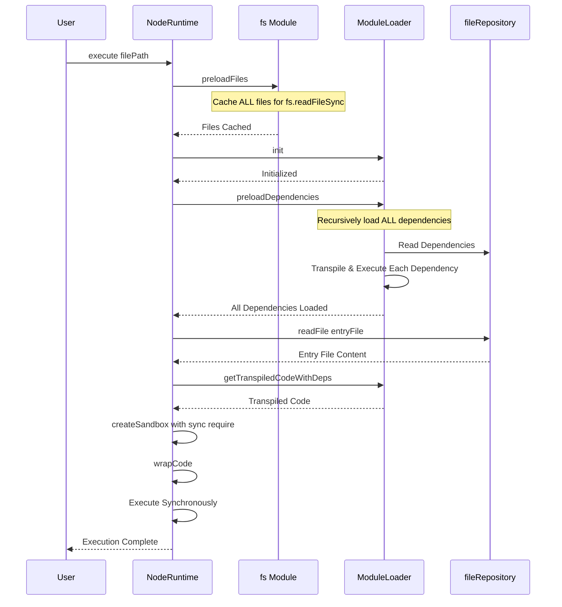

#### Sandbox Environment Components

| Element | Description |
|---------|-------------|
| `console` | デバッグコンソールまたはランタイムロガーへのプロキシ |
| `setTimeout` / `setInterval` | イベントループ追跡機能付きタイマー API |
| `Promise` / `Array` / `Object` | JavaScript の組み込みオブジェクト |
| `global` | グローバルオブジェクト参照 |
| `process` | Node.js の `process` オブジェクトのエミュレーション |
| `Buffer` | バイナリデータ操作用のクラス |
| `require` | **同期的な**モジュール読み込み関数 |

#### Synchronous require() Implementation

依存関係を事前にロードすることで、従来の Node.js と同じ同期的な`require()`を実現しています。

**主な特徴**:
- すべての依存関係は`preloadDependencies()`で事前に`executionCache`にロード済み
- `require()`は`executionCache`から同期的に取得するだけ
- ビルトインモジュールは`builtinResolver`で即座に解決
- モジュール名解決には`moduleNameMap`を使用（npm パッケージの高速解決）

**解決の優先順位**:
1. ビルトインモジュール（`fs`, `path`など）→ 即座に返す
2. `moduleNameMap`をチェック（npm パッケージ名 → パス）
3. 相対パス/絶対パス/エイリアスを解決
4. `executionCache`から exports を取得
5. 見つからない場合はエラー（事前ロードされていない）

**サポートされる利用例**:
```javascript
const fs = require('fs'); // 同期的に動作
const lodash = require('lodash'); // npm パッケージも同期
const utils = require('./utils'); // 相対パスも同期
```

---

### 2. ModuleLoader

モジュールのロードとライフサイクル管理を担当するコアコンポーネント。

#### Primary Responsibilities

- モジュール解決の調整
- 依存関係の事前ロード（`preloadDependencies`）
- トランスパイル処理の管理
- 実行キャッシュの管理
- `moduleNameMap`の構築（npm パッケージ名のマッピング）
- 循環依存の検出とハンドリング

#### Pre-loading Strategy

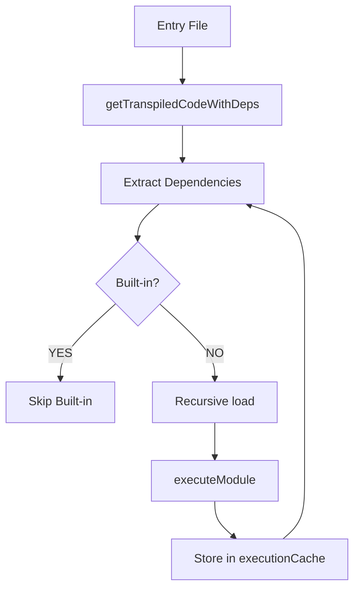

**重要なポイント**:
- エントリーファイル自体は`preloadDependencies()`では実行しない
- 依存関係のみを再帰的にロード・実行する
- ビルトインモジュールはスキップする
- すべての依存関係が`executionCache`に格納される
- npm パッケージは`moduleNameMap`に登録される

#### Execution Cache Structure

| Field | Type | Description |
|-------|------|-------------|
| `exports` | unknown | モジュールの exports オブジェクト |
| `loaded` | boolean | 読み込み完了フラグ |
| `loading` | boolean | 循環依存検出用の読み込み中フラグ |

#### moduleNameMap

npm パッケージ名 → 解決済みパスのマッピング:

```typescript
// Example:
// "lodash" → "/projects/my-app/node_modules/lodash/lodash.js"
// "chalk" → "/projects/my-app/node_modules/chalk/source/index.js"

this.moduleNameMap[moduleName] = resolvedPath;
```

**用途**: `require('lodash')` のような短い名前から即座にフルパスを解決

---

### 3. ModuleCache

変更検出機能と依存グラフを備えた永続キャッシュシステム。

#### Primary Responsibilities

- トランスパイル結果の保存
- ファイル内容のハッシュによる変更検出
- 依存グラフの双方向管理
- 変更時の自動キャッシュ無効化
- LRU 戦略による自動 GC

#### Cache Strategy Overview

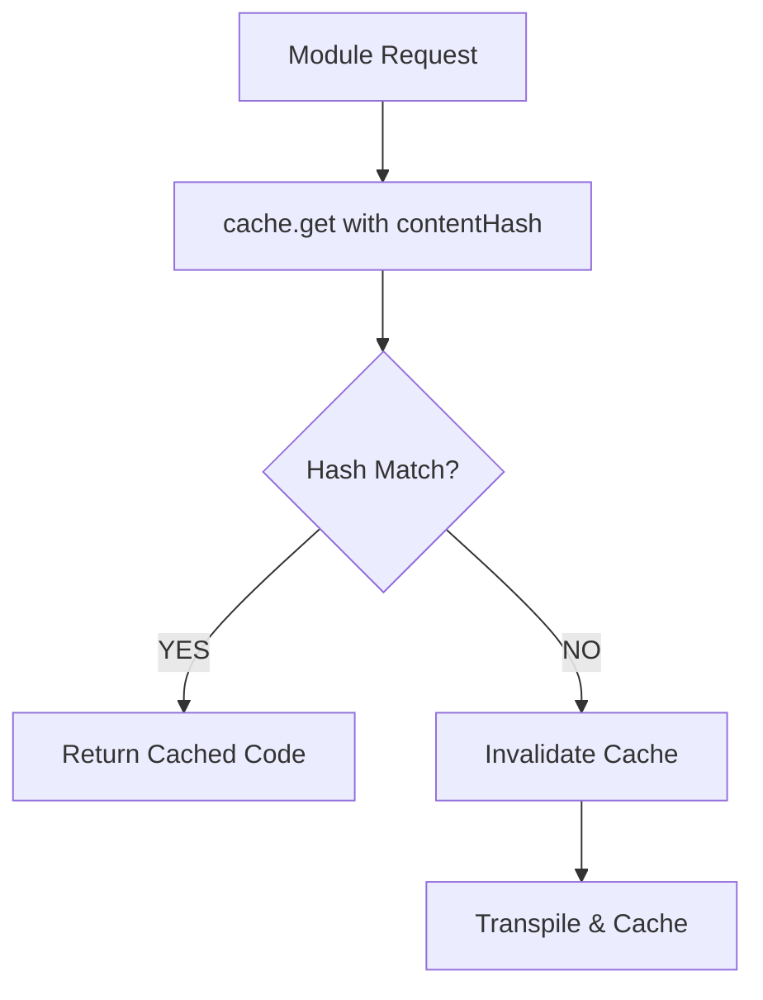

**キャッシュキー**: ファイルパスのみ（内容ハッシュは含まない）  
**変更検出**: `contentHash` フィールドで現在の内容と比較

#### Cache Entry Structure

```typescript
interface CacheEntry {
  originalPath: string;      // 元のファイルパス
  contentHash: string;        // ファイル内容のハッシュ (変更検出用)
  code: string;               // トランスパイル済みコード
  sourceMap?: string;         // ソースマップ (将来実装)
  deps: string[];             // このファイルが依存しているファイル
  dependents: string[];       // このファイルに依存しているファイル (逆参照)
  mtime: number;              // 保存時刻
  lastAccess: number;         // 最終アクセス時刻
  size: number;               // コードサイズ (bytes)
}
```

#### Bidirectional Dependency Graph

依存関係を双方向で管理:

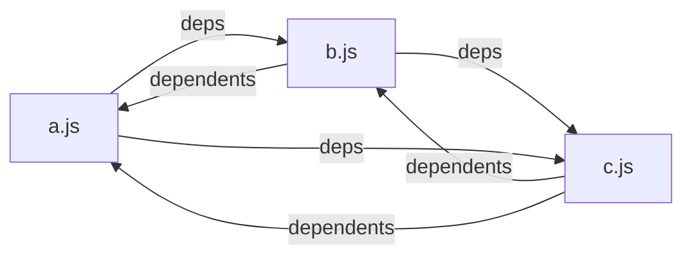

**変更時の処理**:
1. 変更されたファイル自体のキャッシュを削除
2. `dependents` を辿り、依存する全ファイルのキャッシュも再帰的に無効化
3. 変更されていない依存ファイルはキャッシュ利用可能

#### Content Hash Calculation

```typescript
hashContent(content: string): string {
  let hash = 0;
  for (let i = 0; i < content.length; i++) {
    const char = content.charCodeAt(i);
    hash = (hash << 5) - hash + char;
    hash = hash & hash;
  }
  return Math.abs(hash).toString(36);
}
```

32-bit ローリングハッシュを base-36 文字列に変換。

#### Cache Invalidation Flow

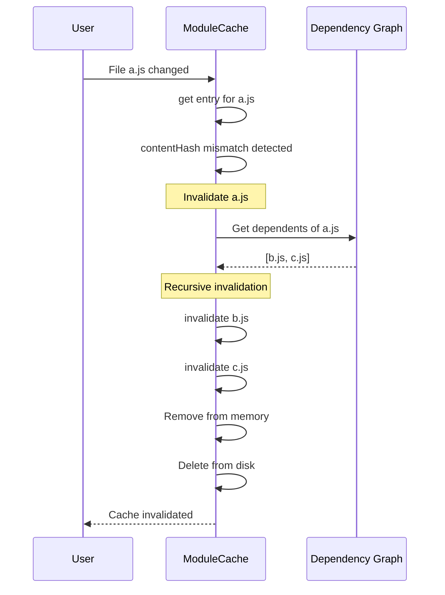

#### Disk Persistence

IndexedDB のディレクトリ構成:

```
/cache/
  ├── modules/
  │     ├── _src_app.tsx.js
  │     ├── _src_utils.ts.js
  │     └── ...
  └── meta/
        ├── _src_app.tsx.json
        ├── _src_utils.ts.json
        └── ...
```

**ファイル名変換**: `/src/app.tsx` → `_src_app.tsx`  
**メタファイル**: キャッシュエントリ全体を JSON 保存

#### GC Strategy

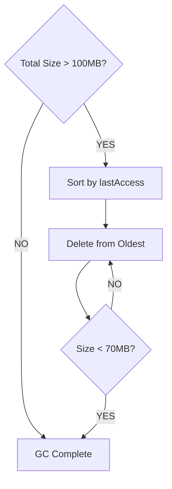

**実行条件**: キャッシュ合計サイズが 100MB を超えたとき  
**削減目標**: LRU で 70MB まで削減

---

### 3. ModuleResolver

Node.js 互換のモジュールパス解決システム。

#### Primary Responsibilities

- 組み込みモジュールの検出
- 相対パスの解決
- `node_modules` の検索
- `package.json` の解析
- `exports` フィールドのサポート
- `imports` フィールドのサポート（`#`で始まるパス）

#### Resolution Priority

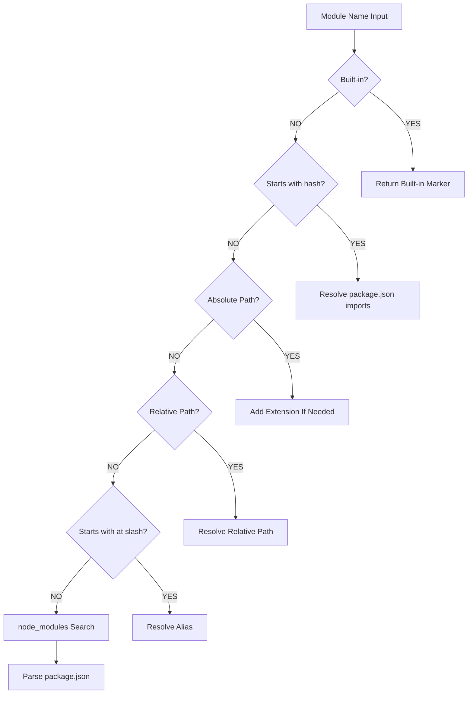

#### Built-in Modules List

`fs`, `fs/promises`, `path`, `os`, `util`, `http`, `https`, `buffer`, `readline`, `crypto`, `stream`, `events`, `url`, `querystring`, `assert`, `child_process`, `cluster`, `dgram`, `dns`, `domain`, `net`, `tls`, `tty`, `zlib`

#### Path Resolution Examples

| Input | Resolution Result |
|-------|-------------------|
| `fs` | 組み込みマーカーが返される |
| `./utils` | `/projects/my-app/src/utils.js` |
| `../config` | `/projects/my-app/config.ts` |
| `@/components/Button` | `/projects/my-app/src/components/Button.tsx` |
| `lodash` | `/projects/my-app/node_modules/lodash/lodash.js` |
| `@vue/runtime-core` | `/projects/my-app/node_modules/@vue/runtime-core/dist/runtime-core.esm-bundler.js` |
| `#internal/utils` | `package.json` の `imports` フィールドから解決される |

#### package.json Parsing Logic

エントリポイント決定の優先順位:

1. `module` フィールド — ES モジュール版を優先
2. `main` フィールド — CommonJS 版
3. `exports` フィールド — 条件付きエクスポート対応
4. `index.js` — フォールバック

#### Extension Completion

ファイルパスに拡張子がない場合、次の順で試します:

1. そのままのパスで存在チェック（拡張子なしのスクリプト用、例: bin/cowsay）
2. `.js`, `.mjs`, `.ts`, `.mts`, `.tsx`, `.jsx`, `.json`
3. `/index.js`, `/index.mjs`, `/index.ts`, `/index.mts`, `/index.tsx`

---

### 4. TranspileManager & Web Worker

高速トランスパイルシステム。

#### Primary Responsibilities

- Web Worker の作成と管理
- トランスパイルリクエストの処理
- タイムアウト管理（10 秒）
- 自動メモリ管理

#### Worker Processing Flow

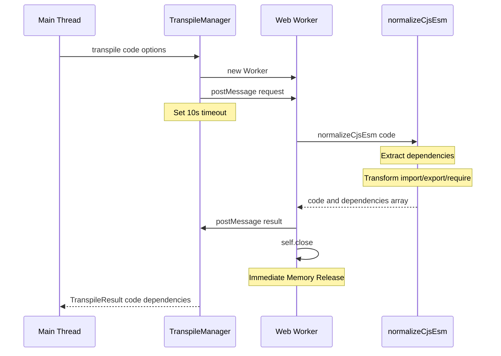

#### normalizeCjsEsm Transform

**役割**: 正規表現ベースの軽量な CJS/ESM 変換と依存関係の抽出

**import 文の変換例**

- `import foo from 'bar'` → `const foo = (tmp => tmp && tmp.default !== undefined ? tmp.default : tmp)(require('bar'))`
- `import { named } from 'bar'` → `const { named } = require('bar')`
- `import * as ns from 'bar'` → `const ns = require('bar')`
- `import 'bar'` → `require('bar')`

**export 文の変換例**

- `export default foo` → `module.exports.default = foo`
- `export const bar = 1` → `const bar = 1; module.exports.bar = bar;`
- `export { baz }` → `module.exports.baz = baz`
- `export { a as b }` → `module.exports.b = a;`

**require 呼び出し**

- `require('foo')` → そのまま（同期的に動作）

**依存関係の抽出**

- すべての`import`、`require`、動的`import()`から依存関係を抽出
- 重複を除去してユニークなリストを返す
- `{ code: string, dependencies: string[] }`の形式で返す

#### Extension Transpiler Integration

TypeScript/JSX のトランスパイルは拡張機能の責任です:

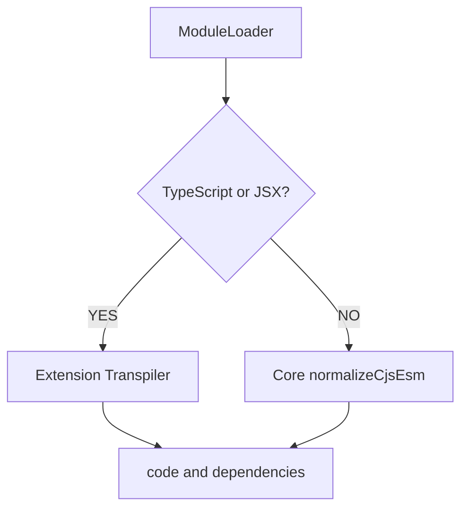

拡張機能の例（`extensions/typescript-runtime`）:
- TypeScript の型情報を削除
- JSX を React 関数呼び出しに変換
- 依存関係を抽出
- `{ code: string, map?: string, dependencies?: string[] }`を返す

#### Memory Management Strategy

- トランスパイル完了後に `self.close()` を呼んで Worker を終了させる
- Worker のヒープは即座に解放される
- メインスレッドのメモリへ影響は与えない
- 各リクエストごとに新しい Worker を生成する

---

### 5. ModuleCache

トランスパイル結果の永続キャッシュシステム。

#### Primary Responsibilities

- トランスパイル結果の保存
- 内容ハッシュによる変更検出
- 依存グラフの双方向管理
- ファイル変更時の自動無効化
- LRU 戦略による自動 GC
- IndexedDB への永続化

#### Cache Structure

IndexedDB のディレクトリ構成:

```
/cache/
    ├── modules/
    │     ├── _src_app_tsx.js
    │     ├── _src_utils_ts.js
    │     └── ...
    └── meta/
          ├── _src_app_tsx.json
          ├── _src_utils_ts.json
          └── ...
```

#### Cache Entry Format

| Field | Type | Description |
|-------|------|-------------|
| `originalPath` | string | 元のファイルパス |
| `contentHash` | string | ファイル内容のハッシュ（変更検出用） |
| `code` | string | トランスパイル済みコード |
| `sourceMap` | string | ソースマップ（オプション） |
| `deps` | string[] | このファイルが依存しているファイル一覧 |
| `dependents` | string[] | このファイルに依存しているファイル一覧（逆参照） |
| `mtime` | number | トランスフォームのタイムスタンプ |
| `lastAccess` | number | 最終アクセスのタイムスタンプ |
| `size` | number | コードのバイトサイズ |

#### Smart Invalidation Strategy

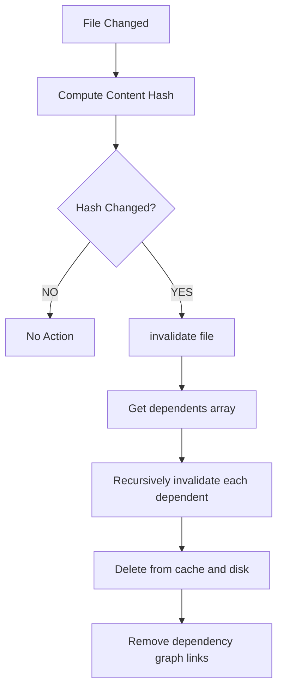

**重要なポイント**:
- ファイル内容のハッシュで変更を検出
- 変更されたファイルのキャッシュを削除
- そのファイルに依存するすべてのファイルも再帰的に無効化
- 依存グラフの双方向リンク（`deps`と`dependents`）を維持
- 変更されていない依存ファイルはキャッシュ利用可能

#### GC Strategy

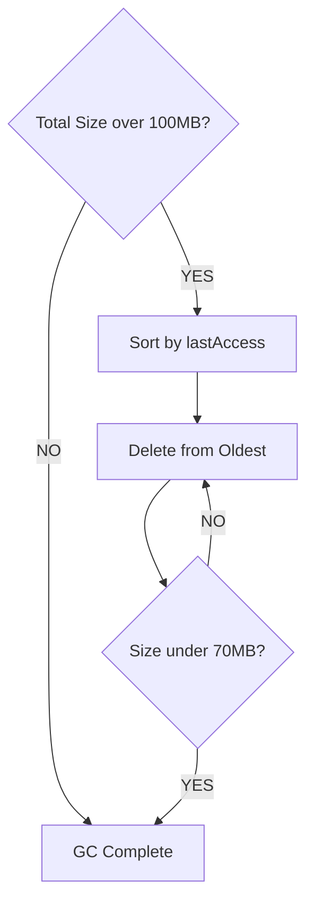

**GC 実行条件**: キャッシュ合計サイズが 100MB を超えたとき  
**削減目標**: 最終アクセスが古いものから削除して 70MB まで減らす

---

## Data Flow Details

### Complete Module Loading Flow

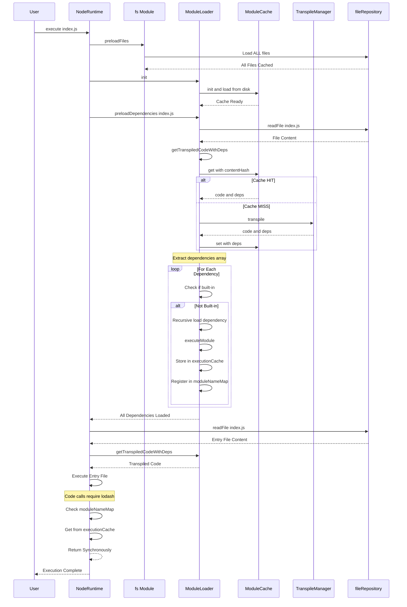

### Transpile Detail Flow

#### Step 1: Language Detection

入力: ファイルパスとコード内容

判定基準:

1. 拡張子が `.ts`, `.tsx`, `.mts`, `.cts` → TypeScript（拡張機能が処理）
2. 拡張子が `.jsx`, `.tsx` → JSX（拡張機能が処理）
3. 拡張子が `.mjs` → ESM（常にトランスパイル）
4. コードに `import` / `export` を含む → ESM
5. コードに `require()` を含む → CJS

#### Step 2: Transpiler Selection

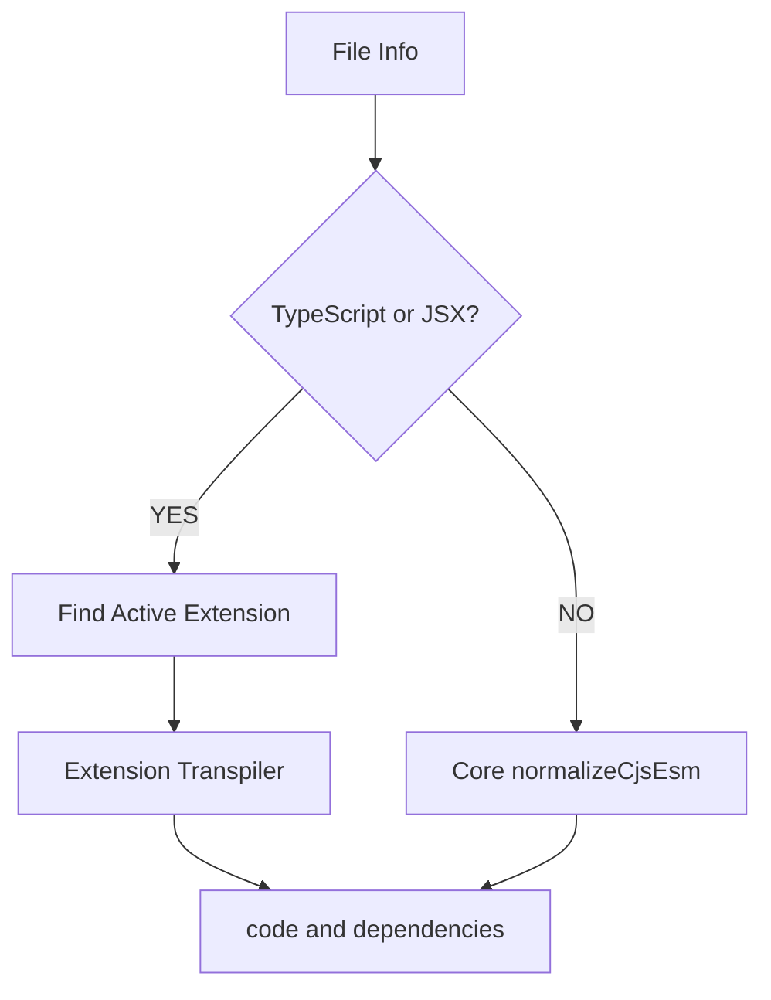

#### Step 3: Transform and Extract

**拡張機能の処理**（TypeScript/JSX の場合）:
1. TypeScript の型情報を削除
2. JSX を React 関数呼び出しに変換
3. import/export を抽出（依存関係として）
4. `{ code, map?, dependencies? }`を返す

**コアの処理**（通常の JS の場合）:
1. `normalizeCjsEsm`で import/export/require を変換
2. 依存関係を抽出
3. `{ code, dependencies }`を返す

#### Step 4: Cache Save

メモリとディスクの両方に保存:

- メモリ: 即時アクセス用の Map 構造
- ディスク: IndexedDB（次回起動時に有効）
- 依存グラフ: `deps`と`dependents`を双方向に更新

---

## Performance Characteristics

### First Execution Timing

| Phase | Time | Description |
|-------|------|-------------|
| File Pre-loading (fs) | ~10-20ms | すべてのファイルをメモリキャッシュ |
| Dependency Pre-loading | ~100-200ms | 依存関係の再帰的ロードと実行 |
| Entry File Transpilation | ~50-100ms | エントリーファイルのトランスパイル |
| Entry File Execution | ~5-10ms | エントリーファイルの同期実行 |
| **Total** | **~165-330ms** | 初回のみの目安 |

### Second and Later (Cache HIT)

| Phase | Time | Description |
|-------|------|-------------|
| File Pre-loading (fs) | ~10-20ms | ファイルキャッシュロード |
| Dependency Pre-loading | ~20-40ms | キャッシュから高速ロード |
| Entry File Cache Load | ~1-5ms | メモリからの取得 |
| Entry File Execution | ~5-10ms | 同期実行 |
| **Total** | **~36-75ms** | **約 5 倍高速** |

### Memory Footprint


**メモリ使用量**: LRU GC により概ね 50-70MB に落ち着く

---

## Built-in Modules

### Support Status

| Module | Implementation | Description |
|--------|----------------|-------------|
| `fs` | ✅ | fileRepository を通したファイル操作、`preloadFiles`によるメモリキャッシュ |
| `fs/promises` | ✅ | Promise ベースの FS API |
| `path` | ✅ | パス操作ユーティリティ |
| `os` | ✅ | OS 情報のエミュレーション |
| `util` | ✅ | ユーティリティ関数群 |
| `http` | ✅ | fetch をラップした HTTP 通信 |
| `https` | ✅ | HTTPS 通信 |
| `buffer` | ✅ | Buffer クラス |
| `readline` | ✅ | 対話入力のサポート |
| `assert` | ✅ | アサーション関数 |
| `events` | ✅ | EventEmitter クラス |
| `module` | ✅ | Module オブジェクト |
| `url` | ✅ | URL パース |
| `stream` | ✅ | Stream クラス |

### fs Module Implementation Features

**設計方針**: IndexedDB を単一の真実のソース（single source of truth）として利用し、`preloadFiles`でメモリキャッシュを構築

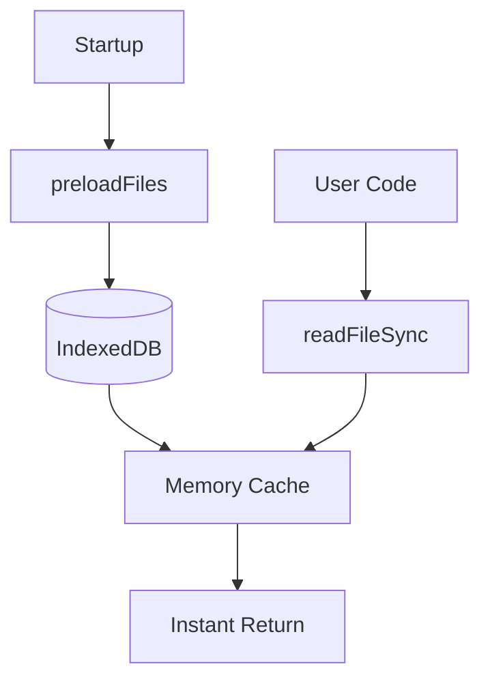

**重要なポイント**:
- `preloadFiles()`ですべてのファイルをメモリにキャッシュ
- `readFileSync()`は同期的にメモリキャッシュから読み取る
- IndexedDB は非同期だが、事前ロードにより同期的な API を実現
- 書き込みは IndexedDB に保存され、GitFS に自動同期

---

## References

### Related Documents

- [CORE-ENGINE.md](./CORE-ENGINE.md) - Core engine design
- [DATA-FLOW.md](./DATA-FLOW.md) - Overall data flow
- [SYSTEM-OVERVIEW.md](./SYSTEM-OVERVIEW.md) - System overview

### External Links

- [Babel Documentation](https://babeljs.io/docs/)
- [Web Workers API](https://developer.mozilla.org/en-US/docs/Web/API/Web_Workers_API)
- [IndexedDB API](https://developer.mozilla.org/en-US/docs/Web/API/IndexedDB_API)
- [Node.js Built-in Modules](https://nodejs.org/api/)

---

**Last Updated**: 2025-01-06  
**Version**: 5.0  
**Status**: ✅ Accurate documentation based on implementation
