# 未チェックーこのドキュメントは実装に基づいていない可能性があります。あまり参考にしないで下さい。


# Node.js Runtime - ブラウザ内実行環境

Pyxis CodeCanvasのNode.js Runtimeは、完全にブラウザ環境で動作するNode.js互換の実行環境です。babel standaloneによる本格的なAST変換、Web Workerによるマルチスレッド処理、IndexedDBベースの永続キャッシュを備えています。

---

## システム概要

### 設計目標

1. **完全ブラウザ環境**: サーバーを使わず、すべてクライアントで実行
2. **Node.js互換**: require、npm packages、ビルトインモジュールをサポート
3. **高性能**: babel standaloneによる高速トランスパイル、3層キャッシュシステム
4. **メモリ効率**: LRU GC、Worker自動終了による一定のメモリフットプリント
5. **拡張性**: プラグイン可能な設計、将来のHMR対応

### 主要な特徴

- **babel standalone統合**: 正規表現ではなくAST変換による正確なトランスパイル
- **TypeScript完全サポート**: interface、generics、decorators対応
- **JSX/TSX対応**: React自動ランタイム
- **ES Module ⇔ CommonJS**: 双方向変換
- **npm packages**: node_modules内のパッケージを完全サポート
- **ビルトインモジュール**: fs、path、http、readlineなど

---

## アーキテクチャ全体図

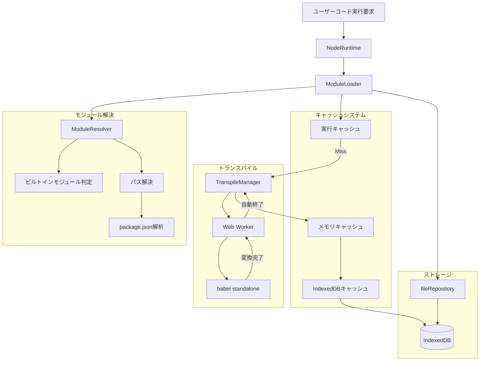

---

## コアコンポーネント

### 1. NodeRuntime

**役割**: システム全体のエントリーポイント

**責務**:
- ファイル実行の開始
- サンドボックス環境の構築
- ビルトインモジュールの提供
- グローバルオブジェクトの注入

**処理フロー**:

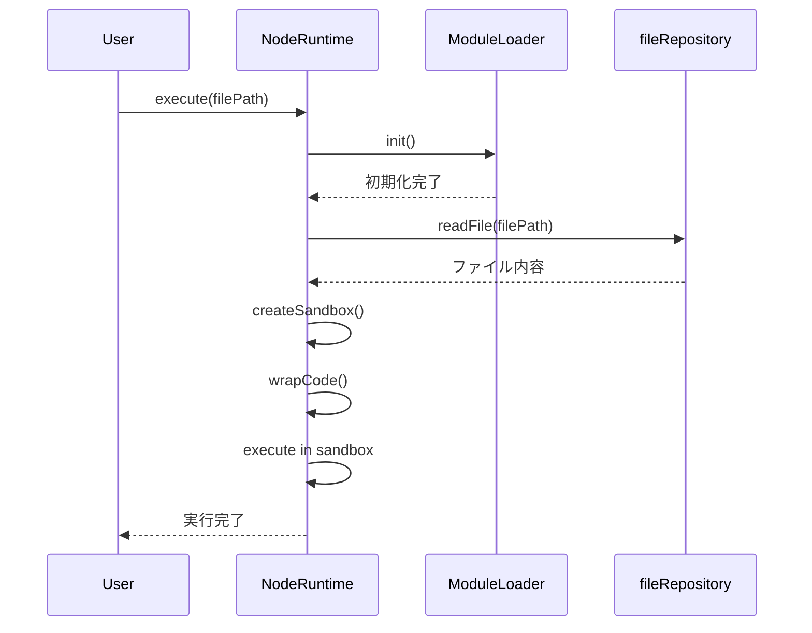

**主要メソッド**:
- `execute(filePath)`: ファイルを実行
- `createSandbox(filePath)`: サンドボックス環境を構築
- `require(moduleName)`: モジュールを読み込み

---

### 2. ModuleLoader

**役割**: モジュールの読み込みと管理

**責務**:
- モジュール解決の調整
- トランスパイルの管理
- 実行キャッシュの管理
- 循環参照の検出

**キャッシュ戦略**:

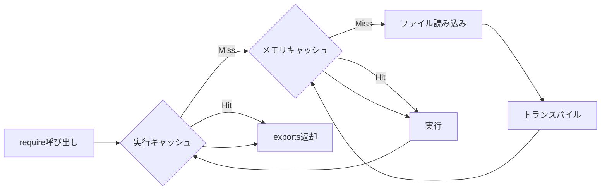

**実行キャッシュの構造**:
| フィールド | 型 | 説明 |
|-----------|-----|------|
| exports | unknown | モジュールのexports |
| loaded | boolean | ロード完了フラグ |
| loading | boolean | ロード中フラグ（循環参照検出） |

---

### 3. ModuleResolver

**役割**: モジュールパスの解決

**責務**:
- ビルトインモジュールの判定
- 相対パスの解決
- node_modulesからの解決
- package.jsonの解析
- exportsフィールドのサポート

**解決優先順位**:

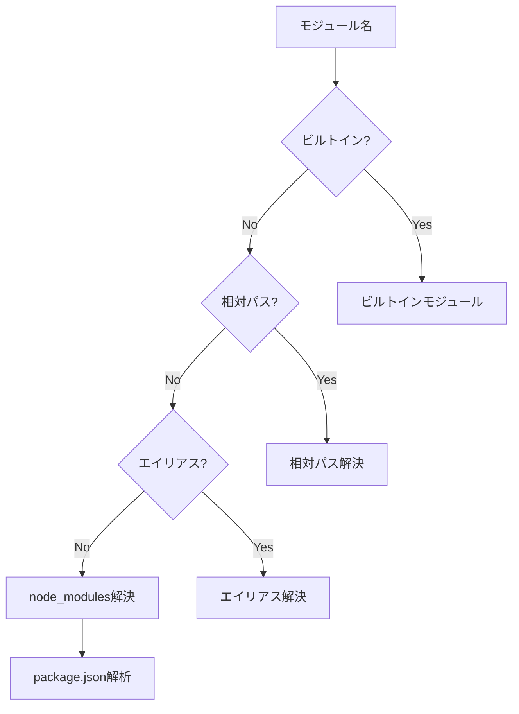

**パス解決例**:

| 入力 | 解決結果 |
|------|----------|
| `fs` | ビルトインモジュール |
| `./utils` | `/projects/my-app/src/utils.js` |
| `../config` | `/projects/my-app/config.js` |
| `@/components/Button` | `/projects/my-app/src/components/Button.js` |
| `lodash` | `/projects/my-app/node_modules/lodash/lodash.js` |
| `@vue/runtime-core` | `/projects/my-app/node_modules/@vue/runtime-core/dist/runtime-core.esm-bundler.js` |

**package.json解析**:

解決順序:
1. `module` フィールド（ES Module優先）
2. `main` フィールド（CommonJS）
3. `exports` フィールド（条件付きエクスポート）
4. `index.js` フォールバック

---

### 4. TranspileManager & Web Worker

**役割**: babel standaloneによる高速トランスパイル

**責務**:
- Web Workerの作成と管理
- babel standaloneの初期化
- トランスパイルリクエストの処理
- 自動メモリ管理

**Worker処理フロー**:

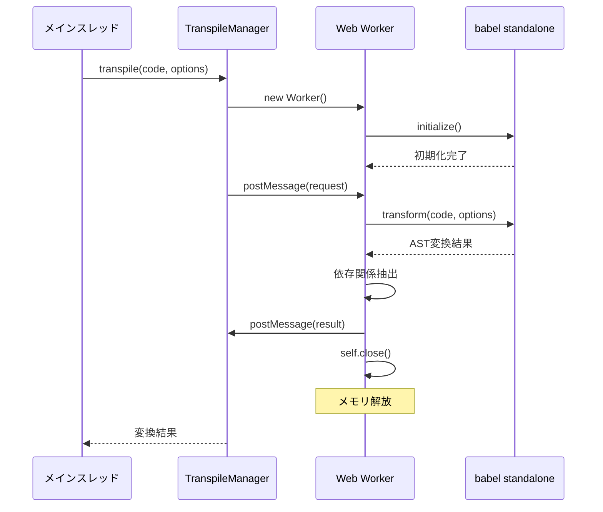

**SWC設定**:

| 設定項目 | 値 | 説明 |
|---------|-----|------|
| parser.syntax | typescript / ecmascript | 構文解析モード |
| parser.tsx | true | JSX/TSXサポート |
| jsc.target | es2020 | 出力ターゲット |
| module.type | commonjs | モジュール形式 |
| transform.react.runtime | automatic | React 17+自動ランタイム |

**メモリ管理**:
- トランスパイル完了後、即座にWorkerを終了
- babel standaloneのヒープはWorker内に隔離
- メインスレッドのメモリに影響なし

---

### 5. ModuleCache

**役割**: トランスパイル済みモジュールの永続キャッシュ

**責務**:
- LRU戦略によるキャッシュ管理
- IndexedDBへの永続化
- 自動GC（100MB超過時）
- メタデータ管理

**キャッシュ構造**:

```
/cache/
├── modules/              トランスパイル済みコード
│   ├── abc123.js
│   ├── def456.js
│   └── ...
└── meta/                 メタデータ
    ├── abc123.json
    ├── def456.json
    └── ...
```

**メタデータ形式**:

| フィールド | 説明 |
|-----------|------|
| originalPath | 元のファイルパス |
| hash | キャッシュキー |
| code | トランスパイル済みコード（メモリのみ） |
| deps | 依存モジュールリスト |
| mtime | 変換日時 |
| lastAccess | 最終アクセス日時 |
| size | コードサイズ |

**GC戦略**:

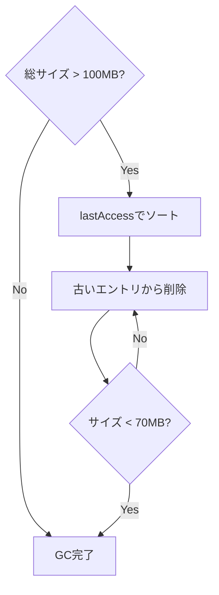

---

## データフロー詳細

### モジュール読み込みの完全フロー

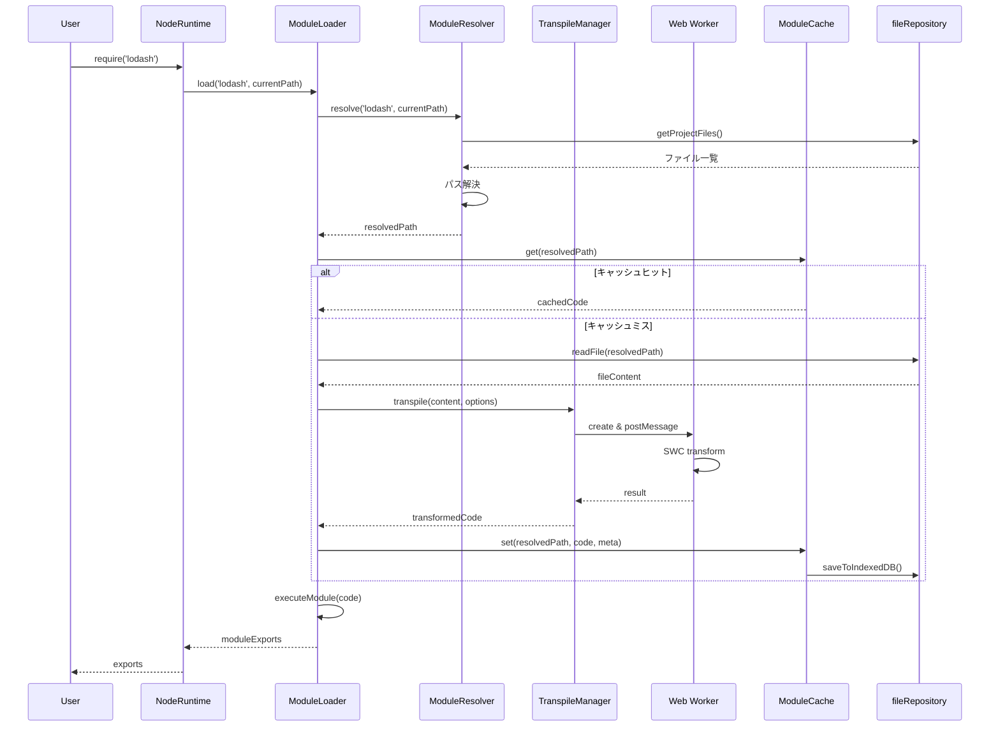

### トランスパイル詳細フロー

**ステップ1: 言語判定**

入力: ファイルパスとコード内容

判定基準:
- 拡張子: `.ts`, `.tsx`, `.mts`, `.cts` → TypeScript
- 拡張子: `.jsx`, `.tsx` → JSX
- 拡張子: `.mjs`, `.mts` → ES Module
- コード内容: `import`/`export`構文あり → ES Module

**ステップ2: SWC設定構築**

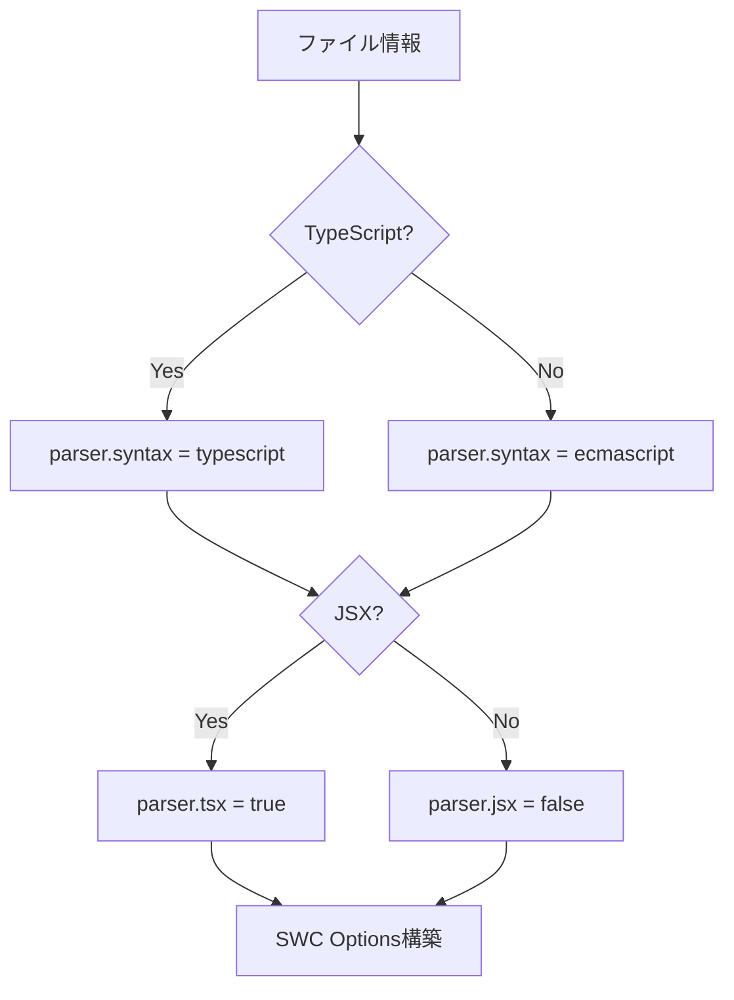

**ステップ3: AST変換**

babel standaloneによる処理:
1. コードをASTに解析
2. 型アノテーションを削除（TypeScript）
3. JSXをReact.createElement呼び出しに変換
4. ES Module構文をCommonJSに変換
5. 依存関係を抽出
6. 最適化されたコードを生成

**ステップ4: 結果キャッシュ**

メモリとディスクの2層キャッシュ:
- メモリ: 即座にアクセス可能
- ディスク: 永続化、次回起動時に復元

---

## パフォーマンス特性

### 初回実行

| フェーズ | 時間 | 説明 |
|---------|------|------|
| ファイル読み込み | ~10ms | IndexedDBから取得 |
| SWC初期化 | ~100-200ms | 初回のみ、Workerで実行 |
| トランスパイル | ~50-100ms | AST変換 |
| キャッシュ保存 | ~5ms | IndexedDBへ非同期保存 |
| モジュール実行 | ~10ms | サンドボックス内実行 |
| **合計** | **~175-325ms** | |

### 2回目以降（キャッシュヒット）

| フェーズ | 時間 | 説明 |
|---------|------|------|
| キャッシュ読み込み | ~5ms | メモリから取得 |
| モジュール実行 | ~10ms | サンドボックス内実行 |
| **合計** | **~15ms** | **約20倍高速** |

### メモリ使用量


**メモリフットプリント**: 常時50-70MB（LRU GCにより一定）

---

## ビルトインモジュール

### サポートモジュール一覧

| モジュール | 実装状態 | 説明 |
|-----------|---------|------|
| `fs` | ✅ 完全 | ファイルシステム操作（IndexedDB） |
| `fs/promises` | ✅ 完全 | Promise版FS API |
| `path` | ✅ 完全 | パス操作ユーティリティ |
| `os` | ✅ 完全 | OS情報（ブラウザ環境） |
| `util` | ✅ 完全 | ユーティリティ関数 |
| `http` | ✅ 完全 | HTTP通信（fetch wrapper） |
| `https` | ✅ 完全 | HTTPS通信 |
| `buffer` | ✅ 完全 | Buffer API |
| `readline` | ✅ 完全 | 対話的入力 |
| その他 | 📝 計画中 | stream, events, crypto等 |

### fsモジュール実装

**設計方針**: IndexedDBを唯一の真実の源とする

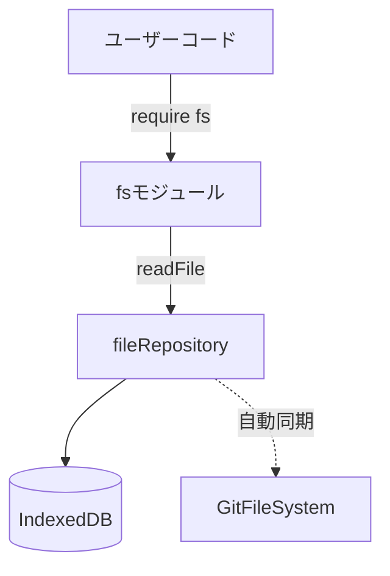

**主要API**:

| API | 説明 | 実装 |
|-----|------|------|
| `readFile` | ファイル読み込み | fileRepository経由 |
| `writeFile` | ファイル書き込み | fileRepository経由、自動同期 |
| `readdir` | ディレクトリ一覧 | fileRepository経由 |
| `stat` | ファイル情報取得 | fileRepository経由 |
| `mkdir` | ディレクトリ作成 | fileRepository経由 |
| `unlink` | ファイル削除 | fileRepository経由、自動同期 |

---

## npm packages対応

### インストール済みパッケージの使用

**前提**: npm installは別システムで完了済み（node_modules/に配置）

**解決フロー**:

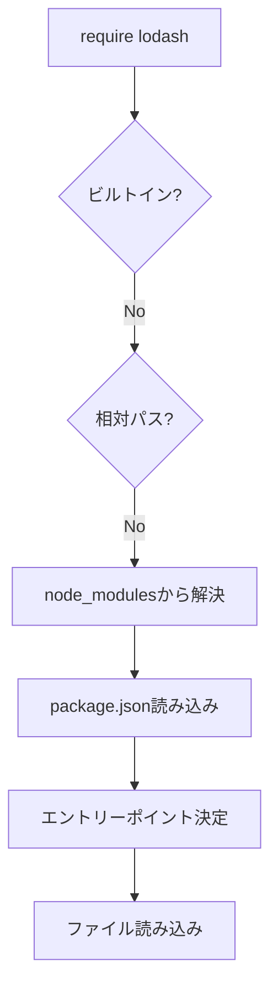

**package.json解析例**:

パッケージ: `lodash`
```
node_modules/lodash/package.json:
{
  "name": "lodash",
  "version": "4.17.21",
  "main": "lodash.js"
}

→ 解決: /node_modules/lodash/lodash.js
```

パッケージ: `@vue/runtime-core`
```
node_modules/@vue/runtime-core/package.json:
{
  "name": "@vue/runtime-core",
  "version": "3.3.4",
  "module": "dist/runtime-core.esm-bundler.js",
  "main": "index.js"
}

→ 解決: /node_modules/@vue/runtime-core/dist/runtime-core.esm-bundler.js
```

### サブパス解決

| require呼び出し | 解決パス |
|----------------|----------|
| `lodash` | `/node_modules/lodash/lodash.js` |
| `lodash/merge` | `/node_modules/lodash/merge.js` |
| `@vue/runtime-core` | `/node_modules/@vue/runtime-core/dist/runtime-core.esm-bundler.js` |
| `@vue/runtime-core/dist/runtime-core.esm-bundler.js` | 同上 |

---

## エラーハンドリング

### エラーの種類と対処

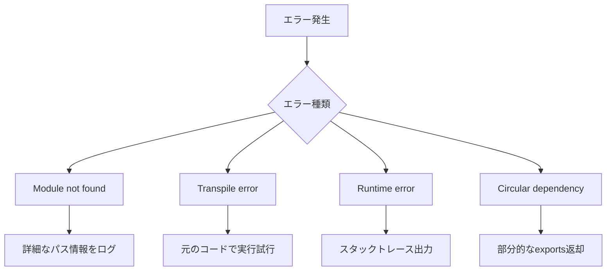

**エラーメッセージ例**:

1. モジュール未発見:
```
❌ Failed to load module: lodash
Cannot find module 'lodash'

チェック項目:
- ファイルがIndexedDBに存在するか
- npm installが完了しているか
- パスが正しいか
```

2. トランスパイルエラー:
```
❌ Transpile failed: /src/app.tsx
SyntaxError: Unexpected token

⚠️ Using original code without transpilation
```

3. 循環参照:
```
⚠️ Circular dependency detected: /src/a.js
→ /src/b.js
→ /src/a.js

部分的にロード済みのexportsを返します
```

---

## 設計の背景と理由

### なぜbabel standaloneを選択したか

**比較検討**:

| 選択肢 | メリット | デメリット | 判断 |
|-------|---------|-----------|------|
| 正規表現 | 軽量、簡単 | 不正確、複雑な構文に非対応 | ❌ |
| Babel | 強力、プラグイン豊富 | 重い、バンドルサイズ大 | ❌ |
| TypeScript Compiler | 公式、正確 | 重い、ブラウザ非対応 | ❌ |
| babel standalone | 高速、正確、軽量 | WebAssembly必須 | ✅ |

**決定理由**:
- Rustベースで高速
- wasmでブラウザ動作
- AST変換で正確
- バンドルサイズ小（~2MB）

### なぜWeb Workerを使用するか

**メインスレッドでの問題**:
- トランスパイルに50-100ms
- UI処理がブロック
- メモリ使用量が増加

**Worker使用のメリット**:
- メインスレッド非ブロック
- 並列処理可能
- 完了後、即座にメモリ解放
- babel standaloneヒープの隔離

### なぜ3層キャッシュか

**各層の役割**:

1. **実行キャッシュ**: 循環参照対策、即座にアクセス
2. **メモリキャッシュ**: トランスパイル結果、高速アクセス
3. **IndexedDBキャッシュ**: 永続化、再起動時も有効

**メリット**:
- 初回: ~200ms
- 2回目: ~15ms（約13倍高速）
- 再起動後: ~20ms（ディスクキャッシュ）

### なぜIndexedDBを唯一の真実とするか

**設計原則**:
- データの一貫性を保証
- 単一の書き込み先
- 自動同期でGitFileSystemと連携

**データフロー**:
```
ユーザー操作
  ↓
fileRepository (IndexedDB)
  ↓
自動同期（バックグラウンド）
  ↓
GitFileSystem (lightning-fs)
```

---

## 使用例とベストプラクティス

### 基本的な使用

**TypeScriptファイル実行**:
```typescript
import { executeNodeFile } from '@/engine/runtime/nodeRuntime';

await executeNodeFile({
  projectId: 'proj_123',
  projectName: 'my-app',
  filePath: '/src/index.ts',
  debugConsole: console,
});
```

**npm packageの使用**:
```typescript
// ユーザーコード
const lodash = require('lodash');
const result = lodash.map([1, 2, 3], x => x * 2);
console.log(result); // [2, 4, 6]
```

**ES Moduleの使用**:
```typescript
// ユーザーコード (自動的にCommonJSに変換)
import { map } from 'lodash';
export const double = (arr) => map(arr, x => x * 2);
```

### ベストプラクティス

**推奨**:
- ✅ fileRepositoryでファイル操作
- ✅ 相対パスで自作モジュールを参照
- ✅ package.jsonでnpm packagesを管理
- ✅ TypeScriptで型安全に開発

**非推奨**:
- ❌ gitFileSystemへの直接書き込み
- ❌ グローバル変数の多用
- ❌ 巨大なファイルの同期読み込み
- ❌ メモリリークを起こす循環参照

---

## トラブルシューティング

### よくある問題

**問題1: モジュールが見つからない**

症状:
```
Cannot find module 'xxx'
```

原因と対処:
- npm installが未完了 → npm install実行
- パスが間違っている → 相対パスを確認
- IndexedDBに存在しない → ファイルを作成

**問題2: トランスパイルが遅い**

症状: 初回実行が数秒かかる

原因と対処:
- SWC初期化に時間がかかる（初回のみ）
- 大量のファイルを読み込んでいる → 必要最小限に
- キャッシュが効いていない → 2回目以降は高速化

**問題3: メモリ不足**

症状: ブラウザが重くなる

原因と対処:
- キャッシュが溜まりすぎ → 自動GCが動作、70MBまで削減
- 循環参照によるリーク → コード設計を見直し
- 大量のWorker起動 → 同時実行数を制限（将来実装）

---

## 今後の拡張計画

### 短期（1-2ヶ月）

- [ ] Source Map統合
- [ ] Workerプール（並列トランスパイル）
- [ ] エラーメッセージの改善
- [ ] デバッガー統合

### 中期（3-6ヶ月）

- [ ] Hot Module Replacement
- [ ] より多くのビルトインモジュール
- [ ] パフォーマンス最適化
- [ ] プラグインシステム

### 長期（6ヶ月以上）

- [ ] WebContainerとの統合検討
- [ ] ネイティブアプリ対応（Tauri）
- [ ] 分散キャッシュシステム
- [ ] AI支援デバッグ

---

## 参考資料

### 関連ドキュメント

- [CORE-ENGINE.md](./CORE-ENGINE.md) - コアエンジンの設計
- [DATA-FLOW.md](./DATA-FLOW.md) - データフロー全体像
- [src/engine/runtime/README.md](../src/engine/runtime/README.md) - 実装詳細
- [src/engine/runtime/ARCHITECTURE.md](../src/engine/runtime/ARCHITECTURE.md) - アーキテクチャ詳細

### 外部リンク

- [SWC Documentation](https://swc.rs/)
- [Web Workers API](https://developer.mozilla.org/en-US/docs/Web/API/Web_Workers_API)
- [IndexedDB API](https://developer.mozilla.org/en-US/docs/Web/API/IndexedDB_API)
- [Node.js Built-in Modules](https://nodejs.org/api/)

---

**最終更新**: 2025-10-04  
**バージョン**: 3.0  
**ステータス**: ✅ babel standalone統合完了
