# Node.js Runtime - Browser Implementation

このドキュメントでは、Pyxis CodeCanvasのブラウザ内Node.js実行環境の実装、アーキテクチャ、動作フローについて詳細に説明します。

---

## 1. Node Runtime Overview

Node Runtimeは、ブラウザ内でNode.jsコードを実行するための独自実装です。

### 1.1 Architecture

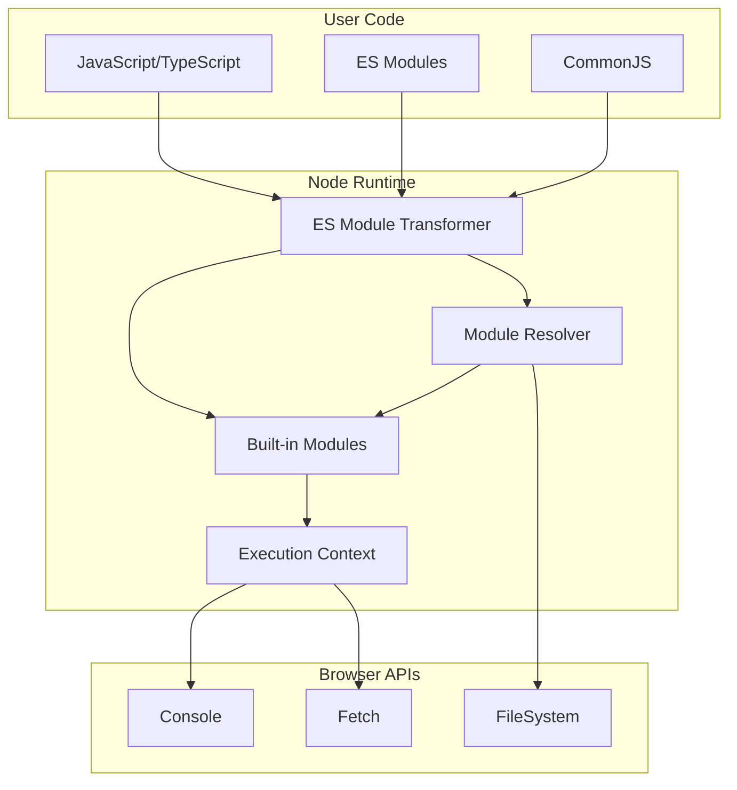
```mermaid
graph TB
    subgraph User Code
        A[JavaScript/TypeScript]
        B[ES Modules]
        C[CommonJS]
    end
    
    subgraph Node Runtime
        D[ES Module Transformer]
        E[Built-in Modules]
        F[Module Resolver]
        G[Execution Context]
    end
    
    subgraph Browser APIs
        H[FileSystem]
        I[Console]
        J[Fetch]
    end
    
    A --> D
    B --> D
    C --> D
    
    D --> E
    D --> F
    F --> E
    F --> H
    
    E --> G
    G --> I
    G --> J
```

### 1.2 Key Components

| Component | File | Purpose |
|-----------|------|---------|
| **ES Module Transformer** | esModuleTransformer.ts | Convert ES6 to CommonJS |
| **Built-in Modules** | builtInModule.ts | Emulate Node.js core modules |
| **Module Resolver** | modules/* | Dynamic module loading |
| **Runtime Context** | Used in components | Execution environment |

---

## 2. ES Module Transformer

### 2.1 Transformation Process

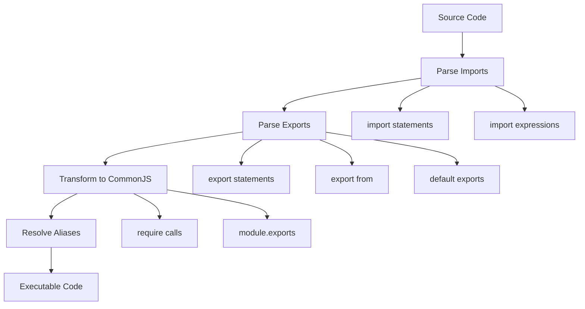
```mermaid
graph TB
    A[Source Code] --> B[Parse Imports]
    B --> C[Parse Exports]
    C --> D[Transform to CommonJS]
    D --> E[Resolve Aliases]
    E --> F[Executable Code]
    
    B --> B1[import statements]
    B --> B2[import expressions]
    
    C --> C1[export statements]
    C --> C2[export from]
    C --> C3[default exports]
    
    D --> D1[require calls]
    D --> D2[module.exports]
```

### 2.2 Import Transformations

**Import Types and Transformations:**

| ES6 Syntax | CommonJS Output | Notes |
|------------|-----------------|-------|
| `import X from 'mod'` | `const X = require('mod')` | Default import |
| `import { a, b } from 'mod'` | `const { a, b } = require('mod')` | Named imports |
| `import * as M from 'mod'` | `const M = require('mod')` | Namespace import |
| `import 'mod'` | `require('mod')` | Side-effect import |
| `import('#/alias')` | Resolved path | Alias resolution |

**Transformation Flow:**

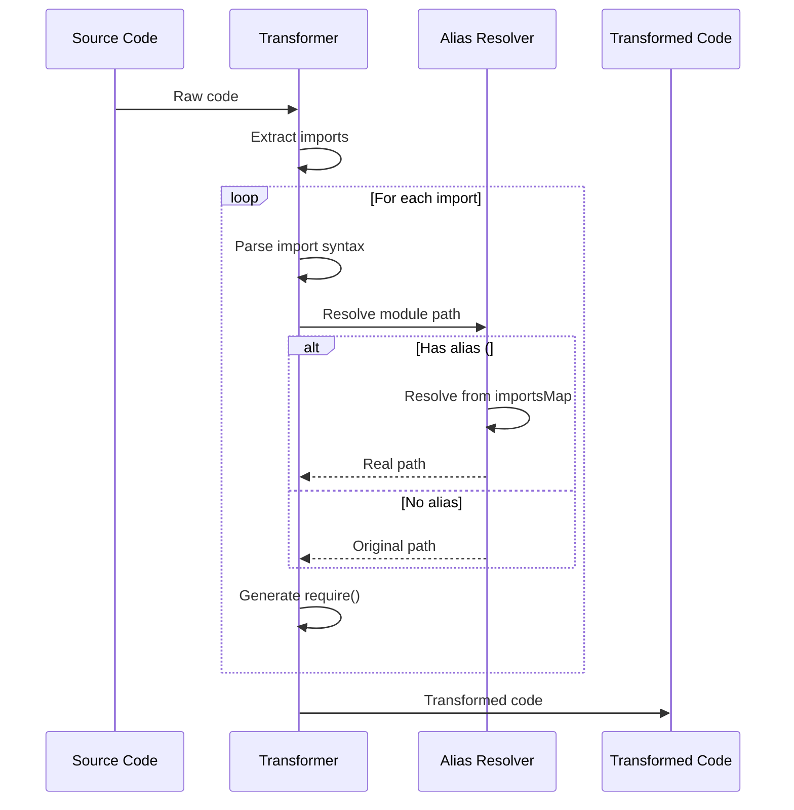
```mermaid
sequenceDiagram
    participant CODE as Source Code
    participant TRANS as Transformer
    participant RESOLVER as Alias Resolver
    participant OUTPUT as Transformed Code

    CODE->>TRANS: Raw code
    TRANS->>TRANS: Extract imports
    
    loop For each import
        TRANS->>TRANS: Parse import syntax
        TRANS->>RESOLVER: Resolve module path
        
        alt Has alias (#/)
            RESOLVER->>RESOLVER: Resolve from importsMap
            RESOLVER-->>TRANS: Real path
        else No alias
            RESOLVER-->>TRANS: Original path
        end
        
        TRANS->>TRANS: Generate require()
    end
    
    TRANS->>OUTPUT: Transformed code
```

### 2.3 Export Transformations

**Export Types and Transformations:**

| ES6 Syntax | CommonJS Output | Notes |
|------------|-----------------|-------|
| `export default X` | `module.exports.default = X` | Default export |
| `export { a, b }` | `module.exports.a = a; module.exports.b = b` | Named exports |
| `export const x = 1` | `const x = 1; module.exports.x = x` | Inline export |
| `export * from 'mod'` | `Object.assign(module.exports, require('mod'))` | Re-export all |
| `export { x } from 'mod'` | `module.exports.x = require('mod').x` | Re-export named |

**Transformation Examples:**

Before:
```javascript
import React from 'react'
import { useState } from 'react'
import * as utils from './utils'

export default function App() {}
export const VERSION = '1.0'
```

After:
```javascript
const React = require('react')
const { useState } = require('react')
const utils = require('./utils')

function App() {}
module.exports.default = App
const VERSION = '1.0'
module.exports.VERSION = VERSION
```

---

## 3. Built-in Modules

### 3.1 Module Emulation Architecture

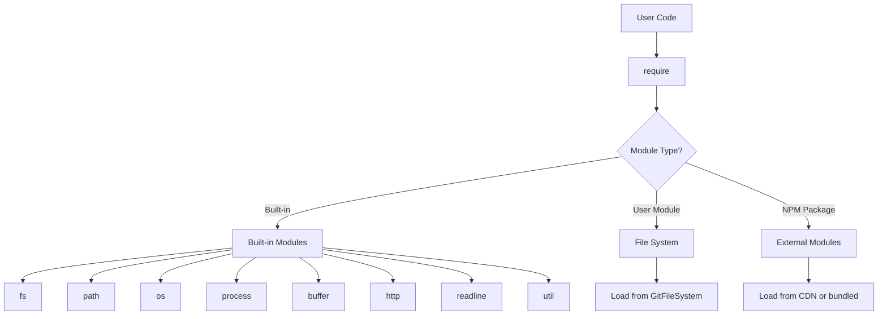
```mermaid
graph TB
    A[User Code] --> B[require]
    B --> C{Module Type?}
    
    C -->|Built-in| D[Built-in Modules]
    C -->|User Module| E[File System]
    C -->|NPM Package| F[External Modules]
    
    D --> D1[fs]
    D --> D2[path]
    D --> D3[os]
    D --> D4[process]
    D --> D5[buffer]
    D --> D6[http]
    D --> D7[readline]
    D --> D8[util]
    
    E --> G[Load from GitFileSystem]
    F --> H[Load from CDN or bundled]
```

### 3.2 Core Module Implementations

#### fs (File System)

**Provided APIs:**

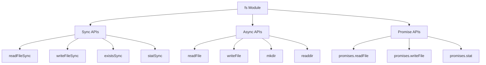
```mermaid
graph TB
    A[fs Module] --> B[Sync APIs]
    A --> C[Async APIs]
    A --> D[Promise APIs]
    
    B --> B1[readFileSync]
    B --> B2[writeFileSync]
    B --> B3[existsSync]
    B --> B4[statSync]
    
    C --> C1[readFile]
    C --> C2[writeFile]
    C --> C3[mkdir]
    C --> C4[readdir]
    
    D --> D1[promises.readFile]
    D --> D2[promises.writeFile]
    D --> D3[promises.stat]
```

**Implementation Strategy:**

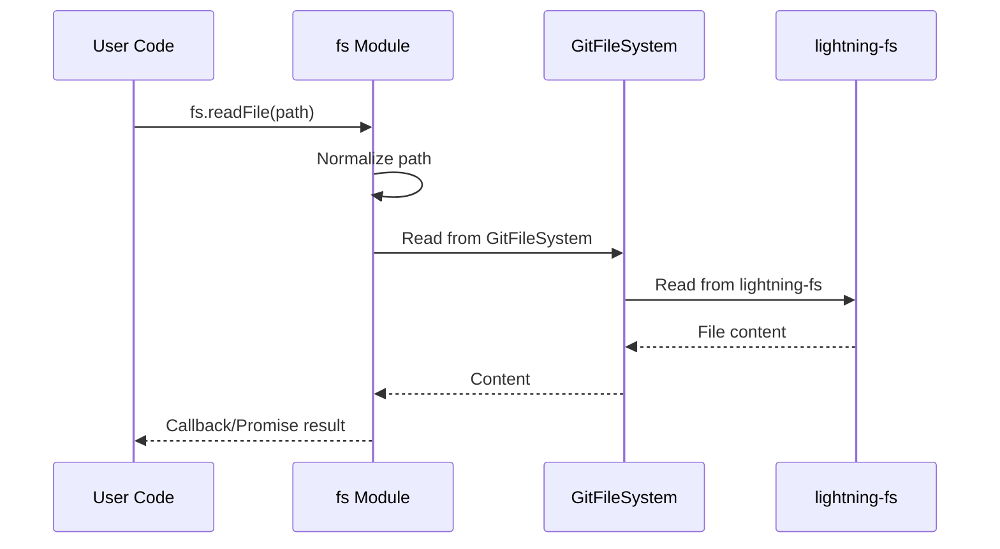
```mermaid
sequenceDiagram
    participant CODE as User Code
    participant FS_MODULE as fs Module
    participant GFS as GitFileSystem
    participant LFS as lightning-fs

    CODE->>FS_MODULE: fs.readFile(path)
    FS_MODULE->>FS_MODULE: Normalize path
    FS_MODULE->>GFS: Read from GitFileSystem
    GFS->>LFS: Read from lightning-fs
    LFS-->>GFS: File content
    GFS-->>FS_MODULE: Content
    FS_MODULE-->>CODE: Callback/Promise result
```

**Supported Operations:**

| Operation | Sync | Async | Promises | Description |
|-----------|------|-------|----------|-------------|
| Read | ✅ | ✅ | ✅ | Read file contents |
| Write | ✅ | ✅ | ✅ | Write file contents |
| Append | ✅ | ✅ | ✅ | Append to file |
| Delete | ✅ | ✅ | ✅ | Remove file |
| Exists | ✅ | ✅ | ✅ | Check file existence |
| Stat | ✅ | ✅ | ✅ | Get file metadata |
| Mkdir | ✅ | ✅ | ✅ | Create directory |
| Readdir | ✅ | ✅ | ✅ | List directory |

#### path Module

**Path Operations:**

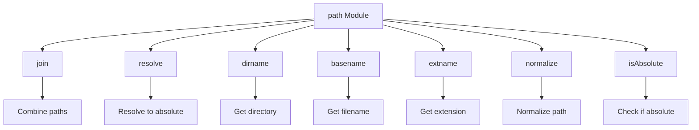
```mermaid
graph TB
    A[path Module] --> B[join]
    A --> C[resolve]
    A --> D[dirname]
    A --> E[basename]
    A --> F[extname]
    A --> G[normalize]
    A --> H[isAbsolute]
    
    B --> I[Combine paths]
    C --> J[Resolve to absolute]
    D --> K[Get directory]
    E --> L[Get filename]
    F --> M[Get extension]
    G --> N[Normalize path]
    H --> O[Check if absolute]
```

**Cross-Platform Handling:**

| Function | Unix Input | Windows Input | Output |
|----------|------------|---------------|--------|
| join | 'a', 'b', 'c' | 'a', 'b', 'c' | 'a/b/c' |
| resolve | './file' | '.\\file' | '/current/dir/file' |
| normalize | 'a/../b' | 'a\\..\\b' | 'b' |

#### process Module

**Process Object:**

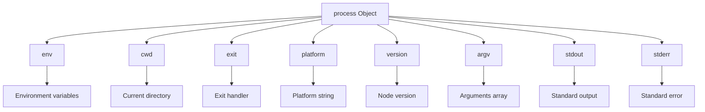
```mermaid
graph TB
    A[process Object] --> B[env]
    A --> C[cwd]
    A --> D[exit]
    A --> E[platform]
    A --> F[version]
    A --> G[argv]
    A --> H[stdout]
    A --> I[stderr]
    
    B --> B1[Environment variables]
    C --> C1[Current directory]
    D --> D1[Exit handler]
    E --> E1[Platform string]
    F --> F1[Node version]
    G --> G1[Arguments array]
    H --> H1[Standard output]
    I --> I1[Standard error]
```

**Implementation Details:**

| Property | Value | Description |
|----------|-------|-------------|
| `platform` | 'browser' | Platform identifier |
| `version` | 'v16.0.0' | Emulated Node version |
| `cwd()` | '/projects/[name]' | Current working directory |
| `env` | {} | Environment variables |
| `argv` | ['node', 'script.js'] | Command-line args |

#### os Module

**OS Information:**

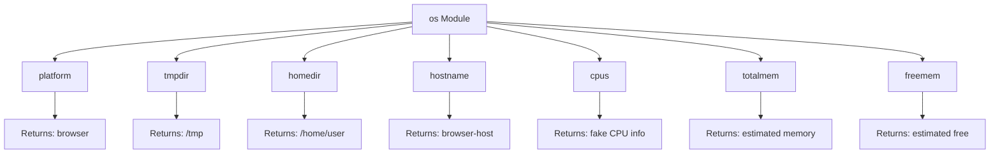
```mermaid
graph TB
    A[os Module] --> B[platform]
    A --> C[tmpdir]
    A --> D[homedir]
    A --> E[hostname]
    A --> F[cpus]
    A --> G[totalmem]
    A --> H[freemem]
    
    B --> B1[Returns: browser]
    C --> C1[Returns: /tmp]
    D --> D1[Returns: /home/user]
    E --> E1[Returns: browser-host]
    F --> F1[Returns: fake CPU info]
    G --> G1[Returns: estimated memory]
    H --> H1[Returns: estimated free]
```

#### Other Modules

**Additional Built-in Modules:**

| Module | Purpose | Key APIs |
|--------|---------|----------|
| **buffer** | Binary data handling | Buffer.from, Buffer.alloc |
| **http** | HTTP client | request, get |
| **readline** | Line-by-line input | createInterface, question |
| **util** | Utility functions | promisify, inspect, format |

> **注意**: events, stream, crypto, url, querystringは現在未実装です。

---

## 4. Module Resolution

### 4.1 Resolution Strategy

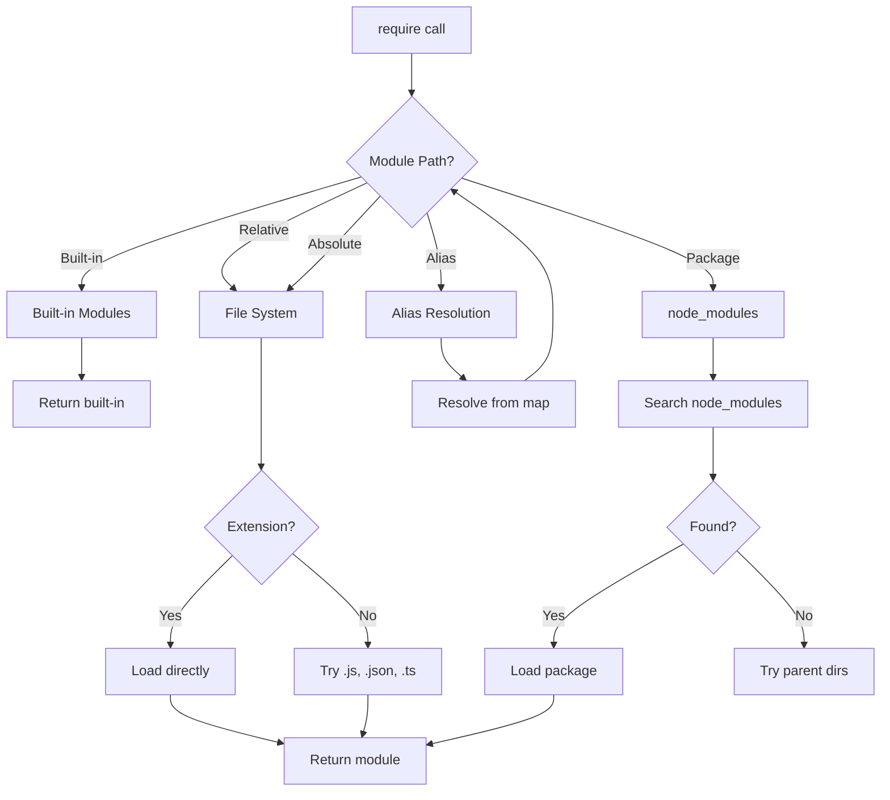
```mermaid
graph TB
    A[require call] --> B{Module Path?}
    
    B -->|Built-in| C[Built-in Modules]
    B -->|Relative| D[File System]
    B -->|Absolute| D
    B -->|Package| E[node_modules]
    B -->|Alias| F[Alias Resolution]
    
    C --> G[Return built-in]
    
    D --> H{Extension?}
    H -->|Yes| I[Load directly]
    H -->|No| J[Try .js, .json, .ts]
    
    E --> K[Search node_modules]
    K --> L{Found?}
    L -->|Yes| M[Load package]
    L -->|No| N[Try parent dirs]
    
    F --> O[Resolve from map]
    O --> B
    
    I --> P[Return module]
    J --> P
    M --> P
```

### 4.2 Module Cache

**Cache Management:**

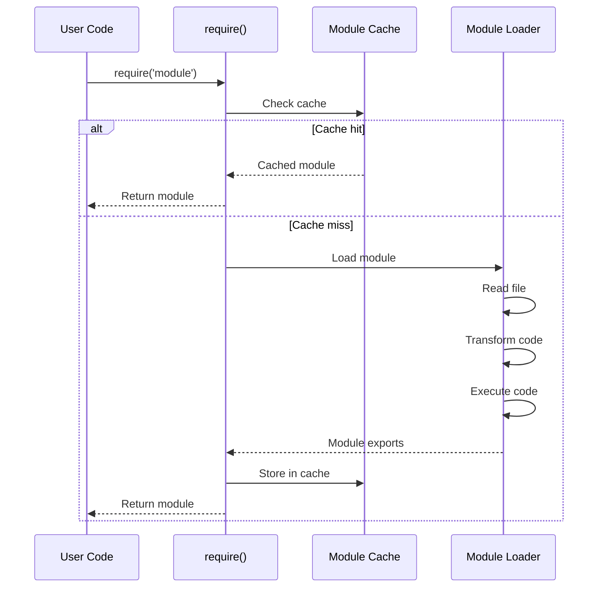
```mermaid
sequenceDiagram
    participant CODE as User Code
    participant REQUIRE as require()
    participant CACHE as Module Cache
    participant LOADER as Module Loader

    CODE->>REQUIRE: require('module')
    REQUIRE->>CACHE: Check cache
    
    alt Cache hit
        CACHE-->>REQUIRE: Cached module
        REQUIRE-->>CODE: Return module
    else Cache miss
        REQUIRE->>LOADER: Load module
        LOADER->>LOADER: Read file
        LOADER->>LOADER: Transform code
        LOADER->>LOADER: Execute code
        LOADER-->>REQUIRE: Module exports
        REQUIRE->>CACHE: Store in cache
        REQUIRE-->>CODE: Return module
    end
```

**Cache Invalidation:**

- Manual: `delete require.cache[path]`
- Hot reload: Clear cache on file change
- Project switch: Clear entire cache

---

## 5. Execution Context

### 5.1 Runtime Environment

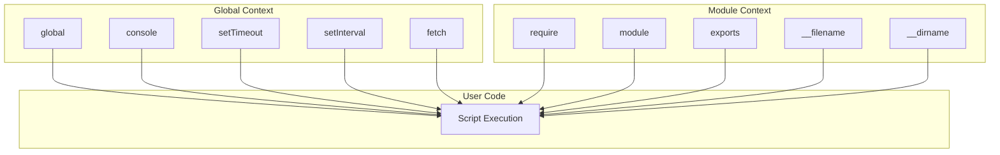
```mermaid
graph TB
    subgraph Global Context
        A[global]
        B[console]
        C[setTimeout]
        D[setInterval]
        E[fetch]
    end
    
    subgraph Module Context
        F[require]
        G[module]
        H[exports]
        I[__filename]
        J[__dirname]
    end
    
    subgraph User Code
        K[Script Execution]
    end
    
    A --> K
    B --> K
    C --> K
    D --> K
    E --> K
    
    F --> K
    G --> K
    H --> K
    I --> K
    J --> K
```

### 5.2 Code Execution Flow

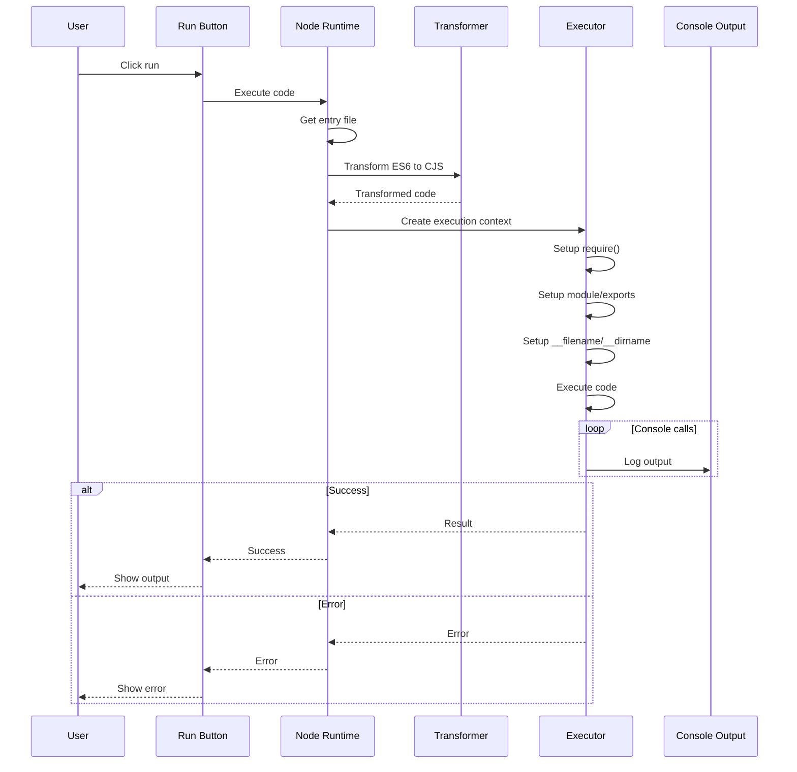
```mermaid
sequenceDiagram
    participant USER as User
    participant UI as Run Button
    participant RUNTIME as Node Runtime
    participant TRANS as Transformer
    participant EXEC as Executor
    participant CONSOLE as Console Output

    USER->>UI: Click run
    UI->>RUNTIME: Execute code
    RUNTIME->>RUNTIME: Get entry file
    RUNTIME->>TRANS: Transform ES6 to CJS
    TRANS-->>RUNTIME: Transformed code
    
    RUNTIME->>EXEC: Create execution context
    EXEC->>EXEC: Setup require()
    EXEC->>EXEC: Setup module/exports
    EXEC->>EXEC: Setup __filename/__dirname
    
    EXEC->>EXEC: Execute code
    
    loop Console calls
        EXEC->>CONSOLE: Log output
    end
    
    alt Success
        EXEC-->>RUNTIME: Result
        RUNTIME-->>UI: Success
        UI-->>USER: Show output
    else Error
        EXEC-->>RUNTIME: Error
        RUNTIME-->>UI: Error
        UI-->>USER: Show error
    end
```

### 5.3 Error Handling

**Error Types:**

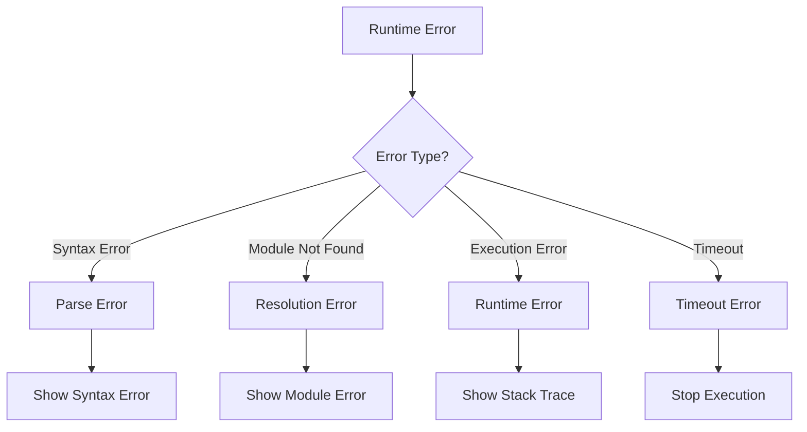
```mermaid
graph TB
    A[Runtime Error] --> B{Error Type?}
    
    B -->|Syntax Error| C[Parse Error]
    B -->|Module Not Found| D[Resolution Error]
    B -->|Execution Error| E[Runtime Error]
    B -->|Timeout| F[Timeout Error]
    
    C --> G[Show Syntax Error]
    D --> H[Show Module Error]
    E --> I[Show Stack Trace]
    F --> J[Stop Execution]
```

**Error Information:**

| Error Type | Information Captured | User Display |
|------------|---------------------|--------------|
| Syntax | Line, column, message | Code editor highlight |
| Module | Module path, require location | File not found message |
| Runtime | Stack trace, error message | Console error output |
| Timeout | Execution time | Timeout warning |

---

## 6. Console Integration

### 6.1 Console Output Capture

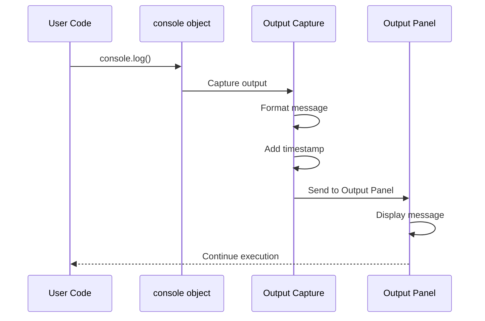
```mermaid
sequenceDiagram
    participant CODE as User Code
    participant CONSOLE as console object
    participant CAPTURE as Output Capture
    participant UI as Output Panel

    CODE->>CONSOLE: console.log()
    CONSOLE->>CAPTURE: Capture output
    CAPTURE->>CAPTURE: Format message
    CAPTURE->>CAPTURE: Add timestamp
    CAPTURE->>UI: Send to Output Panel
    UI->>UI: Display message
    UI-->>CODE: Continue execution
```

### 6.2 Console Methods

**Supported Methods:**

| Method | Function | Output Format |
|--------|----------|---------------|
| `log` | Standard output | Plain text |
| `info` | Information | With info icon |
| `warn` | Warning | Yellow highlight |
| `error` | Error | Red highlight |
| `debug` | Debug info | Muted color |
| `table` | Tabular data | ASCII table |
| `time` / `timeEnd` | Performance timing | Duration in ms |

**Output Formatting:**

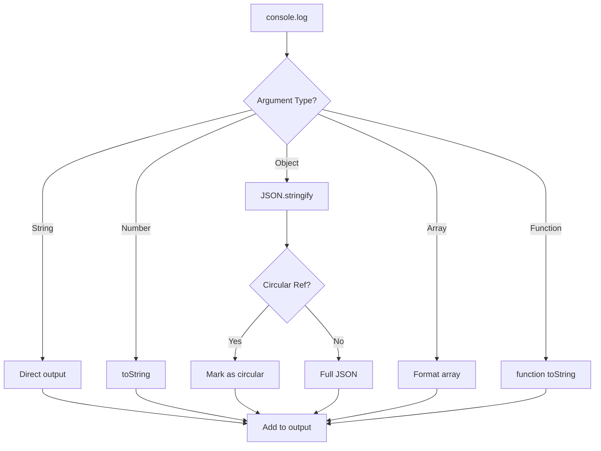
```mermaid
graph TB
    A[console.log] --> B{Argument Type?}
    
    B -->|String| C[Direct output]
    B -->|Number| D[toString]
    B -->|Object| E[JSON.stringify]
    B -->|Array| F[Format array]
    B -->|Function| G[function toString]
    
    E --> E1{Circular Ref?}
    E1 -->|Yes| H[Mark as circular]
    E1 -->|No| I[Full JSON]
    
    C --> J[Add to output]
    D --> J
    H --> J
    I --> J
    F --> J
    G --> J
```

---

## 7. File System Integration

### 7.1 Runtime FS Operations

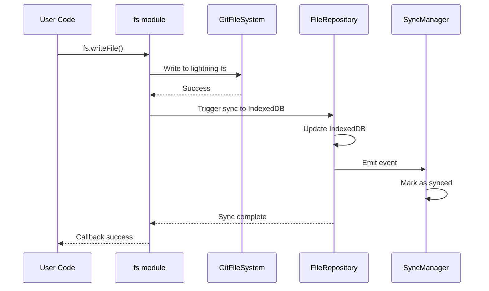
```mermaid
sequenceDiagram
    participant CODE as User Code
    participant FS as fs module
    participant GFS as GitFileSystem
    participant REPO as FileRepository
    participant SYNC as SyncManager

    CODE->>FS: fs.writeFile()
    FS->>GFS: Write to lightning-fs
    GFS-->>FS: Success
    
    FS->>REPO: Trigger sync to IndexedDB
    REPO->>REPO: Update IndexedDB
    REPO->>SYNC: Emit event
    SYNC->>SYNC: Mark as synced
    
    REPO-->>FS: Sync complete
    FS-->>CODE: Callback success
```

### 7.2 Reverse Sync (Runtime → IndexedDB)

**Sync Strategy:**

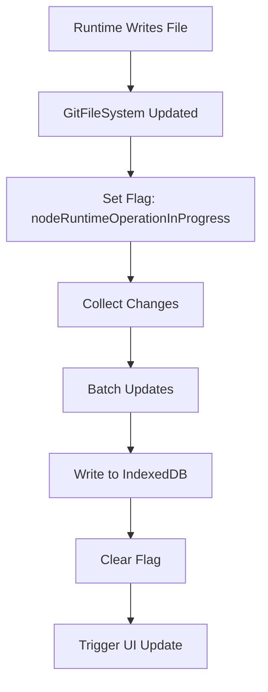
```mermaid
graph TB
    A[Runtime Writes File] --> B[GitFileSystem Updated]
    B --> C[Set Flag: nodeRuntimeOperationInProgress]
    C --> D[Collect Changes]
    D --> E[Batch Updates]
    E --> F[Write to IndexedDB]
    F --> G[Clear Flag]
    G --> H[Trigger UI Update]
```

**Why Reverse Sync?**

- Runtime directly modifies lightning-fs (GitFileSystem)
- IndexedDB must stay synchronized as source of truth
- Avoid UI confusion with outdated file list

---

## 8. NPM Package Support

### 8.1 Package Loading Strategy

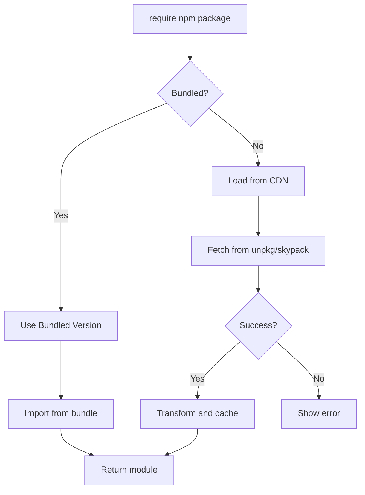
```mermaid
graph TB
    A[require npm package] --> B{Bundled?}
    
    B -->|Yes| C[Use Bundled Version]
    B -->|No| D[Load from CDN]
    
    C --> E[Import from bundle]
    D --> F[Fetch from unpkg/skypack]
    
    F --> G{Success?}
    G -->|Yes| H[Transform and cache]
    G -->|No| I[Show error]
    
    H --> J[Return module]
    E --> J
```

### 8.2 Package Loading

**外部パッケージ読み込み:**

現在、npm packageの動的読み込みは基本実装のみです。
- CDN経由での読み込み機能は限定的
- プロジェクト内のnode_modulesは未サポート

> **注意**: Pre-bundledパッケージやCDN自動読み込みは現在未実装です。

---

## 9. Performance Optimization

### 9.1 Lazy Loading

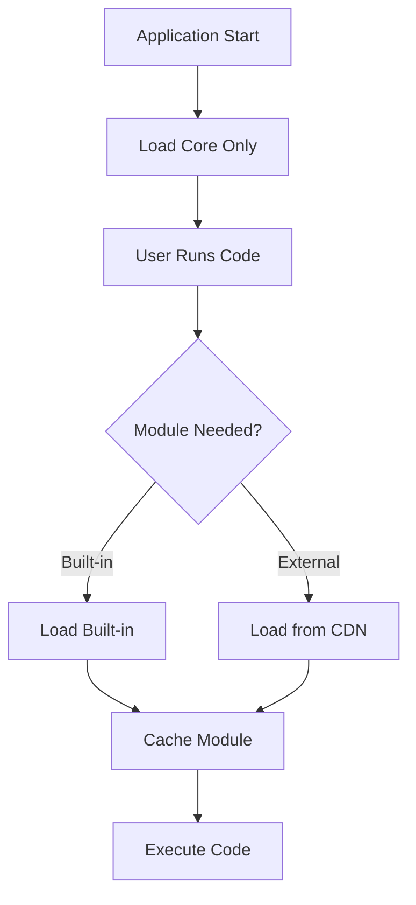
```mermaid
graph TB
    A[Application Start] --> B[Load Core Only]
    B --> C[User Runs Code]
    C --> D{Module Needed?}
    
    D -->|Built-in| E[Load Built-in]
    D -->|External| F[Load from CDN]
    
    E --> G[Cache Module]
    F --> G
    G --> H[Execute Code]
```


---

## 10. Testing and Debugging

現在、専用のテストスイートやデバッグツール、セキュリティサンドボックスは実装されていません。

コード実行は基本的にブラウザの制約に従います:
- ネイティブモジュールは使用不可
- `child_process`は使用不可
- ネットワークサーバーは起動不可
- ファイル操作はプロジェクト内のlightning-fs領域に限定

---

## Related Documents

- [SYSTEM-OVERVIEW.md](./SYSTEM-OVERVIEW.md) - System architecture
- [CORE-ENGINE.md](./CORE-ENGINE.md) - Core engine details
- [UI-COMPONENTS.md](./UI-COMPONENTS.md) - UI components

---

**Last Updated**: 2025-01-23  
**Version**: 0.7  
**Status**: Verified
