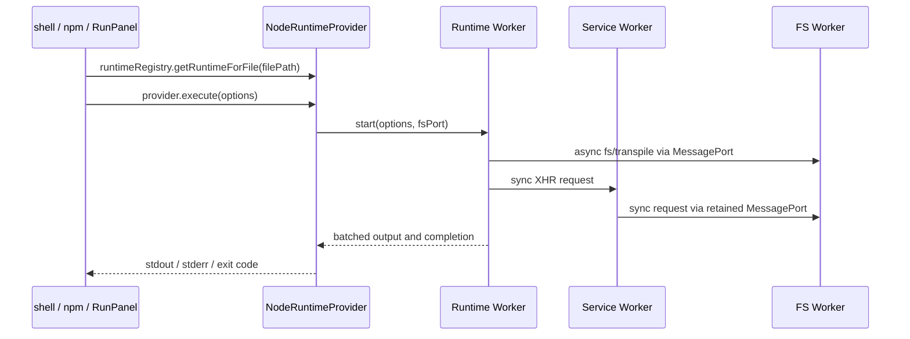

# Node.js Runtime

Pyxisはブラウザ内でNode.js互換コードを実行する。Providerは待機Runtime Workerを1つ先行起動する。実行はそれを再利用し、正常完了したWorkerは待機へ戻る。待機Workerがない状態で同時実行が来た場合はWorkerを必要に応じて起動し、終了後の待機Workerは最大1つに保つ。terminateやWorker内部の予期しない失敗が起きたWorkerは破棄して補充する。module cache、timer、process listener、stdinなどの実行状態は各実行の終了時に破棄する。Workerのglobal scopeに追加された値は次の実行へ残りうる。

## 実行経路

```mermaid
sequenceDiagram
    participant Caller as shell / npm / RunPanel
    participant Provider as NodeRuntimeProvider
    participant RT as Runtime Worker
    participant SW as Service Worker
    participant FS as FS Worker
    Caller->>Provider: runtimeRegistry.getRuntimeForFile(filePath)
    Caller->>Provider: provider.execute(options)
    Provider->>RT: start(options, fsPort)
    RT->>FS: async fs/transpile via MessagePort
    RT->>SW: sync XHR request
    SW->>FS: sync request via retained MessagePort
    RT-->>Provider: batched output and completion
    Provider-->>Caller: stdout / stderr / exit code
```

`runtimeRegistry`から呼ばれた`NodeRuntimeProvider`がFS Workerのportを取得し、待機Workerを取得して実行を開始する。Runtime Workerはportから`RuntimeFsMount`を作り、必須filesystem依存として各実行の`NodeRuntime`へ渡す。stdout、stderr、console、debugConsoleの出力はWorkerからまとめて送られる。TerminalのCtrl+Cはcatch可能なSIGINTを送り、ハンドラーが処理しない場合やSIGINTが繰り返された場合はWorkerを終了してexit code 130を返す。RunPanelの停止とcomponent unmountはAbortSignalで実行を強制終了し、入れ子のShellExecutorも停止する。

初回起動ではService Workerを登録して更新・activation・controllerを待ち、FS Workerのportを確認する。制御されていない初回ページは一度だけreloadし、次も未制御なら起動エラーを表示する。Service Workerの再起動時は新しいFS portを受け取るまで同期要求を待ち、処理中の旧portは応答が返るまで保持する。再接続には上限時間がある。Service Workerの実装は`src/engine/runtime/bridge/serviceWorker.js`から`setup-build`で`public/sw.js`へbundleされる。

`child_process`経由で起動中のShellExecutorにも中断signalを送り、Runtime Workerの終了時に実行中のshell処理を停止する。

## ファイルとモジュール

FS Workerの`FsCore`がOPFSと揮発性`/tmp`を所有する。Runtime Workerは全fileをpreloadせず、`RuntimeFsMount`を通じてFS Workerに操作を依頼する。

- 非同期file操作とtranspileはRuntime WorkerからFS Workerへ直接MessagePortで送る。
- 同期file操作、動的なrequireのpath解決などは同期XHRでService Workerへ送り、FS Workerのportへ転送する。
- 同期XHRが止めるのはRuntime Workerだけ。UIのmain threadは停止しない。
- Service Workerが再起動してFS Workerのportを失うと、main pageへ新しいportを要求し、受領確認後に処理を再開する。
- `child_process`のshell実行とstdinはmain pageを経由する。

module解決は1つのresolverを使い、非同期の先読みと同期`require`の両方で成功した解決先を実行内に保持する。同期経路は未解決の候補だけをFS Workerへ問い合わせる。通常のCommonJS fileは実行ごとのmodule cacheで一度読み込み、変換済みmoduleの永続cacheはFS Workerが所有する。これらのcacheは用途と寿命が異なり、Runtime Workerに独立したfile Mapは持たない。CommonJSの循環requireはロード途中のpartial exportsを返し、`module.exports`の置換も反映する。CommonJSとESMのnamespace生成も同じ実行内module cacheを使う。`fs`の同期APIも同じbridgeを使う。

module種別はJavaScript parserで判定する。`.mjs` / `.mts`はESM、`.cjs` / `.cts`はCommonJSとして扱い、`.js` / `.ts`は最寄りの`package.json`の`type`に従う。`type`がない場合はsource grammarで判定する。packageの`exports`と`imports`は`import` / `require`などの実行条件とNodeのpath規則で解決する。Function constructorのbodyもparserで解析し、そこにあるimportを同じI/O追跡経路へ渡す。regexでsource構文を推測してmodule種別を決めない。

Node `fs` and shell streams preserve file bytes. `readFile` returns a Buffer unless an encoding is explicitly requested; an encoding such as `utf8`, `hex`, or `base64` converts only at that call. Stdin, stdout, pipes, and redirection retain bytes; terminal rendering is the decoding boundary.

Runtimeの仮想HOMEは`/home/pyxis`。新規workspaceの配置先は`~/<name>`で、module cacheは`~/.cache/pyxis`、npm tarball cacheは`~/.npm`。npm metadataは必要時にregistryから取得し、cacheしない。tarball URLのSHA-256で名前を決めたarchiveだけを展開成功後にcacheする。`/tmp`はFS Worker内の揮発領域で、Node実行をまたいで共有される。

## 計測の再実行

`scripts/bench/node-runtime/`には、同一fixtureをdemo workspaceへseedするmanifestとbrowser runnerがある。Pyxisをagent-browserで開いた状態で、`import('/scripts/bench/node-runtime/run.mjs').then(m => m.measureRuntimeBenchmarks())`を評価すると、5つのJavaScript/TypeScript・dependencyケースと`npm run bench`を各4回実行する。返る`warmSamples`は各caseの2〜4回目。既定の`benchmark: true`は実行ごとのWorker取得、起動、RPC、解決、parse/analyze、transpile metricsを出力へ追加し、`measureRuntimeBenchmarks({ benchmark: false })`は通常実行のwall timeだけを測る。`acquisitionMs`はpool取得開始からWorker ready確認まで、`preparedWorker`は先行起動slotの借用を示す。`workerStartMs`は`start` message送信からWorker handler到着までで、先行起動時間を含まない。以前のconstruct-to-handler計測とは比較できない。sub-ms clock分解能により小さな負値になる場合がある。fixtureのseedとsetup時間は計測wallに含まれない。UI submitとterminal描画も含まれない。最初の計測sampleではbenchmark helperの初回読込がwall timeに入る。結果は開発fixtureでの比較値であり、browser/device一般の性能保証ではない。

## トランスパイル

FS Workerはtranspile要求を一つずつ処理し、必要になったときだけ専用Workerを起動する。poolは1 Workerに固定され、30秒間未使用なら破棄される。後続要求は新しいWorkerを起動する。NodeのJavaScript ESM変換にはesbuildを使い、TypeScriptは登録済み拡張機能の変換設定を同じpoolで実行する。npm installはpackageが配布したfile bytesをそのまま展開し、runtime向け変換は実行時に行う。永続cacheはfile pathと変換入力のSHA-256 hashで検証する。

## 対応範囲

Runtimeは`fs`、`path`、`readline`、`child_process`などのブラウザ内実装を提供する。`child_process`はPyxisのshell機能に接続される。ネイティブNode.js addon、`worker_threads`、完全なOS process環境は提供しない。

## 未検証項目

Safari実機でのOPFS、同期XHR、Service Worker再起動後のport復旧は未検証。page全体400 MB以内のメモリ予算も未計測。確認項目は[Development/TODO.md](../Development/TODO.md)に記録する。
