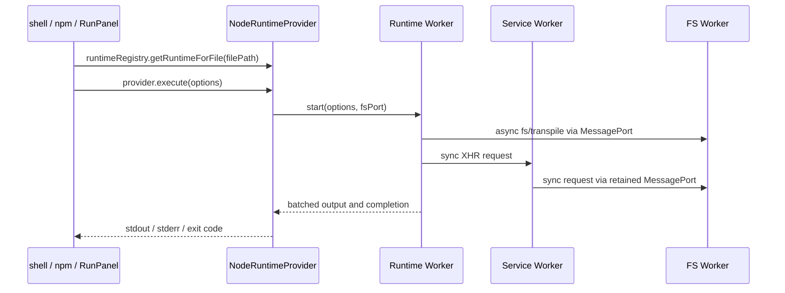

# Node.js Runtime

Pyxisはブラウザ内でNode.js互換コードを実行する。各実行は専用のRuntime Workerで動き、完了後に破棄される。プロセス状態とモジュール状態は実行ごとに初期化される。

## 実行経路

```mermaid
sequenceDiagram
    participant Caller as shell / npm / RunPanel
    participant Provider as NodeRuntimeProvider
    participant RT as Runtime Worker
    participant SW as Service Worker
    participant FS as FS Worker
    Caller->>Provider: runtimeRegistry.getRuntimeForFile(filePath)
    Caller->>Provider: provider.execute(options)
    Provider->>RT: start(options, fsPort)
    RT->>FS: async fs/transpile via MessagePort
    RT->>SW: sync XHR request
    SW->>FS: sync request via retained MessagePort
    RT-->>Provider: batched output and completion
    Provider-->>Caller: stdout / stderr / exit code
```

`runtimeRegistry`から呼ばれた`NodeRuntimeProvider`が実行ごとにWorkerを起動する。stdout、stderr、console、debugConsoleの出力はWorkerからまとめて送られる。TerminalのCtrl+Cはcatch可能なSIGINTを送り、ハンドラーが処理しない場合やSIGINTが繰り返された場合はWorkerを終了してexit code 130を返す。RunPanelの停止とcomponent unmountはAbortSignalで実行を強制終了し、入れ子のShellExecutorも停止する。

初回起動ではService Workerを登録して更新・activation・controllerを待ち、FS Workerのportを確認する。制御されていない初回ページは一度だけreloadし、次も未制御なら起動エラーを表示する。Service Workerの再起動時は新しいFS portを受け取るまで同期要求を待ち、処理中の旧portは応答が返るまで保持する。再接続には上限時間がある。Service Workerの実装は`src/engine/runtime/bridge/serviceWorker.js`から`setup-build`で`public/sw.js`へbundleされる。

`child_process`経由で起動中のShellExecutorにも中断signalを送り、Runtime Workerの終了時に実行中のshell処理を停止する。

## ファイルとモジュール

FS Workerの`FsCore`がOPFSと揮発性`/tmp`を所有する。Runtime Workerは全fileをpreloadせず、`RuntimeFsMount`を通じてFS Workerに操作を依頼する。

- 非同期file操作とtranspileはRuntime WorkerからFS Workerへ直接MessagePortで送る。
- 同期file操作、動的なrequireのpath解決などは同期XHRでService Workerへ送り、FS Workerのportへ転送する。
- 同期XHRが止めるのはRuntime Workerだけ。UIのmain threadは停止しない。
- Service Workerが再起動してFS Workerのportを失うと、main pageへ新しいportを要求し、受領確認後に処理を再開する。
- `child_process`のshell実行とstdinはmain pageを経由する。

静的に見つかる依存モジュールは非同期に先読みする。先読みされていないrequireも同期でpath解決し、FS Workerからfileを読み、必要なら同じ同期経路でtranspileして実行する。CommonJSの循環requireはロード途中のpartial exportsを返し、`module.exports`の置換も反映する。`fs`の同期APIも同じbridgeを使う。

Runtimeの仮想HOMEは`/home/pyxis`。新規workspaceの配置先は`~/<name>`で、module cacheは`~/.cache/pyxis`、npm tarball cacheは`~/.npm`。npm metadataは必要時にregistryから取得し、cacheしない。tarball URLのSHA-256で名前を決めたarchiveだけを展開成功後にcacheする。`/tmp`はFS Worker内の揮発領域で、Node実行をまたいで共有される。

## トランスパイル

FS Workerはtranspile要求を一つずつ処理し、必要になったときだけ専用Workerを起動する。poolは1 Workerに固定され、30秒間未使用なら破棄される。後続要求は新しいWorkerを起動する。NodeのJavaScript ESM変換とnpm installの両経路で行う`.mjs`変換にはesbuildを使い、TypeScriptは登録済み拡張機能の変換設定を同じpoolで実行する。永続cacheはfile pathと変換入力のSHA-256 hashで検証する。

## 対応範囲

Runtimeは`fs`、`path`、`readline`、`child_process`などのブラウザ内実装を提供する。`child_process`はPyxisのshell機能に接続される。ネイティブNode.js addon、`worker_threads`、完全なOS process環境は提供しない。

## 未検証項目

Safari実機でのOPFS、同期XHR、Service Worker再起動後のport復旧は未検証。page全体400 MB以内のメモリ予算も未計測。確認項目は[Development/TODO.md](../Development/TODO.md)に記録する。
