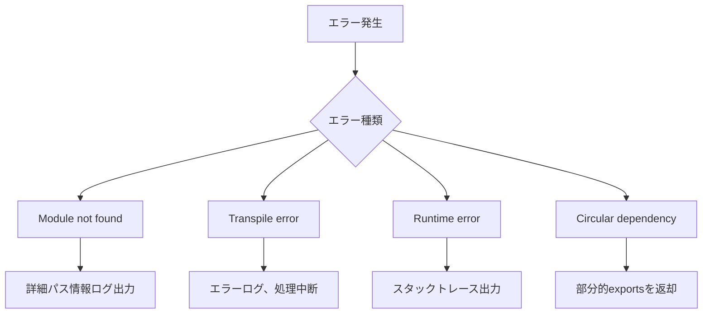

# Node.js Runtime - ブラウザ内JavaScript実行環境

Pyxis CodeCanvasのNode.js Runtimeは、完全にブラウザ環境内で動作するNode.js互換の実行システムです。IndexedDBをストレージとして使用し、Babel standaloneによるトランスパイル、Web Workerによる非同期処理、3層キャッシュシステムを備えています。

---

## システム概要

### 設計目標

1. **完全ブラウザ動作**: サーバー不要、すべてクライアント側で実行
2. **Node.js互換性**: CommonJS require、npm packages、ビルトインモジュール対応
3. **高性能**: Babel standaloneトランスパイル、多層キャッシュによる高速化
4. **非同期設計**: IndexedDB対応のため全モジュール読み込みを非同期化
5. **拡張性**: プラグイン可能な設計

### 主要な特徴

- **Babel standalone統合**: ASTベースの正確なトランスパイル
- **TypeScript/JSX完全対応**: 型情報、Reactランタイム自動変換
- **ES Module ⇔ CommonJS**: 双方向変換、非同期require実装
- **npm packages対応**: node_modules内パッケージの完全サポート
- **ビルトインモジュール**: fs、path、http、readlineなど

---

## アーキテクチャ全体図


---

## コアコンポーネント詳細

### 1. NodeRuntime

システム全体のエントリーポイント。ファイル実行の開始とサンドボックス環境の構築を担当。

#### 主要な責務

- ファイル実行の開始
- サンドボックス環境構築
- グローバルオブジェクト注入
- ビルトインモジュール提供

#### 処理フロー


#### サンドボックス環境の構成要素

| 要素 | 説明 |
|-----|------|
| console | デバッグコンソールへのプロキシ |
| setTimeout / setInterval | ブラウザのタイマーAPI |
| Promise / Array / Object | JavaScriptビルトイン |
| global | グローバルオブジェクト参照 |
| process | Node.jsプロセスオブジェクトエミュレーション |
| Buffer | バイナリデータ操作 |
| __require__ | 非同期モジュール読み込み関数 |

#### 非同期require実装

従来の同期的なrequireをIndexedDB対応のため非同期化：

- `require('module')` → `await __require__('module')`
- トランスパイル時にBabelプラグインで自動変換
- 親関数を自動的にasync化

---

### 2. ModuleLoader

モジュール読み込みとライフサイクル管理の中核コンポーネント。

#### 主要な責務

- モジュール解決の調整
- トランスパイル処理の管理
- 実行キャッシュ管理
- 循環参照検出と対処

#### キャッシュ戦略


#### 実行キャッシュの構造

| フィールド | 型 | 説明 |
|-----------|-----|------|
| exports | unknown | モジュールのexportsオブジェクト |
| loaded | boolean | ロード完了フラグ |
| loading | boolean | ロード中フラグ、循環参照検出に使用 |

#### モジュール実行の詳細

各モジュールは独立した関数スコープで実行：

- `module.exports` オブジェクトを注入
- `__require__` 関数でさらにモジュール読み込み可能
- `__filename` と `__dirname` を提供
- evalで実行し、結果のexportsを返却

#### トランスパイル判定ロジック

以下の条件でトランスパイルを実行：

1. 拡張子が `.ts`, `.tsx`, `.mts`, `.cts`
2. 拡張子が `.jsx`, `.tsx`
3. `import` または `export` 構文を含む
4. `require()` 呼び出しを含む（非同期化のため）

---

### 3. ModuleResolver

Node.js互換のモジュールパス解決システム。

#### 主要な責務

- ビルトインモジュール判定
- 相対パス解決
- node_modules検索
- package.json解析
- exportsフィールド対応

#### 解決優先順位

```mermaid
graph TB
    Start[モジュール名入力]
    BuiltIn{ビルトイン?}
    PackageImports{#で始まる?}
    Relative{相対パス?}
    Alias{@で始まる?}
    NodeMods[node_modules検索]
    
    BuiltInReturn[ビルトインマーカー返却]
    ImportsResolve[package.json imports解決]
    RelativeResolve[相対パス解決]
    AliasResolve[エイリアス解決]
    PkgJSON[package.json解析]
    
    Start --> BuiltIn
    BuiltIn -->|YES| BuiltInReturn
    BuiltIn -->|NO| PackageImports
    PackageImports -->|YES| ImportsResolve
    PackageImports -->|NO| Relative
    Relative -->|YES| RelativeResolve
    Relative -->|NO| Alias
    Alias -->|YES| AliasResolve
    Alias -->|NO| NodeMods
    NodeMods --> PkgJSON
```

#### ビルトインモジュール一覧

fs, fs/promises, path, os, util, http, https, buffer, readline, crypto, stream, events, url, querystring, assert等

#### パス解決の実例

| 入力 | 解決結果 |
|------|----------|
| `fs` | ビルトインマーカー返却 |
| `./utils` | `/projects/my-app/src/utils.js` |
| `../config` | `/projects/my-app/config.ts` |
| `@/components/Button` | `/projects/my-app/src/components/Button.tsx` |
| `lodash` | `/projects/my-app/node_modules/lodash/lodash.js` |
| `@vue/runtime-core` | `/projects/my-app/node_modules/@vue/runtime-core/dist/runtime-core.esm-bundler.js` |
| `#internal/utils` | package.jsonのimportsフィールドから解決 |

#### package.json解析ロジック

エントリーポイント決定の優先順位：

1. `module` フィールド - ES Module版を優先
2. `main` フィールド - CommonJS版
3. `exports` フィールド - 条件付きエクスポート対応
4. `index.js` - フォールバック

#### スコープ付きパッケージ対応

`@vue/runtime-core` のようなスコープ付きパッケージも正しく解決：

- パッケージ名: `@vue/runtime-core`
- サブパス: なし
- package.json位置: `/node_modules/@vue/runtime-core/package.json`

#### 拡張子補完

ファイルパスに拡張子がない場合、以下の順で試行：

1. `.js`, `.mjs`, `.ts`, `.mts`, `.tsx`, `.jsx`, `.json`
2. `/index.js`, `/index.mjs`, `/index.ts`, `/index.mts`, `/index.tsx`

---

### 4. TranspileManager & Web Worker

Babel standaloneを使用した高速トランスパイルシステム。

#### 主要な責務

- Web Workerの作成と管理
- トランスパイルリクエストの処理
- タイムアウト管理（30秒）
- 自動メモリ管理

#### Worker処理フロー


#### Babel設定の構築

| 設定項目 | 条件 | 値 |
|---------|------|-----|
| presets: typescript | isTypeScript=true | TypeScript構文削除 |
| presets: react | isJSX=true | JSX→React.createElement |
| plugins: module-transform | 常に | ES Module/require変換 |
| sourceType | isESModule=true | 'module' または 'script' |

#### 変換プラグインの動作

カスタムBabelプラグイン `babelPluginModuleTransform` で以下を変換：

**import文の変換**

- `import foo from 'bar'` → `const foo = (await __require__('bar')).default || await __require__('bar')`
- `import { named } from 'bar'` → `const named = (await __require__('bar')).named`
- `import * as ns from 'bar'` → `const ns = await __require__('bar')`

**export文の変換**

- `export default foo` → `module.exports.default = foo`
- `export const bar = 1` → `const bar = 1; module.exports.bar = bar`
- `export { baz }` → `module.exports.baz = baz`

**require呼び出しの変換**

- `require('foo')` → `await __require__('foo')`
- 親関数を自動的に `async` 化

#### メモリ管理戦略

- トランスパイル完了後、即座に `self.close()` でWorker終了
- Babel standaloneのヒープはWorker内に隔離
- メインスレッドのメモリに影響なし
- 各リクエストごとに新規Worker作成

---

### 5. ModuleCache

トランスパイル済みコードの永続キャッシュシステム。

#### 主要な責務

- トランスパイル結果の保存
- LRU戦略によるキャッシュ管理
- IndexedDBへの永続化
- 自動GC（100MB超過時）

#### キャッシュ構造

IndexedDB内のディレクトリ構造：

```
/cache/
  ├── modules/
  │     ├── abc123.js
  │     ├── def456.js
  │     └── ...
  └── meta/
        ├── abc123.json
        ├── def456.json
        └── ...
```

#### キャッシュエントリの形式

| フィールド | 型 | 説明 |
|-----------|-----|------|
| originalPath | string | 元のファイルパス |
| hash | string | パスからハッシュ生成したキー |
| code | string | トランスパイル済みコード |
| sourceMap | string | ソースマップ（将来実装） |
| deps | string[] | 依存モジュールリスト |
| mtime | number | 変換日時 |
| lastAccess | number | 最終アクセス日時 |
| size | number | コードサイズ（バイト） |

#### ハッシュ生成

パス文字列から数値ハッシュを計算し、36進数文字列に変換してキーとして使用。

#### GC戦略


**GC実行条件**: キャッシュ総サイズが100MBを超過  
**削減目標**: 70MBまで削減（最もアクセスされていないものから削除）

---

## データフロー詳細

### モジュール読み込みの完全フロー


### トランスパイル詳細フロー

#### ステップ1: 言語判定

入力: ファイルパスとコード内容

判定基準:

- 拡張子 `.ts`, `.tsx`, `.mts`, `.cts` → TypeScript
- 拡張子 `.jsx`, `.tsx` → JSX
- コード内容に `import` / `export` → ES Module
- コード内容に `require()` → CommonJS（非同期化必要）

#### ステップ2: Babel設定構築


#### ステップ3: AST変換

Babel standaloneによる処理:

1. コードをASTに解析
2. TypeScript型アノテーション削除
3. JSXをReact関数呼び出しに変換
4. import/export文をCommonJS変換
5. require呼び出しを非同期化
6. 依存関係を抽出
7. 最適化されたコードを生成

#### ステップ4: キャッシュ保存

メモリとディスクの2層に保存:

- メモリ: Map構造で即座にアクセス
- ディスク: IndexedDB、次回起動時も有効

---

## パフォーマンス特性

### 初回実行時のタイミング

| フェーズ | 時間 | 説明 |
|---------|------|------|
| ファイル読み込み | ~5-10ms | IndexedDBから取得 |
| トランスパイル | ~50-150ms | Babel変換、Workerで実行 |
| キャッシュ保存 | ~5ms | IndexedDB非同期保存 |
| モジュール実行 | ~5-10ms | eval実行 |
| **合計** | **~65-175ms** | 初回のみ |

### 2回目以降（キャッシュHIT）

| フェーズ | 時間 | 説明 |
|---------|------|------|
| キャッシュ読み込み | ~1-5ms | メモリから取得 |
| モジュール実行 | ~5-10ms | eval実行 |
| **合計** | **~6-15ms** | **約10-15倍高速** |

### メモリフットプリント


**メモリ使用量**: LRU GCにより常時50-70MBで安定

---

## ビルトインモジュール

### サポート状況

| モジュール | 実装 | 説明 |
|-----------|------|------|
| `fs` | ✅ | ファイルシステム操作、fileRepository経由 |
| `fs/promises` | ✅ | Promise版FS API |
| `path` | ✅ | パス操作ユーティリティ |
| `os` | ✅ | OS情報エミュレーション |
| `util` | ✅ | ユーティリティ関数 |
| `http` | ✅ | HTTP通信、fetch wrapper |
| `https` | ✅ | HTTPS通信 |
| `buffer` | ✅ | Bufferクラス |
| `readline` | ✅ | 対話的入力 |
| その他 | 📝 | stream, events, crypto等は計画中 |

### fsモジュール実装の特徴

**設計原則**: IndexedDBを唯一の真実の源として使用


**主要API**:

| API | 動作 |
|-----|------|
| `readFile` / `readFileSync` | fileRepository経由でIndexedDBから読み取り |
| `writeFile` / `writeFileSync` | fileRepositoryに書き込み、GitFS自動同期 |
| `readdir` / `readdirSync` | ディレクトリ一覧取得 |
| `stat` / `statSync` | ファイル情報取得 |
| `mkdir` / `mkdirSync` | ディレクトリ作成 |
| `unlink` / `unlinkSync` | ファイル削除、GitFS自動同期 |

### pathモジュール

標準的なNode.js path APIを提供：

- `join()`, `resolve()`, `dirname()`, `basename()`, `extname()`
- プロジェクトディレクトリをベースとした解決

### httpモジュール

fetch APIをラップしたHTTP通信：

- `http.get()`, `http.request()`
- EventEmitterベースのレスポンスストリーム

---

## npm packages対応

### 動作前提

npm installは別システムで完了済みとし、`node_modules/`ディレクトリがIndexedDBに存在。

### 解決フロー


### package.json解析例

**lodashパッケージ**:

```
/node_modules/lodash/package.json:
{
  "name": "lodash",
  "main": "lodash.js"
}

→ 解決先: /node_modules/lodash/lodash.js
```

**@vue/runtime-coreパッケージ**:

```
/node_modules/@vue/runtime-core/package.json:
{
  "name": "@vue/runtime-core",
  "module": "dist/runtime-core.esm-bundler.js",
  "main": "index.js"
}

→ 解決先: /node_modules/@vue/runtime-core/dist/runtime-core.esm-bundler.js
```

### サブパス解決

| require呼び出し | 解決先 |
|----------------|--------|
| `lodash` | `/node_modules/lodash/lodash.js` |
| `lodash/merge` | `/node_modules/lodash/merge.js` |
| `@vue/runtime-core` | package.jsonのmoduleフィールド |
| `chalk` | `/node_modules/chalk/source/index.js` |

---

## エラーハンドリング

### エラーの種類と対処法



### エラーメッセージ例

**1. モジュール未検出**:

```
❌ Module not found: lodash
Cannot find module 'lodash'

対処:
- npm installが完了しているか確認
- node_modulesがIndexedDBに存在するか確認
- パスが正しいか確認
```

**2. トランスパイルエラー**:

```
❌ Transpile failed: /src/app.tsx
SyntaxError: Unexpected token

Worker error: ...
```

**3. 循環参照検出**:

```
⚠️ Circular dependency detected: /src/a.js
→ /src/b.js
→ /src/a.js

部分的にロード済みのexportsを返します
```

---

## 設計の理由

### なぜBabel standaloneか

| 選択肢 | メリット | デメリット | 判断 |
|-------|---------|-----------|------|
| 正規表現 | 軽量、簡単 | 不正確、複雑構文非対応 | ❌ |
| TypeScript Compiler | 公式、正確 | 重い、ブラウザ非対応 | ❌ |
| esbuild-wasm | 高速 | サイズ大、機能限定 | ❌ |
| Babel standalone | 正確、プラグイン豊富 | バンドルサイズ中 | ✅ |

**採用理由**: ASTベースで正確、プラグインで柔軟にカスタマイズ可能、ブラウザで動作。

### なぜWeb Workerか

**メインスレッドの問題点**:

- トランスパイルに50-150ms、UI処理がブロック
- メモリ使用量が累積

**Worker使用のメリット**:

- メインスレッド非ブロック
- 完了後、即座にメモリ解放
- Babelのヒープが隔離される

### なぜ3層キャッシュか

**各層の役割**:

1. **実行キャッシュ**: 循環参照対策、同一モジュールの再実行防止
2. **トランスパイルキャッシュ（メモリ）**: 高速アクセス、トランスパイル結果保存
3. **永続キャッシュ（IndexedDB）**: ブラウザ再起動後も有効

**効果**:

- 初回: ~100ms
- 2回目: ~10ms（約10倍高速）
- 再起動後: ~15ms（ディスクキャッシュ）

### なぜIndexedDBを唯一の真実とするか

**設計原則**: データの一貫性を単一のストレージで保証

```
ユーザー操作
  ↓
fileRepository（IndexedDB）
  ↓
自動同期（バックグラウンド）
  ↓
GitFileSystem（lightning-fs）
```

**メリット**: データの書き込み先が一箇所、同期処理は自動化。

### なぜrequireを非同期化するか

IndexedDBは非同期APIのため、ファイル読み込みが非同期になる。従来の同期的なrequireでは対応できないため、`await __require__()`に変換。

---

## 使用例

### 基本的なファイル実行

TypeScript、JSXファイルの実行：

```typescript
import { executeNodeFile } from '@/engine/runtime/nodeRuntime';

await executeNodeFile({
  projectId: 'proj_123',
  projectName: 'my-app',
  filePath: '/src/index.ts',
  debugConsole: console,
});
```

### npm packageの使用

ユーザーコード内でnpmパッケージを使用：

```javascript
// ユーザーコード: index.js
const lodash = require('lodash');
const result = lodash.map([1, 2, 3], x => x * 2);
console.log(result); // [2, 4, 6]
```

自動的に以下のように変換され実行される：

```javascript
const lodash = await __require__('lodash');
```

### ES Moduleの使用

ES Module構文も自動変換：

```javascript
// ユーザーコード: utils.ts
import { map } from 'lodash';
export const double = (arr) => map(arr, x => x * 2);
```

自動的にCommonJSに変換：

```javascript
const map = (await __require__('lodash')).map;
module.exports.double = (arr) => map(arr, x => x * 2);
```

---

## トラブルシューティング

### よくある問題と対処

**問題1: モジュールが見つからない**

症状: `Cannot find module 'xxx'`

原因と対処:

- npm installが未完了 → npm installを実行
- パスが間違っている → 相対パスを確認
- IndexedDBに存在しない → ファイルを作成またはアップロード

**問題2: トランスパイルが遅い**

症状: 初回実行が数秒かかる

原因と対処:

- 初回はBabel初期化とトランスパイルで時間がかかる（正常動作）
- 2回目以降はキャッシュにより高速化される

**問題3: メモリ不足**

症状: ブラウザが重くなる

原因と対処:

- キャッシュが100MB超過 → 自動GCが動作し70MBまで削減
- キャッシュをクリアして再起動

---

## 今後の拡張計画

### 短期

- Source Map統合でデバッグ改善
- エラーメッセージの詳細化
- パフォーマンス計測とプロファイリング

### 中期

- より多くのビルトインモジュール実装
- Workerプール（並列トランスパイル）
- Hot Module Replacement

### 長期

- WebContainerとの統合検討
- ネイティブアプリ対応（Tauri）
- AI支援デバッグ機能

---

## 参考資料

### 関連ドキュメント

- [CORE-ENGINE.md](./CORE-ENGINE.md) - コアエンジン設計
- [DATA-FLOW.md](./DATA-FLOW.md) - データフロー全体像
- [SYSTEM-OVERVIEW.md](./SYSTEM-OVERVIEW.md) - システム概要

### 外部リンク

- [Babel Documentation](https://babeljs.io/docs/)
- [Web Workers API](https://developer.mozilla.org/en-US/docs/Web/API/Web_Workers_API)
- [IndexedDB API](https://developer.mozilla.org/en-US/docs/Web/API/IndexedDB_API)
- [Node.js Built-in Modules](https://nodejs.org/api/)

---

**最終更新**: 2025-10-05  
**バージョン**: 4.0  
**ステータス**: ✅ 実装に基づいた正確なドキュメント
