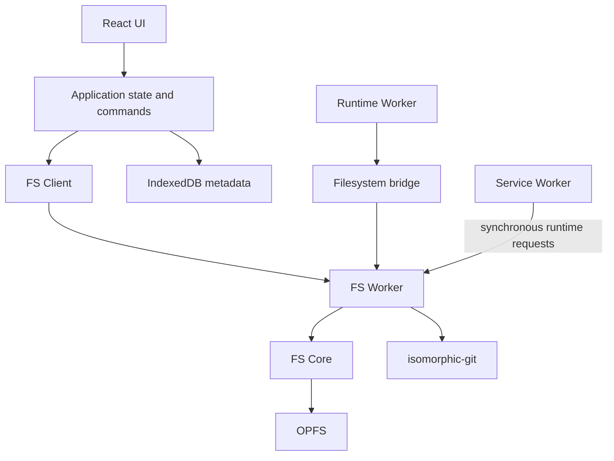

# System Overview

Pyxis is a client-side browser IDE. The page hosts the interface and application state; dedicated workers handle filesystem, Git, and runtime work that should not block interaction.

## Architecture

| Area | Responsibility |
|---|---|
| UI | Editors, file tree, terminal, panels, and dialogs |
| Application | Stores, hooks, command parsing, and worker clients |
| FS Worker | OPFS ownership, filesystem operations, Git, and package installation |
| Runtime Worker | Node-compatible program execution, isolated per run |
| Service Worker | Routes synchronous runtime filesystem RPC |
| IndexedDB | Recent folders and structured application metadata |

## Storage model

Virtual HOME is `/home/pyxis`; workspaces live at `~/<name>`. OPFS stores workspace files, `.git`, `node_modules`, runtime cache at `~/.cache/pyxis`, and the canonical npm cache directory at `~/.npm`. It is the sole persistent filesystem. The FS Worker owns its handles, and its client exposes path-based operations and change events to the page. `/tmp` is ephemeral and memory-backed.

IndexedDB stores recent folder records, root-scoped tab and chat state, AI reviews, settings, translations, and extension data. File contents are not duplicated there. `ProjectFile` tree entries contain metadata only: absolute path, entry type, size, and modification time. Content is read from OPFS on demand and classified from bytes before the UI selects a text editor, binary editor, or preview.

A workspace is an opened absolute folder under HOME. It scopes the file tree and default working directory, while filesystem paths remain absolute. The single-tab Web Lock ensures only one page owns the filesystem worker at a time.

Before a folder is selected, the active editor pane is empty. New workspaces start empty. After legacy migration, startup places generated `initial_files/` content in `~/demo` only when the directory is absent, before recent folders are read. Existing folders are preserved.

See [Two-Layer Architecture](./TWO-LAYER-ARCHITECTURE.md), [Core Engine](./CORE-ENGINE.md), and [Data Flow](./DATA-FLOW.md) for details.

## Application state

Valtio stores in `src/stores/` hold current workspace, panes and tabs, terminal session data, and logs. Persistent file data remains in OPFS; IndexedDB adapters persist metadata as needed.

## Runtime

Each Node execution runs in a separate Runtime Worker. The worker uses asynchronous messaging for asynchronous filesystem calls and the Service Worker route for synchronous calls such as `fs.*Sync` and module resolution. This keeps the UI responsive when the runtime blocks on a synchronous request. See [Node Runtime](./NODE-RUNTIME.md).

## Extensions

Extensions are bundled from `extensions/`, loaded dynamically, and receive typed APIs through `ExtensionContext`. The extension-facing type surface is in `extensions/_shared/`. See [Extension System](./EXTENSION-SYSTEM.md) and [How to Create an Extension](./HOW-TO-CREATE-EXTENSION.md).
