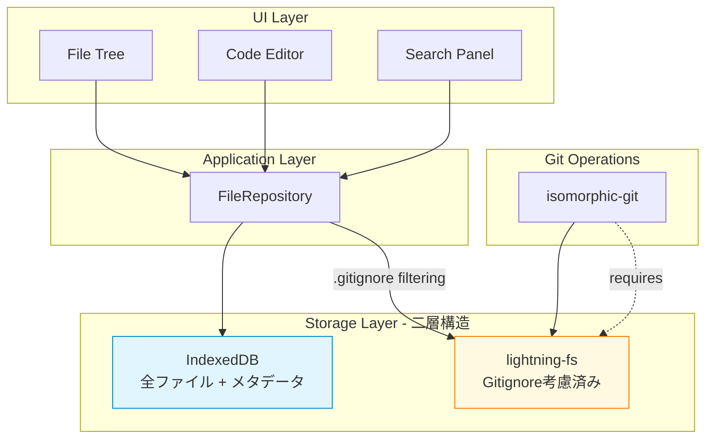
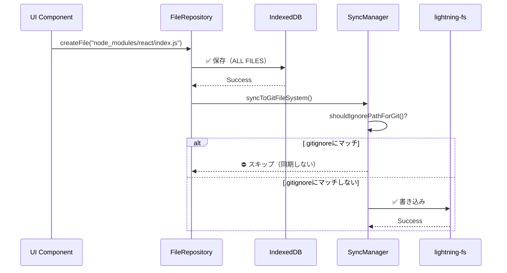

# Two-Layer Architecture - 設計の理由と必要性

## 概要

Pyxis CodeCanvasは、**IndexedDB**と**lightning-fs**という二層のストレージアーキテクチャを採用しています。
このドキュメントでは、なぜこの設計が必要なのか、それぞれのレイヤーの役割、そして.gitignoreの動作について詳しく説明します。

---

## 1. アーキテクチャ概要



### 二層の役割分担

| レイヤー | 用途 | 格納内容 | 主な用途 |
|---------|------|---------|---------|
| **IndexedDB** | プライマリストレージ | **全ファイル**<br/>（node_modules含む） | - ファイルツリー表示<br/>- エディタ表示<br/>- 検索機能<br/>- メタデータ管理<br/>- Node.js Runtime |
| **lightning-fs** | Gitストレージ | **.gitignore考慮済み**<br/>（node_modules除外） | - Git操作<br/>- isomorphic-git<br/>- ターミナルコマンド |

---

## 2. なぜ二層が必要なのか

### 2.1 IndexedDBが必要な理由

#### ✅ 高速クエリ

IndexedDBはインデックスベースのクエリに最適化されており、以下の操作が高速です：

```typescript
// パスで直接検索（インデックス使用）
const file = await fileRepository.getFileByPath(projectId, '/src/App.tsx');

// プレフィックス検索（範囲クエリ）
const srcFiles = await fileRepository.getFilesByPrefix(projectId, '/src/');

// プロジェクトIDで全ファイル取得（インデックス使用）
const allFiles = await fileRepository.getProjectFiles(projectId);
```

lightning-fsでこれを実現するには、毎回ディレクトリを再帰的にスキャンする必要があり、パフォーマンスが悪化します。

#### ✅ メタデータ管理

IndexedDBは、ファイル内容だけでなく、豊富なメタデータを保存できます：

```typescript
interface ProjectFile {
  id: string;
  projectId: string;
  path: string;
  name: string;
  content: string;
  type: 'file' | 'folder';
  parentPath: string;
  createdAt: Date;        // 作成日時
  updatedAt: Date;        // 更新日時
  isBufferArray: boolean; // バイナリファイル判定
  bufferContent?: ArrayBuffer;
  aiReviewStatus?: string;    // AI レビュー状態
  aiReviewComments?: string;  // AI コメント
}
```

lightning-fsは単なるファイルシステムであり、これらのメタデータを保存できません。

#### ✅ トランザクション保証

IndexedDBはACID特性を持ち、複数のファイル操作を原子的に実行できます：

```typescript
// 複数ファイルを一括作成（全て成功 or 全て失敗）
await fileRepository.createFilesBulk(projectId, [
  { path: '/package.json', content: '...', type: 'file' },
  { path: '/src/index.ts', content: '...', type: 'file' },
  { path: '/src/utils.ts', content: '...', type: 'file' },
]);
```

#### ✅ Node.js Runtime のモジュール解決

ブラウザ内Node.js Runtimeは、`require()`や`import`でモジュールを解決する際にIndexedDBから高速に読み込みます：

```typescript
// node_modules/react/index.js を高速読み込み
const reactModule = await fileRepository.getFileByPath(
  projectId,
  '/node_modules/react/index.js'
);
```

これがlightning-fsだと、毎回ファイルシステムAPIを通して読み込む必要があり、遅くなります。

### 2.2 lightning-fsが必要な理由

#### ✅ isomorphic-gitの要件

`isomorphic-git`は**POSIX風のファイルシステムAPI**を必須とします。IndexedDBでは提供できません：

```typescript
import git from 'isomorphic-git';

// isomorphic-gitはFSインスタンスを必要とする
await git.commit({
  fs: gitFileSystem.getFS(), // lightning-fsのインスタンス
  dir: '/projects/my-project',
  message: 'Initial commit',
  author: { name: 'User', email: 'user@example.com' }
});
```

lightning-fsは`fs.promises`互換のAPIを提供するため、isomorphic-gitと完璧に統合できます。

#### ✅ Git操作に不要なファイルを除外

`.gitignore`の役割は、**Gitの追跡から除外すること**です。

- `node_modules/` は数万ファイルになることもある
- これらを全てGitで追跡すると、`git status`や`git diff`が極端に遅くなる
- `.gitignore`に従って、lightning-fsには**同期しない**ことで、Git操作を高速に保つ

#### ✅ ターミナルコマンドの互換性

Unixコマンド（`ls`, `cat`, `cd`など）は、ファイルシステムAPIを前提としています：

```typescript
// ls コマンドの実装
const entries = await fs.promises.readdir('/projects/my-project/src');
```

IndexedDBにはディレクトリの概念がないため、このようなAPIを実装するのは非効率です。

---

## 3. .gitignoreの動作

### 3.1 現在の実装



### 3.2 各レイヤーの内容

**例: node_modulesを持つプロジェクト**

```
プロジェクト構造:
/
├── .gitignore          ("node_modules" を含む)
├── package.json
├── src/
│   └── index.ts
└── node_modules/
    └── react/
        └── index.js    (数千ファイル...)
```

**IndexedDBの内容（全て格納）:**
```
✅ /.gitignore
✅ /package.json
✅ /src/index.ts
✅ /node_modules/react/index.js  ← 全て保存
✅ /node_modules/...（全ファイル）
```

**lightning-fsの内容（.gitignore適用済み）:**
```
✅ /.gitignore
✅ /package.json
✅ /src/index.ts
⛔ /node_modules/  ← .gitignoreで除外、同期されない
```

### 3.3 なぜnode_modulesをIndexedDBに保存するのか

1. **Node.js Runtimeがrequire/importで必要**
   ```typescript
   import React from 'react'; // IndexedDBから読み込み
   ```

2. **エディタでの参照ジャンプ**
   - 型定義ファイル（.d.ts）を開く
   - ライブラリのソースコードを閲覧

3. **検索機能**
   - プロジェクト全体を検索する際、node_modules内も検索対象にできる

4. **完全なプロジェクト状態の保持**
   - プロジェクトのスナップショットとして全ファイルを保存

---

## 4. よくある誤解

### ❌ 誤解1: 「ファイルが完全に重複している」

**実態:**
- IndexedDB: 全ファイル（プロジェクトの完全な状態）
- lightning-fs: .gitignore適用後（Gitに必要なファイルのみ）

これは**意図的な設計**であり、重複ではありません。

### ❌ 誤解2: 「.gitignoreが機能していない」

**実態:**
- .gitignoreは**完璧に機能している**
- `shouldIgnorePathForGit()`がチェックを行っている
- 無視されたファイルはlightning-fsに同期されない

### ❌ 誤解3: 「二層は不要で、lightning-fs単体でいける」

**実態:**
- IndexedDBなしでは、以下が実現できない：
  - 高速クエリ（パス検索、プレフィックス検索）
  - メタデータ管理（作成日時、AIレビュー状態など）
  - Node.js Runtimeの高速モジュール解決
  - トランザクション保証
  - ファイルツリーの効率的な構築

---

## 5. パフォーマンス最適化

### 5.1 同期の最適化

```typescript
// 単一ファイル変更: 個別同期
await fileRepository.saveFile(file);
// → syncSingleFileToFS() が呼ばれる（高速）

// 大量ファイル作成: 一括同期
await fileRepository.createFilesBulk(projectId, files);
// → syncFromIndexedDBToFS() が呼ばれる（差分のみ同期）
```

### 5.2 .gitignore キャッシュ

```typescript
// .gitignoreルールをキャッシュ（5分間有効）
private gitignoreCache: Map<string, { rules: GitIgnoreRule[]; ts: number }>;
private readonly GITIGNORE_CACHE_TTL_MS = 5 * 60 * 1000;
```

.gitignoreファイルを毎回読み込むのではなく、キャッシュすることで高速化しています。

### 5.3 非同期同期

```typescript
// IndexedDB書き込みは即座に完了
await fileRepository.saveFile(file); // ← ここで完了

// lightning-fsへの同期はバックグラウンドで実行
this.syncToGitFileSystem(...).catch(error => {
  coreWarn('[FileRepository] Background sync failed (non-critical):', error);
});
```

ユーザーはIndexedDB書き込みの完了を待つだけで、lightning-fsへの同期は非同期で行われます。

---

## 6. 設計の利点まとめ

| 機能 | IndexedDBのみ | lightning-fsのみ | **二層設計** |
|-----|-------------|----------------|-----------|
| 高速クエリ | ✅ | ❌ | ✅ |
| メタデータ管理 | ✅ | ❌ | ✅ |
| Git操作 | ❌ | ✅ | ✅ |
| .gitignore適用 | ❌ | ✅ | ✅ |
| Node.js Runtime | ✅ | ⚠️ 遅い | ✅ |
| トランザクション | ✅ | ❌ | ✅ |

---

## 7. 結論

**二層アーキテクチャは、必要不可欠な設計です。**

- **IndexedDB**: プロジェクト全体の高速ストレージ、メタデータ管理
- **lightning-fs**: Git操作専用、.gitignore適用済み
- **.gitignore**: 正しく機能しており、lightning-fsへの同期を制御
- **"重複"**: 意図的な設計であり、各レイヤーの役割が異なる

この設計により、以下を同時に実現しています：

1. 高速なファイル検索とエディタ操作
2. 効率的なGit操作（node_modules除外）
3. 完全なプロジェクト状態の保持
4. ブラウザ内Node.js Runtimeのサポート

---

## Related Documents

- [SYSTEM-OVERVIEW.md](./SYSTEM-OVERVIEW.md) - システム全体のアーキテクチャ
- [CORE-ENGINE.md](./CORE-ENGINE.md) - Core Engineの詳細設計
- [DATA-FLOW.md](./DATA-FLOW.md) - データフローと状態管理

---

**Last Updated**: 2025-01-07  
**Version**: 1.0  
**Status**: Initial Release - 二層アーキテクチャの必要性を説明
