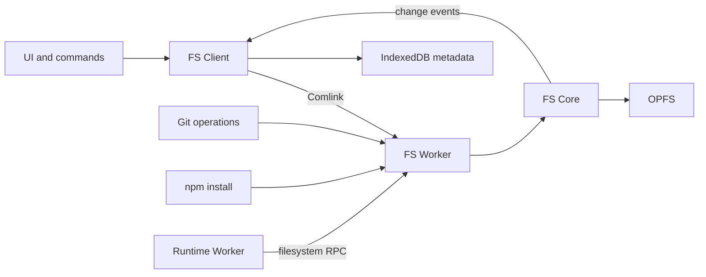

# Two-Layer Architecture

Pyxis stores file contents and directories in one OPFS filesystem. IndexedDB stores searchable metadata and application state. The filename is retained for existing links; the former IndexedDB plus lightning-fs file-copy model no longer applies.

## Storage boundaries

| Layer | Data | Authority |
|---|---|---|
| OPFS | Workspace files, `.git`, `node_modules`, runtime module cache `~/.cache/pyxis`, and npm cache directory `~/.npm` | The only persistent file contents |
| IndexedDB | Recent folder records, chat spaces, tabs, AI reviews, settings, and extension data | Application metadata keyed by absolute workspace root where applicable |
| Memory | `/tmp` | Ephemeral files for the current page lifetime |

A `ProjectFile` is a filesystem entry summary: absolute `path`, `type`, `size`, and `mtime`. It contains no file contents, project ID, parent path, or review fields. File identity is its normalized absolute path.

## Ownership and access

```mermaid
graph LR
  UI[UI and commands] --> Client[FS Client]
  Client -->|Comlink| Worker[FS Worker]
  Git[Git operations] --> Worker
  Npm[npm install] --> Worker
  Worker --> Core[FS Core]
  Core --> OPFS[OPFS]
  Core -->|change events| Client
  Client --> Metadata[IndexedDB metadata]
  Runtime[Runtime Worker] -->|filesystem RPC| Worker
```

The FS Worker is the only OPFS owner. It implements path-based operations such as `readFile`, `readText`, `writeFile`, `readdir`, `stat`, `mkdir`, `rm`, `rename`, `walk`, and `exists`. `readFile` returns raw bytes; text decoding is explicit. FS Core retains only the directory-handle chain for its last successful lookup and reuses shared ancestors on the next path. Initialization resets it; directory removal invalidates it before and after removal, including source removal during a directory rename. A stale in-flight lookup cannot republish the chain. File handles and contents are not cached. The FS Client provides the main-thread API and change-event subscription. Git operations and package installation run in the FS Worker so their filesystem calls do not cross the worker boundary individually. Git and npm preserve file payload bytes through filesystem operations. npm resolves registry metadata with up to 15 concurrent requests, downloads tarballs with up to six requests, and installs up to six packages concurrently. Compatible lockfile entries are preferred; fresh range resolution chooses the `latest` dist-tag when it satisfies the range, then the maximum satisfying version. Compact abbreviated packuments use HTTP freshness and ETag under `~/.npm/registry`; URL-digested tarballs are retained under `~/.npm` after successful extraction. Tar extraction streams decompressed chunks and awaits each entry write. npm v3 `package-lock.json` records the resolved registry package tree and integrity values. An unchanged root dependency map replays the saved tree without registry metadata requests and preserves lockfile bytes; changed manifests reuse compatible locked packages and write a rebuilt tree. Nested package placements follow Node module lookup, and tarball integrity is checked before extraction writes. Registry cache reads use direct reads rather than an `exists`/`stat` preflight, and cache/package directories are created once per installer/package. Registry metadata declaring unsupported `os` or `cpu` constraints is skipped for optional dependencies and rejected for required ones; the target is `browser/x64`. Installation does not decode `.mjs` source; runtime transforms decode it as UTF-8 when required.

OPFS file access uses a SyncAccessHandle only for one operation: open, read or write, flush when writing, and close. Access is serialized per path. `/tmp` is memory-backed. Virtual HOME is `/home/pyxis`; runtime module cache is under `~/.cache/pyxis`, and `~/.npm` is the canonical npm cache directory.

A Web Lock enforces the single-tab ownership model. If another tab holds the lock, initialization fails with an actionable error. File changes are reported by the FS Worker with absolute paths.

## Workspace and paths

Opening a folder sets the workspace root; newly created workspaces at `~/<name>` start empty under HOME `/home/pyxis`. At startup, generated `initial_files/` content seeds `~/demo` only when that folder is absent. Seeding runs after legacy migration and before recent folders are read, and never rewrites existing folder contents. The root controls the file tree and default working directory; it does not change path identity. Paths are absolute and use one normalized form. The terminal and runtime can address paths outside the workspace root, while the file tree shows entries beneath the opened root.

Recent folders are keyed by root path. Chat spaces, tab state, and AI reviews use the same root-path scope. AI review records remain in IndexedDB and refer to files by absolute path.

## Why file contents live in OPFS

The former design wrote each file to IndexedDB and copied selected files into lightning-fs for Git. That duplicated contents and required synchronization, filtering, and path conversion. OPFS now holds both worktree and `.git`; isomorphic-git uses an adapter over the same FS Core. Git sees the actual worktree, including ignored files, and applies Git ignore rules to tracking operations rather than to a second copy.

IndexedDB remains useful for data that needs lookup by application keys or has structured attributes. It is not a second file store.

## Legacy migration

A temporary startup migration copies legacy project data and Git history into OPFS and rewrites metadata keys to root paths. File payloads are copied from legacy `ArrayBuffer`/`Uint8Array` values without text decoding. Legacy projects target `/home/pyxis/<name>` without a reserved suffix. If an unassigned destination already exists, migration stops before project writes and preserves legacy data; persisted project-to-root mappings let retries reuse their assigned destinations. Legacy runtime-cache records contain old project paths or IDs; their old `/cache/...` suffixes are preserved under `~/.cache/pyxis/legacy/<namespace>` while the runtime rebuilds current cache entries. Migration code is isolated under `src/engine/core/migration/`; it verifies copied content before removing legacy stores. This migration is temporary and is intended for removal around April 2027.

## Related documents

- [Core Engine](./CORE-ENGINE.md)
- [Data Flow](./DATA-FLOW.md)
- [Storage intent](./plan/STORAGE_INTENT.md)
