# UI Components - Architecture and Design

このドキュメントでは、Pyxis CodeCanvasのUI層の構成、コンポーネント設計、状態管理について詳細に説明します。

---

## 1. UI Layer Overview

UI層は、ユーザーインターフェースを構成するReactコンポーネント群で構成されています。

### 1.1 Component Hierarchy

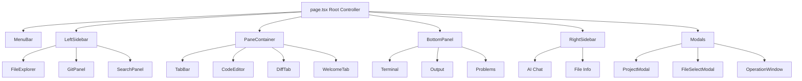
```mermaid
graph TB
    A[page.tsx Root Controller] --> B[MenuBar]
    A --> C[LeftSidebar]
    A --> D[PaneContainer]
    A --> E[BottomPanel]
    A --> F[RightSidebar]
    A --> G[Modals]
    
    C --> C1[FileExplorer]
    C --> C2[GitPanel]
    C --> C3[SearchPanel]
    
    D --> D1[TabBar]
    D --> D2[CodeEditor]
    D --> D3[DiffTab]
    D --> D4[WelcomeTab]
    
    E --> E1[Terminal]
    E --> E2[Output]
    E --> E3[Problems]
    
    F --> F1[AI Chat]
    F --> F2[File Info]
    
    G --> G1[ProjectModal]
    G --> G2[FileSelectModal]
    G --> G3[OperationWindow]
```

### 1.2 Layout Structure

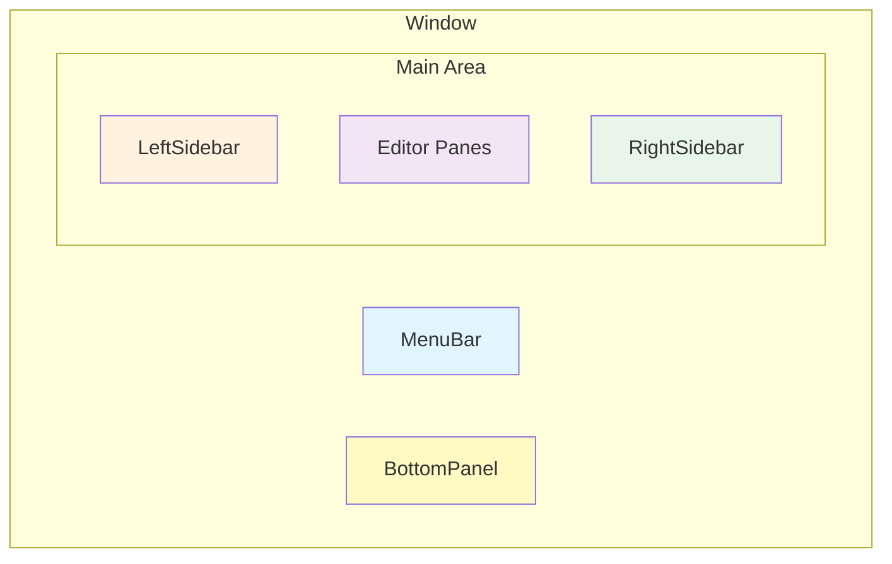
```mermaid
graph TB
    subgraph Window
        A[MenuBar]
        
        subgraph Main Area
            B[LeftSidebar]
            C[Editor Panes]
            D[RightSidebar]
        end
        
        E[BottomPanel]
    end
    
    style A fill:#e1f5ff
    style B fill:#fff3e0
    style C fill:#f3e5f5
    style D fill:#e8f5e9
    style E fill:#fff9c4
```

**Layout Dimensions:**
- MenuBar: Fixed height (40px)
- LeftSidebar: Resizable width (default 240px)
- RightSidebar: Resizable width (default 240px)
- BottomPanel: Resizable height (default 200px)
- Editor Panes: Flexible, fills remaining space

---

## 2. page.tsx: Main Controller

page.tsxは、アプリケーション全体の状態とレイアウトを管理するメインコントローラーです。

### 2.1 State Management

**Main State Categories:**

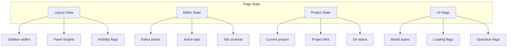
```mermaid
graph TB
    subgraph Page State
        A[Layout State]
        B[Editor State]
        C[Project State]
        D[UI Flags]
    end
    
    A --> A1[Sidebar widths]
    A --> A2[Panel heights]
    A --> A3[Visibility flags]
    
    B --> B1[Editor panes]
    B --> B2[Active tabs]
    B --> B3[Tab contents]
    
    C --> C1[Current project]
    C --> C2[Project files]
    C --> C3[Git status]
    
    D --> D1[Modal states]
    D --> D2[Loading flags]
    D --> D3[Operation flags]
```

**State Variables:**

| Category | State | Type | Persistence |
|----------|-------|------|-------------|
| Layout | `leftSidebarWidth` | number | localStorage |
| Layout | `rightSidebarWidth` | number | localStorage |
| Layout | `bottomPanelHeight` | number | localStorage |
| Layout | `isLeftSidebarVisible` | boolean | localStorage |
| Layout | `isRightSidebarVisible` | boolean | localStorage |
| Layout | `isBottomPanelVisible` | boolean | localStorage |
| Editor | `editors` | EditorPane[] | localStorage |
| Project | `currentProject` | Project or null | useProject hook |
| Project | `projectFiles` | FileItem[] | useProject hook |
| UI | `activeMenuTab` | MenuTab | Session |
| UI | `isProjectModalOpen` | boolean | Session |
| UI | `gitChangesCount` | number | Session |
| UI | `nodeRuntimeOperationInProgress` | boolean | Session |

### 2.2 Initialization Flow

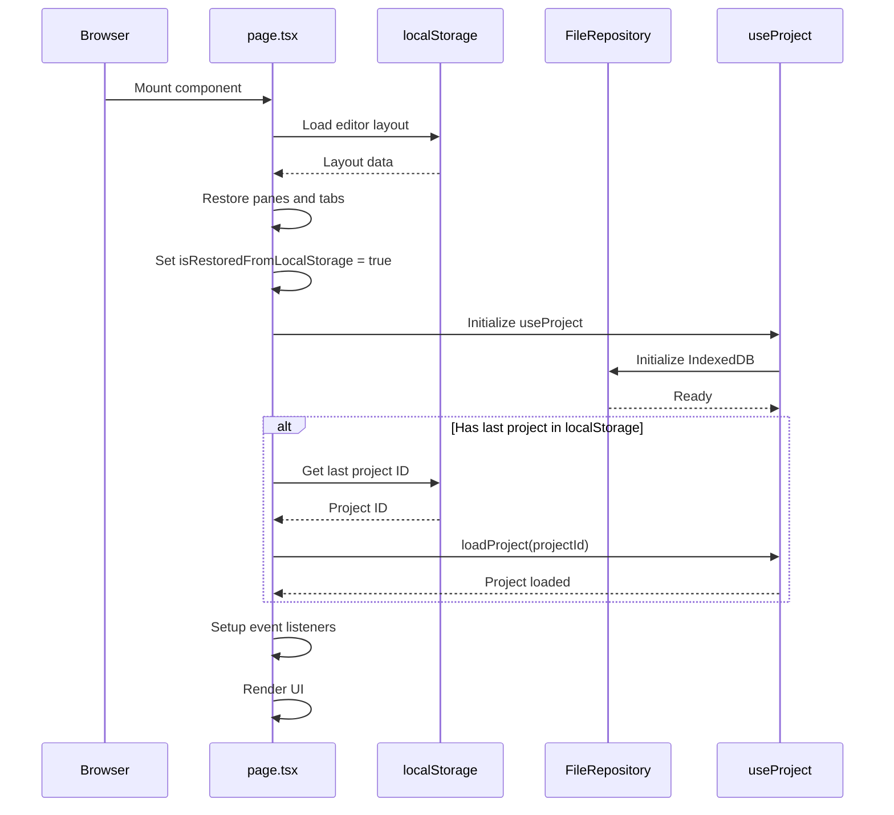
```mermaid
sequenceDiagram
    participant BROWSER as Browser
    participant PAGE as page.tsx
    participant LS as localStorage
    participant REPO as FileRepository
    participant HOOK as useProject

    BROWSER->>PAGE: Mount component
    PAGE->>LS: Load editor layout
    LS-->>PAGE: Layout data
    PAGE->>PAGE: Restore panes and tabs
    PAGE->>PAGE: Set isRestoredFromLocalStorage = true
    
    PAGE->>HOOK: Initialize useProject
    HOOK->>REPO: Initialize IndexedDB
    REPO-->>HOOK: Ready
    
    alt Has last project in localStorage
        PAGE->>LS: Get last project ID
        LS-->>PAGE: Project ID
        PAGE->>HOOK: loadProject(projectId)
        HOOK-->>PAGE: Project loaded
    end
    
    PAGE->>PAGE: Setup event listeners
    PAGE->>PAGE: Render UI
```

### 2.3 Effect Dependencies

**Key useEffect Hooks:**

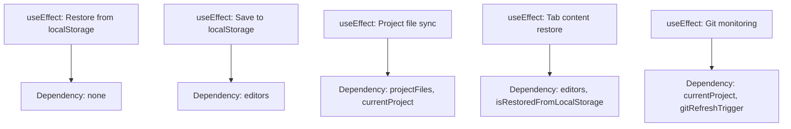
```mermaid
graph TB
    A[useEffect: Restore from localStorage] --> B[Dependency: none]
    C[useEffect: Save to localStorage] --> D[Dependency: editors]
    E[useEffect: Project file sync] --> F[Dependency: projectFiles, currentProject]
    G[useEffect: Tab content restore] --> H[Dependency: editors, isRestoredFromLocalStorage]
    I[useEffect: Git monitoring] --> J[Dependency: currentProject, gitRefreshTrigger]
```

**Effect Execution Order:**
1. Restore layout from localStorage (on mount)
2. Initialize FileRepository and useProject
3. Load last project (if exists)
4. Setup git monitoring
5. Sync tab contents with project files
6. Setup auto-save to localStorage

### 2.4 Event Handlers

**File Operations:**

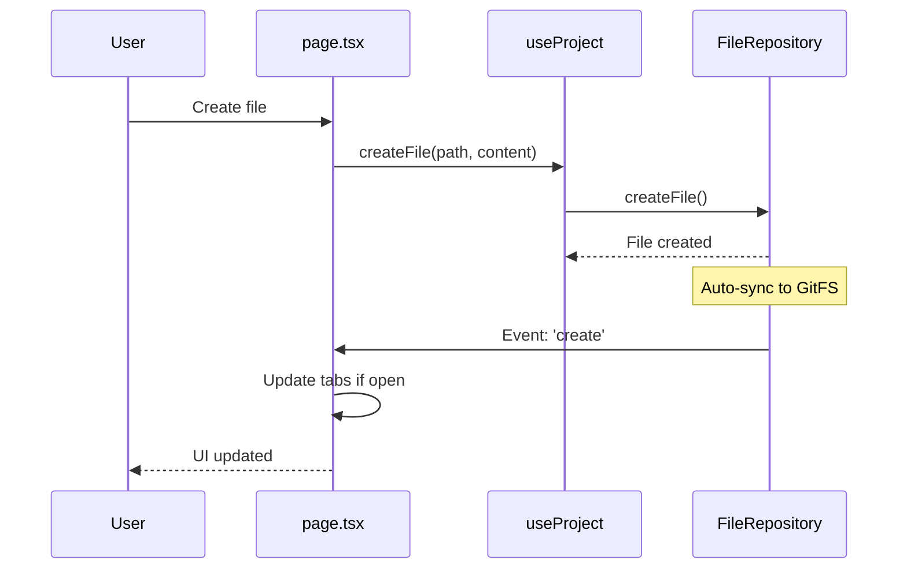
```mermaid
sequenceDiagram
    participant USER as User
    participant PAGE as page.tsx
    participant HOOK as useProject
    participant REPO as FileRepository

    USER->>PAGE: Create file
    PAGE->>HOOK: createFile(path, content)
    HOOK->>REPO: createFile()
    REPO-->>HOOK: File created
    Note over REPO: Auto-sync to GitFS
    REPO->>PAGE: Event: 'create'
    PAGE->>PAGE: Update tabs if open
    PAGE-->>USER: UI updated
```

**Tab Operations:**

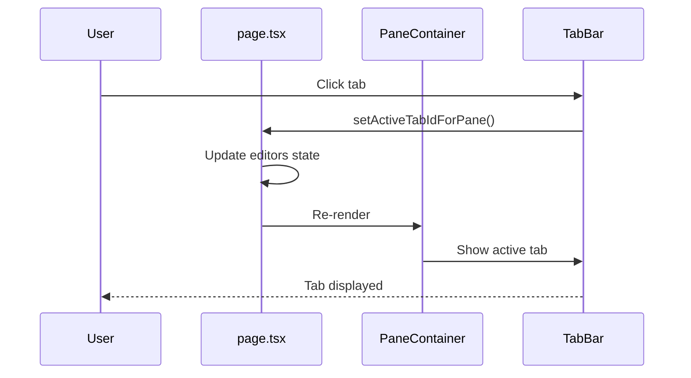
```mermaid
sequenceDiagram
    participant USER as User
    participant PAGE as page.tsx
    participant PANE as PaneContainer
    participant TAB as TabBar

    USER->>TAB: Click tab
    TAB->>PAGE: setActiveTabIdForPane()
    PAGE->>PAGE: Update editors state
    PAGE->>PANE: Re-render
    PANE->>TAB: Show active tab
    TAB-->>USER: Tab displayed
```

**Git Operations:**

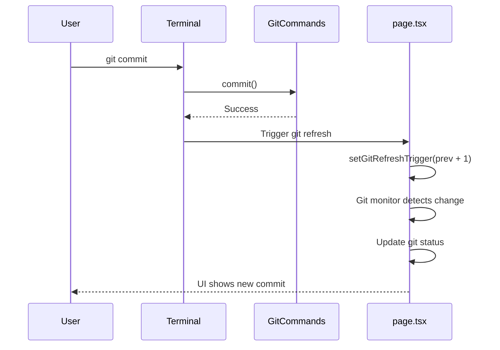
```mermaid
sequenceDiagram
    participant USER as User
    participant TERM as Terminal
    participant GIT as GitCommands
    participant PAGE as page.tsx

    USER->>TERM: git commit
    TERM->>GIT: commit()
    GIT-->>TERM: Success
    TERM->>PAGE: Trigger git refresh
    PAGE->>PAGE: setGitRefreshTrigger(prev + 1)
    PAGE->>PAGE: Git monitor detects change
    PAGE->>PAGE: Update git status
    PAGE-->>USER: UI shows new commit
```

---

## 3. Editor System

### 3.1 Multi-Pane Architecture

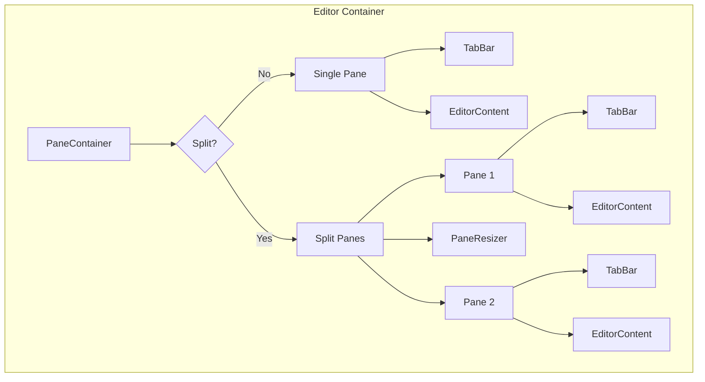
```mermaid
graph TB
    subgraph Editor Container
        A[PaneContainer] --> B{Split?}
        B -->|No| C[Single Pane]
        B -->|Yes| D[Split Panes]
        
        C --> C1[TabBar]
        C --> C2[EditorContent]
        
        D --> D1[Pane 1]
        D --> D2[PaneResizer]
        D --> D3[Pane 2]
        
        D1 --> D1A[TabBar]
        D1 --> D1B[EditorContent]
        
        D3 --> D3A[TabBar]
        D3 --> D3B[EditorContent]
    end
```

**Pane Structure:**

```typescript
interface EditorPane {
  id: string
  tabs: Tab[]
  activeTabId: string
  layout?: 'vertical' | 'horizontal'
  size?: number
  children?: EditorPane[]
  parentId?: string
}
```

**Pane Operations:**

| Operation | Function | Description |
|-----------|----------|-------------|
| Add Pane | `addEditorPane()` | Add new pane to array |
| Remove Pane | `removeEditorPane()` | Remove pane by ID |
| Split Pane | `splitPane()` | Split pane into two |
| Flatten | `flattenPanes()` | Get flat list of all panes |

### 3.2 Tab Management

**Tab Lifecycle:**

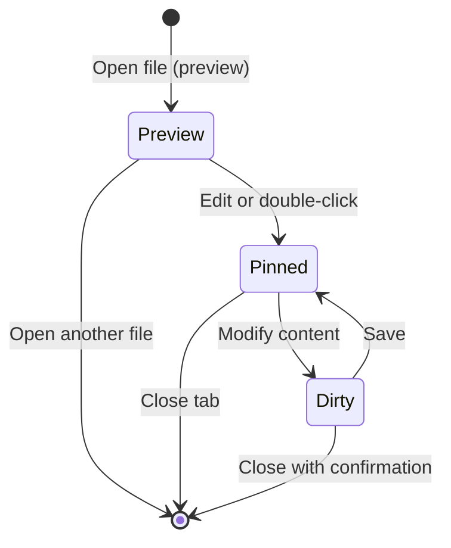
```mermaid
stateDiagram-v2
    [*] --> Preview: Open file (preview)
    Preview --> Pinned: Edit or double-click
    Preview --> [*]: Open another file
    Pinned --> Dirty: Modify content
    Dirty --> Pinned: Save
    Pinned --> [*]: Close tab
    Dirty --> [*]: Close with confirmation
```

**Tab Types:**

| Type | Purpose | Identifier Pattern |
|------|---------|-------------------|
| Welcome | Initial tab | `welcome` |
| File | Regular file | `paneId:path` |
| Preview | Preview file | `paneId:path-preview` |
| Diff | Git diff view | `paneId:path-diff` |
| AI Review | AI suggestion | `paneId:path-ai` |
| Web Preview | HTML preview | `paneId:path-web` |

**Tab State Management:**

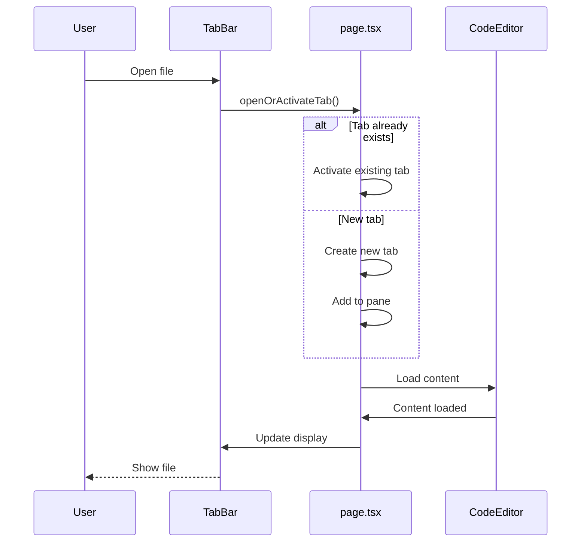
```mermaid
sequenceDiagram
    participant USER as User
    participant TAB as TabBar
    participant PAGE as page.tsx
    participant EDITOR as CodeEditor

    USER->>TAB: Open file
    TAB->>PAGE: openOrActivateTab()
    
    alt Tab already exists
        PAGE->>PAGE: Activate existing tab
    else New tab
        PAGE->>PAGE: Create new tab
        PAGE->>PAGE: Add to pane
    end
    
    PAGE->>EDITOR: Load content
    EDITOR->>PAGE: Content loaded
    PAGE->>TAB: Update display
    TAB-->>USER: Show file
```

### 3.3 Tab Synchronization

**File Change Sync:**

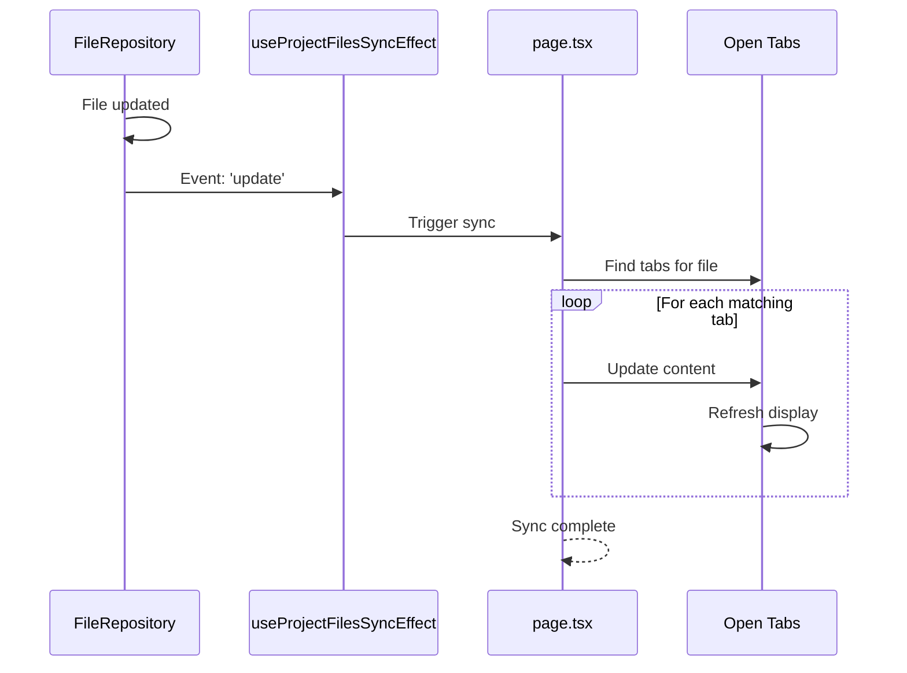
```mermaid
sequenceDiagram
    participant REPO as FileRepository
    participant HOOK as useProjectFilesSyncEffect
    participant PAGE as page.tsx
    participant TAB as Open Tabs

    REPO->>REPO: File updated
    REPO->>HOOK: Event: 'update'
    HOOK->>PAGE: Trigger sync
    PAGE->>TAB: Find tabs for file
    
    loop For each matching tab
        PAGE->>TAB: Update content
        TAB->>TAB: Refresh display
    end
    
    PAGE-->>PAGE: Sync complete
```

**NodeRuntime Sync:**

When Node runtime writes files, tabs are synchronized differently:

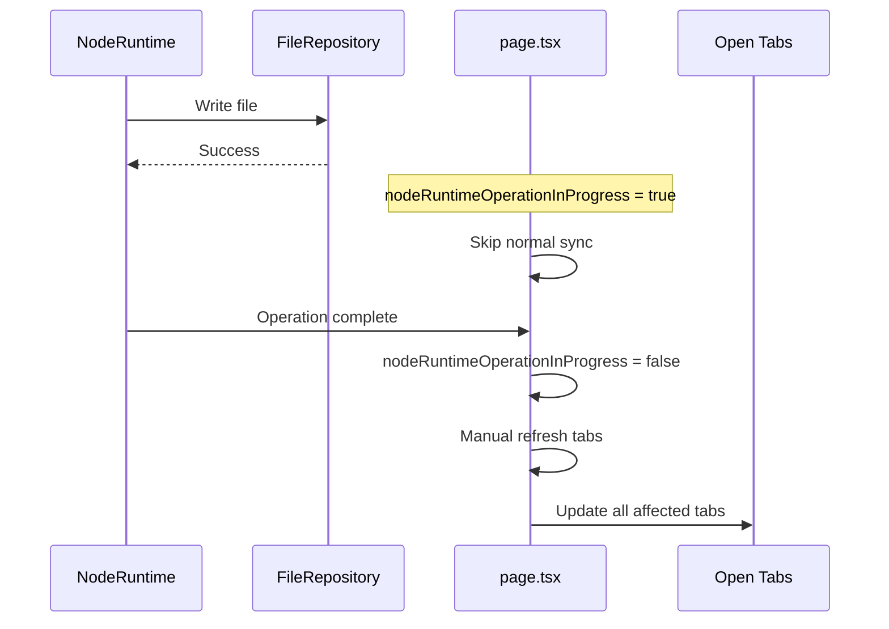
```mermaid
sequenceDiagram
    participant RUNTIME as NodeRuntime
    participant REPO as FileRepository
    participant PAGE as page.tsx
    participant TAB as Open Tabs

    RUNTIME->>REPO: Write file
    REPO-->>RUNTIME: Success
    Note over PAGE: nodeRuntimeOperationInProgress = true
    PAGE->>PAGE: Skip normal sync
    RUNTIME->>PAGE: Operation complete
    PAGE->>PAGE: nodeRuntimeOperationInProgress = false
    PAGE->>PAGE: Manual refresh tabs
    PAGE->>TAB: Update all affected tabs
```

---

## 4. Sidebar Components

### 4.1 LeftSidebar

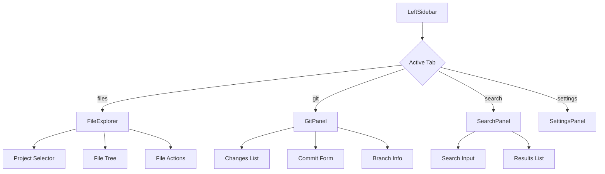
```mermaid
graph TB
    A[LeftSidebar] --> B{Active Tab}
    B -->|files| C[FileExplorer]
    B -->|git| D[GitPanel]
    B -->|search| E[SearchPanel]
    B -->|settings| F[SettingsPanel]
    
    C --> C1[Project Selector]
    C --> C2[File Tree]
    C --> C3[File Actions]
    
    D --> D1[Changes List]
    D --> D2[Commit Form]
    D --> D3[Branch Info]
    
    E --> E1[Search Input]
    E --> E2[Results List]
```

**FileExplorer Features:**

- Hierarchical file tree display
- Drag-and-drop support
- Context menu for file operations
- New file/folder creation
- File deletion
- File renaming

**File Tree Rendering:**

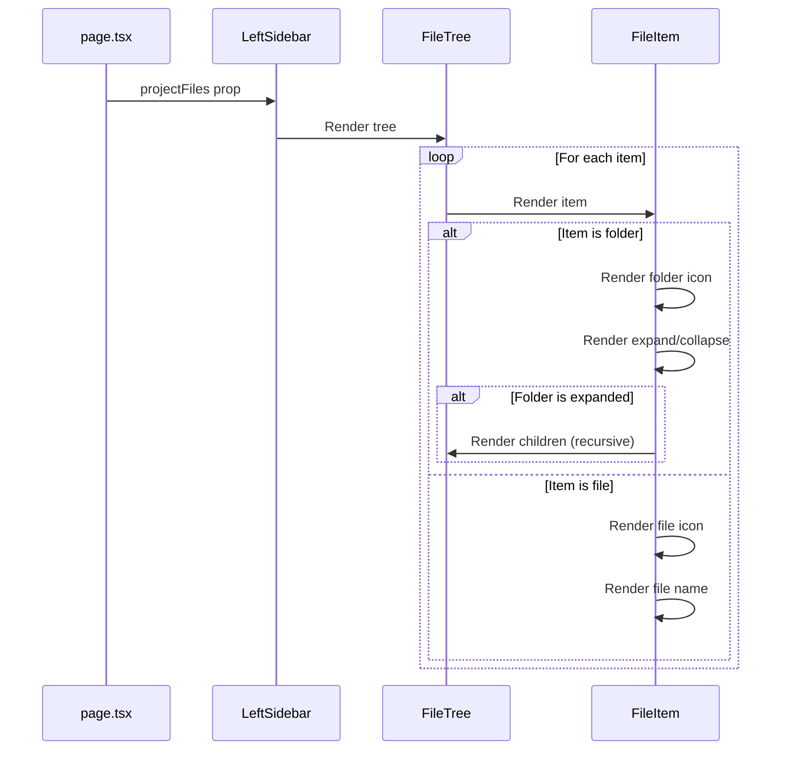
```mermaid
sequenceDiagram
    participant PAGE as page.tsx
    participant SIDEBAR as LeftSidebar
    participant TREE as FileTree
    participant ITEM as FileItem

    PAGE->>SIDEBAR: projectFiles prop
    SIDEBAR->>TREE: Render tree
    
    loop For each item
        TREE->>ITEM: Render item
        
        alt Item is folder
            ITEM->>ITEM: Render folder icon
            ITEM->>ITEM: Render expand/collapse
            
            alt Folder is expanded
                ITEM->>TREE: Render children (recursive)
            end
        else Item is file
            ITEM->>ITEM: Render file icon
            ITEM->>ITEM: Render file name
        end
    end
```

**GitPanel Features:**

- Display changed files
- Stage/unstage files
- Commit with message
- Branch management
- View commit history

### 4.2 RightSidebar

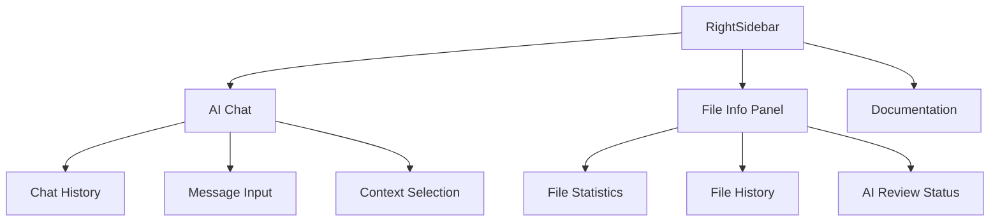
```mermaid
graph TB
    A[RightSidebar] --> B[AI Chat]
    A --> C[File Info Panel]
    A --> D[Documentation]
    
    B --> B1[Chat History]
    B --> B2[Message Input]
    B --> B3[Context Selection]
    
    C --> C1[File Statistics]
    C --> C2[File History]
    C --> C3[AI Review Status]
```

**AI Chat Features:**

- Conversation history
- Context-aware responses
- File attachment support
- Code snippet inclusion
- Markdown rendering

---

## 5. Bottom Panel

### 5.1 Panel Structure

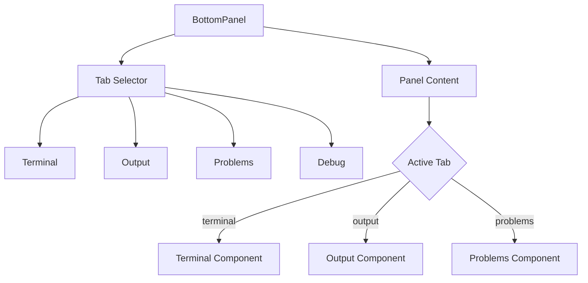
```mermaid
graph TB
    A[BottomPanel] --> B[Tab Selector]
    A --> C[Panel Content]
    
    B --> B1[Terminal]
    B --> B2[Output]
    B --> B3[Problems]
    B --> B4[Debug]
    
    C --> C1{Active Tab}
    C1 -->|terminal| D[Terminal Component]
    C1 -->|output| E[Output Component]
    C1 -->|problems| F[Problems Component]
```

### 5.2 Terminal Component

**Terminal Architecture:**

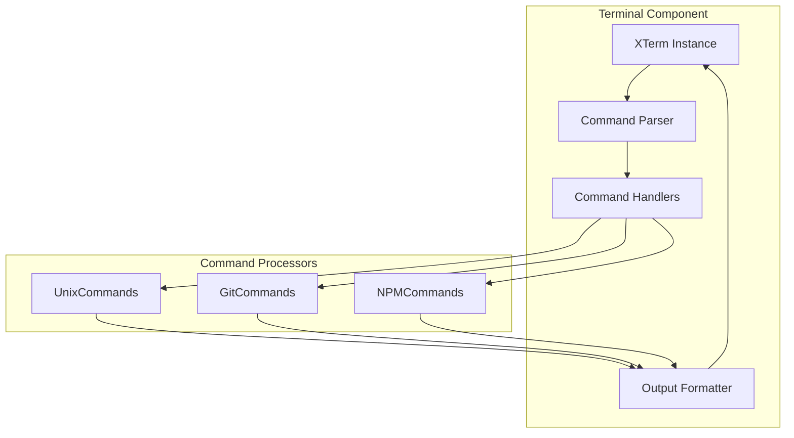
```mermaid
graph TB
    subgraph Terminal Component
        A[XTerm Instance]
        B[Command Parser]
        C[Command Handlers]
        D[Output Formatter]
    end
    
    subgraph Command Processors
        E[UnixCommands]
        F[GitCommands]
        G[NPMCommands]
    end
    
    A --> B
    B --> C
    C --> E
    C --> F
    C --> G
    E --> D
    F --> D
    G --> D
    D --> A
```

**Terminal Initialization:**

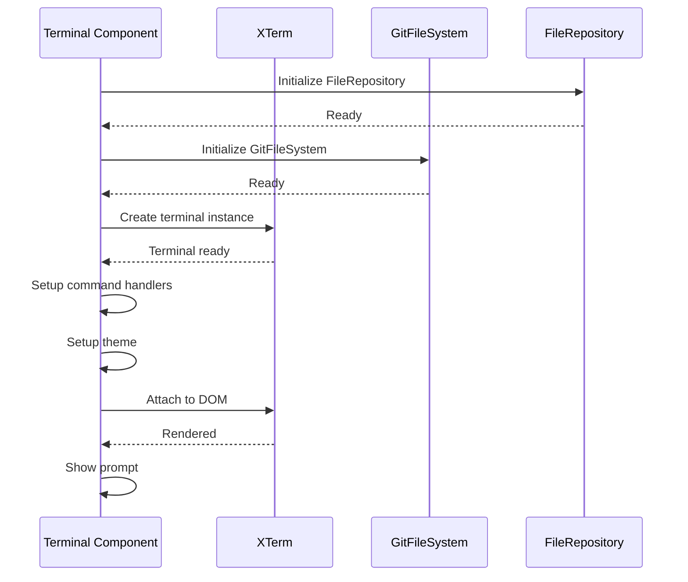
```mermaid
sequenceDiagram
    participant COMP as Terminal Component
    participant XTERM as XTerm
    participant FS as GitFileSystem
    participant REPO as FileRepository

    COMP->>REPO: Initialize FileRepository
    REPO-->>COMP: Ready
    COMP->>FS: Initialize GitFileSystem
    FS-->>COMP: Ready
    
    COMP->>XTERM: Create terminal instance
    XTERM-->>COMP: Terminal ready
    COMP->>COMP: Setup command handlers
    COMP->>COMP: Setup theme
    COMP->>XTERM: Attach to DOM
    XTERM-->>COMP: Rendered
    COMP->>COMP: Show prompt
```

**Command Execution Flow:**

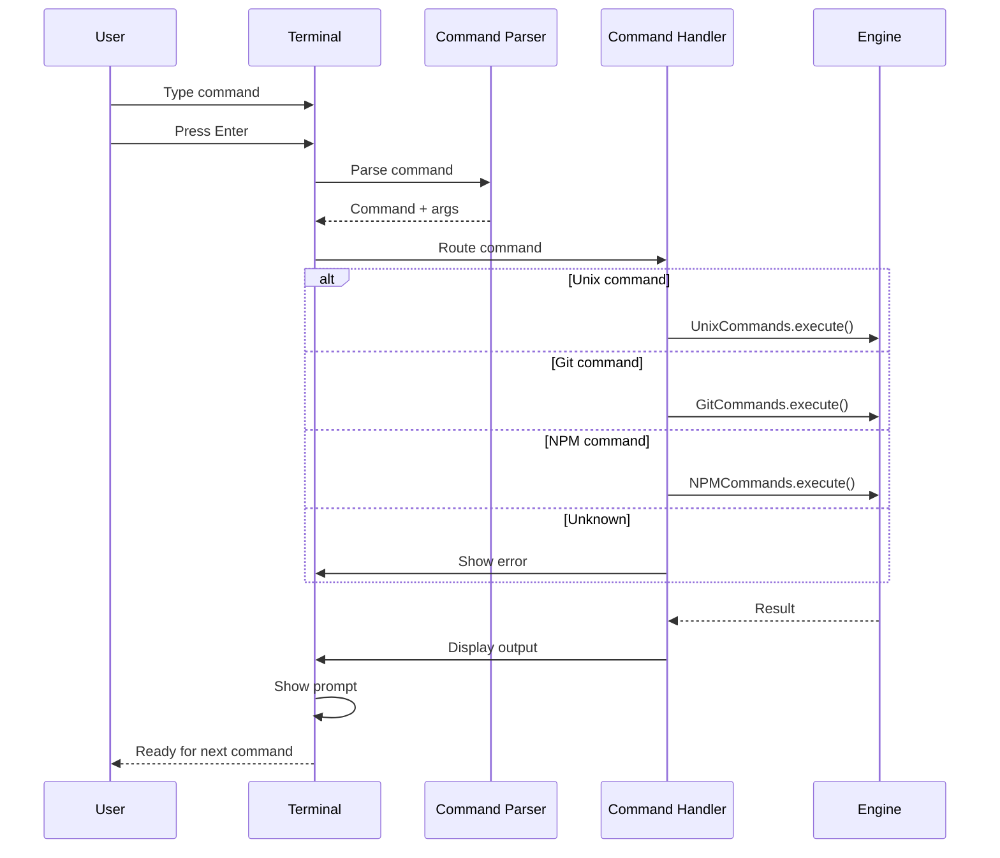
```mermaid
sequenceDiagram
    participant USER as User
    participant TERM as Terminal
    participant PARSER as Command Parser
    participant HANDLER as Command Handler
    participant ENGINE as Engine

    USER->>TERM: Type command
    USER->>TERM: Press Enter
    TERM->>PARSER: Parse command
    PARSER-->>TERM: Command + args
    
    TERM->>HANDLER: Route command
    
    alt Unix command
        HANDLER->>ENGINE: UnixCommands.execute()
    else Git command
        HANDLER->>ENGINE: GitCommands.execute()
    else NPM command
        HANDLER->>ENGINE: NPMCommands.execute()
    else Unknown
        HANDLER->>TERM: Show error
    end
    
    ENGINE-->>HANDLER: Result
    HANDLER->>TERM: Display output
    TERM->>TERM: Show prompt
    TERM-->>USER: Ready for next command
```

### 5.3 Output Panel

**Output Sources:**

```mermaid
graph TB
    A[Output Panel] --> B[Node Runtime Output]
    A --> C[Build Output]
    A --> D[AI Operations]
    A --> E[System Messages]
    
    B --> B1[Console logs]
    B --> B2[Error messages]
    B --> B3[Runtime info]
```

**Output Message Structure:**

| Field | Type | Description |
|-------|------|-------------|
| `type` | string | Message category |
| `message` | string | Message content |
| `timestamp` | Date | When message was logged |
| `source` | string | Source of message |

---

## 6. Code Editor

### 6.1 Editor Types

```mermaid
graph TB
    A[Editor Content] --> B{File Type?}
    
    B -->|Text| C[CodeEditor]
    B -->|Image/Binary| D[BinaryTabContent]
    B -->|Markdown| E[MarkdownPreviewTab]
    B -->|HTML| F[WebPreviewTab]
    B -->|Diff| G[DiffTab]
    B -->|Welcome| H[WelcomeTab]
    
    C --> C1[Monaco Editor]
    C --> C2[Syntax Highlighting]
    C --> C3[Auto-completion]
```

### 6.2 CodeEditor Component

**Features:**

- Monaco-based code editor
- Syntax highlighting for multiple languages
- Auto-completion and IntelliSense
- Multi-cursor editing
- Find and replace
- Code folding
- Minimap
- Git diff indicators

**Editor Initialization:**

```mermaid
sequenceDiagram
    participant COMP as CodeEditor
    participant MONACO as Monaco Editor
    participant THEME as Theme Context

    COMP->>MONACO: Create editor instance
    MONACO-->>COMP: Editor ready
    
    COMP->>THEME: Get current theme
    THEME-->>COMP: Theme colors
    
    COMP->>MONACO: Apply theme
    COMP->>MONACO: Set language
    COMP->>MONACO: Set content
    COMP->>MONACO: Set options
    
    MONACO-->>COMP: Configured
    COMP->>COMP: Setup event listeners
```

**Content Synchronization:**

```mermaid
sequenceDiagram
    participant USER as User
    participant EDITOR as Monaco Editor
    participant COMP as CodeEditor
    participant PAGE as page.tsx

    USER->>EDITOR: Edit content
    EDITOR->>COMP: onChange event
    COMP->>COMP: Update local state
    COMP->>PAGE: Mark tab as dirty
    PAGE->>PAGE: Update isDirty flag
    
    alt Auto-save enabled
        COMP->>PAGE: Debounced save
        PAGE->>PAGE: saveFile()
    end
```

### 6.3 DiffTab Component

**Diff View Layout:**

```mermaid
graph TB
    A[DiffTab] --> B[Header]
    A --> C[Side-by-Side View]
    
    B --> B1[File Info]
    B --> B2[Actions]
    
    C --> C1[Original Content]
    C --> C2[Modified Content]
    
    C1 --> C1A[Line Numbers]
    C1 --> C1B[Code Content]
    C1 --> C1C[Diff Markers]
    
    C2 --> C2A[Line Numbers]
    C2 --> C2B[Code Content]
    C2 --> C2C[Diff Markers]
```

**Diff Calculation:**

```mermaid
sequenceDiagram
    participant COMP as DiffTab
    participant PROC as DiffProcessor
    participant RENDER as Renderer

    COMP->>PROC: Calculate diff
    PROC->>PROC: Compare contents
    PROC->>PROC: Identify changes
    PROC-->>COMP: Diff blocks
    
    COMP->>RENDER: Render diff
    
    loop For each diff block
        alt Addition
            RENDER->>RENDER: Highlight green
        else Deletion
            RENDER->>RENDER: Highlight red
        else Modification
            RENDER->>RENDER: Highlight yellow
        else No change
            RENDER->>RENDER: Normal display
        end
    end
    
    RENDER-->>COMP: Rendered
```

---

## 7. Modal Components

### 7.1 ProjectModal

**Project Creation Flow:**

```mermaid
sequenceDiagram
    participant USER as User
    participant MODAL as ProjectModal
    participant PAGE as page.tsx
    participant HOOK as useProject

    USER->>PAGE: Click "New Project"
    PAGE->>MODAL: Open modal
    MODAL-->>USER: Show form
    
    USER->>MODAL: Enter name/description
    USER->>MODAL: Click "Create"
    
    MODAL->>PAGE: Submit data
    PAGE->>HOOK: createProject()
    HOOK-->>PAGE: Project created
    PAGE->>MODAL: Close modal
    PAGE->>PAGE: Switch to new project
    PAGE-->>USER: Show new project
```

### 7.2 FileSelectModal

**File Selection Flow:**

```mermaid
sequenceDiagram
    participant USER as User
    participant MODAL as FileSelectModal
    participant PAGE as page.tsx

    USER->>PAGE: Request file selection
    PAGE->>MODAL: Open modal (paneIdx)
    MODAL-->>USER: Show file list
    
    USER->>MODAL: Preview file
    MODAL->>MODAL: Show preview
    
    USER->>MODAL: Select file
    MODAL->>PAGE: File selected
    PAGE->>PAGE: openFile(file, paneIdx)
    PAGE->>MODAL: Close modal
    PAGE-->>USER: Show file in editor
```

### 7.3 OperationWindow

**Operation Monitoring:**

```mermaid
graph TB
    A[Operation Started] --> B[Show OperationWindow]
    B --> C[Display Progress]
    C --> D{Operation Complete?}
    D -->|No| C
    D -->|Yes| E[Show Result]
    E --> F[Auto-close after delay]
    F --> G[Hide OperationWindow]
```

---

## 8. Responsive Resizing

### 8.1 Resize Handlers

```mermaid
graph TB
    A[Resize Handle] --> B[Mouse Down]
    B --> C[Track Mouse Move]
    C --> D[Calculate Delta]
    D --> E[Update Width/Height]
    E --> F{Still Dragging?}
    F -->|Yes| C
    F -->|No| G[Mouse Up]
    G --> H[Save to localStorage]
```

**Resize Constraints:**

| Panel | Min | Max | Default |
|-------|-----|-----|---------|
| LeftSidebar | 200px | 600px | 240px |
| RightSidebar | 200px | 600px | 240px |
| BottomPanel | 100px | 80vh | 200px |

### 8.2 Layout Persistence

**Save Flow:**

```mermaid
sequenceDiagram
    participant USER as User
    participant HANDLE as Resize Handle
    participant PAGE as page.tsx
    participant LS as localStorage

    USER->>HANDLE: Drag handle
    HANDLE->>PAGE: Update state
    PAGE->>PAGE: Re-render
    
    USER->>HANDLE: Release mouse
    HANDLE->>PAGE: Resize complete
    PAGE->>LS: Save layout
    LS-->>PAGE: Saved
```

**Restore Flow:**

```mermaid
sequenceDiagram
    participant BROWSER as Browser
    participant PAGE as page.tsx
    participant LS as localStorage

    BROWSER->>PAGE: Mount component
    PAGE->>LS: Load layout
    LS-->>PAGE: Layout data
    PAGE->>PAGE: Apply dimensions
    PAGE->>PAGE: Set visibility flags
    PAGE-->>BROWSER: Render with saved layout
```

---

## 9. Theme System

### 9.1 Theme Context

```mermaid
graph TB
    A[ThemeContext] --> B[Color Palette]
    A --> C[Component Styles]
    A --> D[Editor Theme]
    
    B --> B1[Background Colors]
    B --> B2[Foreground Colors]
    B --> B3[Accent Colors]
    
    C --> C1[Sidebar Styles]
    C --> C2[Editor Styles]
    C --> C3[Terminal Styles]
    
    D --> D1[Monaco Theme]
    D --> D2[Syntax Colors]
```

**Theme Application:**

```mermaid
sequenceDiagram
    participant USER as User
    participant COMP as Component
    participant THEME as ThemeContext
    participant LS as localStorage

    COMP->>THEME: useTheme()
    THEME-->>COMP: colors object
    COMP->>COMP: Apply to styles
    
    USER->>COMP: Toggle theme
    COMP->>THEME: setTheme('dark'/'light')
    THEME->>LS: Save preference
    THEME->>THEME: Update context
    THEME->>COMP: Trigger re-render
    COMP->>COMP: Apply new colors
```

### 9.2 Color System

**Color Categories:**

| Category | Dark Theme | Light Theme | Usage |
|----------|-----------|-------------|-------|
| Background | #1e1e1e | #ffffff | Main background |
| Foreground | #d4d4d4 | #333333 | Text color |
| Primary | #007acc | #0066cc | Accent color |
| Border | #3e3e3e | #e5e5e5 | Border color |
| Hover | #2a2a2a | #f0f0f0 | Hover background |
| Active | #37373d | #e8e8e8 | Active state |

---

## 10. Performance Optimization

### 10.1 Rendering Optimization

**Techniques:**

| Technique | Application | Benefit |
|-----------|-------------|---------|
| React.memo | Static components | Prevent unnecessary re-renders |
| useMemo | Expensive calculations | Cache computed values |
| useCallback | Event handlers | Stable function references |
| Lazy loading | Heavy components | Faster initial load |
| Virtual scrolling | Large lists | Render only visible items |
| Debouncing | Frequent updates | Reduce update frequency |

### 10.2 Editor Performance

```mermaid
graph TB
    A[Large File] --> B{File Size?}
    B -->|< 1MB| C[Monaco Editor]
    B -->|>= 1MB| D[Read-only View]
    
    C --> C1[Full features]
    D --> D1[Syntax highlight only]
    D --> D2[No IntelliSense]
```

**Large File Handling:**
- Files > 1MB: Read-only mode
- Files > 5MB: Plain text view
- Files > 10MB: Show warning, lazy load content

---

## 11. Accessibility

### 11.1 Keyboard Navigation

**Shortcuts:**

| Action | Shortcut | Scope |
|--------|----------|-------|
| Open file | Ctrl+P | Global |
| Save file | Ctrl+S | Editor |
| Close tab | Ctrl+W | Tab |
| New file | Ctrl+N | Global |
| Toggle terminal | Ctrl+` | Global |
| Find | Ctrl+F | Editor |
| Command palette | Ctrl+Shift+P | Global |

### 11.2 ARIA Labels

**Accessibility Features:**
- Semantic HTML elements
- ARIA labels for icon buttons
- Role attributes for custom components
- Focus management for modals
- Keyboard-accessible context menus

---

## 12. Error Boundaries

### 12.1 Error Boundary Structure

```mermaid
graph TB
    A[App Root] --> B[Error Boundary]
    B --> C[page.tsx]
    C --> D[Component Error Boundary]
    D --> E[Editor]
    D --> F[Terminal]
    D --> G[Sidebar]
```

**Error Recovery:**
- Component-level errors: Show error message, preserve app state
- Critical errors: Show reload prompt
- Network errors: Retry with exponential backoff

---

## Related Documents

- [SYSTEM-OVERVIEW.md](./SYSTEM-OVERVIEW.md) - System architecture
- [CORE-ENGINE.md](./CORE-ENGINE.md) - Core engine details
- [DATA-FLOW.md](./DATA-FLOW.md) - Data flow diagrams

---

**Last Updated**: 2025-10-02  
**Version**: 0.6  
**Status**: Complete
