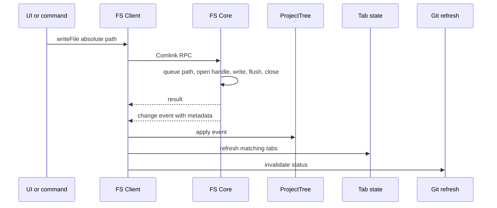
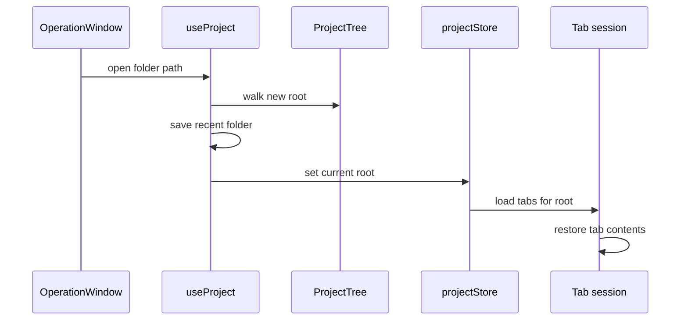
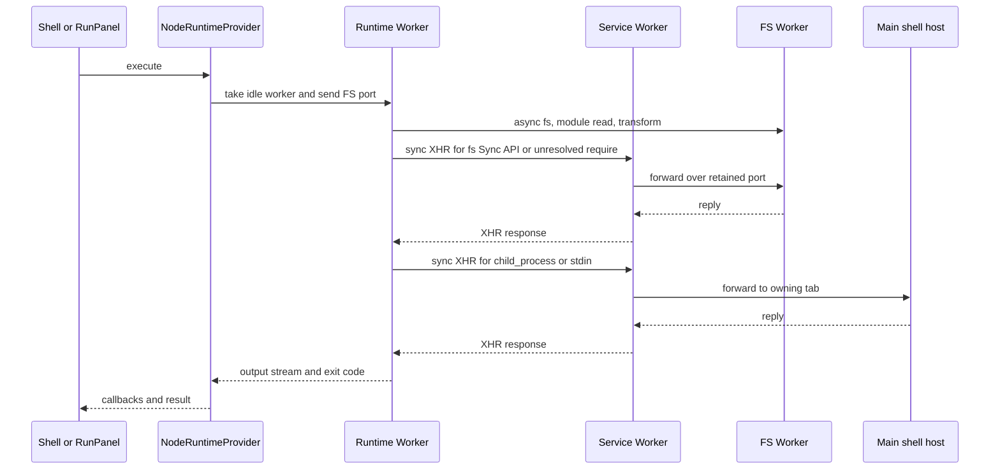
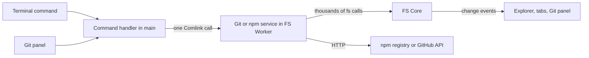

# 層をまたぐ処理の流れ

各機能内部の詳細はdomain文書にある。ここでは複数のcontextをまたぐ流れだけを扱う。

## ファイル操作と変更の伝播

変更eventは`create`・`update`・`delete`・`rename`で、絶対pathとentry metadataを運ぶ。受け手は内容を読み直す必要があるものだけが読む。

| 受け手 | 反応 |
|---|---|
| Explorer tree | create/delete/renameのmetadataで構造を直接更新し、100 msごとにまとめてUIへ出す。`update`は構造を変えない。中身を知らないfolderが移動で入ってきた時だけ、そのsubtreeをwalkする。root全体のwalkは初回、root切替、明示refreshだけ |
| 開いているタブ | create/updateで該当pathを読み直してタブ内容を差し替える。未保存編集があるタブと自分の保存中pathには適用しない。delete/renameでタブを閉じる・pathを付け替える |
| WebPreview・検索結果・`.pyxis/settings.json` | 各自のlistenerで再読込 |
| Git panel | active root配下（`.git`を含む）の変更で100 ms debounceしてstatusを取り直す。取り直しは直列化し、待ちは最新1件だけ残す |

構造だけをeventで更新する理由: 大きなworkspaceやnpm install直後に毎回root全体を走査すると、走査がFS Workerを占有してterminalのpromptなど後続処理を待たせる。

## Workspaceの切替

- 非同期処理の完了時に現在のrootを確かめ、古いrootの結果を新しい画面へ書かない。tree読込、タブsession読込、タブ内容の復元が同じ規則に従う。
- タブ復元はroot pathとsession世代番号に結び付く。同じrootを開き直しても新しい世代になり、古い復元は完了通知も出せない。

## Node実行

- 非同期要求はMessageChannelでFS Workerへ直結し、mainを通らない。
- 同期要求はService Workerが中継する。mainを経由するのは`child_process`のshell実行とstdin読取だけで、mainがbusyでもfile I/Oは進む。
- Service Workerがportを失っていたらmainへ再送を求め、受領確認後に同期要求を再開する。
- 静的に分かる依存は非同期で先読みし、同期RPCは実行時にしか分からない解決先だけに使う。

## Git・npm・検索

Gitとnpm installはFS Worker内で動き、mainからは1操作1 RPCになる。isomorphic-gitはFS Coreのadapterを通してworktreeと`.git`を同じOPFS treeから読むので、`.gitignore`で同期対象を絞るコピー層はない。内容検索もFS Worker内で走査し、一致したmetadataだけをmainへ返す。

## 外部通信

| 通信先 | 発信元 | 用途 |
|---|---|---|
| npm registry | FS Worker | metadataとtarball |
| GitHub REST API | main / FS Worker | 認証確認とpush |
| Gemini API | main | AI Ask/Edit |
| 同一originの静的file | main | 拡張機能bundle、翻訳JSON |
