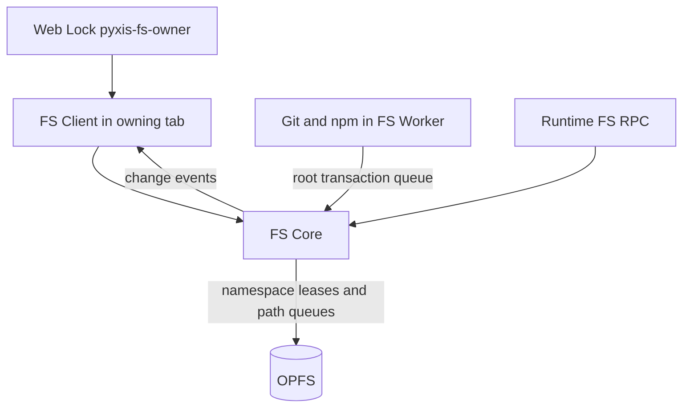

# 保存境界とpathモデル

## 保存先

| 保存先 | 内容 | 性質 |
|---|---|---|
| OPFS | workspace、`.git`、`node_modules`、runtime変換cache `~/.cache/pyxis`、npm cache `~/.npm`、symlink record | 唯一の永続ファイルシステム |
| FS Worker memory | `/tmp`配下のfileとsymlink | 揮発。FS Worker終了で消える |
| IndexedDB `pyxis-global` | タブ・ペイン状態、AIチャット、AIレビュー、翻訳cache、keybindings、user preferences（画面layout、Quick Open MRU、terminal履歴）、拡張機能のmanifestとcode cache | 検索・属性が必要なmetadata |
| IndexedDB `PyxisRecentFolders` | 最近開いたfolder。keyはroot path | metadata |
| IndexedDB `PyxisAuth` | 暗号化したGitHub PAT | 認証 |
| localStorage | theme、言語、既定editor、Gemini APIキー、PAT暗号鍵、一部UI状態 | 小さな設定値 |

IndexedDBはファイル内容の第二の置き場ではない。OPFSにはindexも任意属性もないため、keyで引く・属性を持つデータだけをIndexedDBに置く。workspaceに属するmetadata（タブ、チャット、AIレビュー、MRU）はroot pathでscopeする。

`ProjectFile`はFS entryの要約で、絶対path・種別（file/folder/symlink）・size・mtimeだけを持つ。内容、project ID、親pathは持たない。内容は必要な時にOPFSから読む。

## Pathモデル

- FSは`/`から始まる1つのtree。旧来のAppPath・`/projects/<id>`形式・Git用pathの3形式とその変換は廃止した。
- 配置はLinuxのFHS/XDGに従う。`HOME=/home/pyxis`、新規workspaceは`~/<name>`、runtime cacheは`~/.cache/pyxis`、npm cacheは`~/.npm`、`/tmp`は揮発。shellの`~`、`process.env.HOME`、`os.homedir()`は同じHOMEを指す。shell・Node・npmがHOME基準で期待する配置をそのまま使うため。
- workspace = 開いた絶対folder（VS Code型）。Explorerとdefault cwdの範囲を決めるだけで、別のpath名前空間は作らない。terminalとruntimeはworkspace外の絶対pathにも自由にアクセスできる。実際のshell・Nodeと挙動を揃えるため。
- 字句処理はNodeのPOSIX path実装を全層で共有する。FS境界は絶対pathだけを受け取り、相対pathは呼び出し側が明示したcwdで解決する。FS・runtimeに暗黙のcwdはない。
- `~`・glob・quote・変数の展開はshell parserだけが一度行う。FS APIとruntimeの`fs`はshell展開をしない。これでNodeの`fs`とterminalのpath意味論が一致する。

## 所有と並行性

- 1 tabだけがFS Workerを持つ。2つ目のtabはlock取得に失敗し、起動時エラーになる。
- main、runtime、Service WorkerからのRPC全体は直列化しない。通常のfile accessはpath単位に順序付け、同じpathへの競合を防ぐ。namespaceの共有・排他leaseはpath解決中の構造変更を調停し、directory create/remove/renameと初期化を排他する。
- Gitとnpmはcanonical rootごとにtransaction queueで順序付ける。root pinはその処理中にworkspace rootがremove/renameされるのを防ぐ。これらの長い処理中も、無関係なeditor/runtime file accessは継続できる。
- 読込はWorker内の`SyncAccessHandle`を1操作で開閉する。永続書込みは`FileSystemWritableFileStream`へstageし、`close()`でcommitする。開いた`SyncAccessHandle`を保持しない。
- FS Coreがcacheするのは直近に成功したpathのdirectory handle chainだけ。file handleと内容はcacheしない。正本をOPFSの1つに保つため。
- 変更eventはFS Coreだけが発行し、FS Clientがmain側のlistenerへ配る。

## Bytesの保持

file payloadはOPFS、FS Worker、Git、旧storage移行、upload/download、ZIP、npm tarball、runtimeのstreamとpipeをraw bytesのまま通る。text decodeは明示した境界だけで行う。

| decode境界 | 内容 |
|---|---|
| `readText` | UTF-8 decode |
| runtimeの`fs` encoding指定 | Node互換のencoding変換 |
| module変換 | 変換が必要なsourceだけUTF-8 decode |
| UIのfile表示 | 読んだbytesを分類し、textならエディター、binaryならbinary editorやpreviewへ |
| terminal表示 | 出力bytesを表示直前にdecode |
| GitHub push | transport用にBase64化 |

過去に複数経路で文字列化してbytesを壊した経緯は [binary文字列化の事故](../knowledge/incidents/2026-10-07-binary-stringified.md)。

## 旧storageからの移行

旧構成（`PyxisProjects`のfile、lightning-fs `pyxis-fs`の`.git`、projectId keyのmetadata）を起動時に一度だけOPFSとroot path keyへ移す時限処理。ブラウザー内にしかないデータは失うと復元できないため、コピーとbyte検証が通るまで旧DBを消さない。2027年4月頃を目安に削除する。詳細は [filesystem](../domain/filesystem.md#旧storage移行)。
