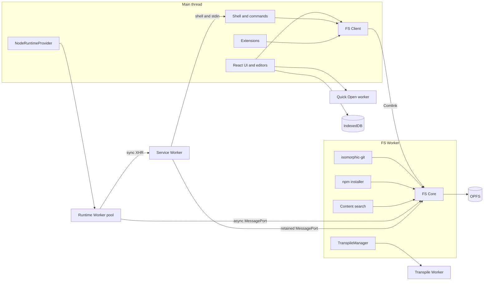
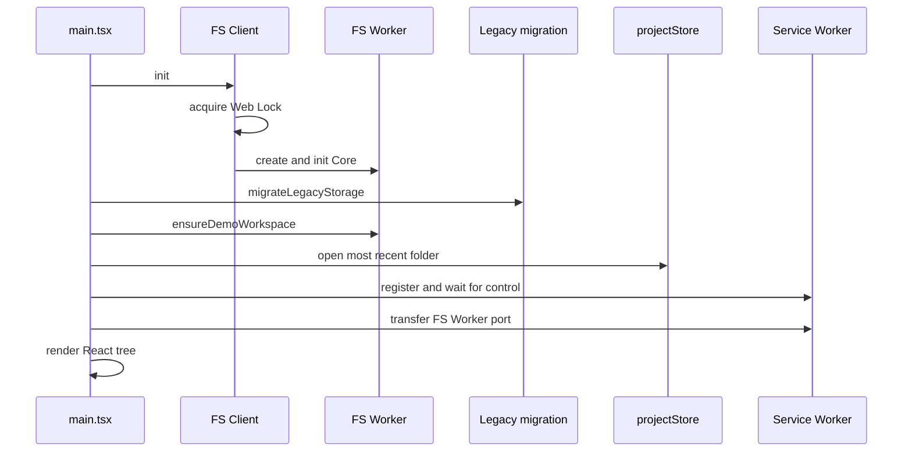

# システム全体像

Pyxisはサーバーを持たないブラウザー完結のIDE。ファイル、Git履歴、`node_modules`、設定はすべてブラウザー内に保存され、外部通信はnpm registry、GitHub API、Gemini API、拡張機能・翻訳ファイル取得などに限られる。

## 設計原則

| 原則 | 理由 |
|---|---|
| ファイルの正本はOPFSの1つだけ | 旧構成はIndexedDBとlightning-fsに二重保存し、同期処理とpath変換が全層に散っていた。二重管理を構造的になくす |
| OPFSに触るのはFS Workerだけ | `SyncAccessHandle`は排他lockなので所有者を1つにし、変更eventの発生源も1か所にする |
| ファイルI/Oの多い処理はFS Workerで動かす | Git・npm installは1操作でfsを数千回呼ぶ。main threadとの往復を挟まない |
| Node runtimeはRuntime Workerで動かす | 同期`require`と`fs.*Sync`を同期XHRで実現する。止まるのは呼んだWorkerだけで、UIは止まらない |
| SharedArrayBufferを使わない | COOP/COEPが必要になり、同一originのWebPreview iframeが外部CDNや画像を読めなくなる。Safariは`credentialless`も未対応 |
| file識別子は正規化済み絶対path | OPFS entryに属性を付けられないため、別IDを持つと二重管理が再発する |
| 常駐Workerを増やさない | page全体のメモリ目標は400 MB。Workerごとにcodeやwasmを抱えるため、並列処理は既存Worker内でboundedに行う |
| 単一tab | Web Lock `pyxis-fs-owner`を取れない2つ目のtabは起動時にエラーで止まる |

判断の背景と記録は [STORAGE_INTENT](../plan/STORAGE_INTENT.md)、移行計画は [OPFS移行計画](../plan/opfs-migration.md)。

## 実行コンテキスト

| Context | 役割 | 寿命 |
|---|---|---|
| Main thread | React UI、Monaco/CodeMirror、xterm、shell parseと実行、拡張機能、IndexedDB metadata、AI通信 | page |
| FS Worker | OPFS唯一の所有者。FS API、Git、npm install、内容検索、runtime向けFS RPCとmodule変換cache | page。Web Lock取得後に1つだけ生成 |
| Transpile Worker | esbuild-wasmと拡張機能が登録したTypeScript変換 | FS Workerが必要時に1つ起動し、30秒idleで破棄 |
| Runtime Worker | Node互換runtime。1実行が1 Workerを占有 | 待機Workerを1つ先行起動。正常終了で待機へ戻し、停止・異常終了で破棄 |
| Service Worker | Runtime Workerの同期XHRを受け、FS WorkerのMessagePortへ中継。shell・stdin要求だけはFS所有tabのmainへ渡す。アイコンのcache | browser管理。再起動でportを失うとmainへ再送を要求 |
| Quick Open worker | OperationWindowのfile名fuzzy検索 | OperationWindow使用時 |

Runtime WorkerとFS Workerを分ける理由: 同期XHRで止まったWorkerは自分宛ての応答を処理できない。FS処理を同じWorkerに置くとdeadlockする。同期要求がmainを経由しないのは、main threadがbusyでもruntimeのI/Oを進めるため。

## 層構造

| 層 | 場所 | 責務 |
|---|---|---|
| UI | `src/components/` | 画面、エディター、ターミナル表示、パネル |
| Application | `src/stores/`、`src/hooks/`、`src/context/` | valtio store（workspace root、タブ、ログ）、画面とengineの調停 |
| Engine | `src/engine/` | FS、shellとコマンド、runtime、拡張機能、タブ種別、AI、i18n、IndexedDB adapter |

UIはOPFSもIndexedDBも直接開かず、FS ClientとEngineのstorage adapterを通す。現在のworkspace rootは`projectStore`だけが持つ。

## 起動順序

- FS Core初期化で`/home/pyxis`、`~/.cache/pyxis`、`~/.npm`、symlink record領域を作る。
- 旧storage移行はseedより前に走る。移行は既存の移行先を見つけると停止するので、先にseedすると旧project `demo`が移行できなくなる。
- `~/demo`は存在しない場合だけ生成済み`initial_files/`で作る。新規workspaceは空。
- Service Workerが未制御なら一度だけreloadする。reload後も未制御（Shift+reload等）なら通常reloadを求めるエラーで停止する。
- どの段階の失敗もReact描画前に画面へエラーを表示して止まる。

## サブシステム一覧

| 領域 | 文書 |
|---|---|
| FS・OPFS・symlink・旧storage移行 | [filesystem](../domain/filesystem.md) |
| Shell・Terminal・Vim | [shell](../domain/shell.md)、[terminal](../domain/terminal.md)、[vim](../domain/vim.md) |
| Node runtime・RuntimeProvider | [node-runtime](../domain/node-runtime.md)、[runtime-provider](../domain/runtime-provider.md) |
| npm・Git | [npm](../domain/npm.md)、[git](../domain/git.md) |
| エディター・タブ・Quick Open・Markdown preview | [editor](../domain/editor.md)、[operation-window](../domain/operation-window.md)、[markdown-preview](../domain/markdown-preview.md) |
| 拡張機能・AI・i18n | [extensions](../domain/extensions.md)、[extension-authoring](../domain/extension-authoring.md)、[ai](../domain/ai.md)、[i18n](../domain/i18n.md) |

保存境界とpathモデルは [storage](storage.md)、層をまたぐ処理の流れは [data-flow](data-flow.md)。
