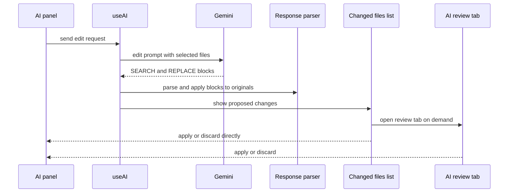

# AI機能

browserからGoogle Gemini APIへ直接要求する。Ask（質問）とEdit（file編集提案）の2 mode。実装は`src/engine/ai/`、`src/hooks/ai/`、`src/components/AI/`。

## 通信

| 項目 | 内容 |
|---|---|
| endpoint | `v1beta/models/gemini-2.5-flash:generateContent`。APIキーはquery `?key=` |
| APIキー | localStorage `gemini-api-key`。設定panelで入力。未設定なら要求しない |
| Ask | temperature 0.7、最大2048 token |
| Edit | temperature 0.1、最大4096 token |
| commit message生成 | Git panelから。同じmodel、temperature 0.7、日本語prompt |

retry、cache、streaming、token管理はない。HTTP errorは例外として呼出し元へ返る。
同時に複数要求した場合は全要求が終わるまで処理中表示を保つ。要求中にworkspaceまたはchat spaceを切り替えた場合、古い応答は切替先の履歴やAI reviewへ追加しない。
chat spaceの作成・user messageの保存に失敗した場合はGemini要求を開始せず、入力を残してalertとOutputへerrorを表示する。Edit応答もassistant messageとして保存できなければAI review entryを作らない。
AIへの入力は送信が受け付けられた後にだけ消去する。要求を受け付けられない、または送信処理が失敗した場合は入力draftを保持する。
未送信draftはworkspace単位でメモリに保持し、workspaceやAsk/Editを切り替えて戻った時も復元する。保存先は持たず、reload後の復元対象ではない。送信完了時は送信中に編集された新しいdraftを消さない。
chat space履歴の読込、名称変更、削除が失敗した場合は履歴を成功したように更新せず、panelとOutputに原因を表示する。

AI panelの入力はEnterで改行、Ctrl/Cmd+Enterで送信、Alt+上下キーで履歴を移動する。IME変換中とkeyCode 229のkeydownはshortcutとして処理しない。

## Context

- 右sidebarのAI panelがworkspaceのtext fileを読み、Stassheが選んだfileの全内容をpromptに入れる。
- file contextの全体読込はworkspaceのtree準備後に一度行う。tree更新ごとの全file再読込は行わない。metadataだけのfile選択では対象fileをFSから読み、選択保存の失敗はpanelとOutputへ表示する。切替前やpath変更前の非同期読込結果は反映しない。選択状態の引継ぎは同じworkspace内に限る。
- filesystem renameでは選択pathを新pathへ移し、folder renameなら子孫pathも移す。deleteでは対象path以下のcontextと選択を除く。内容更新は対象cacheを即時除き、選択中のfileだけ再読込する。読込完了までprompt対象から外し、古い非同期読込結果は反映しない。初回読込中の変更はpath単位で判定し、変更されていないfileは保持する。選択・除外はReactの再描画前でもpromptへ反映する。
- custom指示: 選択に関係なく、pathが`.pyxis/pyxis-instructions.md`（どの階層の`.pyxis`でも可）か`pyxis-instructions.md`のfileを`<custom_instructions>`で囲んで入れる。
- 会話履歴は直近5件、各500文字まで。Editの応答は変更fileと説明に要約して入れる。

## Edit

- 応答形式: fileごとに`### File: path`と`**Reason**:`、既存fileは`<<<<<<< SEARCH` / `=======` / `>>>>>>> REPLACE`、新規fileは`<<<<<<< NEW_FILE … >>>>>>> NEW_FILE`。この形式がなければ旧形式（`<AI_EDIT_CONTENT_START:path>`）として解析する。
- pathはworkspace rootから絶対pathへ解決する。応答に出たが選択外のfileはFSから読み、なければ新規file扱い。
- SEARCHの照合順: 完全一致→行末空白を無視→1行目で候補を絞った曖昧一致（行一致1、部分一致0.7、閾値0.6超）→挿入位置推定。照合できなかったblockは捨てられ、当たった分だけが提案になる。改行はLFに揃える。
- 応答を受けてもfileへは保存せず、変更一覧から直接適用・破棄するか、レビュータブ（Monaco diff）を開く。タブはroot・file・元messageで識別する。狭いpaneではタイトル・path・操作ボタンを折り返す。レビューtab closeではDiffEditorから保持中modelをdetachしてから親がmodelをdisposeし、editor自体はwrapperがdisposeする。レビュータブの編集はタブ状態へ即時反映し、AI review entryへデバウンス保存する。closeとworkspace切替前はpending draftをflushし、失敗時はタブと編集を残して操作を中止する。再表示時は保存済みdraftを優先する。
- レビュータブからの適用は未保存のfileタブがないことと元fileの内容を確認してから、UTF-8 BOMを保って書く。編集可能なsuggestedContent draftと、適用時に実際に書いた内容の固定snapshotは別に保持する。chat messageには適用前と実書込内容を記録し、AI review entryは適用済み状態とrollback用snapshotを保持する。レビュータブの破棄はAI review entryを削除できた場合だけ閉じる。
- レビュータブからのrollbackはfileが記録済みの適用内容と一致する場合だけ実行し、元snapshotへ戻して状態と履歴を更新する。実適用内容のsnapshotがない旧記録はrollbackできず、fileを変更しない。変更一覧からの直接適用・破棄は従来どおりレビュー記録を削除する。
- メッセージ単位の巻き戻し: 対象message以降のfileを元に戻してから履歴を削除する。適用済みfileは適用時に実際に書いた内容と一致する場合だけ戻す。Stassheが後から編集したfileは保持し、rollback全体を中止する。適用内容のsnapshotがない履歴は安全に照合できないため、fileと履歴を変更せず失敗する。新規fileは削除、既存fileは適用直前の元内容を書き戻す。複数fileはすべて成功してから履歴を削除し、履歴末尾が巻き戻し計画後に変わった場合は削除を中止する。
- chat adapterの保存・作成・削除は同じ画面内の購読hookへ変更snapshotを通知する。各hookはrootを照合して一覧と選択中spaceを更新するため、別AI Reviewタブでのapply・rollback・discard後も再読込なしで会話表示が追随する。
- Monaco CDN runtime pathはinstalled `monaco-editor` package versionから導出し、型定義と実行中runtimeのversionを揃える。loader設定はReact editor初期化より前に行う。

## 保存

IndexedDB `pyxis-global`。

| store | key | 内容 |
|---|---|---|
| `chat_spaces` | `chatSpace:<root>:<spaceId>` | 会話。更新はchat keyごとに直列化され、各更新で最新recordに適用 |
| `ai_reviews` | `aiReview:<root>:<filePath>` | 提案内容、提案時の元内容、状態、履歴。Editの応答ごとにfile単位で保存 |

## 実装上の注意

- chat space数に上限はない。更新はkeyごとに直列化するため、連続する追加・編集を最新recordに反映する。選択file更新は対象spaceが消えていたら失敗する。
- AI review entryの更新・削除は直列化された保存区間で元messageを確認する。同じfileへ新しい提案が届いた場合、旧タブのdraft・適用・破棄から新しいentryを変更しない。通常のcloseはdraftを保存し、明示的な提案破棄は対象entryの削除成功後に同じ識別子のタブだけ閉じる。
- 適用済みの印と実際に書いた内容は対象のEditメッセージに保存する。適用後の巻き戻しはfileが実際に書いた内容と一致する場合だけ行う。適用内容snapshotがない履歴はfileと履歴を変更せず失敗する。
