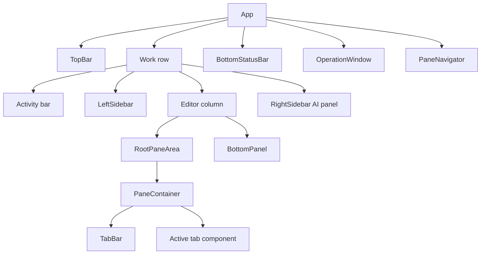
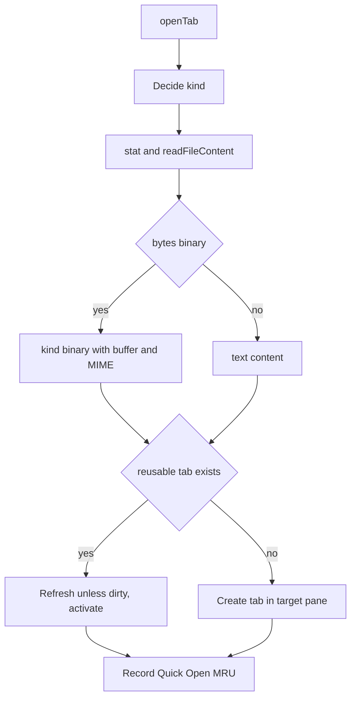
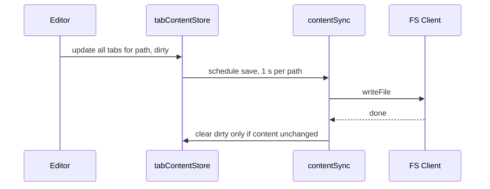

# エディター・ペイン・タブ

画面構成、分割ペイン、タブ種別、保存とsession復元、設定とkeybinding。Quick Openとfolder選択は [operation-window](operation-window.md)、Markdown previewは [markdown-preview](markdown-preview.md)。

## 画面構成

- 左端のactivity barでExplorer・検索・Git・Run・拡張機能・設定・拡張panelを選ぶ。選択中を再度押すと左sidebarを閉じる。workspaceが開かれていなければ左sidebarは出ない。
- 右sidebarはAI panel。editor列と下部panelの右に全高で置く。
- 左右sidebarはdesktopでは保存された幅で表示する。幅640px以下ではactivity barの右にExplorer、editor、AI panelをこの順に縦に並べ、表示中の各領域へ同じflex比率で高さを割り当てる。sidebarの保存幅と横resize handleは狭幅レイアウトに影響しない。editor内の下部panelは領域の40%を上限に縮み、paneの高さを残す。desktopへ戻ると保存幅を使う。
- 下部panelはProblems・Output・Terminal。panelを閉じるとTerminalごとunmountされる。panel内ではTerminalは常時、Output・Problemsは初回表示後mountを保つ。
- session読込中は「Loading session...」、タブ内容の復元中は「Restoring content...」を重ねる。
- 起動時にworkspaceがない、または開けなければOpen Folderを1回開く。
- 各領域の幅・高さ・表示状態はIndexedDB `user_preferences`の`ui-state`（rootに依らず1つ）へ、最後の変更から3秒後に保存する。
- 起動時、`AppInitializer`が組み込みタブ種別、組み込みruntime、拡張機能の順に登録する。タブsessionの読込はこの後に走るので、復元時にタブ種別が揃っている。
- Explorerのrename・内部drag移動は、移動先がすでに存在すればエラーとして中止する。ExplorerはFS renameのno-overwrite optionを使い、importと空file作成もexclusive createで既存fileを保護する。folder importでは相対pathの親folderを作る。作成・削除・download・import・moveの失敗はalertとOutputに表示され、workspace切替後に残りの複数file importは続行しない。FS APIのrenameは既定で既存destinationを置換する。

## ペイン

- `EditorPane`は葉ならタブ列、内部nodeなら子ペインと`layout`（`vertical`=横並び、`horizontal`=縦積み）とsizeを持つ木。rootのペインは横並びで、境界は10〜90%に制限する。rootのsizeはseparator幅を除いた領域に対する割合。
- 分割で葉は2子（既存タブと空ペイン、各50%）の内部nodeになる。ペイン削除で子が1つになった内部nodeはその子に置き換わる。
- 各ペインでmountするのはactiveなタブのcomponentだけ。Monaco modelはfileごとに1つを`inmemory://workspace/<path>`で持ち、LRUで5個まで保持する（TypeScriptのfile間解決のため）。
- drag & drop: タブとExplorerの項目を受ける。上端40 pxはタブ列、外周25%は上下左右の分割、それ以外は中央。タブを中央へ落とすと移動（同じペインなら無視）、端なら分割して移動。fileなら開く・分割して開く。folderは無視。タブ列内の並べ替えはタブの左右半分で位置を決める。
- PaneNavigator（Ctrl+M）: 1〜9で直接選択、矢印・`j k l`で移動、Enterで確定、`v`/`h`で分割、`d`で削除。`h`は移動ではなく分割に割り当たっている。

## タブ

タブ状態はvaltioの`tabState`（ペイン木、active pane・tab、読込flag、session世代）に、内容は`tabContentStore`（tabIdごとの内容・buffer・dirty）に分ける。内容の変化でApp全体を再描画しないため。

| kind | ID | 再利用 | session |
|---|---|---|---|
| `editor` | path＋時刻＋乱数 | 同じpath | 内容を捨て、fileから復元 |
| `diff` | `diff-…` | commitとpath | そのまま保存。復元不要 |
| `ai` | root・file・元messageの組 | 同じroot・file・元message | 元内容は保存せずfileから読む。提案draftはmetadataへ保存 |
| `webPreview` | `webPreview:<path>` | path | 復元不要 |
| `preview` | `preview:<path>` | 同kind・path | fileから復元。binaryならbinaryへ |
| `binary` | `binary-<path>` | 同kind・path | fileから復元。textならeditorへ。Git snapshotは保存しない |
| `merge-conflict` | `merge-conflict:<ours>-<theirs>-<時刻>` | branch組 | 復元不要 |
| `settings`、`welcome`、`extension-info` | 固定 | | |
| `extension:<id>` | `extension:<id>:<resource>` | 拡張次第 | dataをそのまま保存。種別が未登録なら登録まで「Loading extension...」 |

### fileを開く

- binary判定: file-typeがMIMEを検出、既知のbinary拡張子、NULを含む、UTF-8として不正、のいずれか。SVGはtextとして開く。
- file読込は開始時のrootとsession世代に結び付ける。読込中にworkspaceが切り替われば、旧fileのタブ追加・既存タブの内容更新・active切替を行わない。同じrootへ戻った場合も世代で区別する。
- editorはMonacoが既定。localStorage `pyxis-defaultEditor`が`codemirror`ならCodeMirrorで開く。Explorerの右クリック「Open」はMonaco、「Open in CodeMirror」はCodeMirrorを明示する。開いているfileでは同じタブのeditorだけを切り替え、未保存内容を保持する。通常の再openは既存editorの選択を変えない。行・列jumpはMonacoだけ。
- 個別タブを閉じる時はfileに未保存編集があれば確認し、確認後は編集を破棄する。タブ固有draftはclose前に保存する。全タブを閉じる・ペイン削除・workspace切替はタブ固有draftとdirty fileを先に保存し、失敗したら操作を中止する。file削除は未保存編集・draftのあるタブを残す。

## 保存

- 同じpathを開く全タブ（editor・diff・ai）の内容を一緒に更新し、Monaco modelの更新はidle時にまとめる。
- 外部更新後のMonaco model同期が同じ内容を`onChange`で返してもdirtyにしない。storeの内容と異なるeditor入力だけを編集として保存する。
- 保存完了後にstoreの最新内容を見て、保存した内容と同じ時だけdirtyとtimerを消す。保存中の入力を巻き戻さないため（[incident](../knowledge/incidents/2026-05-30-async-save-edit-race.md)）。binaryのfileへtextを書く保存は拒否する。
- close/workspace切替前のflushはタブ種別固有のdraftを保存し、保存中に増えたfile編集も再度保存してから完了する。編集可能なdiffもtab内容の更新時にsession用の`latterContent`を同期する。
- Ctrl+Sはtimerを待たずに保存する。Git panelはworkspace内のfilesystem changeを100 msでまとめて更新するため、同じfileを複数paneで開いても更新は1回にまとまる。
- workspace切替では新workspaceの準備後、rootを確定する直前に現在のsessionを保存し、再度dirty fileをflushする。保存に失敗した場合はrootを切替えず、既存タブとdirty内容を保つ。新sessionを読む直前にもdirty fileをflushし、失敗時はpaneと内容を消さない。

外部変更（terminal、Git、AIなどによる書込み）は変更eventで受け、そのpathにdirtyなタブがなく、自分の保存中でもなければ読み直して反映する。dirtyなら黙って外部変更を見送る。削除されたpath以下のcleanなタブは閉じる。dirtyまたはdraft保存中のタブは残し、古いtimer/saveを無効化してOutputと保存error listenerへ通知する。renameはタブのpathと保存timerを付け替え、editor・preview・binaryの名前とAI reviewの対象path・名前も更新する。

## Session

| 項目 | 内容 |
|---|---|
| 保存先 | IndexedDB `tab_state`、key `tabState:<root>` |
| 保存内容 | ペイン構造とタブのmetadata。file内容と未保存編集は保存しない |
| 保存時期 | 構造・active pane・active tabの変化から1秒後。読込中と別rootへは書かない |
| 読込 | 世代番号を進め、root切替の度に読む。awaitの後で世代とrootを確かめ、違えば捨てる |
| 内容復元 | `useTabContentRestore`がタブ種別の`restoreContent`か既定のfile読込で内容を戻す。書き戻す前に世代とrootを再確認し、その間にdirtyになったタブは保つ。file読込に失敗したタブは再復元待ちのまま編集不可にし、path付きerrorを画面とOutputへ出す |

root切替をまたいで古い復元が完了扱いになる不具合の経緯は [incident](../knowledge/incidents/2026-10-08-restore-flag-folder-switch.md)。

## 設定

- workspace単位: `<root>/.pyxis/settings.json`（editor、theme、search・filesのexclude、Markdownの改行と数式区切り）。なければ既定値を返しfileは作らない。更新はsectionごとの浅いmergeで、配列は置き換え。fileの変更eventで読み直す。
- Explorerの展開状態はroot別のlocalStorageへ保存する。root変更時にFileTreeを再mountし、新rootの展開状態を復元してから保存する。旧rootのSetを新rootのkeyへ書き込まない。
- browser単位（localStorage）: 既定editor、Gemini APIキー、最後に実行したfile、言語、theme名。
- 設定panelは設定の変更通知のたびに`settings.json`の`theme.colorTheme`を適用するので、localStorageで選んだthemeが上書きされうる。

## Keybinding

IndexedDB `keybindings`の`user-keybindings`に保存し、起動時に不足する既定値を足す。ショートカット設定タブ（Ctrl+Shift+J）で重複を拒否しながら変更できる。

| 分類 | 既定 |
|---|---|
| file | 保存 Ctrl+S、Quick Open Ctrl+P |
| 表示 | 左 Ctrl+B、右 Ctrl+Shift+B、下 Ctrl+J、設定 Ctrl+,、Explorer Ctrl+Shift+E、拡張 Ctrl+Shift+X、検索 Ctrl+Shift+F、Git Ctrl+Shift+H、Markdown preview Ctrl+K P、折返し Alt+Z |
| タブ | 閉じる Ctrl+Shift+Q、次・前 Ctrl+Tab・Ctrl+Shift+Tab、次のペインへ Ctrl+K M、全部閉じる Ctrl+K W |
| ペイン | Navigator Ctrl+M、分割 Ctrl+K V・Ctrl+K H、閉じる Ctrl+K D、移動 Ctrl+K L・Ctrl+K J |
| 実行 | Run panel Ctrl+Shift+R、下部panel表示 Ctrl+@ |
| workspace | Open Folder Ctrl+K Ctrl+O、Open Recent Ctrl+R |

- captureで全keydownを受ける。IME変換中は無視。chordの1打目の後は次のkeyまで全入力を止める。入力欄の中では修飾付きkeyだけを扱い、Ctrl/Cmd+C・X・V・Aは通す。
- Macでは先頭の`Ctrl+`をCmdに読み替える。chordの2打目は読み替えないので、Open FolderはCmd+K→Ctrl+O。
- `saveFileAs`（Ctrl+Shift+S）、`newFile`（Ctrl+N）、`runSelection`（Ctrl+Alt+R）は定義だけでhandlerがない。

## 内容検索

左sidebarの検索はFS Worker内で走査する（[filesystem](filesystem.md#内容検索)）。file数50以下なら入力停止300 ms後に自動検索、それ以上は明示実行。結果はroot・query・optionごとにcacheし、root切替でcacheと進行中検索を破棄し、root内の変更eventでもcacheを捨てる。置換は1行・1 file・全結果の単位でFS Clientへ直接書き、開いているタブは外部変更として反映される。除外は`settings.json`の`search.exclude`と`files.exclude`を使い、`search.useIgnoreFiles`が有効なら各階層の`.gitignore`も適用する。除外globはpath全体と照合する。
