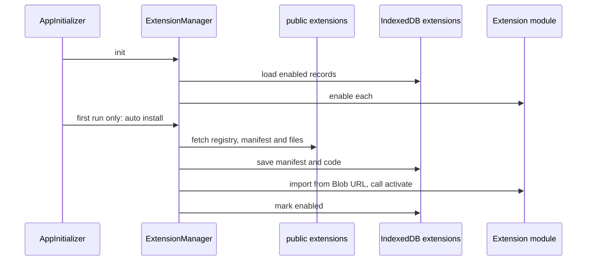

# 拡張機能システム

拡張機能はmain threadで動くES moduleで、ホストが`activate(context)`にAPIを渡す。配布元は同一originの`public/extensions/`、install後はIndexedDBに保存したcodeから読み込む。IDE側の拡張機能管理とAPIは`src/engine/ide/extensions/`、作者向けの型は`extensions/_shared/`。作り方は [extension-authoring](extension-authoring.md)。

## 同梱拡張

| id | type | 既定 |
|---|---|---|
| `pyxis.binary-editor` | ui | 有効 |
| `pyxis.calc`、`pyxis.chart-extension`、`pyxis.react-preview`、`pyxis.note-tab`、`pyxis.todo-panel`、`pyxis.test-multi-file` | ui | 無効 |
| `pyxis.sample-command` | tool | 無効 |
| `pyxis.typescript-runtime` | transpiler | 無効 |
| `pyxis.python-runtime` | language-runtime | 無効 |
| `pyxis.lang.<locale>` 20言語 | service | 無効。初回起動時にbrowser言語のものだけ自動で入る |

`type`（`builtin-module`・`service`・`transpiler`・`language-runtime`・`tool`・`ui`）は分類labelで、loaderは分岐に使わない。

Extensions panelの管理操作・件数・検索・確認・失敗表示は`common.extensionsPanel`の翻訳を使う。20言語のkeyと補間parameterを揃え、拡張自身のname・description・readmeはmanifestの内容を表示する。

## Lifecycle

- **起動**: `AppInitializer`が組み込みタブとruntimeを登録してから`initializeExtensions`を呼ぶ。React・ReactDOM・Markdown系libraryを`window.__PYXIS_REACT__`等へ公開し、IndexedDBで有効になっている拡張を順に有効化する。2回目以降の起動はnetworkに出ない。
- **自動install**: registryの`defaultEnabled`拡張と`navigator.language`の基底言語pack（`zh-TW`は選ばれない）を選ぶ。成功した拡張IDをIndexedDBへ記録し、途中失敗した項目だけを次回起動で再試行する。
- **install**: manifestと`entry`・`files`をfetchしてIndexedDB `pyxis-global`の`extensions` storeへ保存し、続けて有効化する。宣言されたfileの取得失敗はinstallを失敗させる。有効化失敗時は保存済みpackageを無効状態で残し、Extensions panelはその状態を再読込してInstalledへ表示する。追加fileはbytes内容から判定し、binaryはMIME付きBlobとして保持する。依存ID（`dependencies`）は警告を出すだけで、自動installも中断もしない。fileのURLはmanifest URLではなくIDから決まる: `pyxis.lang.X`は`/extensions/lang-packs/X/`、他は`/extensions/<pyxis.を除いたID>/`。
- **ZIPからのinstall**: Extensions panelの「Import .zip」。rootの`manifest.json`を優先する。
- **有効化**: `onlyOne`が同じ拡張が有効なら先に無効化する。有効化に失敗した拡張は`enabled=false`を保存してから、無効化したpeerの復元を試みる。復元に失敗したpeerはconsole errorへ記録する。context（Tab・Sidebar・ExplorerMenu APIを含む）を作り、moduleを読んで`activate`を呼ぶ。
- **module読込**: entryと参照された相対moduleをBlob URLにし、side-effect・static/re-export・文字列literalのdynamic importを解決する。nested importはimport元moduleのdirectoryを基準に解決し、拡張子なしでは`.js`・`.mjs`・`.ts`・`.tsx`、次に同名directoryの`index`を探す。bare specifierはloaderでは変換しない。循環する相対import graphとJS escape sequenceを含むspecifierは拒否する。式を使うdynamic importはresolverの対象外で、書換えず残す。実行中のdynamic importでも使えるようBlob URLは拡張の無効化まで保持し、deactivate後に解放する。
- **無効化**: system-module購読、タブ・panel・menu・コマンドの登録、runtime・transpilerを解除し、拡張タブを閉じてから`deactivate()`を呼ぶ。
- **更新**: 既存packageを一時置換して有効化する。停止・保存・有効化のどこかで失敗した場合は旧packageを戻して元が有効なら再度有効化する。再有効化に失敗した場合は旧packageを無効状態で保存し、console errorへ記録する。
- registryは1分memoryにcacheする。

## Context API

| API | 内容 |
|---|---|
| `tabs` | `registerTabType`で`extension:<id>`種別を登録。`createTab`・`updateTab`・`closeTab`・`onTabClose`・`getTabData`・`openSystemTab`。タブIDは`extension:<id>:<resourceId>`で、自分の接頭辞のタブだけ操作できる |
| `sidebar` | 左sidebarのpanel。`createPanel`・`updatePanel`（stateを浅くmerge）・`removePanel`・`onPanelActivate`。`order`昇順（既定100） |
| `commands.registerCommand` | terminalコマンド。解除関数を返す。名前空間は全拡張で1つで、同名は警告して上書き。shellは組み込みより先に拡張コマンドを探す |
| `explorerMenu` | file treeの右クリック項目。file/folder、拡張子、binaryだけ等の表示条件 |
| `getSystemModule(name)` | `fsClient`、`pathUtils`、`workspace`（root取得・購読）、`keybindings`、`workerRuntime`（Worker pool）、`commandRegistry`、`systemBuiltinCommands`（Unix・Git・npm・shell） |
| `registerTranspiler` / `registerRuntime` | [runtime-provider](runtime-provider.md#拡張機能からの登録) |
| `logger` | `[id]`付きでconsoleへ |

`activate`の戻り値のうち使われるのは`services['language-pack']`（[i18n](i18n.md)）だけ。`builtInModules`と`runtimeFeatures`は型だけで、読む側がない。

file APIは共有OPFSの絶対pathを受け取る。`readdir`・`walk`のentry typeは`file`・`folder`・`symlink`・`fifo`・`characterDevice`。拡張機能のcodeはFS Workerを通らずmain threadで実行される。TODO panelは`readdir`で走査し、`.git`・`node_modules`を再帰前に除外して通常fileだけを読む。

## Build

`setup-build`（dev・buildの前に自動実行）の`scripts/build/build-extensions.js`が`extensions/`をbuildする。

| 拡張の形 | build | 型検査 |
|---|---|---|
| `package.json`あり | esbuildで1 fileにbundle。React・Markdown系はexternal | なし |
| `package.json`なし | 全拡張をまとめて`tsc`。1 source = 1 JS | 型errorでbuild全体が止まる |

- `_`で始まるdirectoryは除外。`_build.js`があれば追加で実行する（失敗しても続行）。
- dist内の全JSでReact・Markdown系のimportをhost globalの参照へ書き換える。この変換はbuild時に1回だけ行う。
- manifestの`files`はdistにあるentry以外の`.js`から自動生成し、READMEを`readme`に埋め込む。
- registryはdistのmanifestから生成し、`public/extensions/registry.json`と`extensions/registry.json`へ書く。手で編集しない。
