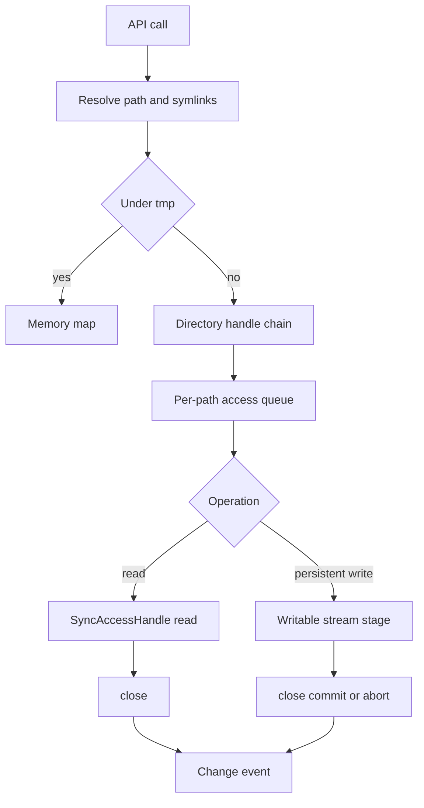
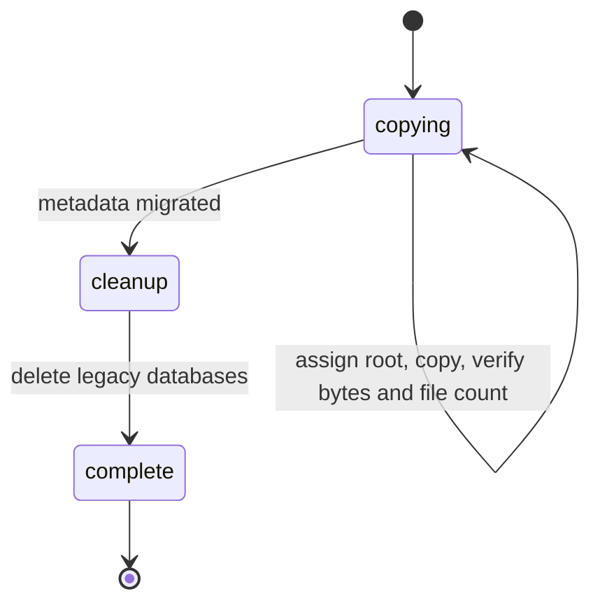

# ファイルシステム

`src/engine/core/fs/` がOPFS上の永続領域、`/tmp`の揮発領域、symlink、workspace作成、内容検索を担う。OPFSを触るのはFS Workerの`FsCore`だけで、main threadは`FsClient`、Runtime Workerはruntime用port経由で操作する。保存境界とpathモデルの全体像は [arch/storage](../arch/storage.md)。

## API

| 操作 | 振る舞い |
|---|---|
| `readFile` | `Uint8Array`を返す。decodeしない |
| `readText` | UTF-8 decodeして返す唯一のtext読取 |
| `writeFile` | 文字列（UTF-8 encode）かbytes。parentがなければ`ENOENT` |
| `readdir` / `walk` / `stat` / `lstat` | metadataだけを返す。`walk`は子孫を再帰列挙し、symlinkはentryとして返すが辿らない |
| `mkdir` | `recursive`対応。既存folderは`recursive`時だけ成功 |
| `rm` | `recursive` / `force`。`/`と`/tmp`は`EBUSY` |
| `rename` | 既定はdestinationを置換する。`overwrite: false`は排他mutation中にdestinationを確認し、存在すれば`EEXIST`。persistent fileはOPFS native moveで移動・置換し、move非対応環境では`ENOTSUP`。directoryと`/tmp`内fileはcopy後にsourceを削除する。directory copy中の失敗ではdestinationの作成分を除去するが、copy完了後のsource削除失敗ではdestinationを保持し、source削除が部分的でもデータを残す。自分の子孫への移動は`EINVAL` |
| `exists` | `ENOENT`だけをfalseにし、他のerrorは投げる |
| `realpath` / `readlink` / `symlink` | symlink節を参照 |
| `mkfifo` | 名前付きFIFO entryを作成する。metadata typeは`fifo` |
| `createPipe(readOwnerId, writeOwnerId)` | 名前を持たないFIFO endpoint pairを事前openし、`/dev/fd/N` pathを返す |
| `getDescriptorPath(endpointId)` / `closeFifo(s)` | live descriptor pathを取得し、endpointまたはowner全体を閉じる |
| `scoped(ownerId)` | owner単位の操作scope。closeで待機中のread/write/openを中断する |
| `readFile` / `writeFile` on FIFO | FIFO streamとしてEOFまで読む／全bytesを書き終えるまでbackpressureを待つ |
| `/dev/null` | 仮想character device。readはEOF、writeはbytesを破棄し、sizeは0 |
| `/dev/fd/N` | FS Worker上で現在open中のFIFO endpointへのdescriptor path。openで同じinodeを参照するaliasを作る |
| `createWorkspace(name)` | `~/<name>`を空で作る。`/`を含む名前、`.`、`..`は拒否 |
| `ensureDemoWorkspace()` | `~/demo`がなければ生成済み`initial_files/`を書き込む。既存なら何もしない。fileなら失敗 |
| `search(root, request)` | 内容検索。後述 |

FS APIは絶対pathだけを受け付ける（`normalizePath`は相対pathとNUL文字を`EINVAL`で拒否）。`ProjectFile.mount`はroot mountのbackingを示す任意metadataで、`/tmp`は`memory`、`/dev`は`devices`。通常のfile/folder entryはmount metadataを持たない。OPFSの`DOMException`はNode風のcodeへ変換する: `NotFoundError`→`ENOENT`、`TypeMismatchError`→`ENOTDIR`/`EISDIR`、`InvalidModificationError`→`ENOTEMPTY`、`QuotaExceededError`→`ENOSPC`、`NotAllowedError`→`EACCES`、その他→`EIO`。`FSError`は`code`と`path`に加え、native messageとrollback failure causeをUI/logで追える形で保持し、Comlink境界でも同じ内容を伝える。

UIがfileを開く時は`readFileContent`がbytesと既知のbinary拡張子からtext/binaryを分類する。text拡張子でもbytes検査を省略しない。

## FsCoreの内部

- **Directory handle chain**: 直近に成功したpathのancestor handle列を1本だけ保持し、次のpathとの共通prefixを再利用する。Node module解決のように兄弟fileを続けて読むと、毎回rootから辿るコストが目立ったため。初期化とdirectory削除（前後2回）でepochを進めてchainを捨てる。lookup開始時のepochと異なれば結果をchainに書き戻さないので、削除と並行した古いlookupが無効なhandleを復活させない。directory renameはsource削除時に無効化される。
- **Access queue**: 同じpathへのfile操作をpath単位で直列化する。persistent readは`SyncAccessHandle`を1操作の中で開閉し、writeは`FileSystemWritableFileStream`へstageする。
- **Namespace lease**: 通常のpath操作は共有lease、directory create/remove/renameと初期化は排他leaseを使う。構造変更中にpath解決が古いdirectory handleを使わないため。
- **Root pin / transaction queue**: Git・npmはcanonical root pathごとに順序付ける。root pinは処理中のworkspace root rename/removeを待たせる。これにより長いGit/npm処理中も無関係なfile accessは進められる。
- **Persistent write**: `FileSystemWritableFileStream`へ変更をstageし、`close()`でcommitする。失敗時はabortし、既存payloadを保持する。
- **/tmp**: `Map<path, {metadata, data}>`で持つ。OPFSには書かない。`readdir('/')`はOPFS上の`tmp`とsymlink/FIFO領域を隠し、memoryの`/tmp`とvirtual `/dev`を足して返す。
- **Devices / descriptors**: `/dev/null`はgeneric FS read/write/stat pathから扱うcharacter deviceで、EOF read・discard write・size 0を持つ。`/dev/fd`は現在open中のFIFO endpointだけを列挙し、numeric descriptorは3から割り当てる。`createPipe`はFIFO名を作らずread/write endpointを事前openし、両側の`/dev/fd/N` pathを返す。descriptor pathを開くと同じinodeを参照し、元descriptorをcloseしても他のopen aliasは存続する。`/dev`、`/dev/fd`の構造変更とdevice/descriptor pathの削除・renameは拒否する。
- **Mount reset**: `pyxis init --all --admin`はroot entry metadataの`mount`で処理を分ける。`memory` mountは内容を空にし、`devices` mountを保持し、mount metadataのない通常entryを削除する。pathごとの例外分岐は持たない。
- **FIFO**: `stat`・`readdir`・`walk`は`fifo` metadataを返す。通常pathの名前はreserved `.pyxis-fs-fifos` recordとして永続化し、`/tmp`の名前はmemoryに置く。FIFO bytesとopen endpointは常に揮発し、active inodeごとに遅延確保する64 KiB ring bufferへ保持し、最後のendpoint closeで破棄する。FIFOは通常fileと異なり、readはwriterが全て閉じてbufferを読み切るまで待ち、`writeFile`は全bytesを流すまでbackpressureを待つ。`PIPE_BUF`（4096 bytes）以下のwriteはatomic。open/read/writeはblockingが既定で、nonblocking modeも使える。readerがいなくなるとwriteは`EPIPE`、writerが全て閉じるとreadはbuffer drain後にEOFを返す。所有endpointのclose/cancelは待機操作を`EINTR`で解除する。
- FIFO nameはunlink/rename後もopen endpointがinodeを保持する。FIFOを含むpath treeの`/tmp`境界をまたぐrenameは`EXDEV`、FIFOへのpositioned range I/Oは`ESPIPE`。reserved metadata directoryはroot listingに表示せず、直接path accessを`EACCES`にする。
- **変更event**: `create` / `update` / `delete` / `rename`を絶対pathとmetadata付きで発行する。成功した`rename`は内部操作を通知せず、最後に1つだけ出す。失敗時はrollback後のsource／destinationと子孫の実状態を通知し、消えた子孫だけを`delete`、残ったentryを`create`／`update`で伝える。通知状態の再読込が失敗すれば元errorと合わせて返す。
- **部分削除**: OPFSのrecursive removeは[非atomicに失敗し得る](https://fs.spec.whatwg.org/#api-filesystemdirectoryhandle-removeentry)。永続folderの`rm`は対象subtreeのmetadataを削除前に保持し、失敗後の状態との差から消えたpathだけを通知する。成功時は従来どおりrootの`delete`1件。rename内部の通知なし削除では余分なwalkを加えず、rename側のcopy snapshotを使う。symlink／FIFO recordの復元は物理parentが残るものだけに限り、削除済みdirectory配下に孤立recordを作らない。
- **ZIP export**: folder exportとworkspace exportはfile bytesと空folderを保持する。workspaceの既定`.git`除外後、全entryを事前検証し、FIFO／character device（symlinkの参照先を含む）はtype・path付きerrorで拒否する。writer不在のFIFO読込や無限deviceを待ち続けず、entryを黙って欠落させない。symlinkは従来どおり参照先のfile bytesを保存し、linkそのもののarchive形式は提供しない。

## Symlink

OPFSにsymlinkはないので、FS Workerが仮想entryとして管理する。Nodeの`fs`、module解決、npmの`.bin`、Gitが同じ意味論を共有する。

| 項目 | 仕様 |
|---|---|
| 正本 | OPFS直下のreserved directory `.pyxis-fs-links`に、pathのSHA-256名でJSON record（path、literal target、mtime）を置く。Worker内Mapは起動時に全record読込で作るlookup index |
| `/tmp`配下 | recordを書かずmemoryだけに置く |
| 追跡 | `stat`・read・writeは最終componentまで追う。`lstat`・`readlink`・`rm`・`rename`は最終componentを追わない。中間componentは常に追う |
| target解決 | 相対targetはlinkのparent基準。target中の`..`はlink traversal後に評価する。追跡40回超で`ELOOP` |
| 列挙 | `readdir`・`walk`はtype `symlink`のentryとして返し、中へ再帰しない |
| 保護 | `/.pyxis-fs-links`自体へのアクセスは`EACCES` |
| Git | mode `120777`を返し、isomorphic-gitのsymlink操作を通す |

## 内容検索

`search`はFS Worker内で`walk`して各fileを読み、text判定を通ったものだけを行単位で照合する。mainへは一致位置とmetadataだけを返す。option: 大文字小文字、単語単位、正規表現、file名一致。除外globは`fnmatch`で1 segmentずつ照合し、`**`は0個以上のdirectoryに一致する。root相対・絶対pathの両方で照合する。

`.gitignore`は各directoryを基準に適用する。`a/**/b`は`a/b`から任意の深さに一致する。不正な文字classのruleは非一致とし、他のruleと検索を継続する。

## Workspace

workspaceは開いた絶対folderで、projectStoreはroot pathを持つ。Explorerはroot配下だけを表示する。

`ProjectTree`がExplorer用の構造を持つ。root全体の`walk`は初回、root切替、明示refreshだけで、以降は変更eventのmetadataを適用する。

| event | treeへの反映 |
|---|---|
| create / update | entryを追加・置換 |
| delete | そのpath以下を削除 |
| rename | 既知の子孫をprefix置換で移す。子孫を知らないfolderがroot内へ入ってきた時だけ、そのsubtreeを`walk` |

root外のeventは無視し、root切替後に完了した古い読込は捨てる。UIへの反映は100 msでまとめる。

workspace設定`.pyxis/settings.json`は、なければdefaultを返してfileを作らない。明示的な更新時だけ書く。fileの変更eventで再読込する。

## 旧storage移行

`src/engine/core/migration/` に隔離した時限処理で、呼出しは起動処理の1か所だけ。2027年4月頃に削除する。

| 旧データ | 移行先 |
|---|---|
| `PyxisProjects.files`のworktree | `/home/pyxis/<project name>/...` |
| lightning-fs `pyxis-fs`の`/projects/<name>/.git` | 同じroot配下の`.git` |
| `PyxisProjects.runtimeCache` | `~/.cache/pyxis/legacy/<namespace>/...`（現行runtimeはcacheを作り直す） |
| chat、タブ、AIレビューのprojectId key | root path key |

- 状態は`PyxisStorageMigration` DBに保存する。project→root mappingはコピー前に保存し、retryで同じ移行先を使う。
- 未割当projectの移行先が既に存在すれば、そのprojectへの書込み前に停止し、旧データを残す。suffixを付けて避けない。
- file payloadは旧`ArrayBuffer`/`Uint8Array`からdecodeせずにコピーし、全fileのbytesとfile数を検証してから`PyxisProjects`、`pyxis-fs`、`pyxis-fs_lock`を削除する。
- 移行中は同一originのquotaを一時的に約2倍使う。失敗はlogに出して起動を止める。

## 実装の場所

| Path | 担当 |
|---|---|
| `src/engine/core/fs/core.ts` | OPFS操作、`/tmp`、symlink解決、変更event、directory chain |
| `src/engine/core/fs/links.ts` | symlink recordの永続化とindex |
| `src/engine/core/fs/fifo.ts` | FIFO metadata record、bounded byte queue、open endpoint lifecycle |
| `src/engine/core/fs/descriptors.ts` | virtual `/dev/null`、`/dev/fd`、FIFO descriptor alias |
| `src/engine/core/fs/layout.ts` | root mount metadataとcache paths |
| `src/engine/core/fs/endpoint.ts` | Worker API、Git/npm/runtime port、transpile |
| `src/engine/core/fs/client.ts` | Web Lock、Comlink client、変更event配信 |
| `src/engine/core/fs/fileMove.ts` | OPFS persistent fileのnative move |
| `src/engine/core/fs/git.ts` | isomorphic-git adapter |
| `src/engine/core/fs/search.ts` | 内容検索 |
| `src/engine/core/project.ts`・`projectTree.ts` | workspace選択とtree projection |
| `src/engine/core/pathUtils.ts` | POSIX字句処理、`HOME_DIR` |
| `src/engine/core/migration/` | 旧storage移行 |
