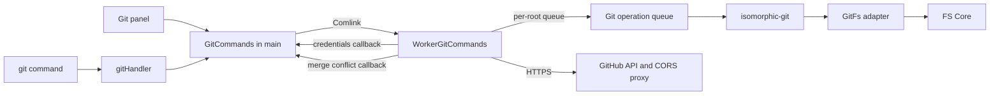
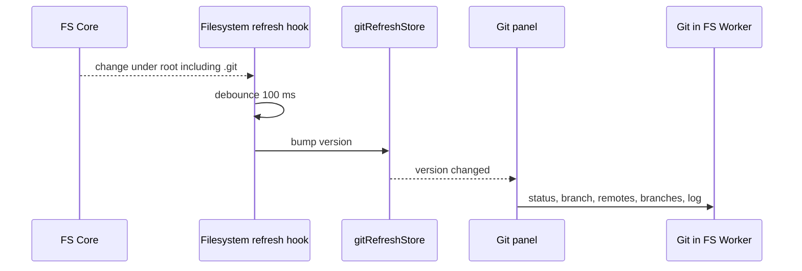
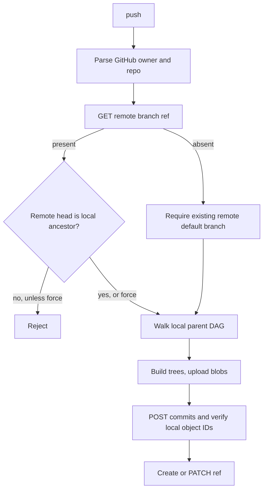

# Git と GitHub

ローカルGitはisomorphic-gitをFS Worker内で動かし、worktreeと`.git`を同じOPFS treeから読む。GitHubへのpushはGit transportではなくREST Git Data APIで行う。実装は`src/engine/cmd/global/gitOperations/`、`src/engine/cmd/handlers/gitHandler.ts`、`src/engine/core/fs/git.ts`、`src/components/Left/GitPanel/`。

## 構成

- 同じcanonical repository rootへのGit操作はroot単位のqueueで直列化する。Git処理中の各FSアクセスはFS Coreを通り、path namespace lockで調整する。無関係なFS操作までGitのqueueには入らない。
- mainは接続時に2つのcallbackを渡す。credentials（保存したPATを`x-access-token`として返す）と、merge conflict時にconflict解決タブを開くreporter。
- adapterはFS Coreをisomorphic-gitのpromises APIへ合わせる。通常fileは`100644`、folderは`40755`、symlinkは`120777`。index上の実行可能file `100755`はGit操作中に保持する。encoding指定時だけ`Buffer`でdecodeし、それ以外はbytesのまま返す。`rmdir`は空のときだけ。repository外のpathは拒否する。
- `.gitignore`は追跡判定にだけ使う。OPFS移行前のような「Git用のコピーへ同期するfilter」はない。

## コマンド

terminalの`git init`と`git clone`はshellのcwdを基準にする。それ以外のGit commandはcwdから親へ探索し、最も近い`.git`を持つdirectoryをrepository rootとして実行する。workspaceは閲覧と初期cwdを決めるだけなので、repositoryはworkspace外でも使える。`git add`、`diff`、`reset`と`show <commit>:<path>`の相対pathspecはcwdから解決し、repository root相対へ変換する。`reset`はcommit/refの解決をpathより先に試す。`diff <name>`はlocal branchと一致すればbranch、それ以外はpathとして扱う。`checkout -- <path>`による復元は未対応。

| コマンド | 対応 |
|---|---|
| `init` | default branch `main` |
| `status` | 引数なし。書式は下記 |
| `add <path>` | `.`、glob、file、directory、削除のstage。引数は1つ |
| `commit -m msg` | shell展開済みのmessageをそのまま保存。`-m <message>`一組のみ。余分な引数・未対応optionは拒否 |
| `log` | 直近10件 |
| `branch` | 一覧、`-r`、`-a`、作成、`-d`/`-D`（merge済み確認なし） |
| `checkout` / `switch` | branch、`-b`/`-c`、commit hashやremote refはdetached HEAD。`checkout -- file`はない |
| `merge` | fast-forwardか3-way。`--no-ff`、`-m`はbranchの前後どちらでも指定可。messageの引用符を保持。`--abort`にも対応。tracked変更があると拒否し、untrackedは上書き衝突があれば拒否。対象はlocal branchだけ |
| `revert <commit>` | merge commitと最初のcommit以外を1つ。worktree/indexがcleanであることが必要 |
| `reset` | `<file>`はunstage。`--hard <commit>`はrefを動かして強制checkout。`<commit>`だけはrefを動かすのみ |
| `diff` | 下記 |
| `remote` | `add`、`remove`、一覧 |
| `show` | `<commit>`、`<commit>:<path>`（bytes） |
| `clone <url> [dir]` | 公開CORS proxy `cors.isomorphic-git.org`経由、depth 10、single branch。宛先は空であること。成功したcloneは`.git`を含む。認証付きcloneは非対応 |
| `fetch` | remoteのsmart HTTPを公開CORS proxy経由で使う。認証は拒否されるため、公開repositoryのみ |
| `pull [remote] [branch] [--rebase]` | fetch後にmergeする。認証は拒否されるため、公開repositoryのみ。`--rebase`は未対応としてfetch前にエラー。未知flagと3つ以上のpositionalsもエラー |
| `push [remote] [branch] [-f]` | GitHubのみ。REST API。下記 |

stash、tag、rebase、cherry-pick、config、rm、mv、restoreはない。Git operation失敗・不正な引数・未知commandはGit名を付けたErrorとして伝播し、shell dispatchがstderrへ表示してexit 1を返す。成功出力はstdout、exit 0。

### status

statusMatrixの`[file, HEAD, WORKDIR, STAGE]`から、HEAD≠STAGEをstaged（new file / modified / deleted）、WORKDIR≠STAGEをunstaged（modified / deleted / untracked）に分類し、Git風のtextで出す。Git panelはこのtextを解析して表示するので、CLIの書式がpanelとの契約になっている。

### diff

| 呼び方 | 比較 |
|---|---|
| UIのstaged | HEAD対index。読取専用 |
| UIのunstaged | stagedに含まれればindex、そうでなければHEADを左、worktreeを右。編集可 |
| UIのcommit | 第1親対commit。読取専用 |
| terminal `git diff [path]` | HEAD対worktree |
| terminal `git diff --staged [path]`・`--cached` | HEAD対index |
| terminal `git diff <commit1> <commit2> [path]` | 2つのcommit tree |

`path`がdirectoryなら配下の変更fileを含み、`.`はrepository全体を対象にする。末尾の`/`は正規化する。line単位で同じ行を照合し、LCSではない。

binaryはdiffではなく両側のbinary snapshotタブを開く。同じdiffタブを開き直すと、未編集ならGitの現状で内容と編集用cacheを更新し、未保存の編集があればそのまま保つ。

## Git panelの更新

- 取得は直列化し、実行中の追加要求は最新の1件だけ待たせる。完了時にroot・世代が変わっていれば結果を捨てる。
- stage・unstage・commit・discardの後に明示的な再取得はせず、FS変更eventに任せる。
- 保存済みのbranch filterを読んでから初回取得する。
- discardはHEADのblobを書き戻し、HEADになければfileを消す。workspaceを読み直さない。
- push・pull・fetchはterminalだけ。

## Merge conflict

3-way mergeで衝突するとbase・ours・theirsをfileごとに検出し（binary対応）、conflict解決タブを開く。初期値はours。確定すると解決内容を書き（binaryで未選択なら削除）、各fileをstageする。続く`git commit`は`MERGE_HEAD`を読み、現在HEADとmerge対象の2親commitを作ってmerge stateを消す。`git merge --abort`は現在branchを強制checkoutしてmerge stateを消す。

- fast-forwardと衝突なしmergeはcheckout完了後にbranch refを更新する。ref保存失敗時は元commitへworktree／indexを戻し、既存untracked fileを保持する。復元も失敗した場合は両方の原因を通知する。
- merge commit作成後にstate cleanupが失敗した場合、作成済みSHAを含むerrorを返す。再試行はHEADの第2親と残存`MERGE_HEAD`を照合してcleanupを再試行し、cleanなら同じcommitを返す。新たな変更がある場合はmerge stateを消して通常のsingle-parent commitへ進み、merge commitを重複させない。
- checkout自体の途中書込失敗は未回復。HEAD／indexが旧commitのままでもworktreeに一部target bytes・target-only untracked fileが残り得る。元commitのforce checkoutでも戻らない経路を確認した。上記ref保存失敗後の復元と区別し、tree／index／新設entryの整合した復元はTODOに残す。

## GitHub連携

### 認証

- MenuBarでPATを入力すると`GET /user`で検証して保存する。
- 保存先はIndexedDB `PyxisAuth`の`github` record。PATはAES-GCM 256で暗号化し、鍵はlocalStorageにJWKで置く。sign outと復号失敗で鍵とrecordを両方消す。
- commit・merge・revert authorはPATがあれば`GET /user`で解決し、`name || login`と`email || login@users.noreply.github.com`を使う。PATがなければ`User <user@pyxis.dev>`。`GitHubUserManager`（5分cache）はUI表示用。

### Push

- remote headがあるbranchでは、それがlocal headの祖先であることを確認する。そうでなければ`--force`なしでは拒否する。
- pushはlocal headから親commit DAGを再帰的に処理する。各treeをremoteと比較して必要なblob/treeだけを送信し、commitのtreeと作成後のGitHub commit SHAがlocal object IDと一致することを検証してからrefを更新する。既に同じSHAのremote commitがあれば再利用する。
- 新規branchではremote default branchが存在することを確認する。push後にlocal branchをfetch/resetする処理はない。remote-tracking refはlocal headへ更新する。
- remote URLは`https://github.com/<owner>/<repo>[.git]`または`git@github.com:<owner>/<repo>[.git]`形式を受け付ける。PATが必要で、GitHub以外のremoteは非対応。blobはraw bytesのBase64。submoduleなどGit treeのblob/tree以外のentryは失敗する。
