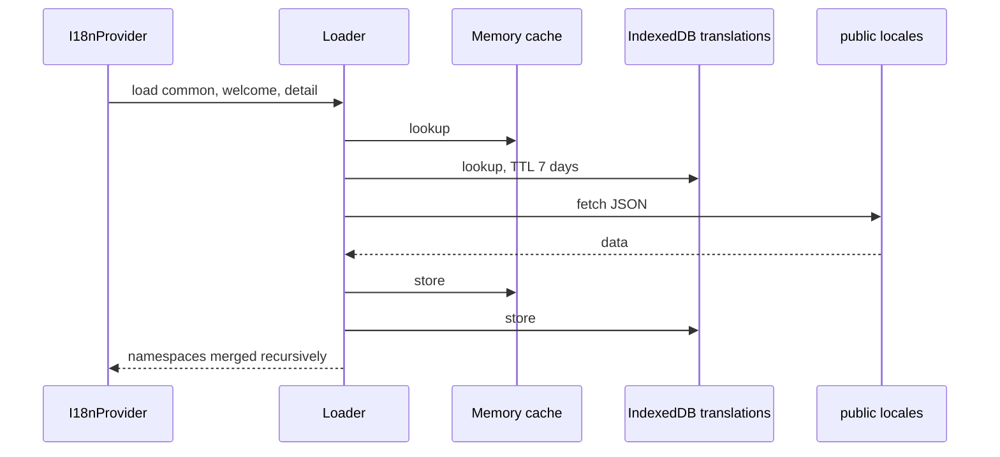

# 多言語対応

翻訳の正本は`locales/<locale>/{common,welcome,detail}.json`。buildで`public/locales/`へcopyされ、実行時にfetchする。言語pack拡張は「どの言語を使えるか」だけを登録し、翻訳本文は持たない。実装は`src/engine/core/i18n/`と`src/context/I18nContext.tsx`。

## 対応言語

`SUPPORTED_LOCALES`の20言語: en、ja、es、fr、de、zh、zh-TW、ko、it、pt、ru、nl、tr、ar、hi、th、vi、id、sv、pl。既定はen。翻訳keyの型は`locales/en/common.json`から作る。

## 読込

- HTTP取得に失敗したnamespaceは英語の同namespaceを読む。英語も失敗すれば空。key単位の英語fallbackはなく、未翻訳keyはkey文字列が出る。取得成功後のIndexedDB書込失敗は翻訳表示に影響しない。IndexedDB読込失敗時はHTTP取得へ進む。
- IndexedDBのcacheは7日TTLで、build versionが異なるentryは破棄する。言語packのuninstallはmemory cacheとIndexedDBを消す。`pyxis i18n clear`はIndexedDBだけを削除するため、memory cacheも破棄するにはreloadする。
- 3 namespaceは再帰mergeする。同じ階層のleafは後のnamespaceが上書きする。

## 言語の決定と切替

- 初期言語は保存値（localStorage `pyxis-locale`）、browser言語の基底部分、`en`の順で、module読込時に1回だけ決める。I18nProviderは拡張機能の初期化より先に描画されるので、起動時点では言語packとの整合を確かめない。browser言語から`zh-TW`は選ばれない。
- 切替は言語packの有効化で行う。言語packは`onlyOne: "lang-pack"`なので有効化すると他が無効になり、`enabled` eventでその言語を読み込む。読込後は翻訳状態と`document.documentElement.lang`を同じlocaleにする。`setLocale`は有効な言語packの言語だけを受け付ける。
- 現在の言語packが無効になると、install済みの他の言語packを有効化し、なければ英語packをinstallする。英語packのinstallまたは有効化が失敗しても、英語翻訳を直接読み込む。uninstallではその言語のcacheを消す。

## 翻訳関数

`useTranslation()`の`t(key, {params, fallback, defaultValue})`はown keyだけをdot区切りで辿り、`{name}`を置換する。見つからなければ`fallback`、`defaultValue`、key文字列の順。空文字も指定値として有効で、読込中も同じ規則。

## 新しい言語を足す

`SUPPORTED_LOCALES`に追加し、`locales/<locale>/`に3 fileを置き、`extensions/lang-packs/<locale>/`に言語pack（[extension-authoring](extension-authoring.md#言語pack)）を作る。`pnpm run format`は`locales/*/common.json`だけを整形する（BOM維持、NFC、2 space indent）。
