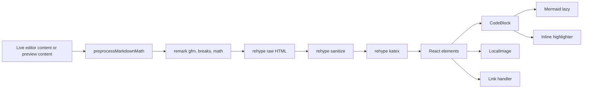

# Markdown previewとWeb preview

実装は`src/components/Tab/MarkdownPreviewTab.tsx`、`src/components/Tab/MarkdownPreview/`、`src/components/Tab/WebPreviewTab.tsx`。

## Markdown preview

`.md`は既定でeditorに開き、previewは明示操作で開く: Ctrl+K P（ペインが1つなら縦分割して新ペインへ、それ以外は他ペインへ）、タブ・Explorerの右クリック「Open Preview」。

- **source**: 同じpathのeditorタブの未保存内容を優先する。編集が保存前にpreviewへ出る。
- **HTML**: raw HTMLを`rehype-sanitize`でsanitizeしてから描画する。許可されない要素・属性は落ちる。
- **改行**: `settings.json`の`markdown.singleLineBreaks`が`breaks`なら単一改行を改行にする。
- **数式**: `markdown.math.delimiter`で`$`（dollar）、`\(…\)`・`\[…\]`（bracket、`$`はescape）、両方（both）を選ぶ。bracket・bothは`$`形式へ変換してからKaTeXへ渡す。CommonMarkのfence規則（backtick・tilde、閉じfenceは開きと同じ長さ以上）に従うcode blockとinline code spanの中は変換しない。
- **code block**: `mermaid`はMermaid、他は自前の正規表現highlighterとcopy button。
- **Mermaid**: viewportの200 px手前に来てから描画する。描画は全体で直列化し、10秒でtimeout。dagre既定でELK layoutも使える。Alt/Ctrl+wheelで0.2〜8倍zoom、Alt/Ctrl+dragとtouch dragで移動、pinch、double clickでreset、SVG download。zoom状態は図の最初の空でない行のhashをkeyに保つので、編集してもzoomが残る。
- **画像**: `http(s):`、`data:`、`//`はそのまま。`/x`はFSの絶対path（workspace root相対ではない）、他はmd fileのdirectory相対。local fileはbytesから判定したMIME（なければ拡張子）でdata URLにする。path変更中の古い読込結果は適用しない。
- **link**: `#anchor`はpreview内scroll。`https:`・`mailto:`・`tel:`・`//`は新しいwindow。その他のschemeは開かない。相対pathはmd fileのdirectory相対、次に`/`相対で探し、それぞれ`.md`付きも試す。見つかればbinaryはbinaryタブ、`.md`はpreview、他はWeb previewで開く。見つからないlocal linkはwindowを開かない。
- PDF・PNG export。狭いpaneではpreview titleとexport controlsを折り返し、button labelは分割しない。内容が末尾に追記された時だけ下へ自動scrollする。

### Monaco AMD loaderとの衝突

Monacoはpage globalにAMD loaderを置く。MermaidがbundleするUMD依存の匿名`define`がそこへ届くとloaderが例外を投げ、preview全体が落ちた。Viteの`define`置換で、bundleされるcodeの自由変数`define`をdev pre-bundleとproduction buildの両方で`undefined`にしている。経緯は [incident](../knowledge/incidents/2026-10-08-markdown-preview-amd-collision.md)。

## Web preview

Explorerの右クリックかMarkdownのlinkから開く。

- `.html`/`.htm`: HTML5 parserで実際の要素・属性を読み、stylesheet・CSSの`url()`・`<script src>`・`src`/`poster`をinline化（画像等はbytes判定のMIMEでdata URL）してから表示する。doctype／head／body、コメント、inline script／styleの文字列、`data-*`を保つ。引用符なし属性も扱い、scriptの`src`以外の属性（`type="module"`を含む）は保持する。外部fileから取り込むscript／styleの終了tag文字列はraw textの途中終了を防ぐためescapeする。
- directory: `index.html`、なければ最初の`.html`。
- 他のfile: textをそのままHTMLとして書く。
- iframeへ`document.write`する。sandboxなし、同一origin。これがSharedArrayBuffer（COEP）を採らなかった理由の1つで、外部CDNや画像をそのまま読める必要がある（[arch/system-overview](../arch/system-overview.md#設計原則)）。
- HTMLをinline化するときに解決したローカル依存pathを購読する。HTML本体、CSS・JS、画像、CSSの`url()`などの変更で再読込し、依存しないfileの変更では再読込しない。絶対pathで参照したworkspace外のassetも対象。directory表示では配下変更も購読する。FSから読むので、editorの変更は自動保存（1秒）後に反映される。
- 読込ごとの世代を持ち、対象変更・再読込・unmount後の古い完了は内容・error・titleへ反映しない。
