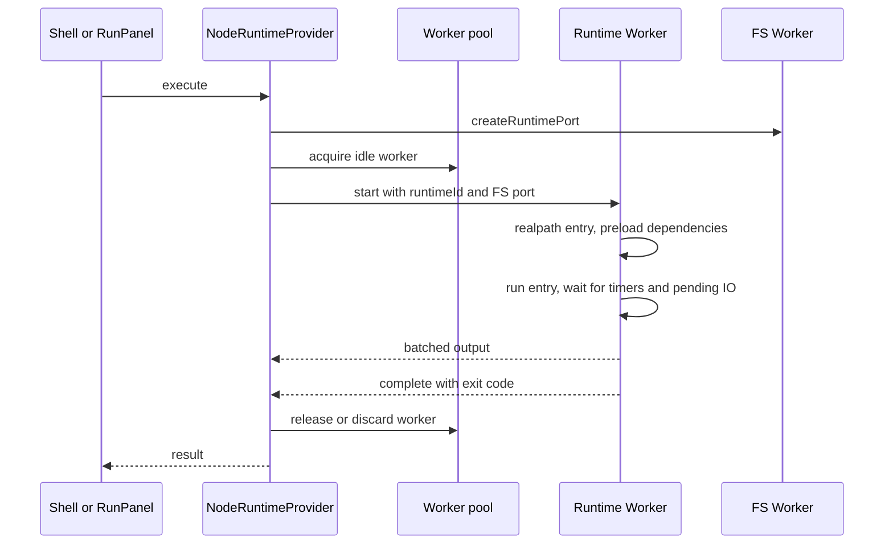

# Node.js Runtime

Node.js互換codeをRuntime Workerで実行する。WASMのNode本体ではなく、moduleローダーと組み込みmoduleを自前実装している。実装は`src/engine/runtime/`。runtime選択と実行契約は [runtime-provider](runtime-provider.md)、Workerと同期RPCの全体像は [arch/data-flow](../arch/data-flow.md#node実行)。

## 対応範囲

Terminalは`node <file.js>`に加え、`node -e <script>`と`node --eval <script>`でinline JavaScriptを実行する。evalはcwdのpackage typeにかかわらずCommonJSのsloppy modeで実行し、`process.argv`は`['node', ...args]`、`__filename`は`[eval]`、`__dirname`は`.`、top-level `this`はglobal objectとなる。module解決は実行時cwdを基準にする。

| 項目 | 内容 |
|---|---|
| 版 | `process.version` = `v18.0.0`、`process.platform` = `browser`、`process.arch` = `os.arch()` = `x64` |
| 環境変数 | `HOME=/home/pyxis`、`LANG=en`、`TERM=xterm-256color`、`COLORTERM=truecolor`、`FORCE_COLOR=3`に実行元shellの環境を重ねる |
| cwd | `options.cwd`、なければworkspace root。`process.chdir()`はvirtual filesystem内で解決し、realpathへ移動 |
| stdout/stderr | 実行元のfd routeから各streamの`isTTY`を受け取る（未指定時false）。寸法はterminalから（既定80×24）、色深度24 |
| stdin | `options.processStdin.isTTY`を引き継ぐ。省略時はfalse |
| 不可 | socket、HTTP server、guest `worker_threads.Worker`生成、native addon、native実行fileを配るpackage、実OS process |

native実行file（TypeScript 7の`tsgo`、Biome CLIなど）を配るpackageは非対応とするのがStassheの決定。browserは実行fileを起動できず、packageごとにWASM版へ差し替える分岐も持たない。`.node` fileは`Native Node.js addons are not supported.`で失敗する。

### 組み込みmodule

`node:`接頭辞の有無を問わない。未対応のNode builtinもbuiltinとして識別し、`ERR_UNKNOWN_BUILTIN_MODULE`で失敗する。`worker_threads`はmain-thread metadataと`SHARE_ENV`を公開するが、guest `Worker`生成は`ERR_FEATURE_UNAVAILABLE`で失敗する。その他の未対応例は`cluster`、`dgram`、`dns`、`tls`、`http2`、`vm`、`async_hooks`。`async_hooks`は未対応で、AsyncLocalStorageも提供しない。

| module | 実装・範囲 |
|---|---|
| `fs`、`fs/promises` | 自前。下記 |
| `worker_threads` | `isMainThread`、`isInternalThread`、`threadId`、`threadName`、`parentPort`、`workerData`、`resourceLimits`と共有`SHARE_ENV`をmain-thread値で公開する。guest `Worker`生成は未対応 |
| `path`、`path/posix`、`path/win32` | `path`はPOSIX実装、`path/win32`は`path-browserify-win32` 2.0.0。`path.posix === path`、`path.win32.win32 === path.win32`、`path.win32.posix === path.posix`を保つ。`resolve`はruntimeのcwd基準 |
| `os` | stub。`platform()`=`browser`、`homedir()`=`/home/pyxis`、`tmpdir()`=`/tmp`、CPU 1つ、memory/uptime 0。`constants.signals`はLinux x64のsignal number map |
| `events` | Browserify `events@3.3.0`のcallable facade。既存のEventEmitter own static descriptorを保持し、upstream constructorは変更しない。追加の`events.on(source, event, options)`はEventEmitter / EventTarget用async iteratorを返す。順序とerror identityを保ち、AbortSignalの`reason`は`AbortError`の`cause`へ渡し、`code`は`ABORT_ERR`。`close` event、`return`、`throw`でlistenerを解除し、high/lowWaterMarkでpause/resumeする。`setMaxListeners(n, ...targets)` / `getMaxListeners(target)`はEventEmitter互換targetとEventTargetの上限値を扱う。targets省略時は共有defaultを設定し、EventEmitterはBrowserifyのwarning動作を保つ。EventTargetは上限値の設定・取得のみで、listener APIやwarningは変更しない。AbortSignalの既定上限は0。`addAbortListener(signal, listener)`はnative signalへone-shot登録し、`Symbol.dispose`で解除できる。既にabortedならcallbackを引数なしでmicrotaskに積む。別listenerの`stopImmediatePropagation()`に対する保護とEventTarget warning diagnosticsは未対応 |
| `diagnostics_channel` | runtimeごとのgeneric channel。string/symbol名の`channel`、購読・解除・publish・`hasSubscribers`と、sync / promise / callback tracingを提供する。`bindStore`は渡されたstoreの`run`へ委譲する。subscriber例外はruntimeのtracked nextTickへ送り、後続subscriberとpublishを続ける。終了statusはguest handlerと`process.exitCode`に従う（browser例ではhandlerありでexit 0、なしでexit 1）。Node coreの自動instrumentationはしない。 |
| `buffer`、`string_decoder`、`util`、`util/types`、`assert`、`assert/strict` | npm実装。`string_decoder`はNode-maintained実装をpackage prototypeを継承するfacadeで公開し、borrowed method・subclass behaviorとTypedArray / DataView viewのoffset/lengthを保つ。`assert`はcallableでstrict entryを持つ。`util`はNode由来の`inspect`・`format`・`formatWithOptions`と`isDeepStrictEqual`、`stripVTControlCharacters`、Node custom symbolsを公開する。`styleText`はANSI style名・配列・hex colorをformatし、`FORCE_COLOR` / `NO_COLOR`と`validateStream`を扱う。`options.stream`はNode stream identityを検証し、その`isTTY`でcolor選択する。custom inspect hookはnested valueにも適用される |
| `stream` | `readable-stream` 4.8のunified core。`Readable`・`Writable`・`Duplex`・`Transform`・`PassThrough`、`stream/consumers`の`text`・`json`・`buffer`を公開 |
| `stream/promises` | 同じunified coreの`finished`・`pipeline`をPromise APIで公開。AbortSignal、cleanup、async iterable、`end: false`に対応 |
| `stream/web` | `node:stream/web` / `stream/web`でnative WHATWG `ReadableStream`・`WritableStream`・`TransformStream`、BYOB reader、text stream、compression streamを公開。module exportはruntimeごとに独立し、constructor identityはnative globalと共有する。圧縮形式はbrowser実装に依存し、非対応形式はnative constructorが拒否する。`stream.Readable.fromWeb()` / `stream.Readable.toWeb()`はNode ReadableとWHATWG Readableを相互変換する。Writable/Duplex変換と`stream/promises.finished()`によるWHATWG stream待機は未対応 |
| `http`、`https` | clientはWritableな`ClientRequest`から`fetch`を呼び、CORSとbrowserの禁止headerに従う。`request(url, options, callback)`、header操作、`destroy`に対応する。`ServerResponse`はmemory transportへstatus・header・bodyをserializeする。`createServer`、network socket、`Agent`はない |
| `net` | `isIP`・`isIPv4`・`isIPv6`だけ |
| `zlib` | pako。gzip・deflate・deflateRaw・inflate系のcallback・Sync・Transform stream、`constants`。`unzip`はgzip/zlib wrapperを自動判定し、inflate data errorは`code`・`errno`付きErrorにする。その他のpako errorにcodeが付かない場合がある。Brotliと`zlib.promises`なし |
| `querystring` | 自前のparse・stringify・escape・unescape |
| `url` | npm `url`にNode互換の`parse(…, true)`、`fileURLToPath`、`pathToFileURL`。global `URL` / `URLSearchParams`を公開 |
| `crypto` | crypto-browserifyのhash・hmac・randomBytes・randomFill・randomFillSync・randomInt・randomUUID・pbkdf2・`timingSafeEqual`・`subtle`に加え、`createCipheriv`・`createDecipheriv`・`getCiphers`・`createSign`・`createVerify`・ECDH/DH・公開鍵/秘密鍵encrypt/decryptを提供。`scrypt`・`scryptSync`は`@noble/hashes` 2.4.0をNode互換のoption alias/defaults、typed view・ArrayBuffer・SharedArrayBuffer入力とmaxmem事前検証で包む。`scrypt-kdf` 4.0.0で96-byte keyと`{ logN: 4, r: 1, p: 1 }`を使ったbrowser確認では正しいpasswordを検証し、誤ったpasswordを拒否した。key generationはない。legacy `createCipher`/`createDecipher`はpassword由来の暗号化であり提供しない |
| `child_process` | Pyxis shellへ橋渡し。下記 |
| `readline` | 自前の`createInterface`と`question`（callback）、cursor操作。`close()`はinterface自身のinput listenerを外す |
| `readline/promises` | `createInterface`、`question`（Promise）、async iterator。`close()`はinterface自身のinput listenerを外す |
| `tty` | `isatty`はtrue。`setRawMode`はterminalへ転送 |
| `module` | `builtinModules`、`createRequire` |
| `process`、`console` | processとglobal consoleに同じ実行状態を公開。`execPath`は仮想CLI名`node`、`execArgv`はeval時の`-e` / `--eval`とsource、file実行時は空配列 |
| `constants` | `fs.constants`と共有 |
| `timers`、`timers/promises`、`perf_hooks`、`v8` | timerはevent loop追跡付き。`timers/promises`は`setTimeout`・`setImmediate`だけ。`v8`の公開methodは`ERR_FEATURE_UNAVAILABLE`で失敗する |

### 実package smoke test

| package/version | 確認した挙動 |
|---|---|
| dotenv 18.0.6 | config parse |
| chalk 6.0.1 | ANSI style |
| commander 15.0.0 | argument parse |
| TypeScript 6.0.3 | TypeScript transpile |
| Prettier 3.9.9 | TypeScript format |
| uvu 0.5.6 | suite 1/1、exit 0 |
| sql.js 1.14.2 | WASM 658,410 bytes、初期化・CREATE/INSERT/SELECT |
| Rollup WASM 4.64.3 | direct APIのESM generate 39 bytes、`bundle.write`で`dist/rollup-api.js`へ出力、`npm run rollup-build`で`dist/rollup.js`を生成。両方にanswer 42を確認し、`npm run node`も42を出力（exit 0） |
| Vite 8.3.4 | install成功。direct APIとbuildは未対応`node:worker_threads`で失敗（build exit 1） |
| Vitest 5.0.3 | 修正後の元test scriptはexit 1。Startup Error stackは未対応`tls`を指し、runner summaryなし。test suiteの成功は未確認 |
| ESLint 10.12.0 | normal CLIをTerminalとcompiled Runtime Workerで確認。bad fileは3 rule diagnosticsでexit 1、fixed fileはdiagnosticsなしでexit 0、`npm run lint`とNode script writeもexit 0。compiled Worker証跡は8/8 assertions。`--concurrency`はguest Worker生成を必要とし未対応 |
| Webpack 5.111.1、webpack-cli 7.2.3 | install成功。最小development compile callbackは未対応`vm`で失敗し、artifactを生成しない |
| Pino 10.4 | `diagnostics_channel` APIを追加後、未対応`worker_threads`で失敗 |
| Winston 3.19 | installed packageの通常JSON console logging（exit 0） |
| get-stream 9.0.1 | Node entryが`events.on`を要求する。`(await getStreamAsBuffer(...)).toString('utf8')`の元のfluent awaitでexit 0 |
| execa 10.1.0 | `execaSync`とasync `execa`の成功・失敗を検証（終了status 0 / 9 / 7）。`spawn.stdin`経由の日本語UTF-8入力からEOFまでを往復し、stdoutを確認 |
| fast-glob 3.3.3 | 相対glob、recursive / dot / ignore、`onlyFiles`・`onlyDirectories`、symlink follow / no-followを確認 |
| fs-extra 11.4.1 | Source Workerで12/12、compiled Runtime Workerで15/15 assertions pass。recursive directory copy、mode保持、symlink / dereference、overwrite / `errorOnExist`、missing source、sync copyを確認 |
| node-fetch 3.3.2 | `fetch` / `Headers` / `Request` / `Response`を利用。実HTTP GET `127.0.0.1:5173`でstatus 200、HTML 2,739 chars、header/JSONを確認（exit 0）。 |
| Axios 1.20.0 | install成功（26 packages、既存依存維持）。実packageのESM entryは`./index.js`からHTTP adapterをeager loadし、`https-proxy-agent`経由で未対応`tls`を要求するため、HTTP request前にexit 1。Node 24 native CJS require / ESM importのHTTP oracleは成功。 |
| inquirer 14.2.3 | `async_hooks` unavailableで実行不可 |
| ts-node 10.9.2 | register時に未対応builtin `repl` のeager loadで失敗 |
| TypeScript 7.0.2 | native packageにJS compilerがなく実行不可 |

### fs

callback・promise形式はMessagePortで、`*Sync`はService Worker経由の同期RPCでFS Workerへ届く。

- 提供: string・Buffer・URL pathを受けるreadFile、writeFile、appendFile、readdir（`withFileTypes`）、opendir、stat・lstat（`bigint`、`throwIfNoEntry`）、access、exists、chmod、fchmod、mkdir、unlink、rm、rename、readlink、realpath（`.native`含む）、symlink、`createReadStream`、`createWriteStream`、copyFile、rmdir、mkdtemp。それぞれ実装のあるcallback・promise・Sync形式を公開する。`opendir`はcallback・promise・Syncに対応し、開いた時点のentry namesを読む。`bufferSize`は受け付けるがbuffering効果はない。`chmod`はcallback・promise・Sync、`fchmod`はcallback・Sync形式で、数値またはoctal stringのmodeを受ける。fd系はcallbackとSync形式のopen・read・write・close、および`fstatSync`を提供する。fd 0と`/dev/stdin`の同期読込はEOFまで読み、fd 1/2はstdout/stderrへ書く。
- ない: `watch`、`cp`、`utimes`、`promises.open`とFileHandle。
- `appendFile`はFS Coreのpath単位書込queue内でappend rangeを1操作として適用し、同一fileへの並行appendを直列化する。
- descriptorとwrite streamの`wx`/`ax`、`copyFile`の`COPYFILE_EXCL`はpath queue内で既存pathを検査してから作成する。
- modeはtype bits付きでstatへ渡る。modeは絶対path基準の永続metadata（`/tmp`はmemory）で、作成時の固定virtual umaskは`022`。`process.umask()`は未対応。`fchmod`はdescriptorに記録したpathへ作用し、rename/unlink後のinode identityは保持しない。4つの時刻はすべてmtime。
- 内容はbytesのまま扱い、encoding指定時だけ文字列にする。
- virtual `/dev/null`はreadでEOFを返し、writeを破棄する。FIFOはFS Workerのopen descriptor経由でNode fd/streamへ接続する。
- `exists` callbackは対象がない場合に`false`を返す。
- symlink、`/tmp`の意味論はFS Workerと同じ（[filesystem](filesystem.md#symlink)）。

### child_process

| API | 実装 |
|---|---|
| `exec`・`execFile`・`spawn`・`fork` | quoteしたcommand行をmain threadの`ShellExecutor`で実行する。同時2本まで。stdout/stderrは実行中にchild streamまたは親へ流す。`ChildProcess.stdin`はwritable-onlyで、RuntimeからShellExecutorへbyte列を渡し、`.end()`でEOFを送る。`spawn` eventはlistener登録後に発火する。`exec`・`execFile`は`maxBuffer`、`timeout`、`signal`を扱う。`fork(m)`は`spawn('node', [m, …])` |
| `execSync`・`execFileSync`・`spawnSync` | 同期RPCでmainのshellを呼ぶ。既定encodingは`buffer`。`spawnSync`は非0終了を`status`で返し、`execSync`系は非0終了を`stdout`・`stderr`付きのErrorにする |
| `kill()` | 実行中のshellへabortを伝え、exit/closeを発火する。shell上のcommandがspawnできない場合もOSのspawn errorと分けず、shellの結果（通常127）として返す |
| IPC `send` | `ENOSYS` |

### process

- `env`はruntime既定値（HOME等）に実行元shellの環境を重ねる。`cwd()`と`chdir()`は仮想filesystem上の現在directoryを使う。
- `stdin`はNodeのReadable stream、`stdout`・`stderr`はWritable stream。各`isTTY`は実行元processの入力/output routeを引き継ぐ。TTYでないrouteや未指定のstreamはfalse。
- `console` builtinとglobal `console`は同じruntime consoleを共有し、info/debug/table/dir/time/group/trace/assertを含むメソッドを提供する。
- `emitWarning()`はwarning eventを発火し、warning stackをstderrへ書く。
- `exit(n)`は内部例外で実行を打ち切り、終了コードは`n & 0xff`。
- `uncaughtException` / `unhandledRejection` listener内の`process.exit(n)`は通常の終了signalとして扱い、終了statusへ反映する。listener内の実際のErrorはfatalとして扱う。
- `process.exitCode`は初期値`undefined`。number/stringの整数を受け付け、getterはsigned 32-bit値を返す。`undefined`/`null`はreset。不正値は以前の値を保って`ERR_INVALID_ARG_TYPE`または`ERR_OUT_OF_RANGE`を投げる。
- 通常終了ではtracked timerとI/Oがdrainした後に`'beforeExit'`を発火し、終了時に`'exit'`を一度発火する。eventへ渡す値はraw `exitCode`、最終statusは別に8-bitへ変換する。listenerから出力できる。終了開始後のtimerやlistener登録は無視する。明示的な`exit(n)`は指定statusを保つ。
- guestのconsole出力はJSON化せずNode由来のformatterを使い、Error stack、`%s`/`%d`、循環参照、BigIntを表示する。構造化logger用JSONは別経路で保つ。
- `pid`、`memoryUsage`、`kill`、`umask`はない。

`process.nextTick()`はruntime専用FIFOをmicrotaskとしてdrainする。既にhost Promise queueに入ったcallbackより前へ割り込むNode固有の優先順位は保証しない。

## Module形式

| 判定順 | 結果 |
|---|---|
| `.mjs` `.mts` | ESM |
| `.cjs` `.cts` | CommonJS |
| 最寄り`package.json`の`type` | `module`ならESM。探索は`node_modules` directoryの境界で止まる |
| 構文 | import/export（type-onlyを除く）、`import.meta`、top-level await、top-levelで`require`等を宣言 → ESM |

- CommonJSと判定されたfileにESM構文があれば`SyntaxError`。
- 変換対象はTypeScript、`.jsx`、ESM、`import()`を含むfile。素のCommonJSは無変換で実行する。
- ESMはparserで解析して実行順とasync graphを判定し、esbuildのexport getter変換を保つ。top-level awaitがあるstatic dependency graphはasync evaluationし、dependencies完了後にimporterを進め、同じlevelのsibling dependenciesは並行評価する。graphにTLAがなければESMも同期実行する。dynamic `import()`のみではstatic graphをasyncにしない。dynamic importの同一moduleは一度だけ評価し、同じ結果またはrejectionを共有する。
- top-level awaitの判定ではobject/class methodのparameterとbodyをnested scopeとして扱う。computed keyはouter scopeで評価するため、そこにあるtop-level awaitはgraphをasyncにする。
- `require()`がasync ESM graphを見つけた場合は実行前に`ERR_REQUIRE_ASYNC_MODULE`を投げる。同期ESMは通常namespaceを返し、独自のnamed `module.exports`があればその値を返す。CommonJSの同期実行と、静的TLA graphのasync評価を分ける。
- CommonJS wrapperはNodeの`exports`・`require`・`module`・`__filename`・`__dirname` parameterを使い、本文実行後に元のmodule objectの`exports`を読む。
- CommonJSや組み込みをimportした時のnamespaceは`{...exports, default: exports}`。
- `Function` / `new Function`の本体もparseし、中の`import()`を書き換える。
- `import.meta`は`url`・`filename`・`dirname`・`resolve(specifier)`を提供する。
- `.json`は`module.exports = <内容>`。shebang行は先にcomment化し、その後ESMへstrict directiveを加える。

## Module解決

1つの解決algorithmを非同期（先読み）と同期（実行時`require`）の両方で動かす。

`module.createRequire()`は絶対POSIX pathまたは`file:` URLを受け付け、URLは`fileURLToPath()`でpath化する。末尾`/`はdirectory baseとして扱う。生成した`require`は`resolve`・`resolve.paths`・`main`・`cache`・`extensions`を持つ。

`require.resolve(specifier, { paths })`は指定したlookup rootから探索でき、builtinには影響しない。`require.resolve.paths()`はpackage lookup rootを返し、builtinでは`null`。解決cacheはrequester・specifier・kind・search rootsで区別し、ロード済みmoduleと`require.cache`はrealpathをidentityとして実行単位で共有する。CJSの未解決は`MODULE_NOT_FOUND`、ESM importは`ERR_MODULE_NOT_FOUND`。

1. 組み込みmodule名なら組み込み。
2. `file:` URLは`import`だけ許可。
3. `#…`は最寄りscopeの`package.json` `imports`。
4. `@/x`は`<root>/src/x`（Pyxis独自のalias）。
5. 相対・絶対path: `import`は拡張子補完なしの完全一致。`require`はfile、`.js`・`.json`・`.node`、directory（`main`→`index.*`）の順。`.mjs`・`.cjs`・`.ts`は補完しない。
6. bare specifier: scopeの名前と一致し`exports`があればself-reference。他は祖先の`node_modules/<pkg>`を探す。`exports`は完全一致、`*` patternの順で照合し、`.`・`..`・空・`node_modules` segmentを拒否する。`exports`がなければsubpathか`main`/index。
7. 条件は`default`・`node`・`module-sync`と`require`/`import`をobject順に評価する。`browser`条件は使わない。
8. 成功した結果は`realpath`に置き換え、module cacheのidentityにする。`process.argv[1]`は呼び出した時のpathを保つ。

**先読み**: 実行前にentryを読み、依存を解析・変換して同時8本で再帰的に準備する。失敗は警告にとどめ、実際のerrorは`require`時に出す。実行時に未準備のmoduleだけが同期RPCで解決・読込・変換される。

**循環**: CommonJSの循環`require`はロード中のpartial exportsを返す。実行が失敗したmoduleはcacheから外す。

## 実行の流れ

- 実行ごとに新しいFS port、runtimeId、NodeRuntime、module loader・resolver、process、timer、stdinを作る。runtime所有のglobal descriptorを実際のWorker `globalThis`へ一時的に重ね、終了時に復元する。Workerのglobal environmentとhost intrinsic objectは共有するため、sloppy moduleの暗黙global代入やprototype変更は次の実行にも残る。この共有状態は許容する。
- 出力は128件または8 msごとにまとめて送る。
- event loopは追跡中のtimerとI/O（fs、http、zlib、pbkdf2、child_process、動的import、pause していないstdin listener）が尽きるまで待つ。
- 同期で投げられた未捕捉errorはNode風に整形してRuntime logへ出し、exit 1。
- entryはstrict mode、依存moduleは非strictのwrapperで評価する。

### Workerの再利用

Workerの起動は1回25〜32 msかかり、短いscriptでは旧main thread実行の約10倍遅かった。待機Worker 1つ分のメモリと引き換えに起動待ちを消している。

| 状況 | Workerの扱い |
|---|---|
| provider生成時 | 待機Workerを1つ先行起動 |
| 実行開始 | 待機Workerを取る。なければ新規起動（同時実行数に上限なし） |
| 正常終了 | 待機枠が空なら待機へ戻し、埋まっていれば終了 |
| 中断・Abort・異常終了・未捕捉error | 破棄して待機Workerを補充 |
| 待機中のerror | 破棄して補充 |

実行単位の状態は毎回捨てる。sloppy scriptのglobal代入と裸の識別子参照をNodeのWorker realmに合わせるため、program globalは実際のWorker `globalThis`へ置く。その値（prototype変更を含む）は次の実行に残ることを許容し、runtimeが設定する一時descriptorはdispose時に復元する。通常終了と例外終了のbrowser Worker probeでは、この残存とdescriptor復元、およびhost側globalの不変を確認した。

### Ctrl+C

1. 最初の割込みでhost側のshellを止め、Workerへ`interrupt`を送り、250 msのtimerを開始する。
2. Workerは`process.emit('SIGINT')`する。listenerがあればtimerを止め、終了はプログラムに任せる。
3. listenerがない、または250 ms以内に応答がなければWorkerをterminateし、exit 130。同期XHRやCPU loopで止まったWorkerは応答できないため。
4. timer中の2回目の割込みは即terminate。

### stdin

- 非同期（stream、readline）: Workerが必要時に要求し、providerがterminal入力を`postMessage`で渡す。
- 同期（`fs.readFileSync(0)`、`fs.readSync(0, …)`）: 同期RPC→Service Worker→FS所有tabのmain→providerの順に届く。同期readerは非同期要求より優先され、1回で次の1 chunk（1行）を返す。EOFで空。

## 同期RPC

`sync-message`を使い、RPC要求全体をService Workerへの同期XHRに載せる。

| 経路 | 対象 |
|---|---|
| 同期XHR→Service Worker→FS Worker | fsの`*Sync`とfd API、実行時`require`の解決・読込・`package.json` type・変換、`realpathSync` |
| 同期XHR→Service Worker→main | `execSync`系、同期stdin |
| MessagePort→FS Worker | fsのcallback・promise、先読み、entryの解決・変換 |
| `postMessage`→main | 非同期child_process、stream stdin |

- Service Workerは同じcall idの重複を1回の実行にまとめる。runtime終了時の`runtime-cancel`で残りを打ち切る。
- 同期呼出しは120 s、変換は10 sでtimeoutする。同期呼出しのtimeoutはruntime call idを通じてmain側もcancelする。stdin待ちはtimeoutしない。
- portの再送: Service Workerがportを持っていなければ全window clientへ要求して最大30 s待つ。mainは新しいportと受領確認portを送り、10 s以内に確認が来なければ失敗する。古いportは返信待ちがなくなってから閉じる。mainは`controllerchange`でもportを送り直す。

## Cache

| cache | 場所 | key | 寿命 |
|---|---|---|---|
| 解決結果、`package.json` | Runtime Worker | (種類, 呼出し元dir, specifier)、package path | 1実行 |
| 実行済みmodule、namespace | Runtime Worker | realpath、`node:<name>` | 1実行 |
| 変換結果 | OPFS `~/.cache/pyxis/modules/<sha256(path)>.json` | 入力hash（code、path、option、descriptor、esbuild版、変換版） | 永続。pathごとに1件で、入力が変われば上書き |
| esbuild-wasm | Transpile Worker | なし | Workerが30 s idleで破棄されるまで |

変換cacheをFS Workerに置くのは、file bytesと変換結果をOPFS境界の1か所で持ち、Runtime Workerには実行内cacheだけを残すため。

## 計測

`execute`の`benchmark: true`は開発buildでだけ利用でき、RPC・解決・読込・解析の時間を出力末尾に付ける。instrumentationはdynamic importされ、production buildから除かれる。UIからは使わず、`scripts/bench/node-runtime/`のrunnerだけが使う。各値は重なり合うspanで、合計はwall timeを超えうる。開発時の計測中だけprototype patchを行い、終了時に復元する。
