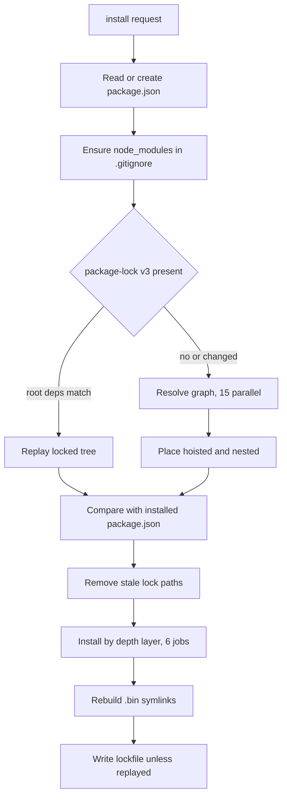
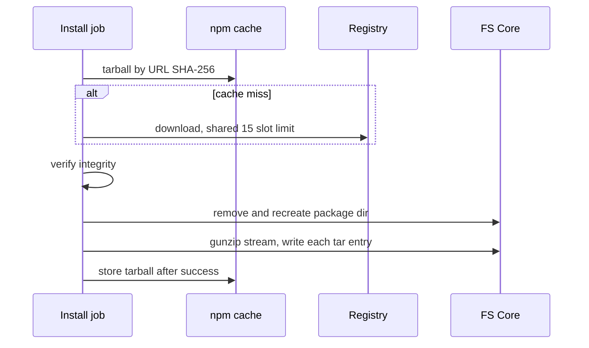

# npm

registry packageをOPFSの`node_modules`へ展開するinstallerと、`npm run`・`npx`。install・uninstall・list・initはFS Workerで動き、`npm run`と`npx`はmain threadで動く。実装は`src/engine/cmd/global/npmOperations/`、`src/engine/cmd/handlers/npmHandler.ts`、`src/engine/cmd/shell/localBinary.ts`。

## コマンド

| コマンド | 挙動 |
|---|---|
| `npm init [-f]` | 対話なし。name=root名、version 1.0.0等の既定`package.json`を作る。既存なら`-f`/`--force`時だけ上書き |
| `npm install` / `i` | `package.json`がなければ作り、dependencies・devDependencies・optionalDependenciesを入れる |
| `npm install [<pkg>[@<spec>] ...] [-D] [--version[=<spec>]]` | 指定した全packageをinstallし、指定なしならmanifestのdependencies・devDependencies・optionalDependenciesを入れる。scoped packageと`<alias>@npm:<target>@<range>`形式（scoped target含む）に対応。manifestには`npm:<resolved-target>@^<resolved-version>`を保存する。`-D`/`--save-dev`でdevDependencies。`--version`はversion省略packageのrangeとして使う |
| `npm uninstall` / `remove` / `rm <pkg> [<pkg> ...]` | 指定packageをmanifestから外す。複数指定に対応。optionは拒否する。lockがあればmanifestでinstallし直してpruneし、lockを書き直す。lockがなければtop-levelの孤立packageだけ消す |
| `npm list` / `ls` | manifestのdependencies・devDependenciesを宣言rangeのまま1段表示 |
| `npm run <script> [-- args...]` | workspace rootの`package.json`のscriptを実行し、stdout/stderrのraw chunksを実行中に出力して終了codeを返す。`--`以降はmain scriptにだけ渡し、shellでは各引数をquoteする。`pre<script>`→script→`post<script>`を順に実行し、失敗時は後続を止める |
| `npm start` / `npm test` | `start`/`test` scriptの短縮形。`start` scriptがなく`server.js`が存在する場合は`node server.js`へfallbackする |
| `npx <bin> args` | cwdから上へ`node_modules/.bin/<bin>`を探してNodeで実行。見つからなければ127。downloadはしない |
| その他 | `npm: 'x' is not a supported npm command`をstderrに出してexit 1 |

shellは未知のコマンド名でも`node_modules/.bin`を探すので、npm script内から`.bin`のコマンドを直接呼べる。

global operation (`-g`/`--global`) は未対応で、`--`より前のnpm optionとして指定された場合はどのcommandでもstderrと失敗statusで拒否する。installは`-D`/`--save-dev`と`--version <spec>`/`--version=<spec>`以外のoptionを拒否する。

### 対応しない範囲

workspaces、`file:`・`git:`・`workspace:`・URL指定（`npm:` aliasは対応）、`.npmrc`・private registry・認証（registryは`https://registry.npmjs.org`固定）、audit、file modeの保持、tar hardlink。package install時の`preinstall`・`install`・`postinstall` scriptは実行しない。native実行fileを配るpackageは非対応（[node-runtime](node-runtime.md#対応範囲)）。

## Installの流れ

1. **lockfile**: v3で`packages['']`を持つ`package-lock.json`だけを読む。それ以外の形式や必須fieldが欠けたentryはinstall全体を失敗させる。rootのdependencies・devDependencies・optionalDependenciesがmanifestと完全一致し、通常依存・optional依存・peer依存の全edgeがNodeの探索順で満たされれば、registryに問い合わせず記録された木をそのまま使い、lockfileのbytesも書き換えない。dist-tag rootはmanifestに記録されたtag指定が同じ場合だけlock treeを再利用する。
2. **解決**: `name@range`単位で重複を除き15並列で依存graphを解決する。指定値がregistry dist-tagならtagのversionを使い、解決できないtagは失敗する。完全一致versionはそのversionを使う。semver rangeは条件を満たす`latest`があれば優先し、なければ最大satisfying versionを使う。`latest` tag自体は必須ではない。必須peer dependencyは互換peerを配置済みtreeから使い、なければgraphに加える。optional peerは見つからなくても追加しない。
3. **platform**: `os`・`cpu`を`browser`/`x64`に照合する。optionalの不一致はskip、requiredの不一致は失敗。browserで使えないnative packageのdownloadと展開を避け、page全体400 MBの目標を守るため。
4. **配置**: root直下の依存は`node_modules/<name>`、子はroot側から見て最も浅い空き位置へhoistし、既存の解決を隠す位置は避ける。置けなければ`Conflicting dependency placement`。異なるversionはNodeと同じnested配置になる。
5. **変更判定**: 配置先の`package.json`のname・versionと`.pyxis-install-complete.json`のname・version・integrityで完了を判定する。親を入れ直すと親directoryごと消えるので、祖先が変わった配置は子孫も全部入れ直す。
6. **展開**: depthの浅い層から順に、各層を最大6 packageずつ並行してinstallする。requiredの失敗で新しいjobを止めて失敗する（lockは書かず、途中の`node_modules`は残る）。optionalの失敗と、それで到達不能になったpackageは消す。
7. **`.bin`**: manifest全体のinstallでは全`.bin`を作り直す。bin名を検証し、targetがpackage内に収まることを確かめて相対symlinkを作る。target fileがpackageに含まれない場合、そのbin entryはskipする。
8. **lockfile**: replayしなかった時だけ書く。`lockfileVersion: 3`、pathでsort、version・resolved・integrity・依存・bin・os・cpu・dev/optionalのflag。

### Package 1つの展開

- integrityはsha512→384→256→sha1の順で最初にあるものを、展開前に検証する。値がなければ検査しない。cacheから読んだarchiveが不一致ならcacheを消す。
- gunzipはstreamで行い、tar entryごとに書込みをawaitする。展開済みgraph全体をmemoryに持たないため。
- tar: file・directory・symlinkだけを扱い、先頭のwrapper directoryを1つ外す。絶対path、`..`、package外を指すentryは黙ってskipする。symlinkはtargetをそのまま作るが、後続の書込みのたびに親のrealpathがpackage内かを確かめ、symlink経由の脱出は`Archive path escapes package`で失敗する。サイズ不足は`Truncated tar entry`。
- 展開に失敗したらpackage directoryを消し、FS以外の原因ならcacheも消す。tarball cacheは展開成功後にだけ書くので、壊れたarchiveを永続化しない。
- tarball download timeoutはnetwork slot取得後の30 sで、queue待ち時間は含めない。

## Registry cache

- abbreviated metadata（`application/vnd.npm.install-v1+json`）を取り、依存・bin・os・cpu・tarball URL・integrity・dist-tagsだけに縮めて`~/.npm/registry/<sha256(url)>.json`へ保存する。
- 鮮度はHTTPの`max-age`と`Age`/`Date`で決める。`max-age`がない、または`no-cache`なら毎回`If-None-Match`で再検証し、304なら鮮度だけ更新する。`no-store`ならcacheを消す。
- 1回のinstall内では同じpackageのmetadata要求を共有する。
- cacheと`package.json`はexists/statを挟まずに直接読み、`ENOENT`を「ない」と扱う（`package.json`の`EISDIR`も同様）。小fileでFS RPCの往復を増やさないため。

## FS Workerで動かす理由と影響

installは1回で数千回のFS操作を行うので、FS Worker内からFS Coreを直接呼び、mainとの往復を挟まない。一方でWorkerはmainやruntimeからのRPCを1本のqueueで処理するため、install中はエディターの保存やruntimeのfs要求も完了まで待つ。

進捗はmainのspinnerへcallbackで送り、各jobの開始時に`Installing name@version`へ更新する。終了表示は`added N packages, checked M packages in X.Xs`（Mは配置数＋root）。追加がなければ`up to date`。auditはしていないので表示しない。

性能の計測方法と結果は`Development/TODO.md`と`scripts/bench/npm-install/`。install後のtree再走査がpromptを遅らせた件は [incident](../knowledge/incidents/2026-10-09-npm-install-root-walk.md)。
