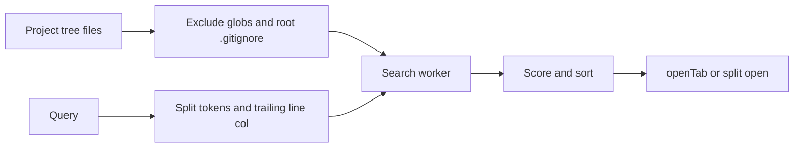

# OperationWindow

画面上部に開く小さな選択window。Quick Open（file検索）、Open Folder（folder閲覧と確定）、Open Recent（最近のfolder）の3つの独立したviewと、他機能が渡す任意の項目listを同じsurfaceで扱う。command paletteはない。UIは`src/components/operation-window/`、検索workerとpath処理は`src/engine/ide/search/`、folder選択contextは`src/context/FileSelectorContext.tsx`。

3つのviewを分けるのは、file検索・path移動・MRU選択はそれぞれ対象と確定動作が違い、結果を混ぜると何が選ばれるか曖昧になるため（[STORAGE_INTENT](../plan/STORAGE_INTENT.md)）。

## 開き方

| 操作 | view |
|---|---|
| Ctrl+P、TopBar、TabBarの`+` | Quick Open |
| Ctrl+K Ctrl+O | Open Folder |
| Ctrl+R | Open Recent |

viewはmount時に固定され、別viewへは閉じて開き直す。開いたペインが開く先になる。AI chat space一覧、Git branch filter、Run panelのfile選択、AIのcontext file選択も項目listを渡して同じwindowを使う。callback付きで開いた場合、選んだfileはcallbackへ渡り、editorでは開かない。

## Quick Open

- queryの末尾`:行[:列]`はjump先、残りを空白でtokenに分ける。全tokenが一致したfileだけを残し、tokenの平均点で並べる。
- 点数: file名一致に+500、なければpathで照合。部分文字列一致（先頭+80、単語境界+35）か、部分列の曖昧一致（文字ごと、境界、連続で加点し、間隔で減点）。同点はpath順。
- 照合は専用Worker（1つ）で行い、古い要求の結果は捨てる。
- 候補はExplorer treeのfile。`search.exclude`と`files.exclude`をpath prefixごとにglob照合して除き、`search.useIgnoreFiles`ならrootの`.gitignore`も使う。
- 空queryではMRUを先に、残りを相対path順に出す。MRUはIndexedDB `user_preferences`の`quickOpenHistory:<root>`に40件まで。editor・binary・previewタブを開く・activeにする度に記録し、同rootの書込みは直列化する。
- Enterで開く。Ctrl/Cmd+Enterは右へ縦分割して開く。

## Open Folder

- 開くと現在のroot、なければ`/home/pyxis`を表示する。path入力は`~`、`~/…`、絶対path、表示中folderからの相対pathを受け、入力ごとに前方一致するsubfolderを出す。
- Enterや行の選択はそのfolderへ移動するだけ。workspaceとして開くのはheaderの「Open Folder」で、statでfolderか確かめてから開く。
- headerにはOpen Recent、親folder、Open Folder、New Workspace。New Workspaceは1 segmentの名前で`~/<name>`を空で作って開く。
- workspaceを開く時はdirty fileをflushして現在のタブsessionを保存し、tree読込、recent folder保存、root設定、新rootのsession読込の順に進む。保存失敗時は切替を中止する（[arch/data-flow](../arch/data-flow.md#workspaceの切替)）。

## Open Recent

IndexedDB `PyxisRecentFolders`の`recent_folders`（keyはroot path）を新しい順に出す。各行から履歴を消せる。workspaceを開く度とlegacy移行で記録し、起動時は先頭のfolderを開く。

## キー

documentのcaptureで受け、IME変換中は無視する。Esc閉じる、↑↓循環移動、Home/End、PageUp/Down（10件）、Enter確定、Tabでfocus巡回。window外のclickで閉じる。閉じるとfocusを元の要素へ戻す。window内ではQuick Open・Open Folder・Open Recentのshortcutだけを扱い、Quick Open中のCtrl+Pは選択を1つ下げる。他のviewのshortcutはそのviewへ切り替える。
