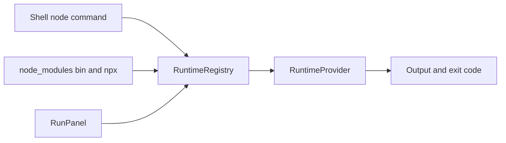

# Runtime Provider

言語runtimeとtranspilerを拡張子で選ぶ登録層。実装は`src/engine/system/runtime/core/`。Node.jsの実装は [node-runtime](node-runtime.md)。

## 登録と選択

| 登録 | 規則 |
|---|---|
| runtime | 拡張子→provider。最後の拡張子（`/(\.[^.]+)$/`）だけで引く。同じ拡張子を後から登録すると置き換わる |
| transpiler | 拡張子ごとにlist。最初に登録したものが使われる |

| Provider | 拡張子 | 実行場所 |
|---|---|---|
| 組み込み `nodejs` | `.js` `.mjs` `.cjs` `.ts` `.mts` `.cts` | Runtime Worker |
| `pyxis.python-runtime` 拡張 | `.py` | main threadのPyodide |

`.jsx`・`.tsx`はどのproviderにも割り当てられず、直接実行できない。依存moduleとしては読める。

## 実行契約

`execute(options)`は絶対pathの`rootPath`と`filePath`を受け、任意で`cwd`・`argv`・`execArgv`・`source`・`signal`・`subscribeInterrupt`・stdout/stderr callback・`processStdin`・stdout/stderrの`isTTY`・terminal寸法・`debugConsole`を受ける。`source`はNode runtime専用のinline entryで、指定時は`filePath`をcwd基準のsynthetic entryとして依存解決に使い、実entry fileは読み込まない。source自体はfilesystemへ保存しない。`execArgv`はruntimeへ渡すCLI option列で、省略時は空配列。Node runtimeではTTY flagsは実行元のfd routeから渡し、未指定はfalse。`processStdin`省略時もstdinは非TTYとして扱う。戻り値は出力と終了コード。

| 中断手段 | 意味 |
|---|---|
| `AbortSignal` | 即時強制終了。exit 130 |
| `subscribeInterrupt` | Ctrl+C。プログラムのSIGINT handlerに渡す |

| 呼出し元 | cwd | 中断 |
|---|---|---|
| shellの`node` | shellのcwd | Ctrl+CでSIGINT、job中断でAbort |
| `node_modules/.bin`・`npx` | shellのcwd | 同上 |
| RunPanel | workspace root | 停止ボタン・workspace切替・unmountでAbortのみ。SIGINTは送らない |

## 拡張機能からの登録

- `context.registerRuntime(config)`はconfigをproviderに包んで登録する。拡張機能の無効化では解除されない。
- `context.registerTranspiler(descriptor)`は変換関数ではなくdescriptor（id、対応拡張子、変換種別）を登録し、全descriptorをFS WorkerのTranspileManagerへ送る。無効化で解除される。変換はFS Worker配下のTranspile Workerで行うので、拡張機能のcodeはWorkerへ持ち込まれない。
- `pyxis.typescript-runtime`拡張は`{id: 'typescript', 拡張子 .ts .tsx .mts .cts, 変換 typescript}`を登録するだけで、実際の変換は組み込みesbuild-wasmの`ts`/`tsx` loader。既定で無効なので、有効化しないと`.ts`系は`No TypeScript transpiler is registered`で失敗する。
- python-runtimeはworkspaceのfileをPyodide FSへコピーして実行し、終了後に書き戻す。Workerを使わず、stdinと中断に対応しない。stderrがあればexit 1。terminalに`python`コマンド（`-c`対応）も登録する。
