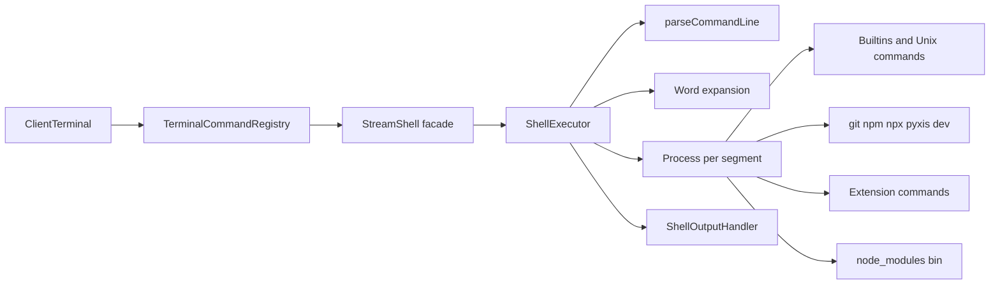

# Shell

OS processではなく、`ShellExecutor`・`Process`（Node streamのstdin/stdout/stderrとfd表）・JavaScriptで書いたコマンドで構成したPOSIX shellの部分集合。実装は`src/engine/system/shell/`、Unixコマンドは`src/engine/system/commands/unix/`。

## 構成

`TerminalCommandRegistry`はworkspace rootごとに1組のshell、Unix・Git・npmコマンド、TerminalUIを持つ。対話shellはroot単位で共有され、`npm run`もこのshellで動く。対話shellで`exit`を実行すると、そのshellを破棄して同じrootの新しいshellへ置き換える。Terminal、TerminalUI、Unix・Git・npmコマンドは維持する。

## 1行の実行

1. `parseCommandLine`: shell構文をtokenizeし、segment分割（`|`・`&&`・`||`、redirect情報）を行う。quoteされたwordもraw formで保持し、変数値を構文として解釈しない。
2. `&&`・`||`でgroupに分け、前のgroupの終了状態で短絡する。
3. 選択したgroup内の各segmentは、`Process`作成時にその時点のshell環境でword expansionを一度行う。parameter・command substitution、IFS分割、brace・glob・tilde展開後に非同期起動する。先行assignmentや直前commandのstatusは後続segmentの展開に反映し、展開結果中のquote/operatorは再解析しない。
4. 各processのstdout/stderrをfd routingで監視し、pipeline stdoutを次processのstdinへ接続する。foreground pipelineの全processへsignalを伝える。
5. 全processを待ち、`PIPESTATUS`を保存して終了状態を決める（pipefail時は右端の非0）。
6. fdごとに集めた`Buffer`をredirect先へ書く。130なら以降を打ち切る。

出力はbytesのまま`Buffer[]`に集め、redirect先へ正確なbytesを書く。画面表示とcallbackにはstreaming decodeした文字列を渡す（[binary文字列化の事故](../knowledge/incidents/2026-10-07-binary-stringified.md)）。

## コマンドの解決順

| 順 | 対象 |
|---|---|
| 1 | `NAME=value`だけの行: 対話shellのenvへ保存 |
| 2 | 引数なし`cd`: `$HOME` |
| 3 | `/`を含むか`.sh`で終わる名前: fileを読み、`.sh`かshebang付きならscript実行。shebangに`node`を含むか`.js`ならNodeで実行 |
| 4 | `sh FILE` / `bash FILE`: 子shellでscript実行（`-c`なし） |
| 5 | `git`・`npm`・`npx`・`pyxis <分類> <操作>`・`dev` |
| 6 | 拡張機能が登録したコマンド |
| 7 | builtin: Unixコマンド、`[`・`test`・`true`・`false`・`type`・`node`・`read`、shell control `exit`・`export`・`return`・`trap`・`set`・`unset`・`wait` |
| 8 | cwdから`/`へ遡って見つけた`node_modules/.bin/<cmd>`をNodeで実行 |
| 9 | `command not found`、exit 127 |

`clear`・`history`・`vim`は1つのsegmentだけの行のときTerminalがshellより先に処理する（[terminal](terminal.md)）。

### Unixコマンド

| 分類 | コマンド |
|---|---|
| FS | ls、cd、pwd、mkdir、mkfifo、touch、rm、cp、mv、rename、tree、find、stat、du、df、dirname |
| text | echo、printf、cat、head、tail、grep、wc、sort、tr、seq、tee、xargs、awk |
| archive | tar、gzip、zip、unzip |
| その他 | date、whoami、sleep、help |
| no-op | chmod、chown |

stdinを読むのはgrep・wc・sort・tr・tee・xargs・head・tail・awk。`awk`は`{print expression}`、`-F`、field参照と基本算術に限り、file operandは未対応。

- `cat`はoptionなしならbytesを保持して連結する。`wc -c`はbyte数、`-m`は有効なUTF-8 code point数（不正byteは数えない）。`-m`と`-c`を併用すると文字数を先に表示する。`-w`はUnicode whitespaceとU+2060で区切り、BOMはword dataとして扱う。複数file時、count列は共通幅で右寄せし、幅は最大countとfile sizeの桁数を下限にする。`tee`は`-a`/`--append`と`--`を認識し、未知optionはerror。
- `grep`・`head`・`tail`は`--help`とfile operand `-`（stdin）に対応する。`grep -f`の空pattern fileは何も選ばずstatus 1、`-e ''`は全行を選ぶ。`-o -v`は選択行があってもstdoutを出さず、statusは選択結果で決まる。`-F`と`-E`は併用できない。`-l`/`-L`と`-H`/`-h`は各組内で後に指定した方が有効で、`-c`併用時は`-l`/`-L`が優先する。`-l`/`-L`では暗黙stdinと明示operand `-`が同じ`(standard input)`名を出し、同じstatusになる。`-A`/`-B`は`-C`の該当方向を上書きし、context countは0以上の10進整数だけを受け付ける。`--include`/`--exclude`は値を別argumentまたは`=`付きで指定する。
- `head`・`tail`はLFのbyte境界で行を選び、UTF-8 decode/re-encodeせず不正byteを保持する。最後に指定した`-n`/`-c`が行数・byte数を決める。負のcountは`head`で末尾N行・byteを除き、`tail`で末尾N行・byteを選ぶ。`--lines -N`/`--bytes -N`も受け付け、`--`後の`-5`はfile名として扱う。`-q`/`-v`は後に指定した方がheader表示を決め、`-v`はstdinにもheaderを付ける。複数fileのheader blockはLFで区切る。
- `find`は`-prune`と明示的な`-print`を扱い、path globの`*`は`/`をまたいで一致する。`cp -R`は子symlinkを保持し、`rm`・`mv`・`stat`はsymlink自体を`lstat`する。
- `ls -F`はsymlinkに`@`を付け、`-l`は`-> target`を表示する。inode番号の`-i`は未対応。`mkdir -m`は明示的に未対応。`unzip -d DIR`は展開先を指定し、gzip失敗はnonzero statusを返す。

`sort`は`-r`・`-n`・`-u`を受け付ける。通常キーはUTF-8 bytesの昇順（GNU `C`/`C.UTF-8`相当）。`-n`は行頭のASCII space/tabと任意の`-`に続く10進数（整数・小数）を比較し、`+`や指数表記は認識しない。`-u`は比較キーが等しい行をまとめ、`-nu`では数値キーが等しい行のうち最初の入力行を残す。

## 構文

| 項目 | 対応 |
|---|---|
| pipe `\|`、`&&`、`\|\|` | 対応 |
| `>` `>>` `N>` `N>>` `N>&M` `N>&-` `&>` `&>>` `<` | 対応。各segmentのfd routeへ適用し、`/dev/null`は破棄 |
| `<<` `<<-` | heredoc対応。`<<-`はbody先頭tabを除去 |
| quote | `'…'`は展開なし、`"…"`は変数とcommand substitutionだけ展開、`$'…'`はANSI-C escapeを解釈 |
| 変数 | `$NAME` `${NAME}` `$?` `$#` `$!` `$@` `$0`〜`$9` `PIPESTATUS[index]`、`${#v}`、`${!v}`、`${!pre*}`、`${v:-w}` `${v:=w}` `${v:?m}` `${v:+w}`とコロンなし版、substring、pattern removal/replacement、case conversion、indexed arrays |
| command substitution | `$(…)`と backtick。ネスト可。fork した子shellで実行し末尾改行を除く |
| process substitution | `<(command)`・`>(command)`を匿名pipeと`/dev/fd/N`で展開する。置換commandは非同期jobとして動き、`$!` / `wait`で識別・待機できる。親command終了時に子jobを強制joinしない |
| arithmetic expansion | `$((…))`。shell変数と演算子を評価し、式中のcommand substitutionにも対応。`set -u`では未設定変数をerrorにし、`&&`・`||`・`?:`は必要なbranchだけを評価する |
| brace | `a{b,c}`、ネスト、`{1..5}`、`{03..05}`、逆順。負数を含むzero-padding範囲も桁幅を保つ（`{-02..02}` → `-02 -01 000 001 002`） |
| glob | path componentごとに照合し、`?`と文字classはUnicode code point単位。`[[:alpha:]]`はUnicode letterに一致し、結果はUTF-8 byte順。反復`/`は一致結果にも保持する。末尾`/`はdirectory symlinkを含むdirectoryだけに一致し、dangling symlinkは除外。一致がなければ入力のまま。`**`はrecursive globではない |
| tilde | quoteされていない単独の`~`と`~/…` |
| IFS | `env.IFS`に従う |
| compound command | `if/elif/else/fi`、`for NAME [in words]`（`in`なしはpositional arguments）、`while`をtyped control syntaxとして解析し、後置redirectとpipelineに接続する。`break`・`continue`は正の階層数を受け取る |
| pipeline否定 | 先頭の`!`はpipelineの終了statusを反転する |
| positional arguments | `set -- arg…`で設定し、interactive shellの初期`$#`は0 |
| `read` | `read [-r] NAME…`でstdinから1行読む |

### 制約

| 項目 | 現状 |
|---|---|
| `;` | commandを区切り、前のcommandの完了後に次を実行する。pipeline operator `\|`とは別 |
| `&` | pipelineをbackground実行する。起動前にPIDを確保し、`$!`は最終Processの単調増加virtual PIDを保持する。`wait PID`または`wait %N`で待機できる |
| `NAME=v cmd` | 非対応（127） |
| 非対応構文・機能 | `<<<`、`exec`、`case`、`until`、`select`、`for ((…))`、alias、`set -x`、`export -p` |

`case`と`<<<`はparse error。background jobの`wait`は使えるが、一覧表示する`jobs` commandはない。

pipeline各stageは並行してredirectを準備するが、同じstage内のredirectは字句順にopenする。FIFO open待ちがあれば後続redirectも待ち、後のredirectがFIFOを置換しても先行openは省略しない。各commandは自身のredirectが揃ってから起動するため、準備済みstageは他stageのrendezvous待ちに巻き込まれない。fd複製があれば元endpointを最後のfd参照まで維持する。正常終了時はfd streamと順序付きFIFO write queueをdrainしてからwriterを閉じ、signalや起動失敗ではpending open/I/Oを中断する。drain中のCtrl+Cはqueueをcancelしてstatus 130とし、後続commandへsignalを漏らさない。close失敗も実行結果へ反映する。process substitutionの親endpointは親commandの終了と出力drainの両方が完了するまで保持し、子job終了とは独立に閉じる。drain後にreaderが消えて発生した`EPIPE`はSIGPIPE status 141になる。

検証: process substitutionは2 files / 9 tests pass（44 skipped）、FIFO startup lifecycleは1 file / 9 tests pass。lifecycle regression suiteは5 files / 78 tests all pass（`shell-sonnet-lifecycle-final.log`）、argv lifecycleは2 files / 44 tests all pass（`shell-sonnet-argv-final-3.log`）。全体検査は[Development/TODO](../../Development/TODO.md)を参照する。

## Script

`.sh`は`scriptRunner`が文単位で解釈する。

- 構文: `if/elif/else/fi`、`for v in …; do … done`、`while`、`break`、`continue`、functions、`trap`、`exit [n]`、`!`、`#` comment。loopは10000回で黙って止まる。
- scriptの`trap`は`ERR`と`EXIT`を扱う。interactive shellでは`exit`時に`EXIT` trapを実行し、trap内で別statusを指定してexitしない限り元の終了statusを保つ。`INT`・`TERM`・`HUP`・`DEBUG`・`RETURN`など未対応名の登録は明示エラー。
- `set -e`/`-u`/`-o pipefail`と`unset`は対話shellとscriptで使える。`export NAME=value`はshell環境へ保存し、後続展開と子processへ反映する。
- `$0`・`BASH_SOURCE`・`BASH_SOURCE[0]`は解決済みscript path、`$1…`は引数。`"$@"`は各引数を別々のwordとして保持し、引用符なしの`$@`は各要素にIFS分割とglob展開を行う。`"$*"`はIFS先頭文字で連結した1 word。
- function呼び出し中は位置引数がその引数列に置き換わり、return後に呼び出し元の値へ戻る。
- `set -e`は条件判定に使われるcommandやpipeline以外の失敗でscriptを終了する。`&&`・`||`の判定対象とpipelineの途中stageはerrexit対象外。
- scriptはforkした子shellで動く。子は親のcwd・envのcopy・pipefail・nounsetを引き継ぎ、変更は親へ戻らない。command substitutionも同じ。

## Signalと終了コード

| 状況 | code |
|---|---|
| parse error | 2 |
| command not found | 127 |
| SIGINT | 130 |
| 例外、redirect失敗 | 1 |
| `git`・`npm`・`pyxis`・`dev`が例外なく戻る | 0 |

`exit n`は`n & 0xff`。Ctrl+Cはforeground pipelineの各processへ伝わる。子scriptと関数の実行contextへもsignalを転送する。
signal handlerを持たないProcessは既定動作で終了し、終了statusは`128 + signal number`。cleanup用listenerだけでは既定終了を抑止しない。
forkしたpipeline childもrootのprocess/job ownershipを引き継ぐ。`wait`中のCtrl+Cは待機をstatus 130で終え、次の入力へsignalを漏らさない。子commandの出力callbackは親commandの実行contextに結び付くため、親終了後に遅れて届くpipe/redirect出力は後から画面へ保持・表示しない。これはBashの完全なprocess group/job-control互換ではない。

## Nodeの`child_process`から

Runtime Workerの`exec`・`spawn`・`execSync`系は、main threadで要求ごとに新しい`UnixCommands`と`ShellExecutor`を作り、指定cwdへ`cd`して実行する。対話shellのenv・拡張コマンド・TerminalUIは引き継がず、出力は終了後に文字列でまとめて返す。経路は [node-runtime](node-runtime.md#child_process)。

## 環境

`process.env`を継承し`HOME=/home/pyxis`で上書きする。`PWD`は`cd`ごとに更新する。
