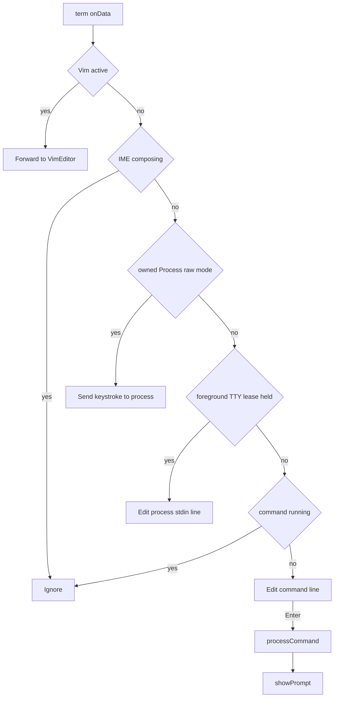

# Terminal

下部panelのxterm.js画面。入力行の編集、prompt、履歴、実行中processへのstdin、出力の直列化を担う。コマンドの実行は [shell](shell.md)。UIは`src/components/terminal/`、terminalの状態と動作は`src/engine/system/terminal/`、xterm連携は`src/lib/xterm/`。

## 仕様

- Terminalは1つ。shell、TerminalUI、Unix/Git/npmコマンドはworkspace rootごとのsingleton。stdin adapterはProcessごとに所有し、foregroundのTTY Processだけが排他的なTerminal入力leaseを得る。
- xtermはscrollback 5000、Fit・WebLinks addon。mouse wheel scrollはxtermに任せ、ClientTerminalの独自handlerはtouch gestureだけを扱う。表示領域の変化で`fit`し、行数・列数をNode runtimeの`process.stdout`へ反映する。
- Touch scrollは10pxを超えた移動から開始し、以後の連続移動を20pxごとに行単位へ変換する。gesture中の端数を符号付きで保持し、開始時に状態をresetする。
- theme変更ではxterm optionsだけを更新し、Terminal sessionとscrollbackを作り直さない。
- 初期promptはFS、command registry、shellの準備後に表示する。準備に失敗した場合はTerminalとloggerへerrorを出し、inputをlockedのままにする。準備前に仮promptは表示しない。
- prompt: `<cwdの絶対path> (<cwdを含む最寄りrepositoryのbranch>) $ `。ancestorにGit repositoryがなければbranch表示を省き、色はbranch名から決まる。
- 履歴: 最大100件、重複除去なし。IndexedDBのuser preferencesに保存し、keyはcurrent workspace root path。↑↓で移動し、先頭で退避したdraftは末尾から↓で復元する。`history`で一覧、`history clear`で削除。

### 行編集

編集カーソルは`Intl.Segmenter`の書記素境界、表示幅はxterm 6の`UnicodeGraphemesAddon`が使うactive Unicode providerに従う。native terminalと幅が異なる書記素（例: VS16付き記号）があるため、Unicode表示幅を全端末共通とは扱わない。TerminalUIの切詰め幅は`string-width`で計算する。

| キー | 動作 |
|---|---|
| 文字 | grapheme単位でカーソル位置へ挿入 |
| Backspace、Delete、←→、Home/End | grapheme削除/移動、行頭・行末 |
| Ctrl+←/→ | Unicode letter・number・markの連続範囲を単語として、その開始/末尾へ移動。句読点や`_`は区切り |
| Ctrl+A/E/B/F/D/U/W/K | 行頭/行末、左右移動、前後削除、行消去、空白区切りの直前word消去、行末消去 |
| ↑↓ | 履歴。最初の↑で編集中の行を退避し、末尾から↓すると戻す |
| Tab | command/file候補を補完。複数候補なら一覧表示。quoteやescapeを含むwordは変更しない |
| Ctrl+L | 画面を消去してpromptと入力行を復元 |
| Ctrl+C | 選択があればcopy。通常入力では現在行を取消し、process実行中はforegroundへのSIGINT。raw入力ではcontrol byteをprocessへ送る。signal後の入力bytesは順序を保ってqueueし、active TTY readerがあればcommandがbusyでも割込み完了直後に送る |
| Ctrl+V、paste | 1行のtextを挿入。CR/LFを含むpasteは`Multiline paste is not supported.`を表示。Vim中はxtermへ渡す |

単一候補はfile名の未入力suffixをshell escapeして補完し、directory以外ならspaceを追加する。複数候補では共通prefixを挿入し、続きがなければ候補を一覧する。quote・backslash・shell syntaxを含むwordは変更しない。command候補にはshell commandに加えてTerminal専用の`clear`・`history`・`vim`を含む。

IME変換中の入力は無視する。コマンド実行中の通常入力は捨てる（先行入力は保持しない）。resize時に入力行を再描画する。clipboard APIが使えない、または失敗した場合はエラーを表示する。

Ctrl+Cでforegroundを中断した後の入力はqueueに保持し、active TTY readerがない間は送信可能になるまで待つ。後続のCtrl+Cはそれ以前にqueueした入力bytesを破棄してからsignalを送り、その後に同じ入力chunk内で続くbytesは順序を保ってqueueする。Terminal dispose時はqueueを破棄する。

入力状態は画面表示とは独立して保持する。行が表示領域より長く、カーソル後ろの描画がcursorをviewport外へ押し出す場合は、入力prefixとcursorを見える位置に残す。末尾へ移動すると後半を表示する。描画前にsuffix全体の収まりをactive Unicode providerのgrapheme cell幅と8-column tab stopから予測し、viewportに収まらない場合はsuffixを描かないため、長い入力が既存出力を押し出さない。

### 実行中processへの入力

foreground Processは自分のstdin adapterを持つ。TTY入力leaseはforeground Process間で排他にし、子Process終了時は自身のadapter/listenerだけを解除する。pipeline、redirect、heredoc、noninteractive、background ProcessはTTY leaseを持たない。background stdinは既定で`/dev/null`（EOF）になり、明示的なstdin redirectは維持する。

| mode | 動作 |
|---|---|
| line | Terminalが入力行をlocal echoして編集し、Enterで`行 + \n`を送る。Ctrl+Dは空行ならEOF、行末より前ならカーソル位置の文字を前方削除、非空行の行末なら入力bytesを改行なしでflush |
| raw | プログラムの`setRawMode(true)`で切り替わり、入力bytesを行編集せずechoなしで送る。貼り付けのCR/LFはxterm同様CRへ正規化し、bracketed paste mode中は開始・終了markerで囲む |

Process終了時にそのProcessの入力leaseを解放し、raw modeを解除する。RunPanelはTerminal入力leaseを使わず、専用stdin adapterとform入力を持つ。

### 出力

- shellのstdoutとstderrはfd routingに従う。program stderr chunkは空白・改行・ANSI bytesを保ち、`warning:`や`error:` prefixで自動色付けしない。
- Terminalはshellより先に`parseCommandLine`を呼ぶので、構文エラーは`Syntax error:`として出る。
- `clear`は画面とcursorを初期化する。`clear > file`ではANSI制御bytesを余分な改行なしでfileへ保存する。

## 実装

### TerminalOutputManager

- xtermのwrite callbackで各書込み完了を待つ。専用write queueは持たない。
- `write`はLFをCRLFへ変換し、CRとLFが別chunkに分かれても二重CRを作らない。`writeRaw`は内容を変換せずに書き、末尾CR状態を更新する。
- 色付きhelper（error赤、warning黄、success緑、info cyan、dim灰）は`write`を通る。
- prompt表示前の`ensureNewline`は出力をflushし、xtermの現在cursorが行途中なら改行を足す。したがって直前のcommandがpartial lineを残してもPyxisは次行にpromptを出す。bashは同じ状況でprompt前の改行を保証しない。
- `flush`は空書込みのcallbackを待つ。promptは`flush`→`ensureNewline`→promptの`writeRaw`→`flush`の順に出す。
- 入力行の再描画は、xterm buffer上のprompt anchorを使うline rendererが直列化する。resize時は現在の入力状態から再描画する。
- prompt anchorがlive screenの先頭行（`baseY`）より上に外れた場合、scrollback trimでmarkerが破棄されていなくても、残っている出力を消さず、その末尾にpromptと入力行を再配置する。cursor行に出力が残っている場合はpromptの前に改行する。
- 高速な連続入力では描画中の要求を待ち行列へ積み上げず、最新の入力状態にまとめて描画する。xterm write callbackを待ちながら順序を保つ。
- xtermへfocusがある間は端末がキー入力を受け取り、global app shortcutは割り込まない。

### TerminalUI

git・npm・Unixコマンドが進捗表示に使う。spinner（既定braille、80 ms）、progress bar、status line、`✓`/`✗`付きの結果行を出す。幅は`string-width`と書記素分割で測り、`列数-1`に収まるよう`…`で切る。stdoutを通らず画面へ直接書くので、pipeやredirect中でもspinnerは画面に出る。Nodeの`child_process`が使うshellにはTerminalUIがない。
