# Node.js Runtime - Browser-Based JavaScript Execution Environment

Pyxis CodeCanvasのNode.js Runtimeは、完全にブラウザ環境内で動作するNode.js互換の実行システムです。IndexedDBをストレージとして使用し、Babel standaloneによるトランスパイル、Web Workerによる非同期処理、3層キャッシュシステムを備えています。

---

## System Overview

### Design Goals

1. **Complete Browser Execution**: No server required, everything runs client-side
2. **Node.js Compatibility**: CommonJS require, npm packages, built-in modules support
3. **High Performance**: Babel standalone transpilation, multi-layer caching for speed
4. **Async Design**: All module loading asynchronous due to IndexedDB
5. **Extensibility**: Plugin-capable architecture

### Key Features

- **Babel Standalone Integration**: AST-based accurate transpilation
- **Full TypeScript/JSX Support**: Type erasure, automatic React runtime transformation
- **ES Module ⇔ CommonJS**: Bidirectional conversion, async require implementation
- **npm Packages Support**: Complete support for node_modules packages
- **Built-in Modules**: fs, path, http, readline, and more

---

## Overall Architecture

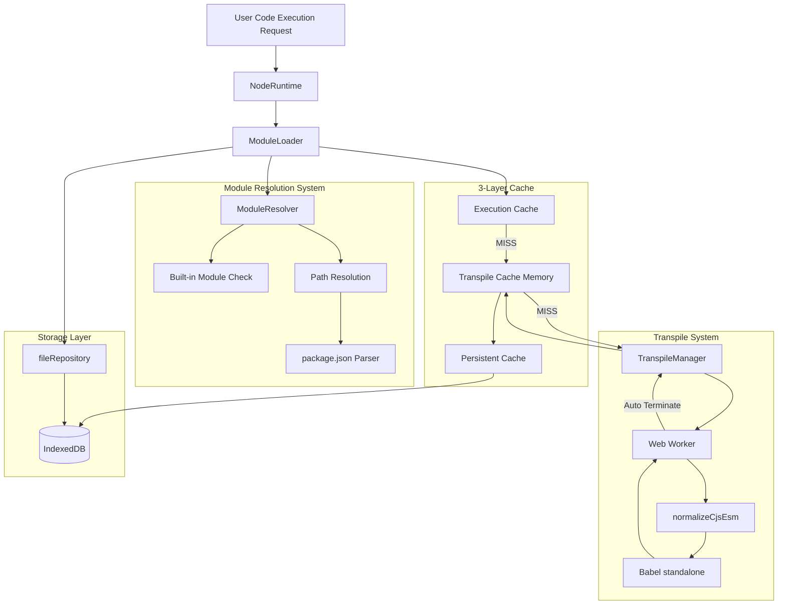

---

## Core Component Details

### 1. NodeRuntime

System entry point. Manages file execution initiation and sandbox environment construction.

#### Primary Responsibilities

- Initiate file execution
- Build sandbox environment
- Inject global objects
- Provide built-in modules
- Create __require__ function with thenable Proxy

#### Processing Flow

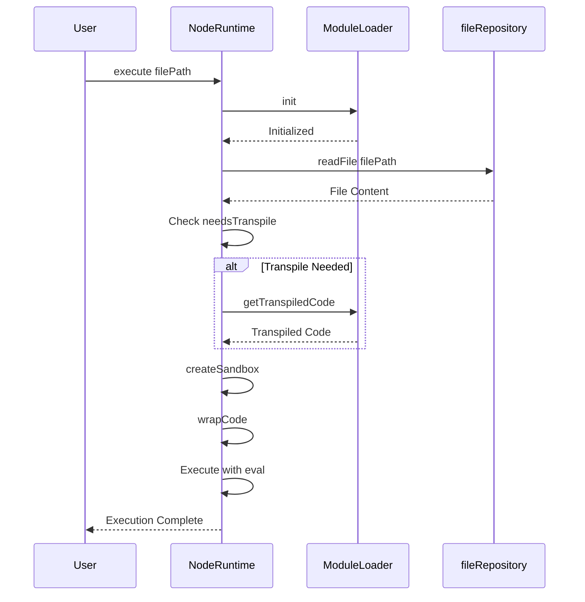

#### Sandbox Environment Components

| Element | Description |
|---------|-------------|
| console | Proxy to debug console or runtime logger |
| setTimeout / setInterval | Browser timer APIs |
| Promise / Array / Object | JavaScript built-ins |
| global | Global object reference |
| process | Node.js process object emulation |
| Buffer | Binary data manipulation |
| __require__ | Async module loading function thenable Proxy |

#### Async Require Implementation with Thenable Proxy

Traditional synchronous require converted to async for IndexedDB compatibility:

**Key Innovation**: `__require__` returns a **thenable Proxy** that allows both:
- `await __require__('fs')` - async resolution
- `__require__('fs').promises` - property access before awaiting

This Proxy implementation:
1. Built-in modules resolve synchronously (stored in `__syncValue`)
2. Non-built-in modules load asynchronously
3. Property access returns nested thenables for chaining
4. Function calls are wrapped and return thenables

**Example Pattern Supported**:
```javascript
const promises = await __require__('fs').promises;
// Works because .promises returns a thenable before await
```

---

### 2. ModuleLoader

Core component for module loading and lifecycle management.

#### Primary Responsibilities

- Coordinate module resolution
- Manage transpilation process
- Handle execution cache
- Detect and handle circular dependencies

#### Cache Strategy

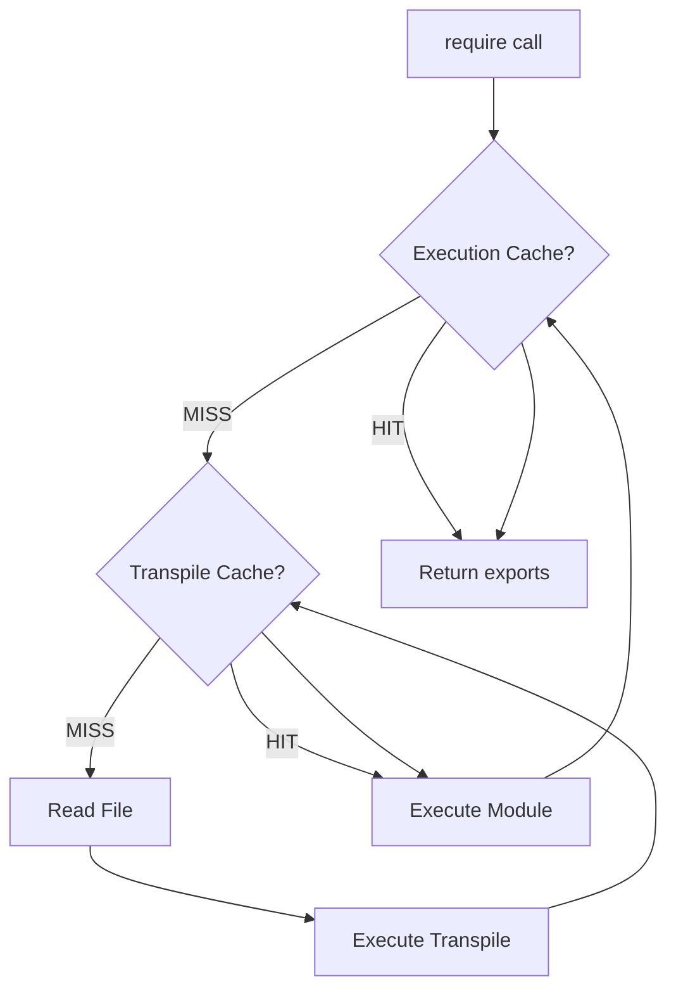

#### Execution Cache Structure

| Field | Type | Description |
|-------|------|-------------|
| exports | unknown | Module's exports object |
| loaded | boolean | Load complete flag |
| loading | boolean | Currently loading flag for circular dependency detection |

#### Module Execution Details

Each module executes in an independent function scope:

- Inject `module.exports` object
- Provide `__require__` function for further module loading
- Supply `__filename` and `__dirname`
- Execute with eval and return exports

#### Transpile Decision Logic

Transpilation executed when:

1. Extension is `.ts`, `.tsx`, `.mts`, `.cts`
2. Extension is `.jsx`, `.tsx`
3. Contains `import` or `export` syntax
4. Contains `require()` calls (for async conversion)

---

### 3. ModuleResolver

Node.js-compatible module path resolution system.

#### Primary Responsibilities

- Built-in module detection
- Relative path resolution
- node_modules search
- package.json parsing
- exports field support

#### Resolution Priority

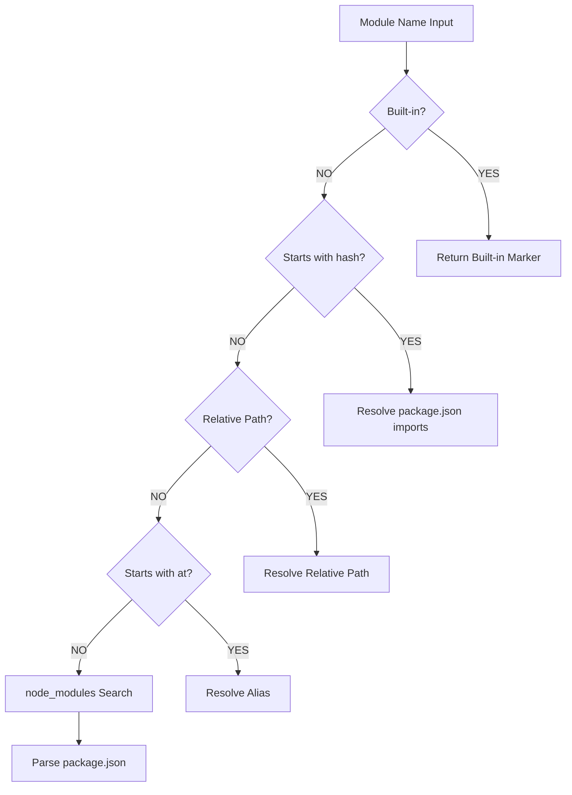

#### Built-in Modules List

fs, fs/promises, path, os, util, http, https, buffer, readline, crypto, stream, events, url, querystring, assert, etc.

#### Path Resolution Examples

| Input | Resolution Result |
|-------|-------------------|
| `fs` | Built-in marker returned |
| `./utils` | `/projects/my-app/src/utils.js` |
| `../config` | `/projects/my-app/config.ts` |
| `@/components/Button` | `/projects/my-app/src/components/Button.tsx` |
| `lodash` | `/projects/my-app/node_modules/lodash/lodash.js` |
| `@vue/runtime-core` | `/projects/my-app/node_modules/@vue/runtime-core/dist/runtime-core.esm-bundler.js` |
| `#internal/utils` | Resolved from package.json imports field |

#### package.json Parsing Logic

Entry point determination priority:

1. `module` field - Prefer ES Module version
2. `main` field - CommonJS version
3. `exports` field - Conditional exports support
4. `index.js` - Fallback

#### Scoped Package Support

Correctly resolves scoped packages like `@vue/runtime-core`:

- Package name: `@vue/runtime-core`
- Subpath: none
- package.json location: `/node_modules/@vue/runtime-core/package.json`

#### Extension Completion

If file path has no extension, tries in order:

1. `.js`, `.mjs`, `.ts`, `.mts`, `.tsx`, `.jsx`, `.json`
2. `/index.js`, `/index.mjs`, `/index.ts`, `/index.mts`, `/index.tsx`

---

### 4. TranspileManager & Web Worker

High-speed transpilation system using Babel standalone.

#### Primary Responsibilities

- Create and manage Web Workers
- Process transpile requests
- Timeout management (30 seconds)
- Automatic memory management

#### Worker Processing Flow

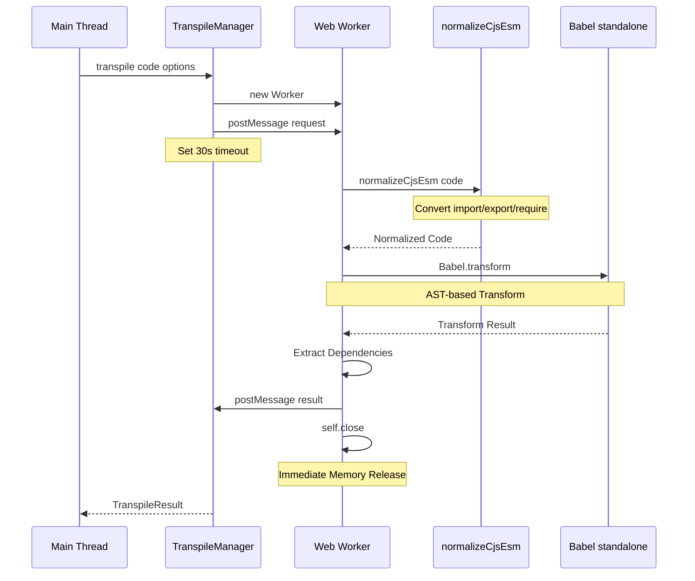

#### Babel Configuration Construction

| Config Item | Condition | Value |
|-------------|-----------|-------|
| presets: typescript | isTypeScript=true | TypeScript syntax removal |
| presets: react | isJSX=true | JSX→React.createElement |
| sourceType | Always | 'module' for top-level await |

#### normalizeCjsEsm Transform

**Pre-processing before Babel**: Regex-based lightweight transformation

**import Statement Transformation**

- `import foo from 'bar'` → `const foo = (tmp => tmp && tmp.default !== undefined ? tmp.default : tmp)(await __require__('bar'))`
- `import { named } from 'bar'` → `const { named } = await __require__('bar')`
- `import * as ns from 'bar'` → `const ns = await __require__('bar')`

**export Statement Transformation**

- `export default foo` → `module.exports.default = foo`
- `export const bar = 1` → `const bar = 1; module.exports.bar = bar;`
- `export { baz }` → `module.exports.baz = baz`

**require Call Transformation**

- `require('foo')` → `await __require__('foo')`

#### Memory Management Strategy

- After transpile completion, immediately call `self.close()` to terminate Worker
- Babel standalone heap isolated within Worker
- No impact on main thread memory
- Create new Worker for each request

---

### 5. ModuleCache

Persistent cache system for transpiled code.

#### Primary Responsibilities

- Save transpile results
- LRU strategy cache management
- Persist to IndexedDB
- Automatic GC (when exceeding 100MB)

#### Cache Structure

IndexedDB directory structure:

```
/cache/
  ├── modules/
  │     ├── abc123.js
  │     ├── def456.js
  │     └── ...
  └── meta/
        ├── abc123.json
        ├── def456.json
        └── ...
```

#### Cache Entry Format

| Field | Type | Description |
|-------|------|-------------|
| originalPath | string | Original file path |
| hash | string | Hash key generated from path |
| code | string | Transpiled code |
| sourceMap | string | Source map (future implementation) |
| deps | string[] | Dependency module list |
| mtime | number | Transformation timestamp |
| lastAccess | number | Last access timestamp |
| size | number | Code size in bytes |

#### Hash Generation

Calculate numeric hash from path string, convert to base-36 string for use as key.

#### GC Strategy

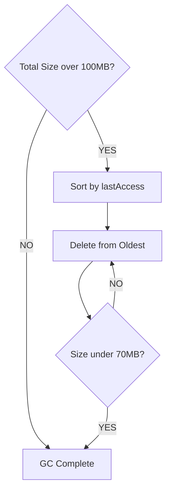

**GC Execution Condition**: Cache total size exceeds 100MB  
**Reduction Target**: Reduce to 70MB (delete least accessed first)

---

## Data Flow Details

### Complete Module Loading Flow

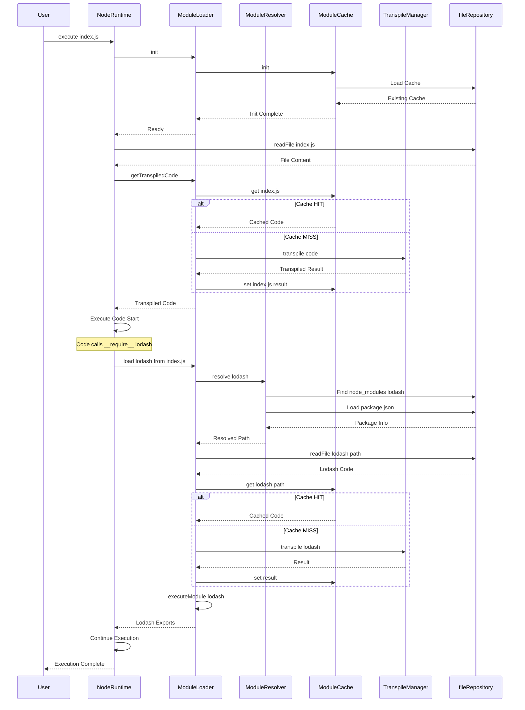

### Transpile Detail Flow

#### Step 1: Language Detection

Input: File path and code content

Detection criteria:

- Extension `.ts`, `.tsx`, `.mts`, `.cts` → TypeScript
- Extension `.jsx`, `.tsx` → JSX
- Code contains `import` / `export` → ES Module
- Code contains `require()` → CommonJS (async conversion needed)

#### Step 2: Babel Configuration Construction

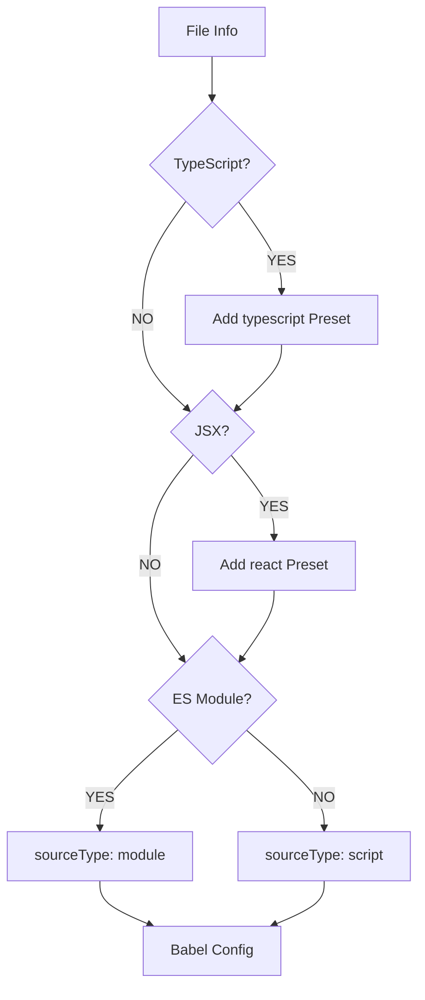

#### Step 3: AST Transformation

Processing by Babel standalone:

1. Parse code to AST
2. Remove TypeScript type annotations
3. Convert JSX to React function calls
4. normalizeCjsEsm already converted import/export to CommonJS
5. Convert require calls to async (already done by normalizeCjsEsm)
6. Extract dependencies
7. Generate optimized code

#### Step 4: Cache Save

Save to both memory and disk:

- Memory: Map structure for immediate access
- Disk: IndexedDB, effective for next startup

---

## Performance Characteristics

### First Execution Timing

| Phase | Time | Description |
|-------|------|-------------|
| File Loading | ~5-10ms | Fetch from IndexedDB |
| Transpilation | ~50-150ms | Babel transform, Worker execution |
| Cache Save | ~5ms | IndexedDB async save |
| Module Execution | ~5-10ms | eval execution |
| **Total** | **~65-175ms** | First time only |

### Second and Later (Cache HIT)

| Phase | Time | Description |
|-------|------|-------------|
| Cache Load | ~1-5ms | Fetch from memory |
| Module Execution | ~5-10ms | eval execution |
| **Total** | **~6-15ms** | **~10-15x faster** |

### Memory Footprint


**Memory Usage**: Stabilizes at 50-70MB with LRU GC

---

## Built-in Modules

### Support Status

| Module | Implementation | Description |
|--------|----------------|-------------|
| `fs` | ✅ | File system operations via fileRepository |
| `fs/promises` | ✅ | Promise-based FS API |
| `path` | ✅ | Path manipulation utilities |
| `os` | ✅ | OS information emulation |
| `util` | ✅ | Utility functions |
| `http` | ✅ | HTTP communication, fetch wrapper |
| `https` | ✅ | HTTPS communication |
| `buffer` | ✅ | Buffer class |
| `readline` | ✅ | Interactive input |
| Others | 📝 | stream, events, crypto, etc. planned |

### fs Module Implementation Features

**Design Principle**: Use IndexedDB as single source of truth

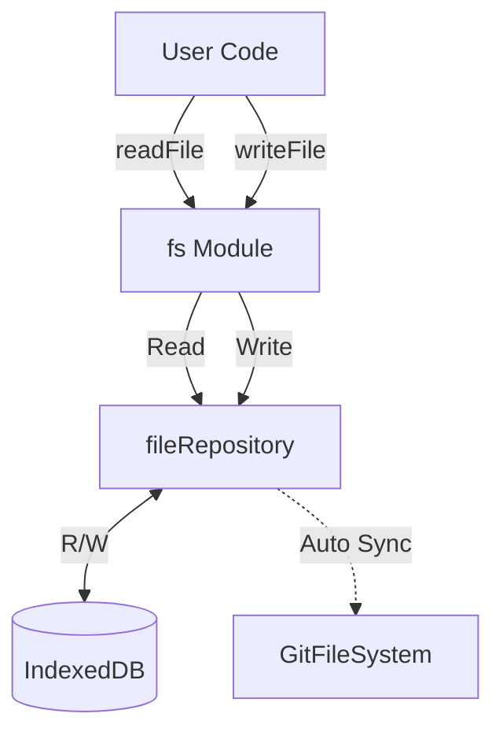

**Main APIs**:

| API | Behavior |
|-----|----------|
| `readFile` / `readFileSync` | Read from IndexedDB via fileRepository |
| `writeFile` / `writeFileSync` | Write to fileRepository, auto-sync to GitFS |
| `readdir` / `readdirSync` | Get directory listing |
| `stat` / `statSync` | Get file information |
| `mkdir` / `mkdirSync` | Create directory |
| `unlink` / `unlinkSync` | Delete file, auto-sync to GitFS |

### path Module

Provides standard Node.js path API:

- `join()`, `resolve()`, `dirname()`, `basename()`, `extname()`
- Resolution based on project directory

### http Module

HTTP communication wrapping fetch API:

- `http.get()`, `http.request()`
- EventEmitter-based response stream

---

## npm Packages Support

### Prerequisites

npm install completed by separate system, `node_modules/` directory exists in IndexedDB.

### Resolution Flow

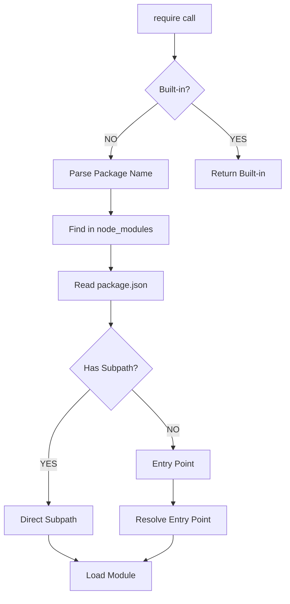

### package.json Parsing Example

**lodash package**:

```
/node_modules/lodash/package.json:
{
  "name": "lodash",
  "main": "lodash.js"
}

→ Resolves to: /node_modules/lodash/lodash.js
```

**@vue/runtime-core package**:

```
/node_modules/@vue/runtime-core/package.json:
{
  "name": "@vue/runtime-core",
  "module": "dist/runtime-core.esm-bundler.js",
  "main": "index.js"
}

→ Resolves to: /node_modules/@vue/runtime-core/dist/runtime-core.esm-bundler.js
```

### Subpath Resolution

| require Call | Resolution |
|--------------|------------|
| `lodash` | `/node_modules/lodash/lodash.js` |
| `lodash/merge` | `/node_modules/lodash/merge.js` |
| `@vue/runtime-core` | package.json module field |
| `chalk` | `/node_modules/chalk/source/index.js` |

---

## Error Handling

### Error Types and Solutions

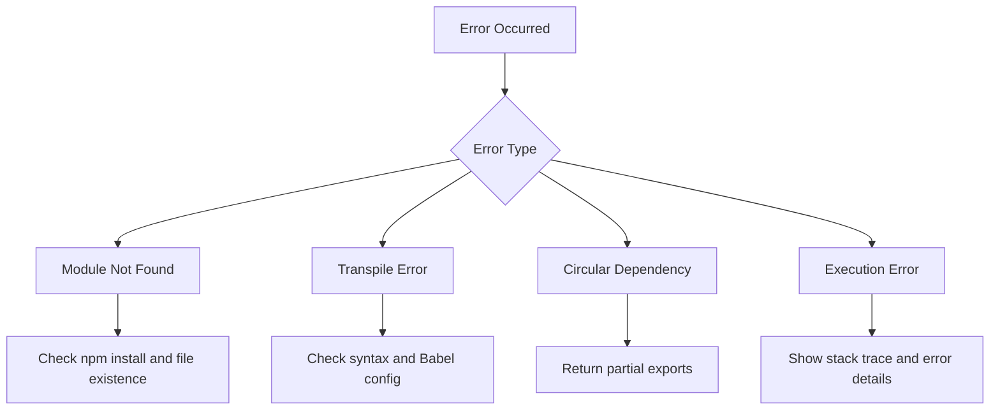

### Error Message Examples

**1. Module Not Found**:

```
❌ Module not found: lodash
Cannot find module 'lodash'

Solution:
- Verify npm install completed
- Check node_modules exists in IndexedDB
- Verify path is correct
```

**2. Transpile Error**:

```
❌ Transpile failed: /src/app.tsx
SyntaxError: Unexpected token

Worker error: ...
```

**3. Circular Dependency Detected**:

```
⚠️ Circular dependency detected: /src/a.js
→ /src/b.js
→ /src/a.js

Returns partially loaded exports
```

---

## Design Rationale

### Why Babel Standalone?

| Option | Pros | Cons | Decision |
|--------|------|------|----------|
| Regex | Lightweight, simple | Inaccurate, no complex syntax | ❌ |
| TypeScript Compiler | Official, accurate | Heavy, no browser support | ❌ |
| esbuild-wasm | Fast | Large size, limited features | ❌ |
| Babel standalone | Accurate, rich plugins | Medium bundle size | ✅ |

**Reason for Adoption**: AST-based accuracy, flexible customization with plugins, works in browser.

### Why Web Worker?

**Main Thread Problems**:

- Transpilation takes 50-150ms, blocks UI processing
- Memory usage accumulates

**Worker Benefits**:

- Main thread non-blocking
- Immediate memory release after completion
- Babel heap isolated

### Why 3-Layer Cache?

**Role of Each Layer**:

1. **Execution Cache**: Circular dependency countermeasure, prevent re-execution of same module
2. **Transpile Cache (Memory)**: Fast access, save transpile results
3. **Persistent Cache (IndexedDB)**: Effective after browser restart

**Effects**:

- First time: ~100ms
- Second time: ~10ms (~10x faster)
- After restart: ~15ms (disk cache)

### Why IndexedDB as Single Source of Truth?

**Design Principle**: Guarantee data consistency with single storage

```
User Operation
  ↓
fileRepository (IndexedDB)
  ↓
Auto Sync (Background)
  ↓
GitFileSystem (lightning-fs)
```

**Benefits**: Single write destination, sync process automated.

### Why Async require?

IndexedDB is async API, so file loading becomes async. Traditional synchronous require cannot handle this, so converted to `await __require__()`.

---

## Usage Examples

### Basic File Execution

Execute TypeScript and JSX files:

```typescript
import { executeNodeFile } from '@/engine/runtime/nodeRuntime';

await executeNodeFile({
  projectId: 'proj_123',
  projectName: 'my-project',
  filePath: '/src/index.ts',
  debugConsole: console,
});
```

### Using npm Packages

User code using npm packages:

```javascript
// User code: index.js
const lodash = require('lodash');
const result = lodash.map([1, 2, 3], x => x * 2);
console.log(result); // [2, 4, 6]
```

Automatically converted and executed:

```javascript
const lodash = await __require__('lodash');
```

### Using ES Modules

ES Module syntax also auto-converted:

```javascript
// User code: utils.ts
import { map } from 'lodash';
export const double = (arr) => map(arr, x => x * 2);
```

Automatically converted to CommonJS:

```javascript
const { map } = await __require__('lodash');
module.exports.double = (arr) => map(arr, x => x * 2);
```

---

## Troubleshooting

### Common Issues and Solutions

**Issue 1: Module not found**

Symptoms: `Cannot find module 'xxx'`

Causes and solutions:

- npm install not completed → Run npm install
- Path is incorrect → Check relative path
- Does not exist in IndexedDB → Create or upload file

**Issue 2: Transpilation is slow**

Symptoms: First execution takes several seconds

Causes and solutions:

- First time takes time for Babel initialization and transpilation (normal behavior)
- Second and later executions fast due to cache

**Issue 3: Out of memory**

Symptoms: Browser becomes heavy

Causes and solutions:

- Cache exceeds 100MB → Auto GC activates and reduces to 70MB
- Clear cache and restart

---

## Future Enhancement Plans

### Short-term

- Source Map integration for better debugging
- More detailed error messages
- Performance measurement and profiling

### Mid-term

- Implement more built-in modules
- Worker pool (parallel transpilation)
- Hot Module Replacement

### Long-term

- WebContainer integration consideration
- Native app support (Tauri)
- AI-assisted debugging features

---

## References

### Related Documents

- [CORE-ENGINE.md](./CORE-ENGINE.md) - Core engine design
- [DATA-FLOW.md](./DATA-FLOW.md) - Overall data flow
- [SYSTEM-OVERVIEW.md](./SYSTEM-OVERVIEW.md) - System overview

### External Links

- [Babel Documentation](https://babeljs.io/docs/)
- [Web Workers API](https://developer.mozilla.org/en-US/docs/Web/API/Web_Workers_API)
- [IndexedDB API](https://developer.mozilla.org/en-US/docs/Web/API/IndexedDB_API)
- [Node.js Built-in Modules](https://nodejs.org/api/)

---

**Last Updated**: 2025-01-06  
**Version**: 5.0  
**Status**: ✅ Accurate documentation based on implementation
