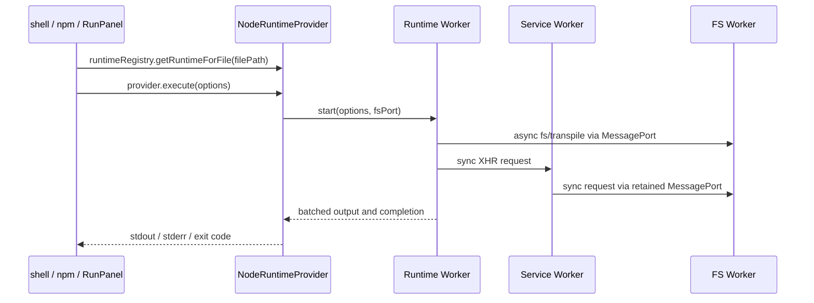

# Node.js Runtime

Pyxis runs Node.js-compatible code in the browser. The provider prewarms one idle Runtime Worker. Executions reuse it when available, and a normally completed Worker returns to the idle pool. When no idle Worker is available, concurrent runs create Workers on demand; at most one idle Worker is retained after they finish. A terminated or unexpectedly failed Worker is discarded and replaced. Per-run module caches, timers, process listeners, stdin, and other execution state are disposed at completion. Values added to the Worker global scope may remain for the next run.

## Execution path

```mermaid
sequenceDiagram
    participant Caller as shell / npm / RunPanel
    participant Provider as NodeRuntimeProvider
    participant RT as Runtime Worker
    participant SW as Service Worker
    participant FS as FS Worker
    Caller->>Provider: runtimeRegistry.getRuntimeForFile(filePath)
    Caller->>Provider: provider.execute(options)
    Provider->>RT: start(options, fsPort)
    RT->>FS: async fs/transpile via MessagePort
    RT->>SW: sync XHR request
    SW->>FS: sync request via retained MessagePort
    RT-->>Provider: batched output and completion
    Provider-->>Caller: stdout / stderr / exit code
```

`NodeRuntimeProvider` acquires a prewarmed Worker for calls from `runtimeRegistry`. Stdout, stderr, console, and debugConsole output is batched from the Worker. Terminal Ctrl+C sends a catchable SIGINT; if no handler processes it, or SIGINT is repeated, the Worker is terminated with exit code 130. RunPanel Stop and component unmount force-cancel through an AbortSignal, including nested ShellExecutor work.

Startup registers and updates the Service Worker, waits for activation and control, then confirms the FS Worker port. An initially uncontrolled page reloads once; if it remains uncontrolled, startup shows an error. After a Service Worker restart, sync requests wait for a new FS port, while retired ports stay open until their pending replies arrive. Reconnection has a timeout. `setup-build` bundles `src/engine/runtime/bridge/serviceWorker.js` into `public/sw.js`.

Interrupt signals also abort an active `ShellExecutor` started through `child_process`; terminating the Runtime Worker stops its active shell work.

## Files and modules

`FsCore` in the FS Worker owns OPFS and volatile `/tmp`. The Runtime Worker does not preload every file; it accesses the filesystem through `RuntimeFsMount` and the FS Worker.

- Async filesystem and transpile requests travel directly from the Runtime Worker to the FS Worker over a `MessagePort`.
- Sync filesystem calls and dynamic `require` path resolution use synchronous XHR to the Service Worker, which forwards requests over its FS Worker port.
- A synchronous request blocks only the Runtime Worker; the UI main thread remains available.
- If the Service Worker restarts and loses its FS Worker port, it asks the main page for a replacement and resumes after the port is acknowledged.
- Shell execution through `child_process` and stdin go through the main page.

`child_process` `.sh` scripts and command substitutions run in child shells that inherit the parent's cwd and environment; their changes stay isolated, and shell execution returns its final or explicit exit status. A script's resolved path is available as `BASH_SOURCE[0]`. Shell syntax coverage is a POSIX subset; see [Shell System](../SHELL-SYSTEM.md).

One resolver serves asynchronous preloading and synchronous `require`, retaining successful resolutions for the duration of an execution. The sync route asks the FS Worker only about unresolved candidates. A CommonJS file is read once into the per-execution module cache; the FS Worker owns the persistent transformed-module cache. These caches have different lifetimes, and the Runtime Worker has no separate file map. CommonJS circular dependencies return partial exports while loading, and replacement of `module.exports` is reflected. CommonJS and ESM namespace creation use the same per-execution module cache. Sync `fs` APIs use the same bridge.

Module format is determined by a JavaScript parser. `.mjs` and `.mts` are ESM; `.cjs` and `.cts` are CommonJS. `.js` and `.ts` follow the nearest `package.json` `type`, with source grammar detection when `type` is absent. Package `exports` and `imports` resolve using execution conditions such as `import` and `require` and Node path rules. Function-constructor bodies are also parsed, so imports in those bodies use the existing I/O tracking path.

The runtime's virtual HOME is `/home/pyxis`. Newly created workspaces use `~/<name>`. The module cache path is `~/.cache/pyxis`, and the npm tarball cache path is `~/.npm`. npm metadata is fetched fresh; only package tarballs are cached, keyed by the SHA-256 of the exact resolved tarball URL and written after successful extraction. `/tmp` is a volatile FS Worker mount shared across Node runs.

## Repeating the benchmark

`scripts/bench/node-runtime/` contains fixture manifests and a browser runner. With Pyxis open in agent-browser, evaluate `import('/scripts/bench/node-runtime/run.mjs').then(m => m.measureRuntimeBenchmarks())`. It seeds the demo workspace, then runs the JavaScript/TypeScript and dependency cases plus `npm run bench` four times each. `warmSamples` contains runs 2–4. The default `benchmark: true` adds per-execution Worker acquisition/startup, RPC, resolver, parse/analyze, and transpile metrics to captured output; `measureRuntimeBenchmarks({ benchmark: false })` measures normal execution wall time. `acquisitionMs` spans the pool request until the acquired Worker is confirmed ready; `preparedWorker` marks a borrowed prewarmed slot. `workerStartMs` spans the `start` message send to Worker handler entry, excluding prewarm time, so it does not match the earlier construct-to-handler metric. Small negative values can occur below clock resolution. Seeding and setup are outside each run's wall timer, as are UI submission and terminal rendering. The first measured sample includes the benchmark helper's first load.

Detailed mode records per-filesystem-operation `calls`, `wallMs`, `queueMs` (enqueue to operation start), and `coreMs` (awaited FS Core operation time, including OPFS waits rather than pure CPU). Call-summed queue/core values overlap across requests and must not be added as wall time. Within each sample, `preloadAnalyzeMs` + `preloadRpcOutsideAnalyzeMs` + `preloadOtherMs` partition `preloadWallMs` without overlap. `preloadRpcActiveMs` is the union of active RPC intervals and may overlap analysis; `preloadRpcWhileAnalyzeMs` reports that overlap. Category medians are calculated independently and may not sum to the wall median.

After FS Core began reusing shared directory-prefix handle chains, normal warm medians for the 24-require fixture fell from 35.4 to 18.8 ms in the repeated comparison (41.5 to 22.4 ms in the initial comparison). For `diff@9.0.0`, they fell from 56.7 to 38.0 ms (initial comparison 64.2 to 42.8 ms). The main-thread reference was 17.9 ms for requires and one 38.3 ms diff sample. Opt-in runs kept RPC/read counts at 75/26 and 60/23 while call-summed FS Core time fell from 34.2 to 15.7 ms and 49.7 to 22.7 ms, respectively. Analyzer time remained about 1 ms for requires and 18 ms for diff, consistent with reduced directory traversal accounting for the measured change. All raw series and per-path diagnostics are in the [residual measurement artifact](../scripts/bench/node-runtime/results/runtime-residual.json); individual samples vary. These are development-fixture measurements, not a performance guarantee across browsers or devices.

## Transpilation

The FS Worker serializes transpile requests and starts a dedicated Worker on demand. The pool has one Worker and disposes it after 30 seconds idle; a later request starts a new one. Runtime JavaScript ESM transforms use esbuild through this pool. TypeScript uses the registered extension transform configuration through the same pool. npm archives and extracted files preserve bytes; transforms occur when runtime code loads modules. Persistent cache entries are validated using SHA-256 hashes of their paths and transform inputs.

## Supported scope

The runtime provides browser implementations of modules such as `fs`, `path`, `readline`, and `child_process`. `child_process` connects to Pyxis's shell. Native Node.js addons, `worker_threads`, and a full operating-system process environment are not provided.

## Not yet verified

OPFS, synchronous XHR, and Service Worker port recovery still need Safari device checks. The page-wide 400 MB memory budget has not been measured. See [Development/TODO.md](../../Development/TODO.md) for remaining checks.
