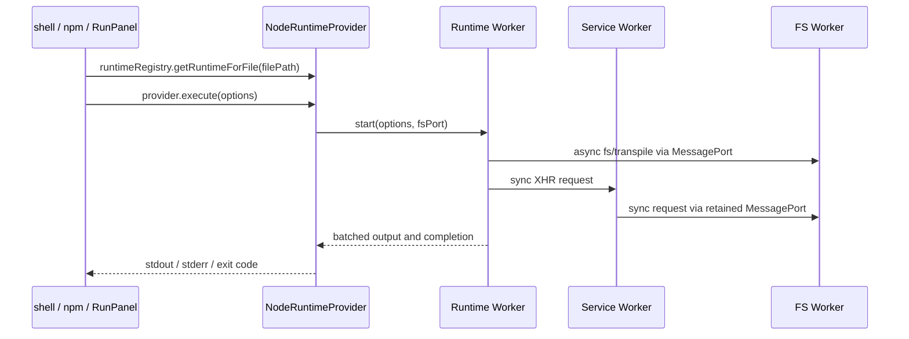

# Node.js Runtime

Pyxis runs Node.js-compatible code in the browser. Each execution gets a dedicated Runtime Worker that is discarded when the run ends, so process and module state start fresh for every run.

## Execution path

```mermaid
sequenceDiagram
    participant Caller as shell / npm / RunPanel
    participant Provider as NodeRuntimeProvider
    participant RT as Runtime Worker
    participant SW as Service Worker
    participant FS as FS Worker
    Caller->>Provider: runtimeRegistry.getRuntimeForFile(filePath)
    Caller->>Provider: provider.execute(options)
    Provider->>RT: start(options, fsPort)
    RT->>FS: async fs/transpile via MessagePort
    RT->>SW: sync XHR request
    SW->>FS: sync request via retained MessagePort
    RT-->>Provider: batched output and completion
    Provider-->>Caller: stdout / stderr / exit code
```

`NodeRuntimeProvider` starts one Worker per call from `runtimeRegistry`. Stdout, stderr, console, and debugConsole output is batched from the Worker. Terminal Ctrl+C sends a catchable SIGINT; if no handler processes it, or SIGINT is repeated, the Worker is terminated with exit code 130. RunPanel Stop and component unmount force-cancel through an AbortSignal, including nested ShellExecutor work.

Startup registers and updates the Service Worker, waits for activation and control, then confirms the FS Worker port. An initially uncontrolled page reloads once; if it remains uncontrolled, startup shows an error. After a Service Worker restart, sync requests wait for a new FS port, while retired ports stay open until their pending replies arrive. Reconnection has a timeout. `setup-build` bundles `src/engine/runtime/bridge/serviceWorker.js` into `public/sw.js`.

Interrupt signals also abort an active `ShellExecutor` started through `child_process`; terminating the Runtime Worker stops its active shell work.

## Files and modules

`FsCore` in the FS Worker owns OPFS and volatile `/tmp`. The Runtime Worker does not preload every file; it accesses the filesystem through `RuntimeFsMount` and the FS Worker.

- Async filesystem and transpile requests travel directly from the Runtime Worker to the FS Worker over a `MessagePort`.
- Sync filesystem calls and dynamic `require` path resolution use synchronous XHR to the Service Worker, which forwards requests over its FS Worker port.
- A synchronous request blocks only the Runtime Worker; the UI main thread remains available.
- If the Service Worker restarts and loses its FS Worker port, it asks the main page for a replacement and resumes after the port is acknowledged.
- Shell execution through `child_process` and stdin go through the main page.

Statically discovered dependencies are preloaded asynchronously. An uncached `require` also works synchronously: it resolves the path, reads the file from the FS Worker, and transpiles it over the same synchronous route when needed. CommonJS circular dependencies return partial exports while loading, and replacement of `module.exports` is reflected. Sync `fs` APIs use that bridge too.

The runtime's virtual HOME is `/home/pyxis`. Newly created workspaces use `~/<name>`. The module cache path is `~/.cache/pyxis`, and the npm tarball cache path is `~/.npm`. npm metadata is fetched fresh; only package tarballs are cached, keyed by the SHA-256 of the exact resolved tarball URL and written after successful extraction. `/tmp` is a volatile FS Worker mount shared across Node runs.

## Transpilation

The FS Worker serializes transpile requests and starts a dedicated Worker on demand. The pool has one Worker and disposes it after 30 seconds idle; a later request starts a new one. JavaScript ESM transforms and `.mjs` transforms in both npm installation paths use esbuild through this pool. TypeScript uses the registered extension transform configuration through the same pool. Persistent cache entries are validated using SHA-256 hashes of their paths and transform inputs.

## Supported scope

The runtime provides browser implementations of modules such as `fs`, `path`, `readline`, and `child_process`. `child_process` connects to Pyxis's shell. Native Node.js addons, `worker_threads`, and a full operating-system process environment are not provided.

## Not yet verified

OPFS, synchronous XHR, and Service Worker port recovery still need Safari device checks. The page-wide 400 MB memory budget has not been measured. See [Development/TODO.md](../../Development/TODO.md) for remaining checks.
