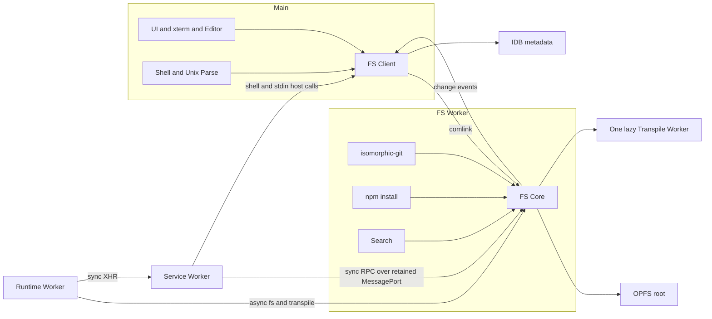

# OPFS移行計画

判断理由は `STORAGE_INTENT.md`。一括で移行する。

## 目標構成

file I/Oに関わる処理はmainに置かない。mainはUI・軽い処理（shellやunixコマンドのparse）・shell/stdin host callsを担う。

| 実行場所 | 担当 |
|---|---|
| main | React UI、xterm、エディタ、shell・unixコマンドのparse、FS Client、shell/stdin host calls |
| FS Worker | OPFSの唯一の所有者。git・npm installの書き込み・検索もここで動かす（大量のfs呼び出しにmessageの往復を挟まないため） |
| Runtime Worker | Node runtime。同期XHRで止まるので、FS Workerとは必ず別にする（同じWorkerだと自分自身を待ってdeadlockする） |
| Transpile Worker | FS Worker内のlazy pool。1 Workerに固定し、30秒間未使用なら破棄する |
| Service Worker | 同期XHRを受け、保持しているFS WorkerのMessagePortへ直接中継する。portを失ったらmainへ再送を要求する |

- SyncAccessHandleは「開く→操作→閉じる」で使い、開きっぱなしにしない
- FS Coreは直近の成功pathのdirectory handle prefixだけを保持し、次のpathとの共通prefixを再利用する。Core再初期化とdirectory削除時にgenerationを更新して無効化し、古いin-flight lookupはchainを更新できない。directory renameはsource削除時に無効化される。file handleやpayloadはcacheしない
- FS Client: API・変更eventの購読口・metadataへのアクセスを提供する。現行の`fileRepository`を置き換える
- API: Node fs風のpath基準（readFile / writeFile / readdir / stat / mkdir / rm / rename）。`readFile`はraw bytes、`readText`は明示UTF-8 decode、`writeFile`はtextまたはbytesを扱う。runtimeの`fsModule`とunixコマンドは同じIFを使う
- 拡張機能はmainで読み込む（現状維持）

## Pathモデル

- 絶対path 1形式。AppPath / FSPath(`/projects/<name>`) / GitPathとその変換を廃止し、Node POSIX互換の字句path APIを共有する
- `normalizePath`は絶対pathを正規化し、`resolvePath(cwd, ...parts)`は明示cwdから相対pathを解決する。FS/runtimeではcwdを暗黙にしない
- path APIはpath文字列の字句処理のみを担当する。`~`・glob・quote・変数展開はshell parserの責務とし、shell入力を一度展開してからFS APIへ渡す。Nodeの`fs` pathへshell展開を持ち込まない
- workspace root = 開いたfolder。`projectStore`は「project ID・名前」ではなく「root path」を持つ
- file tree = root配下だけ。terminal・runtimeは`/`全体にアクセスできる
- Linux型の配置。`HOME=/home/pyxis`（単一userなので固定名）。workspaceは`~/<name>`、runtime cacheは`~/.cache/pyxis`（XDG）、npm cacheは`~/.npm`、`/tmp`はFS Worker内の揮発領域
- shellの`~`、`process.env.HOME`、`os.homedir()`は同じHOMEを指す

## Storage配置

| 対象 | 移行後 |
|---|---|
| file本体・`.git`・node_modules | OPFS |
| projects store | recent folders（key = root path） |
| `pyxis-global`の tab_state / chat_spaces / ai_reviews | keyをprojectIdからroot pathに変更 |
| `ProjectFile`のAIレビュー関連field | ai_reviewsへ統合し、file entryから外す |
| runtime cache | OPFSの`~/.cache/pyxis` |
| `pyxis-fs`(lightning-fs) | 削除 |
| `PyxisAuth`、translations / keybindings / user_preferences / extensions | 変更なし |

`ProjectFile`はpath・種別・size・mtimeを持つだけの純粋なFS entryにする。`id` / `projectId` / `parentPath`は廃止。

## Git

- isomorphic-gitはFS Worker内で動かし、fsはFS Coreを直接使う
- `gitFileSystem.ts` / `syncManager.ts` / lightning-fsへの依存を削除。`.gitignore`による同期フィルタも不要
- `gitOperations/*`（push・TreeBuilder等）のpath変換箇所を書き直す

## UI

- project選択はOperationWindowの独立したOpen Folder・Open Recent modeに置く。Open Folderはpath browsingと明示的な確定、Open RecentはMRU選択に専念させ、browse resultsとrecent foldersを混在させない。新規workspaceは`~/<name>`をmkdirしてopen（空）
- `initial_files/`は`~/demo`に置く（`~/demo`が無いときだけ投入）
- WebPreviewTab: `getProjects()`・`/projects/<name>`接頭辞の除去・`projectId`によるevent絞り込みをやめ、絶対pathで扱う
- Markdownの`LocalImage`: `projectName` / `projectId`を渡す代わりに絶対pathを渡す

## Extensions

- context APIの`fileRepository`をpath APIに置き換える。対象: react-preview / todo-panel / _shared / sample-command / python-runtime / binary-editor
- `docs/HOW-TO-CREATE-EXTENSION.md`・`EXTENSION-SYSTEM.md`を更新

## 旧データ移行（時限・2027-04目安で削除）

- 起動時に1回だけ実行。完了flagをIDBに保存する
- 旧project `<name>`は`/home/pyxis/<name>`へコピーし、予約suffixは付けない。割当済みproject-to-root mappingをstateへ先に保存し、retryでも同じdestinationを使う。未割当projectの実destinationが存在したら、projectへの書き込み前に停止してlegacy dataを残す。worktreeはPyxisProjects.filesから、**`.git`はlightning-fs `pyxis-fs`の`/projects/<name>/.git`から**（gitの履歴はlightning-fsにしかない）
- chat・tab・ai_reviewsのkeyをprojectIdから`~/<name>`の絶対pathに書き換える
- 旧DBの削除は、コピー後にfile数と内容の検証が通ってから。移行中は同一originのquotaを一時的に約2倍使う
- 失敗したらUIとlogに表示し、旧DBは残す
- 移行codeは1つのfolderにまとめ、本体から参照する箇所は1つだけにする

## Runtime

### 実行モデル
- Runtime Workerは使い回す。待機Workerを常に1つ先行起動しておき、`node`実行はそれを取って使う。正常終了したWorkerは待機へ戻す。terminateしたら破棄し、次の待機Workerを先行起動する。同時実行で待機が無ければ追加で起動し、終了後は待機1つを超える分を破棄する
- 実行ごとにmodule cache・timer・`process`のlistener・stdin状態を破棄する。Worker global scopeへ追加された値は次の実行に残りうる（許容）
- ProviderがFS WorkerのportをRuntime Workerへ渡し、Runtime Workerが作る`RuntimeFsMount`を`NodeRuntime`の必須filesystem依存にする。file accessと変換済みmoduleの永続cacheはFS Workerが所有し、Runtime Workerには実行内module cacheだけを置く
- 呼び出し元（shellの`node`コマンド・`npmHandler`・`RunPanel`）は従来通り`runtimeRegistry` → `NodeRuntimeProvider`を使う。ProviderがWorkerを管理する
- Ctrl+C: `process.on('SIGINT')`に処理が登録されていればそれを呼ぶ。登録がない場合や同期XHRで止まっている場合は`worker.terminate()`し、exit code 130で終わる
- stdout / stderr / console・debugConsoleは`postMessage`でまとめて流す
- python-runtime拡張のRuntimeProviderはmainのまま（範囲外）

### fsの経路
- 非同期（`fs.promises`等）: Runtime WorkerとFS Workerを`MessageChannel`で直接つなぎ、mainを通さない
- 同期fs: 同期XHR → SW → FS Worker。mainを経由しない（main busy時にRuntimeが止まらないため）。`sync-message`を使う
  - SWはFS Workerへの`MessagePort`を保持する。mainが初期化時にportを渡し、SWが再起動で失ったらmainへ再送を要求する
  - mainを経由するのはshell（`child_process`）とstdinだけ
- 複数tabは非対応（単一tab前提）。2つ目のtabはWeb Locksの取得に失敗したらエラー表示して止める
- どちらもFS Workerだけが実際に書き込むので、内容の食い違いは起きない
- SW未制御（Shift+reloadなど）を起動時に検出し、通常reloadを促すエラーを表示する

### 同期RPCで扱う操作
- fsの`*Sync`、`require`のパス解決
- transpile（esbuild-wasmは`transformSync`が使えない。拡張機能が提供するTypeScriptのtranspilerも同じ経路）
- `child_process.execSync` / `spawnSync`（mainのshellを呼ぶ）
- stdinの同期読み込み（`fs.readFileSync(0)`、`fs.readSync(0)`。terminalの入力行を待つ）
- 静的に分かる依存はasyncで先読みし、同じresolverが成功したpathを実行内に保持する。同期RPCは未知の解決先だけに使う。CommonJSのentryは一度だけ読み、未解決候補の存在確認を繰り返さない
- `.mjs` / `.mts`はESM、`.cjs` / `.cts`はCommonJSとして扱う。`.js` / `.ts`はpackageの`type`で判定し、未指定時はsource grammarを見る。`exports` / `imports`は`import` / `require`条件に沿って解決する。Function constructorのbodyもJavaScript parserで解析し、importは既存I/O追跡へ渡す。ESM/CJS namespace生成は同じ実行内module cacheを使う
- npm installはregistry tarballのbytesを展開して保存する。runtime変換はinstall時に行わず、実行時に必要なfileだけ変換する

### SW
- 必須にする。初回訪問時は1回reloadする。devでも有効にする（現在の`sw-register.js`はlocalhostでSWを解除している）
- `sync-message`を取り込むため、`public/sw.js`をバンドル対象に変える（`setup-build`でesbuildにかける）

### 保留
- `http.createServer`: SWで仮想的なserverとして実現できる可能性がある。今回は実装しない

## メモリ予算

page全体（main + 全Worker）を**400 MB以内**に抑える目標。実行中program自身が使うメモリは予算に含めない。Safari実機を含む実測は未完了で、Development/TODO.mdに残す。

- 減る: 実行のたびに行っていた全fileのpreload（node_modulesを含む）、ProjectMountのfile Map、lightning-fs
- 増える: FS Workerの常駐分、実行中のRuntime Worker
- Transpile Worker Pool: **FS Worker内で1 Workerに固定し、30秒間未使用なら破棄する**。JS module変換と拡張機能が登録したTypeScript変換を同じpoolで実行する
- Runtime Worker: 待機最大1つ＋実行中の分。同時実行の終了後も余分な待機Workerは保持しない
- 計測: `performance.measureUserAgentSpecificMemory()`はcross-origin isolationが必須なので使えない。ブラウザのタスクマネージャーとDevToolsのMemoryタブで計測する
- 実行中programがメモリを使い切るのは許容する（browserのAPIで制限する手段もない）。Ctrl+Cでterminateすれば実行Workerを終了できる

## 先行検証（Safari実機）

- dedicated WorkerからのrequestをSWが捕捉できるか（Runtime方式の前提）
- Worker内でのSyncAccessHandle、directoryの`FileSystemHandle.move()`対応
- 小さいfileが大量にある場合（node_modules）、tree walkの速度がIDBの`getAll`と比べてどうか
- SWが停止→再起動した後、`MessagePort`の再受け渡しを経て同期XHRが復帰するか
- main busy時にも同期fsが遅延しないか（SW → FS Worker直結の確認）
- 同期XHR 1回あたりの往復時間（`require`の連続解決で許容できるか）

## 影響範囲（2026-10-03時点）

- `fileRepository`を使っているfile: 73（unixOperations 12、shell 4、tabState 3、in-ex 3など）
- lightning-fs / `gitFileSystem`を参照しているfile: 26
- `projectId` / `currentProjectId`を参照しているfile: 113

## 作業順

1. 先行検証
2. FS Worker + FS Client + path API
3. git adapterと、lightning-fs系の削除
4. 利用箇所（cmd・runtime・tabs・components・extensions）の書き換え
5. Open Folder UIとprojectStoreの置き換え
6. 旧データ移行
7. Runtime Worker化と同期RPC
8. README・docs/（TWO-LAYER-ARCHITECTURE、CORE-ENGINE、DATA-FLOW、NODE-RUNTIME等）・CLAUDE.mdを更新
