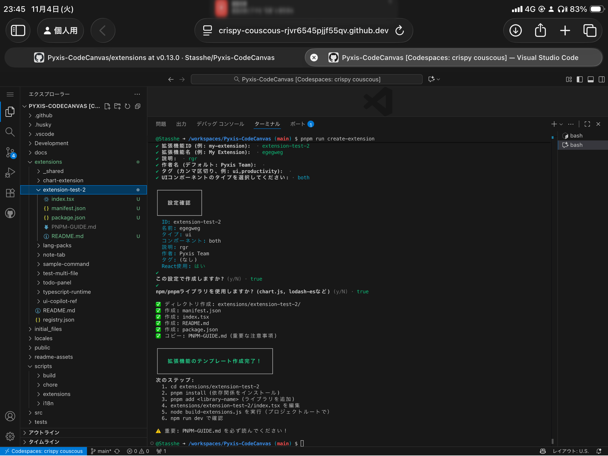

extensions/

# Pyxis Extensions - 2025年新アーキテクチャ

このディレクトリには、Pyxisの拡張機能(TypeScript/TSX)のソースコードが含まれています。

---

## 🚀 2025年・新拡張機能アーキテクチャ

### 1. **pnpmライブラリ完全対応**
- 各拡張機能ごとに`package.json`を配置し、`pnpm install`でnpmライブラリが利用可能
- `chart.js`や`lodash`など、ほぼ全てのnpmパッケージが使えます
- esbuildによる依存バンドルで高速・安全
- React/ReactDOMはPyxis本体からグローバル提供（依存不要）

### 2. **Terminalコマンド拡張**
- 拡張機能から独自のターミナルコマンドを追加可能
- `context.terminal.registerCommand`でコマンド名・実装・引数・説明を登録
- ユーザーはPyxisのターミナルUIから直接コマンド実行
- コマンドはNode.js/TypeScriptで記述可能
- コマンドの引数・補完・説明も拡張機能側で定義

---

## ディレクトリ構造

```

├── _shared/              # 共通型定義
├── chart-extension/      # Chart.jsなど外部ライブラリ利用例
├── typescript-runtime/   # TypeScript/JSXトランスパイラ
├── note-tab/             # ノートタブ拡張機能
├── todo-panel/           # TODOパネル拡張機能
├── lang-packs/           # 多言語パック
└── ...
```

---

## 開発フロー（2025年版）

1. **拡張機能テンプレート作成**
    - `npm run create-extension`で対話生成

<div align="center">
  
</div>

    - または手動で`extensions/<name>/`ディレクトリ作成
2. **npmライブラリ追加**
    - `package.json`を作成し、`pnpm install chart.js lodash`などで依存追加
    - TypeScript/TSXで自由にimport可能
3. **Terminalコマンド追加**
    - `context.terminal.registerCommand`でコマンドを登録
    - コマンドはNode.js/TypeScriptで実装
4. **ビルド**
    - `node build-extensions.js`でesbuildバンドル
    - 依存も自動バンドル
5. **自動配置**
    - `public/extensions/`にバンドル済みJS配置
6. **一括ビルド**
    - `npm run setup-build`で全拡張機能を一括ビルド

---

## 拡張機能の種類

| タイプ | 説明 | React必須 | 返り値 | npmライブラリ | Terminalコマンド |
|--------|------|-----------|--------|--------------|-----------------|
| **transpiler** | TypeScript/JSX等のトランスパイラ | ❌ | `runtimeFeatures` | ✅ | ✅ |
| **service** | 言語パック（i18n等） | ❌ | `services` | ✅ | ✅ |
| **builtin-module** | Node.js互換モジュール | ❌ | `builtInModules` | ✅ | ✅ |
| **ui** | カスタムタブ/サイドバー | ✅ | `{}` | ✅ | ✅ |

---

## Terminalコマンド拡張の例

```typescript
// index.ts
export async function activate(context: ExtensionContext): Promise<ExtensionActivation> {
  context.terminal?.registerCommand({
    name: 'hello',
    description: 'Hello Worldを表示',
    args: [{ name: 'name', type: 'string', required: false }],
    handler: async ({ name }) => {
      return `Hello, ${name || 'World'}!`;
    }
  });
  // ...他のAPI登録
  return {};
}
```

---

## npmライブラリ利用例

```typescript
// index.tsx
import Chart from 'chart.js/auto';
import _ from 'lodash';

function MyChartTab() {
  // Chart.jsやlodashがそのまま使える！
  // ...
}
```

---

## manifest.json 例

```json
{
  "id": "pyxis.chart-extension",
  "name": "Chart Extension",
  "version": "1.0.0",
  "type": "ui",
  "description": "Chart.jsを使ったグラフ表示拡張",
  "author": "Your Name",
  "defaultEnabled": false,
  "entry": "index.js",
  "metadata": {
    "publishedAt": "2025-01-01T00:00:00Z",
    "tags": ["ui", "chart", "productivity"]
  }
}
```

---

## 型定義・API

- `ExtensionContext`に`terminal`プロパティ追加
- `terminal.registerCommand`でコマンド拡張
- npmライブラリは`pnpm install`で自由に追加
- UI拡張はTSX推奨
- 詳細は`_shared/types.ts`参照

---

## よくある質問（2025年版）

### Q: npmライブラリは本当に何でも使える？
**A: ほぼ全て使えます。Chart.js, lodash, dayjs, axiosなど主要ライブラリは全てOK。React/ReactDOMはPyxis本体から提供されるので依存不要です。**

### Q: Terminalコマンドはどんなものが作れる？
**A: Node.js/TypeScriptで記述できる任意のコマンド。引数・補完・説明も自由に定義可能。UI拡張からもコマンド登録できます。**

### Q: 旧拡張機能との互換性は？
**A: 後方互換性は気にせず、新API・新構造で記述してください。**

---

## 参考ドキュメント
- `/docs/domain/extensions.md` - 拡張機能システムの仕組みとContext API
- `/docs/domain/extension-authoring.md` - 作り方、複数file、npmライブラリ
- `/docs/arch/system-overview.md` - システム全体概要

---

## サンプル拡張機能
- **Chart Extension** (`extensions/chart-extension/`) - Chart.js利用例
- **Note Tab** (`extensions/note-tab/`) - ノートタブ
- **TODO Panel** (`extensions/todo-panel/`) - TODOリスト
- **TypeScript Runtime** (`extensions/typescript-runtime/`) - トランスパイラ
- **Lang Packs** (`extensions/lang-packs/`) - 多言語パック

---

## 技術スタック
- TypeScript / TSX
- React (グローバル)
- esbuild (package.jsonあり)
- tsc (package.jsonなし)
- pnpm (依存管理)
- IndexedDB (キャッシュ)
- Node.js API互換

---

## まとめ

Pyxis拡張機能は2025年から**npmライブラリ・Terminalコマンド拡張**に完全対応。
Chart.jsやlodashなど外部ライブラリを自由に使い、独自コマンドも追加可能。
新API・新構造で、より強力な拡張機能開発が可能です。
- **TypeScript/TSX バンドル**: esbuildで依存関係をバンドル
- **npm/pnpm/yarn サポート**: 自動的に依存関係をインストール
- **React外部化**: React/ReactDOMはPyxis本体を使用
- **Tree-shaking**: 使われていないコードを削除
- `public/extensions/` に出力

### 📝 tscモード (package.jsonがない場合)

- **TypeScript/TSX トランスパイル**: tscで単純にトランスパイル
  - TSX → `React.createElement` に変換
  - `import React from 'react'` → `const React = window.__PYXIS_REACT__` に変換
- **JSON/画像/Markdown ファイル**をコピー
- `public/extensions/` に出力

実行方法:

```bash
node build-extensions.js
```

**ビルド時の変換例:**

```tsx
// 開発時 (index.tsx)
import React from 'react';
import { debounce } from 'lodash-es';
<div>Hello</div>

// ビルド後 (index.js) - esbuildモード
const React = window.__PYXIS_REACT__;
// lodash-esがバンドルされている
React.createElement('div', null, 'Hello')
```

**重要:** React/ReactDOMはバンドルされません。ランタイムで`window.__PYXIS_REACT__`と`window.__PYXIS_REACT_DOM__`から提供されます。

**詳細:** `/docs/domain/extension-authoring.md` を参照

## レジストリ

`public/extensions/registry.json` には利用可能な拡張機能の一覧が含まれています。
このファイルは**ビルド時に自動生成**されるため、手動での編集は不要です。
`pnpm run setup-build` を実行すると、`extensions/` ディレクトリ内の全拡張機能が自動的にスキャンされ、registry.jsonが生成されます。

## 技術スタック

- **言語**: TypeScript / TSX
- **UI**: React (グローバルスコープから提供)
- **バンドラー**: 
  - esbuild (package.jsonがある場合)
  - tsc (package.jsonがない場合)
- **JSX設定**: 
  - `jsx: 'transform'` (esbuild) または `jsx: 'react'` (tsc)
  - JSX Factory: `React.createElement`
- **依存関係**: npm/pnpm/yarnでインストール
- **外部化**: React/ReactDOMはPyxis本体を使用
- **配置**: 静的ファイルとして`public/extensions/`
- **ロード**: fetch + IndexedDBキャッシュ
- **アーキテクチャ**: Static Site (サーバーサイド処理なし)


## API（2025年最新版）

### 拡張機能テンプレート生成

- `pnpm run create-extension`で対話式テンプレート生成（推奨）
- 必要な情報（ID/名前/タイプ/UI種別など）を入力するだけで、`manifest.json`・`index.tsx`・`README.md`が自動生成
- 生成直後のコードは、カスタムタブ・サイドバー両方のサンプルを含む

---

### Tab API（カスタムタブ）

- `context.tabs.registerTabType(Component)` でタブコンポーネントを登録
- `context.tabs.createTab({ ... })` でタブ作成
- `context.tabs.updateTab(tabId, { ... })` でタブ更新
- `context.tabs.closeTab(tabId)` でタブを閉じる
- `context.tabs.onTabClose(tabId, cb)` でクローズイベント登録

**実装例（TSX/Javascript）:**
```typescript
// タブコンポーネント登録
context.tabs.registerTabType(MyTabComponent);

// タブ作成
const tabId = context.tabs.createTab({
  id: 'main',
  title: 'ui-ref',
  icon: 'FileText',
  closable: true,
  activateAfterCreate: true,
  data: { content: 'Hello' },
});

// クローズイベント
context.tabs.onTabClose(tabId, (closedTabId) => {
  // クリーンアップ処理
});
```

**Props:**
- `tab`（タブ情報）
- `isActive`（アクティブ状態）

---

### Sidebar API（レフトサイドバー）

- `context.sidebar.createPanel({ ... })` でサイドバーパネル追加
- `context.sidebar.updatePanel(panelId, state)` で状態更新
- `context.sidebar.removePanel(panelId)` で削除
- `context.sidebar.onPanelActivate(panelId, cb)` でアクティブイベント

**実装例:**
```typescript
const Panel = createUiCopilotRefPanel(context);
context.sidebar.createPanel({
  id: 'ui-copilot-ref-panel',
  title: 'ui-ref',
  icon: 'Package',
  component: Panel,
  order: 50,
});
context.sidebar.onPanelActivate('ui-copilot-ref-panel', (panelId) => {
  // パネルがアクティブ化された時の処理
});
```

**Props:**
- `extensionId`（拡張ID）
- `panelId`（パネルID）
- `isActive`（アクティブ状態）
- `state`（パネル状態）

---

### ベストプラクティス

- タブ/パネルの登録は`activate`関数内で行う
- クローズ/アクティブイベントでリソース管理・永続化
- npmライブラリは`pnpm install`で自由に追加
- UIはTSX推奨（React/JSX構文）
- APIはVSCodeライクな設計

---

### 実装サンプル（テンプレート生成直後のコード例）

```typescript
import React, { useState, useEffect } from 'react';
import type { ExtensionContext, ExtensionActivation } from '../_shared/types';

function MyTabComponent({ tab, isActive }: { tab: any; isActive: boolean }) {
  // ...タブの内容
}

function createMyPanel(context: ExtensionContext) {
  return function MyPanel({ extensionId, panelId, isActive, state }: any) {
    // ...パネルの内容
  };
}

export async function activate(context: ExtensionContext): Promise<ExtensionActivation> {
  context.tabs.registerTabType(MyTabComponent);
  if (context.sidebar) {
    const Panel = createMyPanel(context);
    context.sidebar.createPanel({
      id: 'my-panel',
      title: 'My Panel',
      icon: 'Package',
      component: Panel,
      order: 50,
    });
  }
  return {};
}
```

---

### よくある質問（2025年版）

- **Q: タブ/サイドバーは複数同時に作れる？**
  - A: 可能。IDで一意管理され、同じIDなら再利用される
- **Q: CLIテンプレート生成後は何を編集すればいい？**
  - A: `index.tsx`のタブ・パネルコンポーネントを編集。APIは全て使える
- **Q: npmライブラリは制限ある？**
  - A: 主要ライブラリは全て利用可能。React/ReactDOMはPyxis本体から提供
- **Q: API仕様はどこで確認？**
  - A: `/docs/domain/extensions.md`・`_shared/types.ts`・サンプル拡張機能を参照

---

### 参考: 最新API仕様のポイント

- activate関数で必ず`registerTabType`/`createPanel`を呼ぶ
- propsは必ず型定義に準拠
- クリーンアップは`onTabClose`/`onPanelActivate`で
- npmライブラリは自由にimport可能

---

## まとめ

Pyxis拡張機能は2025年から「CLIテンプレート生成」「npmライブラリ完全対応」「Terminalコマンド拡張」「VSCodeライクなTab/Sidebar API」に刷新。
タブ・サイドバーの追加/管理はAPIで直感的に実装でき、サンプルやテンプレートも充実。
API仕様は随時最新化されているため、公式ドキュメント・サンプルを参照してください。

## サンプル拡張機能

詳細な実装例は以下を参照してください:

- **Note Tab** (`extensions/note-tab/`) - シンプルなノートタブ (TSX使用)
- **TODO Panel** (`extensions/todo-panel/`) - TODOリスト管理 (TSX使用)

## 詳細ドキュメント

詳細は以下を参照してください:
- `/docs/domain/extensions.md` - 拡張機能システムの仕組みとContext API
- `/docs/domain/extension-authoring.md` - 作り方、複数file、npmライブラリ
- `/docs/arch/system-overview.md` - システム全体概要

## よくある質問

### Q: TSXとTypeScriptどちらを使うべき？

**A: UI拡張機能の場合はTSXを推奨します。** 直感的で読みやすく、Reactのベストプラクティスに沿っています。非UI拡張機能（transpiler, serviceなど）の場合はTypeScript (.ts) で十分です。

### Q: Reactをimportする必要がある？

**A: UI拡張機能の場合のみ必須です。** `import React from 'react'` は必須で、ビルド時に`const React = window.__PYXIS_REACT__`に変換されます。非UI拡張機能（typescript-runtime, lang-packsなど）ではReactは不要です。

### Q: npm パッケージは使える？

**A: はい！(v0.12.0以降)** 拡張機能ディレクトリに`package.json`を追加し、`pnpm install`すれば使用できます。esbuildで自動的にバンドルされます。詳細は `/docs/domain/extension-authoring.md` を参照してください。

**注意:** React/ReactDOMはPyxis本体のものを使用するため、依存関係に含めないでください。

### Q: データを永続化するには？

**A: localStorageを使用してください。**

```typescript
// 保存
localStorage.setItem('my-extension-data', JSON.stringify(data));

// 読み込み
const data = JSON.parse(localStorage.getItem('my-extension-data') || '{}');
```

### Q: 拡張機能間で通信するには？

**A: CustomEventを使用してください。**

```typescript
// イベント発火
window.dispatchEvent(new CustomEvent('my-event', { detail: { data } }));

// イベントリッスン
window.addEventListener('my-event', (event) => {
  console.log(event.detail.data);
});
```
