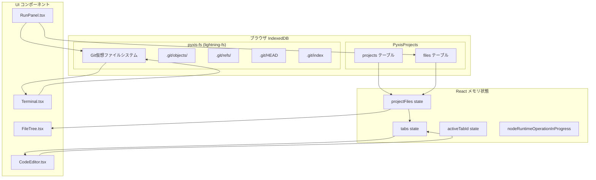

# プロジェクトへようこそ

このプロジェクトはPyxisで作成されました。

---

## 使い方例

### Node.js コード例
```javascript
const fs = require('fs');
fs.writeFileSync('hello.txt', 'Pyxisからこんにちは！');
const content = fs.readFileSync('hello.txt', 'utf8');
console.log(content);
```

### LaTeX 数式例
$
E = mc^2\\
x = \frac{-b \pm \sqrt{b^2-4ac}}{2a}
$

### 複数モニター・テーマ変更
- 設定パネルから「テーマカラー」「個別色設定」を変更できます。

### ファイル操作
- ファイルツリーでドラッグ＆ドロップや右クリックで新規作成・削除・リネーム可能。
- インポート/エクスポートでローカルファイルの追加やダウンロードもできます。

### Git 操作例
```bash
# リポジトリ初期化
git init
# ファイル追加
git add .
# コミット
git commit -m "初期コミット"
# ブランチ作成・切替
git checkout -b feature/new-feature
# マージ
git merge feature/new-feature
```


## Mermaid記法のリアルタイム編集

---

## よく使うコマンド
- `ls`, `cd`, `cat`, `touch`, `mkdir`, `rm`, `cp`, `mv`, `echo`, `clear`
- 詳細は `/docs/unix-commands.md` を参照

## 便利機能
- LaTeXプレビュー
- 複数モニター対応
- テーマカラー変更
- ファイルのインポート/ダウンロード
- Git/プロジェクトファイルのダウンロード
- Mermaid記法のリアルタイム編集
---

> Pyxisで快適な開発をお楽しみください！
