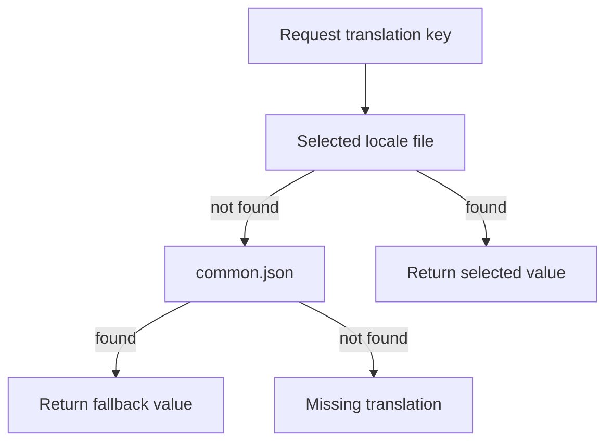

# Localization files (public/locales)

Purpose
- Store translation strings used by the application.
- Provide a single source of truth (common.json) and per-language overrides.

Files
- common.json — required. Contains default translations used as fallback.
- <lang>.json (e.g., ja.json, en.json) — optional. Provide translations for a specific locale.

Lookup behavior (systematic)
- When resolving a key:
  1. Check the selected locale file (<lang>.json).
  2. If the key exists, use that value.
  3. If missing, fall back to common.json.
  4. If still missing, treat as a missing translation (log or show a placeholder).

Mermaid flow (lookup)


How to extract translations
- Run the extraction script:
```bash
bash scripts/i18n-extract.sh
```

Output location
- Extraction results are written to the ./scripts/ directory (files under ./scripts/*).

Notes and best practices
- Keep keys and file structure consistent across locales.
- Prefer adding new keys to common.json first, then add translations in other locale files.
- Validate JSON syntax (UTF-8) after edits to avoid runtime errors.
- Do not rely on partial keys; always verify the full key path exists where expected.
- Log or track missing keys so they can be added to common.json or the appropriate locale.