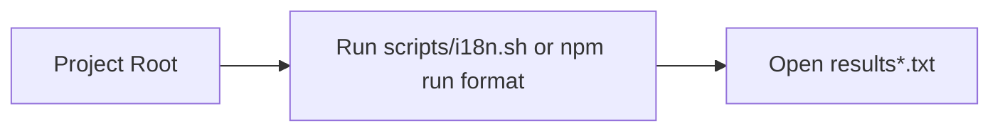

# scripts/README

このディレクトリは通常はあまり触らないでください。使用するのは主に `results*.txt` を確認するときのみです。

概要
- 目的: スクリプト出力（主に `results*.txt`）の参照と簡易実行サポート。
- 実行場所: 常にプロジェクトのルートディレクトリから実行してください。

実行コマンド（例）
```bash
# プロジェクトルートから実行
bash scripts/i18n.sh

# またはパッケージスクリプト経由
npm run format
```

処理フロー（簡易図）

