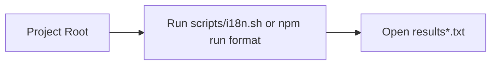

# scripts/README

このディレクトリは通常はあまり触らないでください。使用するのは主に `results*.txt` を確認するときのみです。

## 拡張機能テンプレート作成

対話形式で拡張機能のテンプレートを作成できます:

```bash
npm run create-extension
```

または

```bash
node scripts/create-extension.js
```

このコマンドで以下が自動生成されます:
- `manifest.json` - 拡張機能のメタデータ
- `index.ts` または `index.tsx` - メインコード
- `README.md` - ドキュメント
- (オプション) `registry.json` への登録

## i18nスクリプト

概要
- 目的: スクリプト出力（主に `results*.txt`）の参照と簡易実行サポート。
- 実行場所: 常にプロジェクトのルートディレクトリから実行してください。

実行コマンド
```bash
bash i18n.sh
```

処理フロー（簡易図）

